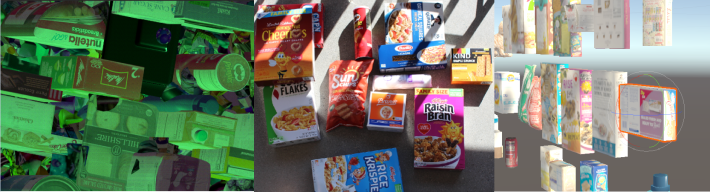

**IMPORTANT: This project has been discontinued and is no longer supported by Unity. Please use the Github issues page to seek community support.**

<p align="center">
  
</p>
<div align="center">
  <h1>Perception Package</h1>
  <span>by </span><a href="https://unity.com/computer-vision" target="_blank">Unity Computer Vision</a>
</div>
<br />
<p align="center">
  
  <a href="./LICENSE.md">
    
  </a>
  
  
</p>

<blockquote>
  <p align="center">
    <a href="https://create.unity.com/computer-vision-newsletter-sign-up?_gl=1*m30uzd*_gcl_aw*R0NMLjE2NDE4MzcyMjAuQ2p3S0NBaUF6LS1PQmhCSUVpd0FHMXJJT2tyQnYwaFFpQUtBQ1pwdXlzeklPbkdtRHp4dnVVOXNSem1EY0dwaTdLOFRra3FQc2gwLTFSb0NHQlFRQXZEX0J3RQ..*_gcl_dc*R0NMLjE2NDE4MzcyMjAuQ2p3S0NBaUF6LS1PQmhCSUVpd0FHMXJJT2tyQnYwaFFpQUtBQ1pwdXlzeklPbkdtRHp4dnVVOXNSem1EY0dwaTdLOFRra3FQc2gwLTFSb0NHQlFRQXZEX0J3RQ">Join our Mailing List!</a> Sign up to stay up-to-date on our latest feature release, community events, blog posts, and more!
  </p>
</blockquote>

<p align="center">
  
</p>

The Perception package provides a toolkit for generating large-scale synthetic datasets for computer vision training and validation. 
## Getting Started with the Perception Package
**[🌟 Perception Synthetic Data Tutorial 🌟](com.unity.perception/Documentation~/Tutorial/TUTORIAL.md)**  
Ideal for those new to either Unity, the Perception package, or synthetic data in general. Detailed instructions covering all the important steps: installing the Unity Editor, creating your first synthetic data generation project, adding domain randomization, visualizing, and analyzing your generated datasets. **No prior experience required.**

**[Quick Start Guide](com.unity.perception/Documentation~/SetupSteps.md)**  
Instructions for adding the Perception package to your existing project. Recommended for users already familiar with Unity and the Perception package. If this is the first time exploring our toolset, we highly recommend briefly going through the **[Perception Synthetic Data Tutorial](com.unity.perception/Documentation~/Tutorial/TUTORIAL.md)**  below!


**[Human Pose Labeling and Randomization Tutorial](com.unity.perception/Documentation~/HumanPose/TUTORIAL.md)**  
Step by step instructions for using the keypoint, pose, and animation randomization tools included in the Perception package. We recommend that you complete the Perception Tutorial above before diving into this guide!

**[Analyzing Datasets with Pysolotools](com.unity.perception/Documentation~/Tutorial/pysolotools.md)**  
Introduction to Unity's [pysolotools](https://github.com/Unity-Technologies/pysolotools) - a python package for parsing, converting, and analyzing a SOLO dataset. Step by step instructions on how to parse a SOLO dataset and look at the dataset statistics in a [jupyter notebook](https://jupyter.org/).

**[Visualizing a Dataset with Voxel51 Viewer](com.unity.perception/Documentation~/Tutorial/pysolotools-fiftyone.md)**  
We will walk through using [Voxel51](https://voxel51.com/) with our [custom SOLO importer](https://github.com/Unity-Technologies/pysolotools-fiftyone) to visualize a dataset.

**[Converting to COCO](com.unity.perception/Documentation~/Tutorial/convert_to_coco.md)**  
We will use [pysolotools](https://github.com/Unity-Technologies/pysolotools) to convert a SOLO dataset into the [COCO](https://cocodataset.org/#home) format.

## Frequently Asked Questions
 
[Check out our FAQ](com.unity.perception/Documentation~/FAQ/FAQ.md) for a list of common questions, tips, tricks, and sample code for common code patterns.

## Reference Documentation

In-depth documentation on specific components of the package. For the full set of feature-based documentation, take a look at the [Features](com.unity.perception/Documentation~/Features/index.md) page.

| Feature                                                                                 | Description                                                                                                                                                                     |
|-----------------------------------------------------------------------------------------|---------------------------------------------------------------------------------------------------------------------------------------------------------------------------------|
| [Labeling](com.unity.perception/Documentation~/GroundTruthLabeling.md)                  | A component that marks a GameObject and its descendants with a set of labels                                                                                                    |
| [Label Config](com.unity.perception/Documentation~/GroundTruthLabeling.md#label-config) | An asset that defines a taxonomy of labels for ground truth generation                                                                                                          |
| [Perception Camera](com.unity.perception/Documentation~/PerceptionCamera.md)            | Captures RGB images and ground truth from a [Camera](https://docs.unity3d.com/Manual/class-Camera.html).                                                                        |
| [Dataset Capture](com.unity.perception/Documentation~/DatasetCapture.md)                | Ensures sensors are triggered at proper rates and accepts data for the JSON dataset.                                                                                            |
| [Accumulation / Path Tracing](com.unity.perception/Documentation~/Accumulation.md)      | Accumulation is a feature that can be used for rendering techniques that require frames to be accumulated, such as path tracing.                                                                                          |
| [Randomization](com.unity.perception/Documentation~/Randomization/index.md)             | The Randomization tool set lets you integrate domain randomization principles into your simulation.                                                                             |
| [Output Endpoint and Dataset Schema](com.unity.perception/Documentation~/Outputs.md)    | An endpoint is responsible for delivering the generated data to the user. Currently supported output endpoints are: Solo endpoint (default), Perception endpoint, and No Output.|

## Datasets and Sample Projects

### Synthetic Homes
<p align="center">
  
</p>

Head over to the [Synthetic Homes repository](https://github.com/Unity-Technologies/SyntheticHomes) for a 100K image dataset of annotated synthetic home interiors for the purpose of training computer vision models, as well as a configurable Unity based stand alone application for generating such datasets. 

### Synthetic Humans

<p align="center">
  <a href="https://github.com/Unity-Technologies/com.unity.cv.synthetichumans/"></a>
</p>

The [Synthetic Humans](https://github.com/Unity-Technologies/com.unity.cv.synthetichumans) package gives you the ability to procedurally generate and realistically place diverse groups of synthetic humans in your Unity Computer Vision projects.

### People Sans People

<p align="center">
  <a href="https://unity-technologies.github.io/PeopleSansPeople/"></a>
</p>

[PeopleSansPeople](https://unity-technologies.github.io/PeopleSansPeople/) is a human-centric privacy-preserving synthetic data generator with highly parametrized domain randomization. This dataset generator contains simulation-ready 3D human assets, a parameterized lighting and camera system, and generates 2D and 3D bounding box, instance and semantic segmentation, and COCO pose labels.

### SynthDet
<p align="center">
  
</p>

[**SynthDet**](https://github.com/Unity-Technologies/SynthDet) is an end-to-end solution for training a 2D object detection model using synthetic data.

### Robotics Object Pose Estimation Demo
<p align="center">
  
</p>

The [**Robotics Object Pose Estimation**](https://github.com/Unity-Technologies/Robotics-Object-Pose-Estimation) project demonstrates pick-and-place with a robot arm in Unity. It includes using ROS with Unity, importing URDF models, collecting labeled training data using the Perception package, and training and deploying a deep learning model.

## Community and Support

This project has been discontinued and is no longer supported by Unity. Please use the Github issues page to seek community support.

## License & Citation
The Perception package is licensed under [Apache License Version 2.0](LICENSE.md).  If you find this package useful, consider citing it using:
```
@misc{unity-perception2022,
    title={Unity {P}erception Package},
    author={{Unity Technologies}},
    howpublished={\url{https://github.com/Unity-Technologies/com.unity.perception}},
    year={2020}
}
```
