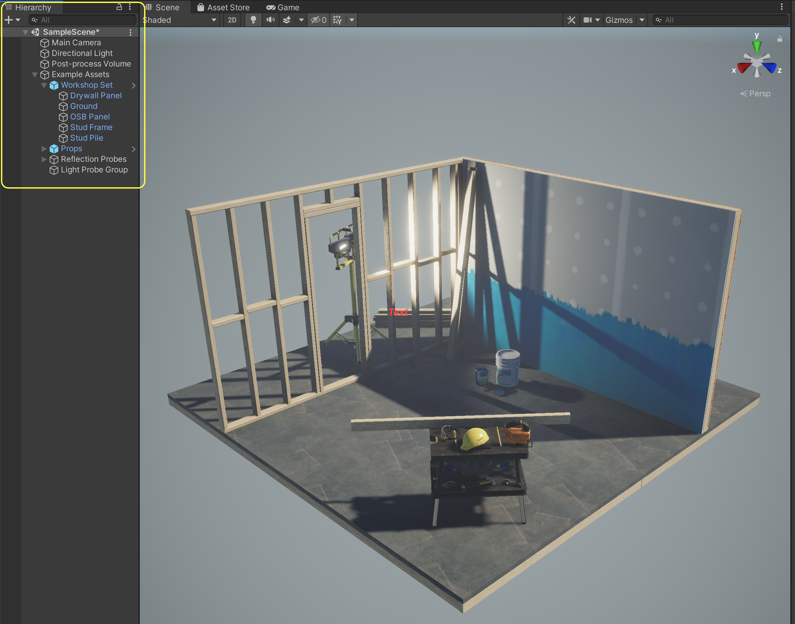
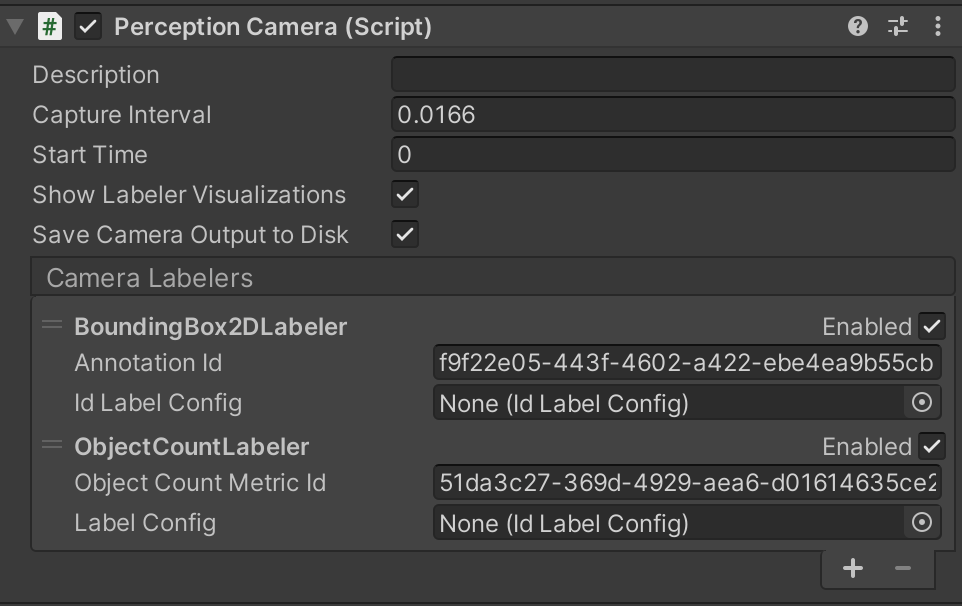
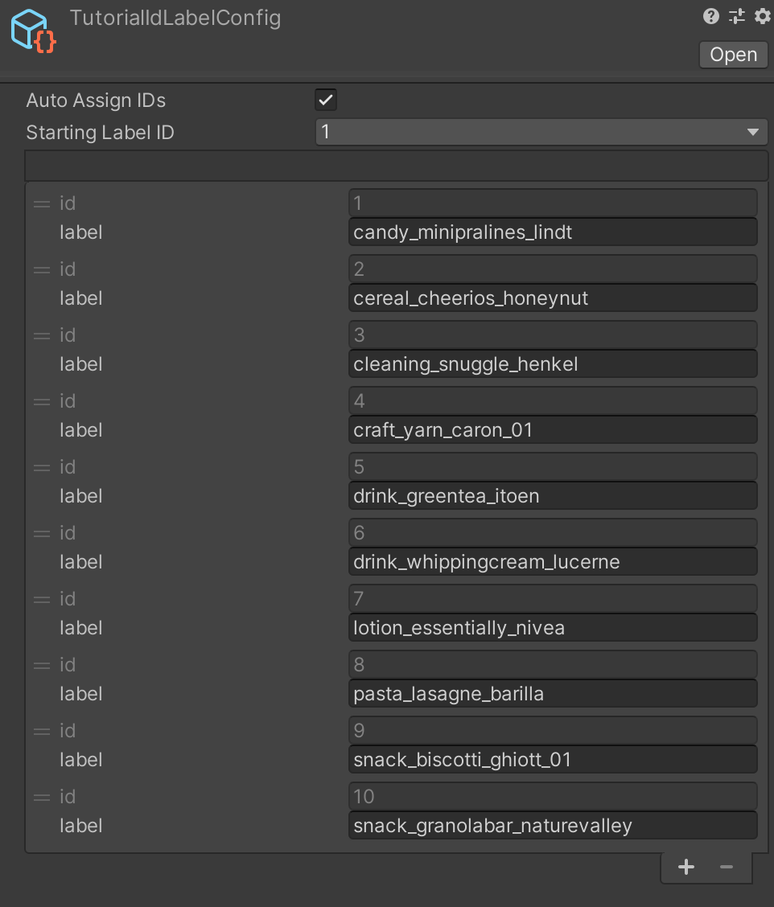
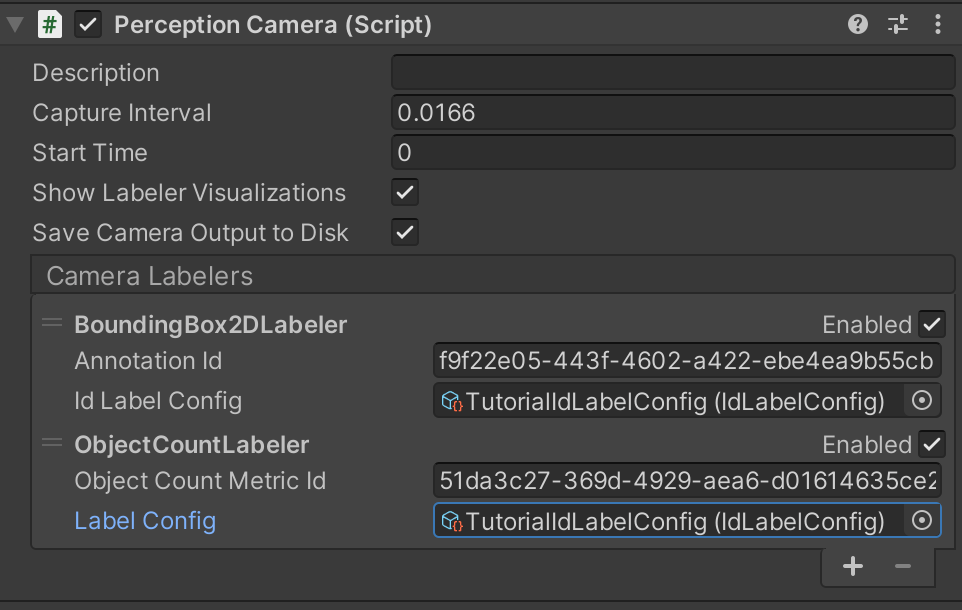
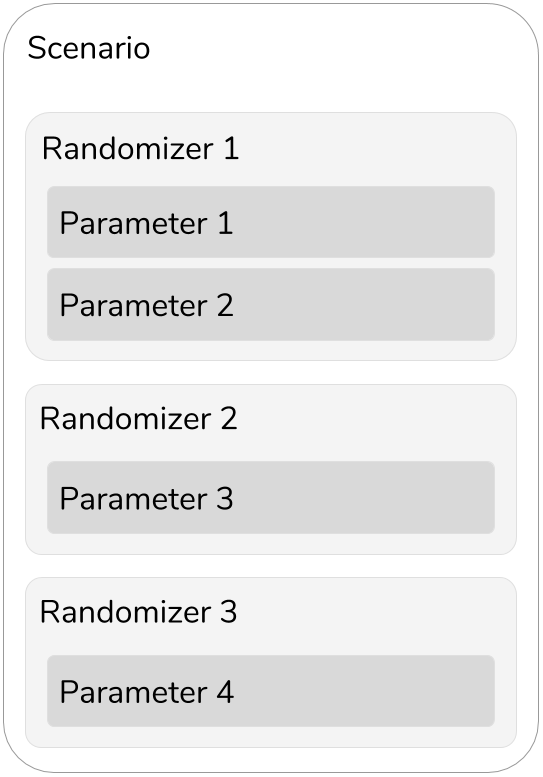
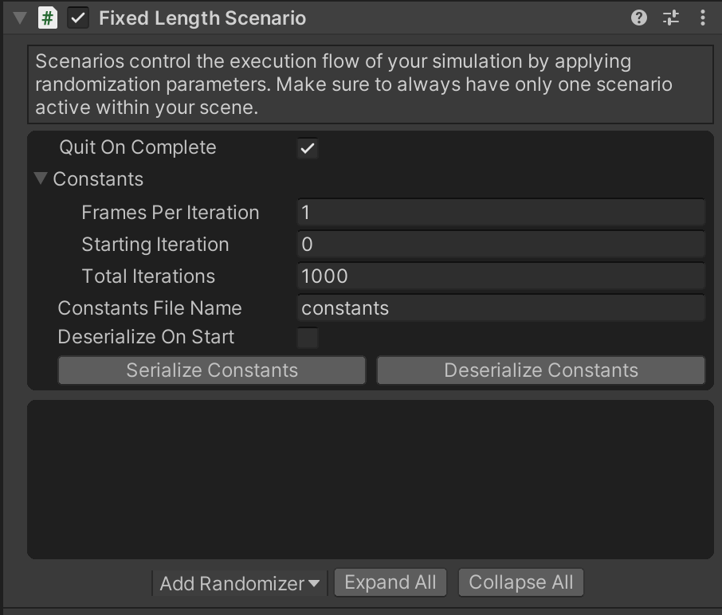
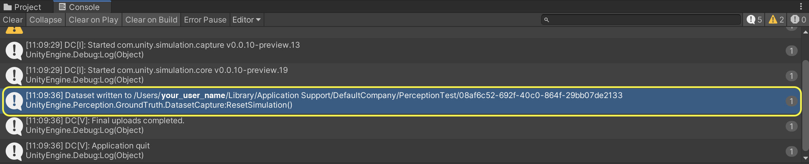

# Perception Tutorial
## Phase 1: Setup and Basic Simulations

In this phase of the Perception tutorial, you will start from downloading and installing Unity Editor and the Perception package. You will then use our sample assets and provided components to easily generate a synthetic dataset for training an object-detection model. Through-out the tutorial, lines starting with bullet points followed by **"Action:"** denote the individual actions you will need to take in order to progress through the tutorial. This is while non-bulleted lines will provide additional context and explanation around the actions. If in a hurry, you can just follow the bullets!

### Step 1: Download Unity Editor and Create a New Project
* **Action**: Navigate to [this](https://unity3d.com/get-unity/download/archive) page to download and install the latest version of Unity Editor 2019.4. 

When you first run Unity, you will be asked to open an existing project, or create a new one. 

* **Action**: Open Unity and create a new project using the Universal Render Pipeline. Name your new project _**Perception Tutorial**_, as shown below. 

### Step 2: Download the Perception Package and Import 

Once your new project is created and loaded, you will be presented with the Unity Editor interface. From this point, whenever we refer to _the editor_, we mean Unity Editor.
* **Action**: From the top menu bar, open _**Window**_ -> _**Package Manager**_. 

As the name suggests, the _**Package Manager**_ is where you can download new packages, update or remove existing ones, and access a variety of information and additional actions for each package.

* **Action**: Click on the _**+**_ sign at the top-left corner of the _**Package Manager**_ window and then choose the option _**Add package frim git URL...**_. 
* **Action**: Enter the address `com.unity.perception` and click _**Add**_

It will take some time for the manager to download and import the package. Once the operation finishes, you will see the newly download Perception package automatically selected in the _**Package Manager**_, as depicted below:

Each package can come with a set of samples. As seen in the righthand panel, the Perception package includes a sample named _**Tutorial Files**_, which will be required for completing this tutorial. The sample files consist of example foreground and background objects (foreground: objects that the eventual machine learning model will try to detect, background: objects that will be placed in the background as distractions to for the machine learning model), randomizers, shaders, and other useful elements to work with during this tutorial.

* **Action**: In the _**Package Manager**_ window, from the list of _**Samples**_ for the Perception package, click on the _**Import into Project**_ button for the sample named _**Tutorial Files**_.

Once the sample files are imported, they will be placed inside the `Assets/Samples/Perception` folder in your Unity project. You can view your project's folder structure and access your files from the _**Project**_ tab of the editor, as seen in the image below:

* **Action**: The _**Project**_ tab contains a search bar; use it to find the file named `ForwardRenderer.asset`, as shown below:

* **Action**: Click on the found file to select it. Then, from the _**Inspector**_ tab of the editor, click on the _**Add Renderer Feature**_ button, and select _**Ground Truth Renderer Feature**_ from the dropdown menu:

This step prepares your project to render tailor-made images that will be later used for labeling the generates synthetic data.

### Step 3: Setup a Scene for Your Perception Simulation
Simply put, in Unity, Scenes contain any object that exists in the world. This world can be a game, or in this case, a perception-oriented simulation. Every new project contains a Scene named _**SampleScene**_, which is automatically openned when the project is created. We will now modify this scene to remove the parts we will not need and tailor it to this tutorial.

The _**Hierarchy**_ tab of the editor displays all the Scenes currently loaded, and all the objects currently present in each loaded Scene, as shown below:

* **Action**: Delete everything shown in the hierarchy except for `Main Camera` and `Directional Light`. 

To remove objects, select them and press `Delete` (Windows) or `cmd+delete` (Mac) on your keyboard. You can also right-click an object and click `Delete`. After this step, your Scene hierarchy should look like below: 

We will now add the necessary components to the camera already present in the scene in order to equip it for the perception workflow. To do this, we need to add a `PerceptionCamera` component to the camera, and then define which types of ground-truth we wish to generate using this camera.

* **Action**: Select `Main Camera` in the Scene hierarchy, then, in the _**Inspector**_ tab, click on the _**Add Component**_ button.
* **Action**: Start typing `Perception Camera` in the search bar that appears, until the `Perception Camera` script is found, with a **#** icon to the left.
* **Action**: Click on this script to add it as a component. Your camera is now a `Perception` camera.

Adding components is the standard way in which objects can have various kinds of logic and data attached to them in Unity. This includes objects placed within the Scene (called GameObjects), such as the camera above, or objects outside of a Scene, in your project folders (called Prefabs).

The `Perception Camera` component comes with its own UI to modify various aspects of synthetic frame generation and annotation, as well as add or remove ground-truth labelers and labelling configurations. If you hover your mouse pointer over each of the fields shown (e.g. `Capture Interval`), you will see a tooltip popup with an explanation on what the item controls. You may see a warning at the bottom of this UI regarding asynchronous shader compilation. If so, follow the instructions in the warning message to disable this functionality and remove the warning.

As seen in the UI for `Perception Camera`, the list of `Camera Lebelers` is currently empty. For each type of ground-truth you wish to generate along-side your captured frames (e.g. 2D bounding boxes around objects), you will need to add a corresponding `Camera Labeler` to this list. 

To speed-up your perception workflow, the Perception comes pre-packaged with four popular labelers for object-detection tasks; however, if you are comfortable with code, you can easily add your own custom labelers. The labelers that come with the Perception package cover **2D bounding boxes, object counts, object information (pixel counts and ids), and semantic segmentation images (each object rendered in a unique colour)**. In this tutorial, we will be working with the first two. 

* **Action**: Click on the _**+**_ button to the bottom right corner of the empty labeler list, and select `BoundingBox2DLabeler`.
* **Action**: Repeat the above step and this time select `ObjectCountLabeler`. 

Once you add the labelers, the _**Inspector**_ view of the `Perception Camera` component will look like this:

One of the useful features that comes with the `Perception Camera` is the ability to display real-time visualizations of the labelers when your simulation is running. For instance, the `BoundingBox2DLabeler` can display bounding boxes around the foreground objects that it tracks in real-time. To enable this feature, make sure the `Show Labeler Visualizations` checkmark is enabled. 

### Step 4: Specify Ground-Truth and Object Labels

It is now time to tell your each labeler added to the `Perception Camera` which objects it should label in the generated dataset. For instance, if your workflow is intended to generate frames and ground-truth for detecting chairs, your labelers would need to know that they should look for objects labeled "chair" within the scene. The chairs should in turn also be labeled "chair" in order to make them visible to their intended labelers. We will now learn how to set-up these configuartions.

You will notice each added labeler has a field named `Id Label Config`. By adding a label configuration here you can instruct the labeler to look for certain labeles within the scene and ignore the rest. To do that, we should first create a fitting label configuration.

* **Action**: In the _**Project**_ tab, right-click the `Assets` folder, then click _**Create -> Perception -> Id Label Config**_.

This will create a new asset file named `IdLabelConfig` inside the `Assets` folder. 

* **Action**: Rename the newly created `IdLabelConfig` asset to `TutorialIdLabelConfig`.

Then, click on this asset to bring up its _**Inspector**_ view. In there, you can specify the labels that this config will keep track of. A new label config like this one contains an empty list of labels. 

In this tutorial, we will generate synthetic data intended for detecting 10 everyday grocery items. In this step, you will add labels for each of these 10 items to the list of labels for `TutorialIdLabelConfig`. 

* **Action**: Select `TutorialIdLabelConfig` and in the _**Inspector**_ tab, click on the _**+**_ button to add 10 new label entries. Use the following exact names for these entries:
  1 `candy_minipralines_lindt`
  2 `cereal_cheerios_honeynut`
  3 `cleaning_snuggle_henkel`
  4 `craft_yarn_caron_01`
  5 `drink_greentea_itoen`
  6 `drink_whippingcream_lucerne`
  7 `lotion_essentially_nivea`
  8 `pasta_lasagne_barilla`
  9 `snack_biscotti_ghiott_01`
  10 `snack_granolabar_naturevalley`

Once done, the _**Inspector**_ window for `TutorialIdLabelConfig` will look like this:

These are the names of the 10 grocery items that we will work with in this tutorial. Wonder were the actual objects are? They were imported into your project when you imported the tutorial files from the _**Package Manager**_, and are located in the folder `Assets/Samples/Perception/0.5.0-preview.1/Tutorial Files/ Foreground Objects/Phase 1` .

Notice that each of the labels you entered automatically has a numerical ID assigned. These ids are required in order to use the generated data in machine learning models, which typically require numerical ids for classification of objects.

Now that you have created your label configuration, we need to assign this configuration to labelers that you previously added to your `Perception Camera` component. 

* **Action**: Select the `Main Camera` object from the Scene _**Hierarchy**_, and in the _**Inspector**_ tab, assign the newly created `TutorialIdLabelConfig` to both labelers. To do so, you can either drag and drop the former into the corresponding fields for each labeler, or click on the small circular button in front of the `Id Label Config` field, which brings up an asset selection window filtered to only show compatible assets. The `Perception Camera` component will now look like the image below:

The final piece of the label set-up workflow is to assign the same 10 labels to the objects that are supposed to be detected by an eventual object-detection model. As mentioned above, these are located at `Assets/Samples/Perception/0.5.0-preview.1/Tutorial Files/ Foreground Objects/Phase 1`. Inside this folder, there are four assets related to each of the 10 foreground objects. These four includes a .fbx model file, a material, a .jpg texture, and a Prefab asset. While the file extensions are not shown as part of the file names in the folder view, if you click on a file to select it, you can view its full name and path in the address bar at the bottom of the _**Project**_ tab.

In Unity, Prefabs are essentially reusable GameObjects that are stored to disk, along with all their child GameObjects, components, and property values. In our case here, the Prefab asset is what brings all the pieces of each foreground object together and will be the actual asset that you will use in your perception pipeline. Let's see what these prefabs include.

* **Action**: In the _**Project**_ tab, navigate to `Assets/Samples/Perception/0.5.0-preview.1/Tutorial Files/ Foreground Objects/Phase 1`
* **Action**: Double click the file named `drink_whippingcream_lucerne.prefab` to open the Prefab asset. 

When you open the Prefab asset, you will see the object shown in the Scene view and its components shown on the right side of the editor, in the _**Inspector**_ view:

The Prefab contains a number of components, including a `Transform`, a `Mesh Filter`, a `Mesh Renderer` and a `Labeling` component (highlighted in the image above). While the first three of these are common Unity components, the fourth one is specific to the Perception package, and is used for assigning labels to objects. You can see here that the cream carton is already labeled `drink_whippingcream_lucerner`. This is true for all the foreground objects supplied in the sample tutorial files, which means you do not need to perform any additonal steps to label your foreground objects.

Note that each object can have multiple labels assigned, and thus appear as different objects to labelers with different label configurations. For instance, you may want your semantic segmentation labeler to detect all cream cartons as as `dairy_product`, while your bounding box labeler still distinguishes between different types of dairy product. To achieve this, you can add a `dairy_product` label to all your dairy products, and then in your label configuration for semantic segmentation, only add the `dairy_product` label, and not any specific products or brand names. To add an additional a label to the cream carton, you can click on the _**+**_ button to the bottom right corner of the label list, in the `Labeling` component.

### Step 5: Set-up Randomization

As mentioned earlier, one of the core ingredients of the perception workflow is the randomization of various aspects of the simulation, in order to introduce sufficient variation into the generated data. 

To start randomizing your simulation you will first need to add a `Scenario` to your scene. Scenarios control the execution flow of your simulation by coordinating all `Randomizer` components added to them. The Perception package comes with a useful set of `Randomizer`s that let you quickly place your foreground objects in the Scene, generate varied backgrounds, as well as randomize various parameters of the simulation over time, including things such as positon, scale, and rotation of objects, number of objects within the camera's view, and so on. `Randomizer`s achieve this through coordinating a number of `Parameter`s, which essentially define the most granular randomization behaviors. For instance, for continuous variable types such as floats, vectors, and colors, `Parameter`s can define the range, sampling distribution, and a seed for randomization. This is while another class of `Paramter`s let you randomly select one of a number of categorical options.  

To summarize, a sample `Scenario` could look like this:

In this tutorial, you will learn how to use the provided Randomizers, as well as how to create new ones that are custom-fitted to your randomization needs.

* **Action**: Create a new GameObject in your Scene by right-clicking in the _**Hierarchy**_ tab and clicking `Create Empty`.
* **Action**: Rename your new GameObject to `Simulation Scenario`.
* **Action**: In the _**Inspector**_ view of this new object, add a new `Fixed Length Scenario` component. 

Each `Scenario` executes a number of `Iterations`, and each `Iteration` carries on for a number of frames. These are timing elements you can leverage in order to customize your `Scenario`s and the timing of your randomizations. You will learn how to use `Iteartions` and frames in Phase 2 of this tutorial. For now, we will use the `Fixed Length Scenario`, which is a special kind of `Scenario` that runs for a fixed number of frames during each `Iteration`, and is sufficient for most beginner use-cases. Note that at any given time, you can have only one `Scenario` active in your Scene. 

Once the `Fixed Length Scenario` component is added, the inspector view for your `Simulation Scenario` object will look like below:

There are a number settings and properties you can modify here, such as `Quit On Complete` or `Constants`. Just like the `Perception Camera` component, if you hover your mouse cursor over each of these properties, you will see a tooltip containing a relevant explanation. For now, we will leave all of these fields as they are. This is currently an empty `Scneario`. Let's add some `Randomizer`s.

_To be added: Steps for adding basic Randomizers_

### Step 6: Run Your Simulation and Generate Synthetic Data

You are now ready to run your simulation and get your first batch of synthetic data.

* **Action**: Click on the **▷** (play) button located at top middle section of the editor to run your simulation.

When the simulation starts running, Unity Editor will switch to the _**Game**_ tab to show you the output of the active camera, which carries the `Perception Camera` component. In this view, you will also see the real-time visualizations we discussed before shown on top of the camera's view. In the top right corner of the window, you can see a visualization control panel, through which you can enable or disable visualizations for individual labelers, as seen below:

_To be added: Screenshot for running simulation and visualziation panel_

Note that disabling visualizations for a labeler does not affect your generated data. The annotations from all labelers that are active before running the simulation will continue to be recorded and will appear in the output data.

To generate data as fast as possible, the simulation will churn through frames quickly, rearranging and randomizing the objects in each frame. To be able to check out individual frames and inspect the real-time visualizations, click on the pause button (next to play). To continue, just click play again. 

The simulation will take about a minute to complete (depending on your computer's hardware). Once the run is complete, you will see a message in the _**Console**_ tab of the editor, with information on where the generated data has been saved. An example is shown below (Mac OS):

### Step 7: Review the Generated Data

* **Action**: Navigate to the dataset path addressed above. 

In this folder, you will find a few types of data, depending on your `Perception Camera` settings. These can include:
\- Logs
- JSON data
- RGB images (raw camera output) (if the `Save Camera Output to Disk` checkmark is enabled on `Perception Camera`)
- Semantic segmentation images (if the `SemanticSegmentationLabeler` is added and active on `Perception Camera')

The output dataset includes a large variety of information about various aspects of the active sensors in the Scene (currently only one), as well as the ground-truth generated by all active labelers. [This page](https://github.com/Unity-Technologies/com.unity.perception/blob/master/com.unity.perception/Documentation%7E/Schema/Synthetic_Dataset_Schema.md) provides a comprehensive explanation on the schema of this dataset. We strongly recommend having a look at the page once you have completed this tutorial.

* **Action**: To get a quick feel of how the data is stored, open the folder whose name starts with `Dataset`. 
