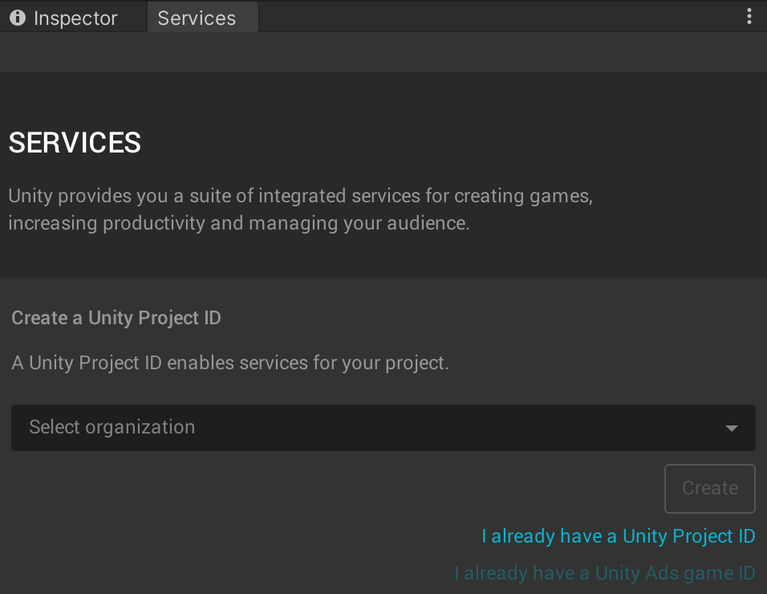
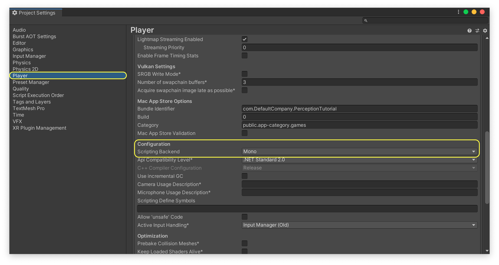
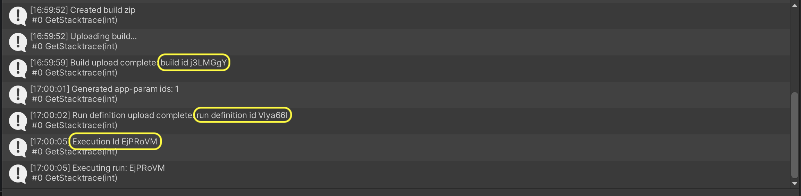
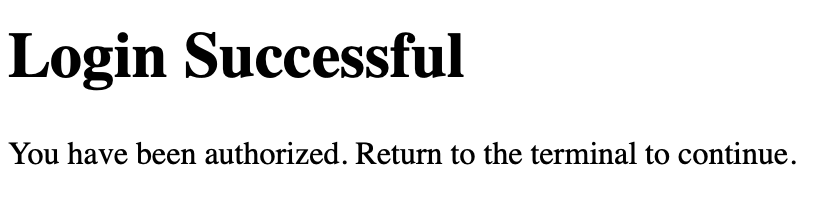

# Perception Tutorial
## Phase 3: Cloud

### Step 1: Setup Unity Account, USim, and Cloud Project
In this phase of the tutorial, we will learn how to run our Scene on _**Unity Simulation (USim)**_. This will allow us to generate a much larger dataset than what is typically plausible on a workstation computer.

In order to use Unity Simulation you need to first create a Unity account or login with your existing one. Once logged in, you will also need to sign-up for Unity Simulation. 

* **Action** Click on the _**Cloud**_ button at the top-right corner of Unity Editor to open the _**Services**_ tab. 

<p align="center">

</p>

If you have not logged in yet, the _**Services**_ tab will display a message noting that you are offline:

<p align="center">

</p>

* **Action**: Click _**Sign in...**_ and follow the steps within the window that opens to sign in or create an account.
* **Action**: Sign up for a free trial of Unity Simulation [here](https://unity.com/products/unity-simulation).

Unity Simulation is a cloud-based service that makes it possible for you run thousands of instances of Unity builds in order to generate massive amounts of data. 

The USim service is billed on a per-usage basis, and the free trial offers up to $100 of free credit per month. In order to access the free trial, you will need to provide credit card information. **This information will be used to charge your account if you exceed the $100 monthly credit.** A list of hourly and daily rates for various computational resources is available in the page where you first register for USim.

Once you have registered for a free trial, you will be taken to your USim dashboard, where you will be able to observe your usage and billing invoices.

It is now time connect your local Unity project to a cloud project and your simulation on USim.

* **Action**: Return to Unity Editor. In the _**Services**_ tab click _**Select Organization**_ and choose the only available option (which typically has the same name as your Unity username).

If you have used Unity before, you might have set-up multiple organizations for your account. In that case, choose whichever you would like to associate with this project.

<p align="center">

</p>

* **Action**: Click _**Create**_ to create a new cloud project and connect your local project to it.


### Step 2: Run Project on USim


The process of running a project on Unity Simulation involves building it for Linux and then uploading this build, along with a set of parameters, to Unity Simulation. The Perception package simplifies this process by including a dedicated _**Run in USim**_ window that accepts a small number of required parameters and handles everything else automatically.

In order to make sure our builds are compatible with USim, we need to set our project's scripting backend to _**Mono**_ rather than _**IL2CPP**_. The latter is the default option for projects created with newer versions of Unity.

* **Action**: From the top menu bar, open _**Edit -> Project Settings**_.
* **Action**: In the window that opens, navigate to the _**Player**_ tab, find the _**Scripting Backend**_ setting (under _**Other Settings**_), and change it to _**Mono**_:

<p align="center">

</p>

* **Action**: Close _**Project Settings**_. From the top menu bar, open _**Window -> Run in USim**_.

<p align="center">

</p>

* **Action**: Choose `TutorialScene` (which is the Scene we have been working in) as your _**Main Scene**_ and the `SimulationScenario` object as your _**Scenario**_.

Here, you can also specify a name for the run, the number of iterations the Scenario will produce, and the number of concurrent _**Instances**_ for the run. 

* **Action**: Name your run `First Run`, set the number of iterations to `20,000`, and instances to `1`. 
* **Action**: Click _**Build and Run**_.

Your project will now be built and then uploaded to USim. Depending on the upload speed of your internet connection, this might take anywhere from a few seconds to a couple of minutes. 

* **Action**: Once the operation is complete, you can find the **Build ID**, **Run Definition ID**, and **Execution ID** of this USim run in the _**Console**_ tab:

<p align="center">

</p>


### Step 3: Keep Track of USim Runs Using USim-CLI

To keep track of the progress of your USim run, you will need to use USim's command-line interface (USim CLI). Detailed instructions for the USim CLI are provided [here](https://github.com/Unity-Technologies/Unity-Simulation-Docs/blob/master/doc/quickstart.md#download-unity-simulation-quickstart-materials). 

For the purposes of this tutorial, we will only go through the most essential commands, which will help us know when our USim run is complete and where to find the produced dataset.

* **Action**: Download the latest version of `unity_simulation_bundle.zip` from [here](https://github.com/Unity-Technologies/Unity-Simulation-Docs/releases)

**Note**: If you are using a MacOS computer, we recommend using the _**curl**_ command from the Terminal to download the file, in order to avoid issues caused by the MacOS Gatekeeper when running the CLI. You can use these commands:
```
curl -Lo ~/Downloads/unity_simulation_bundle.zip <URL-unity_simulation_bundle.zip>
unzip ~/Downloads/unity_simulation_bundle.zip -d ~/Downloads/unity_simulation_bundle
```
The `<URL-unity_simulation_bundle.zip>` address can be found at the same page linked above.

* **Action**: Extract the zip archive you downloaded.
* **Action**: Open a command-line interface (Terminal on Mac OS, cmd on Windows, etc.) and navigate to the extracted folder.

If you downloaded the zip archive in the default location in your downloads folder, you can use these commands to navigate to it from the command-line:
MacOS:
`cd ~/Downloads/unity_simulation_bundle`
Windows:
`cd C:\Users\UserName\Downloads\unity_simulation_bundle`

You will now be using the _**usim**_ executable to interact with Unity Simluation through commands. 

* **Action** To see a list of available commands, simply run `usim` once:
MacOS:
`USimCLI/mac/usim`
Windows:
`USimCLI\windows\usim`

The first step is to login.

* **Action**: Login to USim using the `usim login auth` command.
MacOS:
`USimCLI/mac/usim login auth`
Windows:
`USimCLI\windows\usim login auth`

This will open a browser for you to login to your Unity account. Once you have logged you will see this page:

<p align="center">

</p>

**Note**: On MacOS, you might get errors related to permissions. In these cases, try running your commands with the `sudo` qualifier. For example:
`sudo USimCLI/mac/usim login auth`

This will ask for your MacOS account's password, and should help overcome the persmission issues.

* **Action**: Return to your command-line interface. Get a list of your cloud projects using the `usim get projects` command:

MacOS:
`USimCLI/mac/usim get projects`
Windows:
`USimCLI\windows\usim get projects`

This gives you a list of the cloud projects associated with your Unity account along with their project IDs. In case you have more than one cloud project, you will need to "activate" the one corresponding with your perception tutorial project here. If there is only one project, it is already activated and you will not need to execute the command below (note: replace `<project-id>` with the id of your desired project):

* **Action** 
MacOS:
`USimCLI/mac/usim activate project <project-id>`
Windows:
`USimCLI\windows\usim get projects <project-id>`


