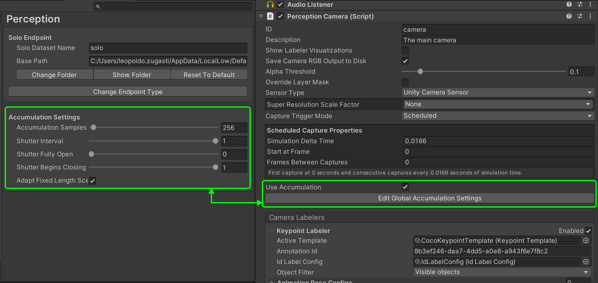
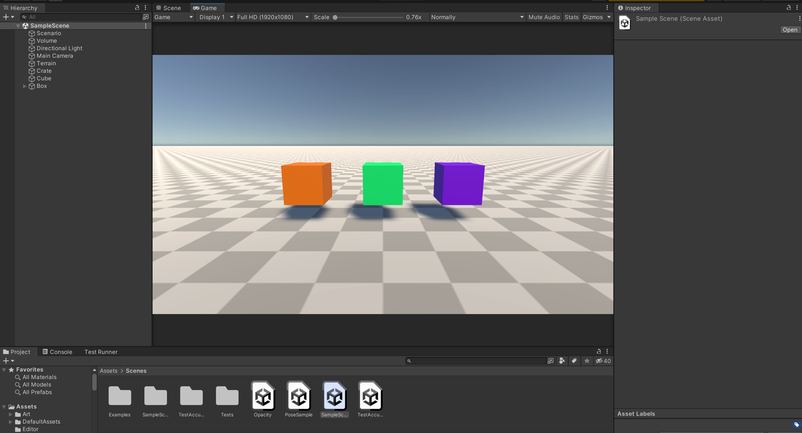
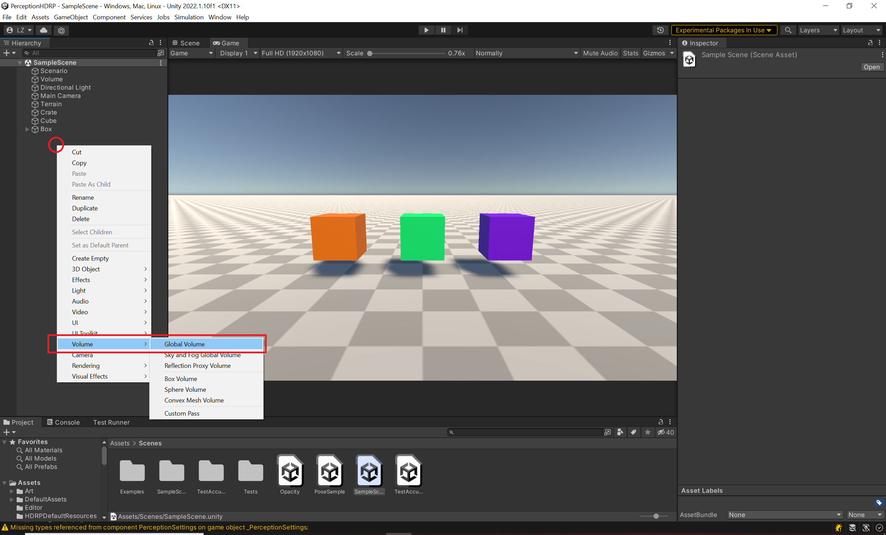
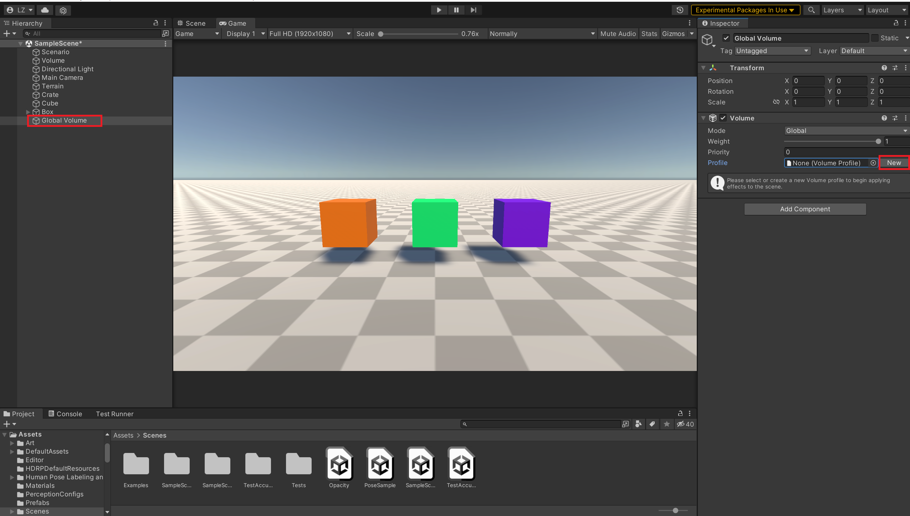
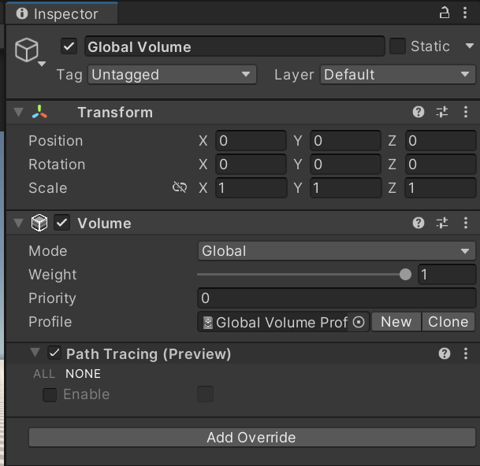
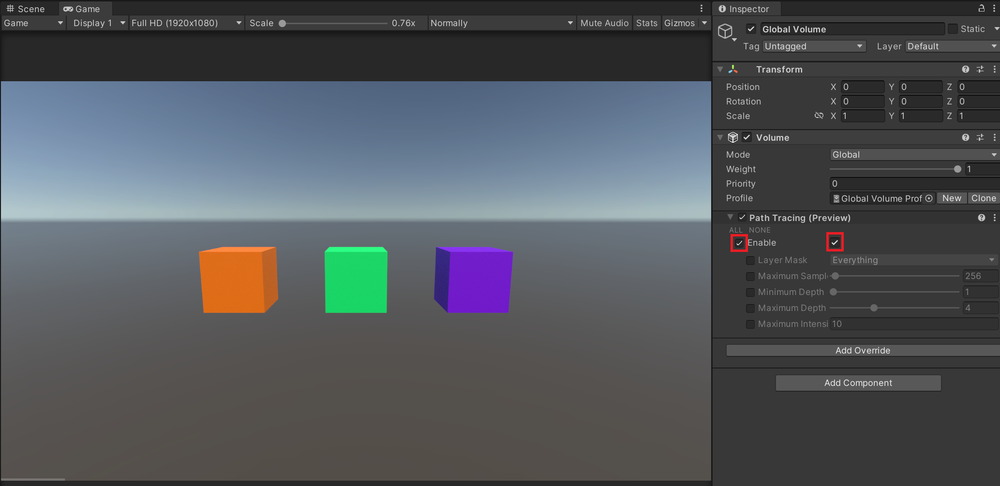
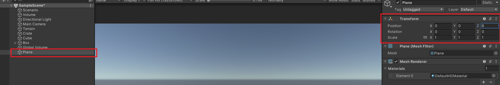
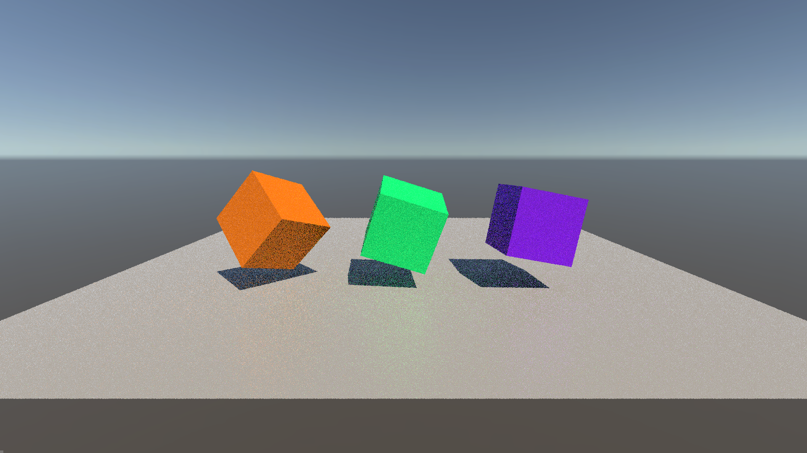
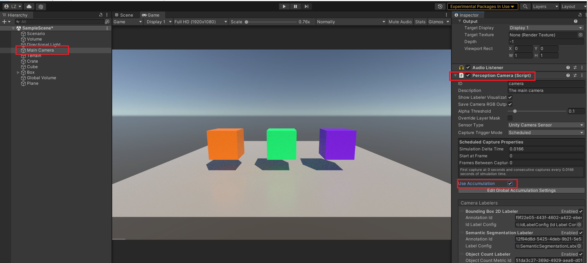
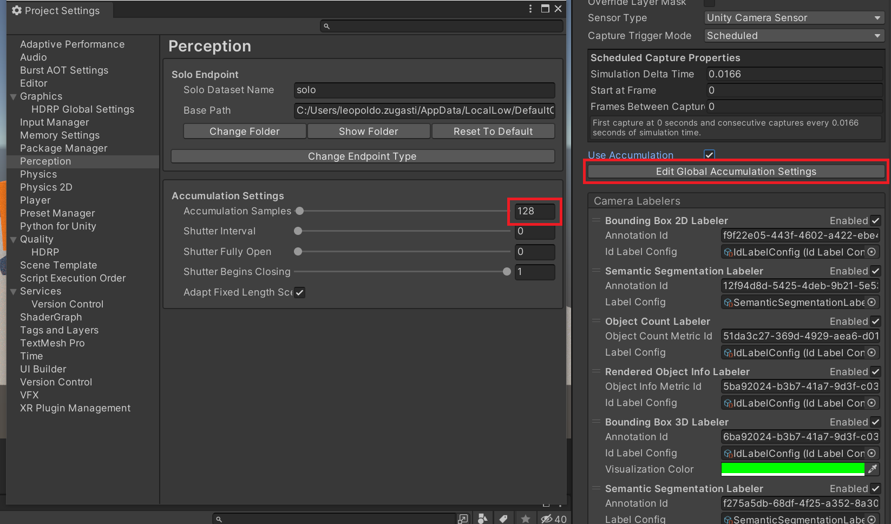

# Accumulation / Path Tracing

The accumulation feature is used for rendering effects that require multiple frames to accumulate to create a single converged frame. The main example of this is [Path Tracing](https://docs.unity3d.com/Packages/com.unity.render-pipelines.high-definition@12.1/manual/Ray-Tracing-Path-Tracing.html), but other effects such as accumulation motion blur are possible.

> :warning: Path tracing requires compatible hardware. You can find the list of requirements [here](https://docs.unity3d.com/Packages/com.unity.render-pipelines.high-definition@12.1/manual/Ray-Tracing-Getting-Started.html).

## Limitations and Bugs

* This feature is only available in HDRP projects.
* When using this feature, the Scene view should not be visible at runtime, otherwise the captured images will not be accumulated.
* A Perception Camera using Manual Captures at the same time as another Perception Camera using Scheduled Captures both of which are using accumulation may cause timing errors in the simulation.
* All the cameras that use accumulation should have the same value for Simulation Delta Time, otherwise some of the captured images will not be properly accumulated.

## How to enable Accumulation

* Accumulation can be enabled on any PerceptionCamera by enabling the ***Use Accumulation*** option
* The Accumulation settings can be changed by clicking on ***Edit Global Accumulation Settings***

   <i>Enabling Accumulation and Changing Accumulation Settings</i>

> :warning: The Accumulation settings are global to all accumulating cameras in the Scene. Hence, changing these settings will affect all PerceptionCameras with the ***Use Accumulation*** setting enabled.

## Settings
| Setting                            | Description                                                                                                                                                                                                                         |
|------------------------------------|-------------------------------------------------------------------------------------------------------------------------------------------------------------------------------------------------------------------------------------|
| Accumulation Samples               | Number of frames used to accumulate a converged image                                                                                                                                                                               |
| Shutter Interval                   | Controls the amount of motion blur. A value of 0 corresponds to no motion blur and a value of 1 corresponds to maximum motion blur. This only applies to motion caused by physics and animations, or Time.deltaTime based movement. |
| Shutter Fully Open                 | The time during shutter interval when the shutter is fully open                                                                                                                                                                     |
| Shutter Begins Closing             | The time during shutter interval when the shutter begins closing                                                                                                                                                                    |
| Adapt Fixed Length Scenario Frames | Specifies whether the Fixed Length Scenario in the Scene (if any) automatically adapt its number of frames per Iteration to account for the number of frames (samples) set in Accumulation settings.                                           |

## Project Setup for Path Tracing

* Setup HDRP to support path tracing by following the ***Render Pipeline Wizard Setup*** in this [tutorial](https://docs.unity3d.com/Packages/com.unity.render-pipelines.high-definition@12.1/manual/Ray-Tracing-Getting-Started.html): 
* For this example we'll use the SampleScene provided in the PerceptionHDRP project but you can follow along using any Scene

   <i>Sample Scene</i>

* Setup a Global Volume by right clicking on the scene hierarchy as follows:

   <i>Creating Global Volume</i>

* Select the newly created Global Volume and in the inspector create a new profile by clicking on ***New***

   <i>Creating an HDRP profile</i>

* Add path tracing to the Scene by clicking on ***Add Override > Ray Tracing > Path Tracing***. You should now see the path tracing override added:

   <i>Path Tracing override</i>

> :warning: If instead you see a warning or error message, this means that HDRP isn't setup to handle path tracing and you should refer back to this [tutorial](https://docs.unity3d.com/Packages/com.unity.render-pipelines.high-definition@12.1/manual/Ray-Tracing-Getting-Started.html)

* Enable path tracing by selecting the override and enabling it

   <i>Enabling Path Tracing</i>

> Notice that the floor disappeared, this is to be expected since path tracing does not support Terrain, for the list of limitations on path tracing refer to this [page](https://docs.unity3d.com/Packages/com.unity.render-pipelines.high-definition@12.1/manual/Ray-Tracing-Path-Tracing.html)

* In order to see shadows let's add a new Plane Game Object to replace the floor in the same way we added the global volume earlier and change it's ***z position*** to 8

* Now, if you pressed play you would generate a dataset with grainy/unconverged images such as this one:

   <i>Grainy Image</i>

* To fix this we want to tell the PerceptionCamera to use Accumulation, to do so go to the Main Camera object and select ***Use Accumulation*** on the PerceptionCamera component

   <i>Enabling Accumulation</i>

* Next, click on ***Edit Global Accumulation Settings*** and change the Accumulation Samples to 128. The more accumulation samples the better the image but the longer it will take to render. For such a simple image 128 is unnecessarily large. You'll have to play around with this value to determine the best setting for your specific scene.

   <i>Enabling Accumulation and Changing Accumulation Settings</i>

* If you generate a dataset now you'll notice that the frames come out much cleaner

   <i>Clean Image</i>

