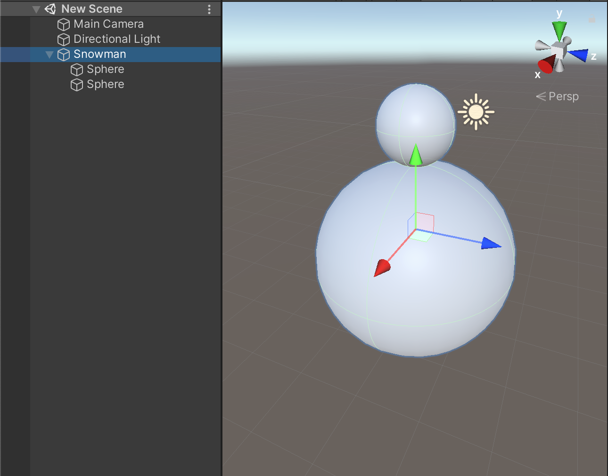
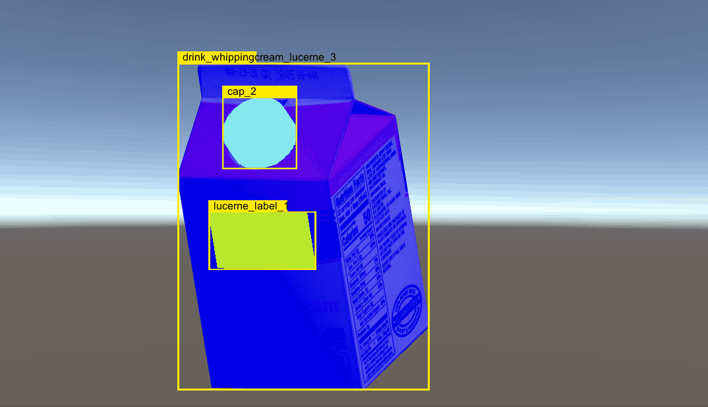
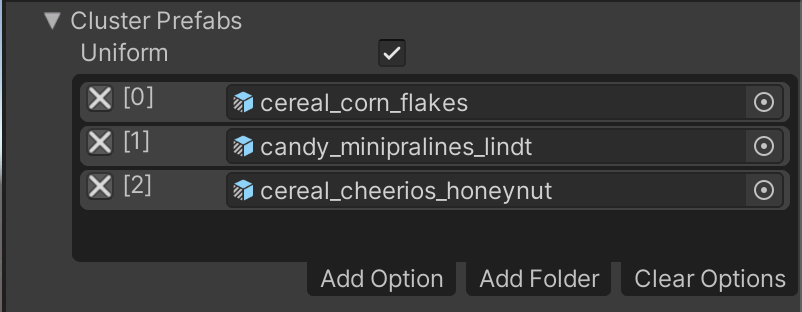
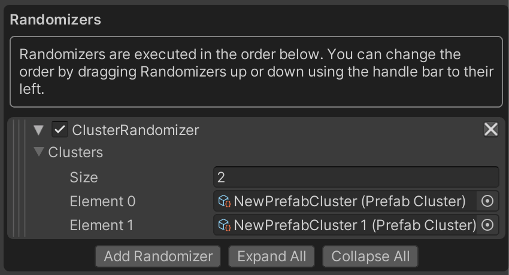
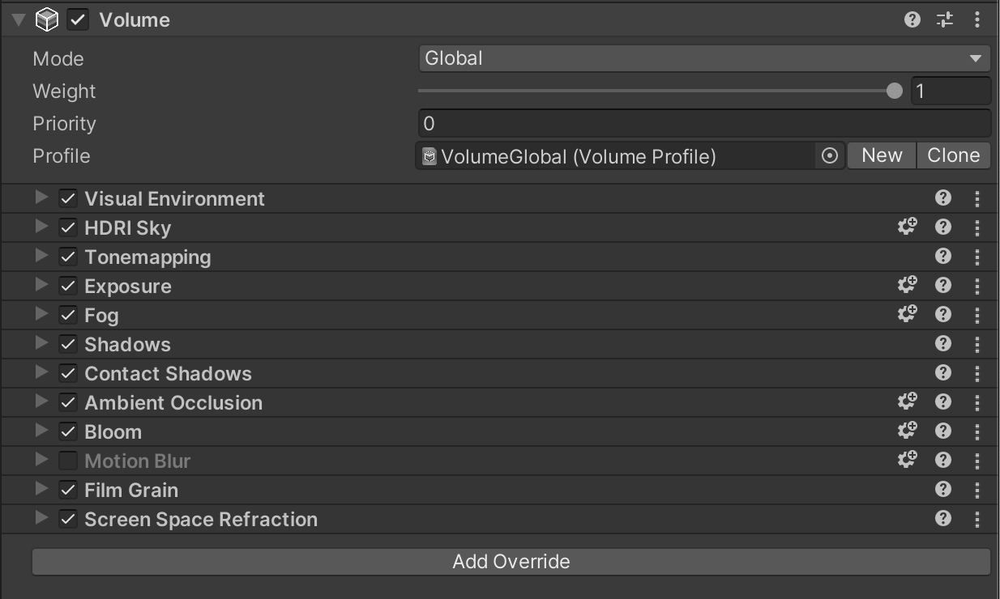
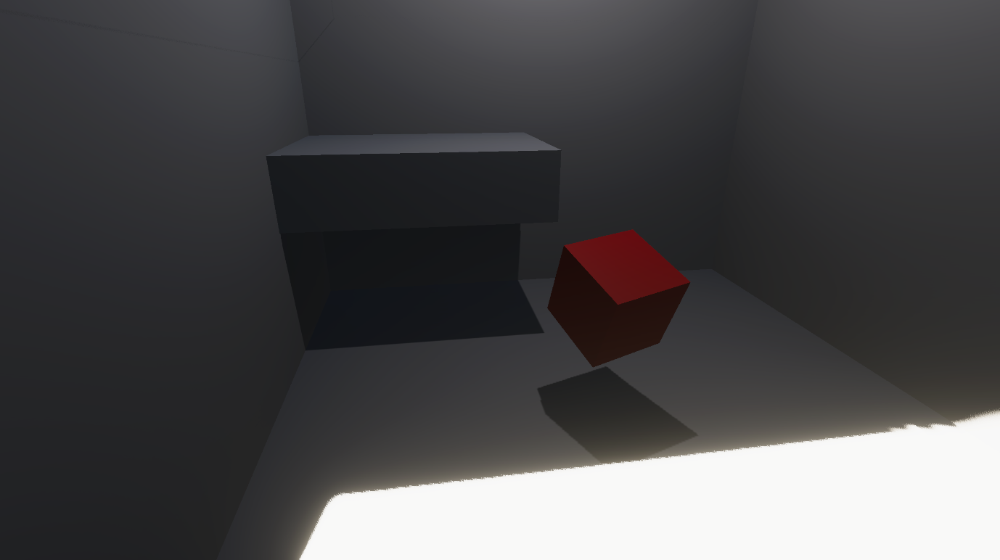
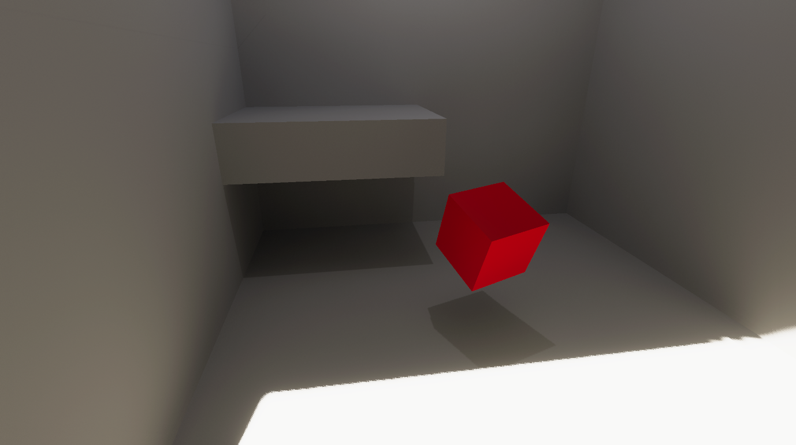
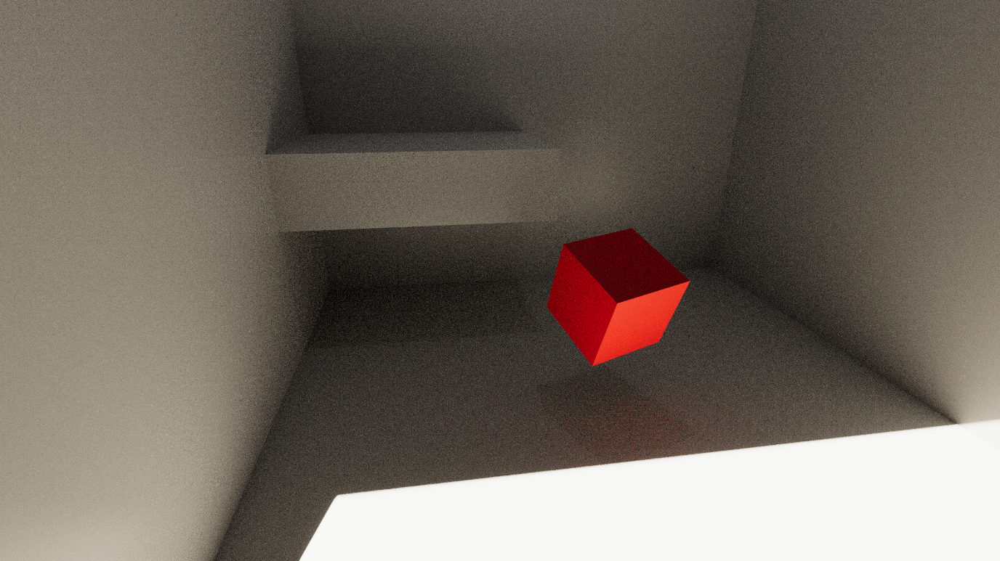
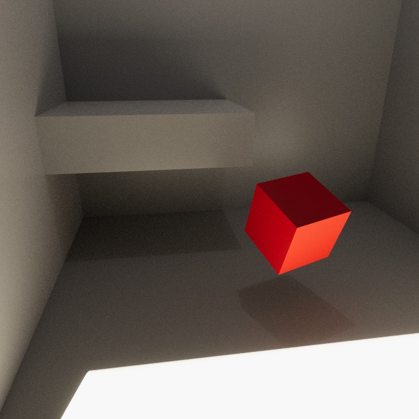

# FAQ and Code Samples

This page covers a variety of topics, including common questions and issues that may arise while using the Perception package, as well as code samples and recommendations for a number of popular workflows and use-cases.

## <a name="labeling">Labeling</a> 


<details>
  <summary><strong>Q:</strong> How can I disable or enable labeling on an object at runtime?</summary>

---

 You can turn labeling on and off on a GameObject by switching the enabled state of its `Labeling` component. For example:

  ```C#
  gameObject.GetComponent<Labeling>().enabled = false;  
  ```
 
---


</details>

<details>
  <summary><strong>Q:</strong> How can I remove or add new labels to objects at runtime?</summary>

---
This can be achieved through modifying the `labels` list of the `Labeling` component. The key is to call `RefreshLabeling` on the component after making any changes to the labels. Example:

```C#
var labeling = gameObject.GetComponent<Labeling>();
labeling.labels.Clear();
labeling.labels.Add("new-label");
labeling.RefreshLabeling();
```
Keep in mind that any new label added with this method should already be present in the `LabelConfig` attached to the `Labeler` that is supposed to label this object.

---
</details>

<details>
  <summary><strong>Q:</strong> Is it possible to label only parts of an object or assign different labels to different parts of objects?</summary>

---
  Labeling works on the GameObject level, so to achieve the scenarios described here, you will need to break down your main object into multiple GameObjects parented to the same root object, and add `Labeling` components to each of the inner objects, as shown below.

<p align="center">

</p>
  
  Alternatively, in cases where parts of the surface of the object need to be labeled (e.g. decals on objects), you can add labeled invisible surfaces on top of these sections. These invisible surfaces need to have a fully transparent material. To create an invisible material:

  * Create a new material (***Assets -> Create -> Material***) and name it `TransparentMaterial`
  * Set the `Surface Type` for the material to `Transparent`, and set the alpha channel of the `Base Map` color to 0.
    * For HDRP: In addition to the above, disable `Preserve specular lighting` 
   
  An example labeled output for an object with separate labels on inner objects is shown below:

<p align="center">

</p> 

---
</details>

<details>
  <summary><strong>Q:</strong> When visible surfaces of two objects are fully aligned, the bounding boxes seem to blink in and out of existence from one frame to another. Why is that?</summary>

---
This is due to a common graphics problem called *z-fighting*. This occurs when the shader can't decide which of the two surfaces to draw on top of the other, since they both have the exact same distance from the camera. To fix this, simply move one of the objects slightly so that the two problematic surfaces do not fully align.

---
</details>


## <a name="randomization">Randomization</a>

<details>
  <summary><strong>Q:</strong> How can I have multiple sets of prefabs in a foreground placement Randomizer, and on every Iteration select one from each set?
  </summary>

---
  This question is an example of more complex functionality that can be achieved by applying slight modifications to the provided sample Randomizers, or by creating completely custom ones using the powerful Parameters provided in the package. 

  Here, we have a variety of options toward achieving the described outcome. One simple method could be to add several more `GameObjectParameter` fields inside of the provided sample `ForegroundObjectPlacementRandomizer`. Each of these Parameters could hold one of our object lists. Then, on each iteration, we would fetch one prefab from each of the lists using the `Sample()` function of each Parameter. 
  
  The above solution can work but it is not modular enough, with the lists of prefabs not being reusable in other Randomizers.

  A better approach can be to define each prefab list separately as a scriptable object asset, and then just reference those scriptable objects inside of our foreground Randomizer. To do this, we first define a `PrefabCluster` class to hold a list of prefabs.

  ```C#
  using UnityEngine;
  using UnityEngine.Perception.Randomization.Parameters;

  [CreateAssetMenu(fileName="NewPrefabCluster", menuName="Test/PrefabCluster")]
  public class PrefabCluster : ScriptableObject
  {
      public GameObjectParameter clusterPrefabs;
  }
  ```

  We can now create a cluster asset using the ***Assets -> Create -> Test -> PrefabCluster** menu option and populate its list of prefabs. Each cluster contains one `GameObjectParameter`, which will hold the list of prefabs and provide us with a `Sample()` function.

  To be able to edit these clusters with the same editor UI available for Randomizers, you will also need to add an empty custom editor for the `PrefabCluster` class that extends our bespoke `ParameterUIElementsEditor` class:

  ```C#
  using UnityEditor;
  using UnityEditor.Perception.Randomization;

  [CustomEditor(typeof(PrefabCluster))]
  public class PrefabClusterEditor : ParameterUIElementsEditor { }
  ```

  Note that any editor scripts must be placed inside a folder named "Editor" within your project. "Editor" is a special folder name in Unity that prevents editor code from compiling into a player during the build process. For example, the file path for the `PrefabClusterEditor` script above could be ".../Assets/Scripts/Editor/PrefabClusterEditor".

  The ***Inspector*** view of a prefab cluster asset looks like below:

  <p align="center">

</p>  

  Now all that is left is to use our prefab clusters inside a Randomizer. here is some sample code:

  ```C#
  using System;
using UnityEngine;

[Serializable]
[UnityEngine.Perception.Randomization.Randomizers.AddRandomizerMenu("My Randomizers/Cluster Randomizer")]
public class ClusterRandomizer : UnityEngine.Perception.Randomization.Randomizers.Randomizer
{
    public PrefabCluster[] clusters;
    protected override void OnIterationStart()
    {
        //select a random prefab from each cluster
        foreach (var cluster in clusters)
        {
            var prefab = cluster.clusterPrefabs.Sample();
            //do things with this prefab, e.g. create instances of it, etc. 
        }
    }
}
  ```
This Randomizer takes a list of `PrefabCluster` assets, then, on each Iteration, it goes through all the provided clusters and samples one prefab from each. The ***Inspector*** view for this Randomizer looks like this:

<p align="center">

</p>  

---
</details>

<details>
  <summary><strong>Q:</strong> How can I specify an exact number of objects to place using the sample foreground object placement Randomizer? </summary>

---
The provided `ForegroundObjectPlacementRandomizer` uses Poisson Disk sampling to find randomly positioned points in the space denoted by the provided `Width` and `Height` values. The distance between the sampled points will be at equal to `Separation Distance`. The number of sampled points will be the maximum number of points in the given area that match these criteria.

Thus, to limit the number of spawned objects, you can simply introduce a hard limit in the `for` loop that iterates over the Poisson Disk samples, to break out of the loop if the limit is reached. For example:

```C#
protected override void OnIterationStart()
{
    var seed = SamplerState.NextRandomState();
    
    //retrieve points using Poisson Disk sampling
    var placementSamples = PoissonDiskSampling.GenerateSamples(
        placementArea.x, placementArea.y, separationDistance, seed);

    var offset = new Vector3(placementArea.x, placementArea.y, 0f) * -0.5f;

    var limit = 50;
    //maximum number of objects to place

    var instantiatedCount = 0;
    //iterate over all points
    foreach (var sample in placementSamples)
    {
        if (instantiatedCount == limit)
            break;

        instantiatedCount ++;        

        var instance = m_GameObjectOneWayCache.GetOrInstantiate(prefabs.Sample());
        instance.transform.position = new Vector3(sample.x, sample.y, depth) + offset;
    }
    placementSamples.Dispose();
}
```

This will guarantee an upper limit of 50 on the number of objects. To have exactly 50 objects, we need to make sure the `Separation Distance` is small enough for the given area, so that there is always at least 50 point samples found. Experiment with different values for the distance until you find one that produces the minimum number of points required.

---
</details>

<details>
  <summary><strong>Q:</strong> How can I avoid object overlap with the sample foreground object placement Randomizer?</summary>

---
  There are a number of ways for procedurally placing objects while avoiding any overlap between them, and most of these methods can be rather complex and need to place objects in a sequence. All the modifications to the objects (like scale, rotation, etc.) would also need to happen before the next object is placed, so that the state of the world is fully known before each placement.

  Here, we are going to introduce a rather simple modification in the sample foreground placement code provided with the package. In each Iteration, a random scale factor is chosen, and then a desirable separation distance is calculated based on this scale factor and the list of given prefabs. We scale the objects here to introduce additional randomization, and the fact that once we have placed the objects we can no longer scale them.
  
  Based on the value given for `Non Overlap Guarantee`, this Randomizer can either reduce the amount of overlap or completely remove overlap. 

  ```C#
  using System;
using System.Collections.Generic;
using System.Linq;
using UnityEngine;
using UnityEngine.Perception.Randomization.Parameters;
using UnityEngine.Perception.Randomization.Randomizers;
using UnityEngine.Perception.Randomization.Randomizers.Utilities;
using UnityEngine.Perception.Randomization.Samplers;

[Serializable]
[AddRandomizerMenu("Example/No Overlap Foreground Object Placement Randomizer")]
public class NoOverlapForegroundObjectPlacementRandomizer : Randomizer
{
    public float depth;
    [Tooltip("Range of scales used for objects. All objects in each frame will use the same scale.")]
    public FloatParameter scaleParameter = new FloatParameter { value = new UniformSampler(4, 8) };
    public Vector2 placementArea;
    public GameObjectParameter prefabs;
    
    [Tooltip("Degree to which we can guarantee that no objects will overlap. Use 1 for no overlap and smaller values (down to 0) for more dense placement with a possibility of some overlap.")]
    public float nonOverlapGuarantee = 1;
    
    float m_ScaleFactor = 1f;
    GameObject m_Container;
    GameObjectOneWayCache m_GameObjectOneWayCache;
    Dictionary<GameObject, float> m_GameObjectBoundsSizeCache;
    List<GameObject> m_SelectedPrefabs;
    int m_SelectionPoolSizePerFrame = 1;
    FloatParameter m_IndexSelector = new FloatParameter { value = new UniformSampler(0, 1) };

    protected override void OnAwake()
    {
        m_Container = new GameObject("Foreground Objects");
        m_Container.transform.parent = scenario.transform;
        m_GameObjectOneWayCache = new GameObjectOneWayCache(
            m_Container.transform, prefabs.categories.Select(element => element.Item1).ToArray());
        m_GameObjectBoundsSizeCache = new Dictionary<GameObject, float>();
        m_SelectedPrefabs = new List<GameObject>();

        //Calculate the average bounds size for the prefabs included in this categorical parameter
        var averageBoundsSize = CalculateAverageBoundsSize();
        
        //Calculate average scale based on the scale range given
        var averageScale = 1f;
        var sampler = (UniformSampler)scaleParameter.value;
        if (sampler != null)
        {
            averageScale = (sampler.range.minimum + sampler.range.maximum) / 2;
        }

        //Use average bounds size and average scale to guess the maximum number of objects that can be placed without having them overlap. 
        //This is a heuristic to help us start the placement process. The actual number of items placed will usually be usually much smaller.
        m_SelectionPoolSizePerFrame = (int)(placementArea.x * placementArea.y / (averageBoundsSize * averageScale));
    }

    protected override void OnIterationStart()
    {
        m_ScaleFactor = scaleParameter.Sample();
        m_SelectedPrefabs.Clear();

        //Select a random number of prefabs for this frame. Placement calculations will be done based on this subset. 
        for (var i = 0; i < m_SelectionPoolSizePerFrame; i++)
        {
            var randIndex = (int)Mathf.Round((m_IndexSelector.Sample() * prefabs.categories.Count) - 0.5f);
            m_SelectedPrefabs.Add(prefabs.categories[randIndex].Item1);
        }

        //Calculate the minimum separation distance needed for the selected prefabs to not overlap.  
        var separationDistance = CalculateMaxSeparationDistance(m_SelectedPrefabs);
        var seed = SamplerState.NextRandomState();
        var placementSamples = PoissonDiskSampling.GenerateSamples(
            placementArea.x, placementArea.y, separationDistance, seed);
        var offset = new Vector3(placementArea.x, placementArea.y, 0f) * -0.5f;
        foreach (var sample in placementSamples)
        {
            //Pick a random prefab from the selected subset and instantiate it.
            var randIndex = (int)Mathf.Round((m_IndexSelector.Sample() * m_SelectedPrefabs.Count) - 0.5f);
            var instance = m_GameObjectOneWayCache.GetOrInstantiate(m_SelectedPrefabs[randIndex]);
            instance.transform.position = new Vector3(sample.x, sample.y, depth) + offset;
            instance.transform.localScale = Vector3.one * m_ScaleFactor;
        }

        placementSamples.Dispose();
    }

    protected override void OnIterationEnd()
    {
        m_GameObjectOneWayCache.ResetAllObjects();
    }

    /// <summary>
    /// Calculates the separation distance needed between placed objects to be sure that no two objects will overlap
    /// </summary>
    /// <returns>The max separation distance</returns>
    float CalculateMaxSeparationDistance(ICollection<GameObject> categories)
    {
        var maxBoundsSize = m_GameObjectBoundsSizeCache.Where(item => categories.Contains(item.Key)).Max(pair => pair.Value); 
        return maxBoundsSize * m_ScaleFactor * nonOverlapGuarantee;
    }

    float CalculateAverageBoundsSize()
    {
        foreach (var category in prefabs.categories)
        {
            var prefab = category.Item1;

            prefab.transform.localScale = Vector3.one;
            var renderers = prefab.GetComponentsInChildren<Renderer>();
            var totalBounds = new Bounds();
            foreach (var renderer in renderers)
            {
                totalBounds.Encapsulate(renderer.bounds);
            }

            var boundsSize = totalBounds.size.magnitude;
            m_GameObjectBoundsSizeCache.Add(prefab, boundsSize);
        }

        return m_GameObjectBoundsSizeCache.Values.Average();
    }
}

  ```
---
</details>

<details>
  <summary><strong>Q:</strong> What if I don't want randomized object placement? Can I move my objects in a non-randomized predefined manner on each frame? </summary>

---
Even though we call them Randomizers, you can use a Randomizer to perform any task through-out the execution lifecycle of your Scenario. The power of the Randomizers comes from the lifecycle hooks that they have into the Iteration and the Scenario, making it easy to know and guarantee when and in which order in the life of your simulation each piece of code runs. These functions include:
* `OnEnable`
* `OnAwake`
* `OnUpdate`
* `OnIterationStart`
* `OnIterationEnd`
* `OnScenarioStart`
* `OnScenarioComplete`
* `OnDisable`

So, in order to have deliberate non-random object movement, you will just need to put your object movement code inside of one of the recurrent lifecycle functions. `OnUpdate()` runs on every frame of the simulation, and `OnIterationStart()` runs every Iteration (which can be the same as each frame if you have only 1 frame per Iteration of your Scenario). For example, the code below moves all objects tagged with the component `ForwardMoverTag` by along their forward axis by 1 unit, on every Iteration. 

```C#
protected override void OnIterationStart()
{
    var tags = tagManager.Query<ForwardMoverTag>();
    foreach (var tag in tags)
    {
        tag.transform.Translate(Vector3.forward);
    }
}
```
---
</details>

<details>
  <summary><strong>Q:</strong> The objects instantiated using the sample foreground placement Randomizer are floating in the air. How can I use this Randomizer to place objects on a horizontal surface instead? </summary>

---
The objects instantiated by the sample foreground Randomizer are all parented to an object named `Foreground Objects` at the root of the Scene Hierarchy. To modify the orientation of the objects, you can simply rotate this parent object at the beginning of the Scenario. 

Alternatively, you could also place `Foreground Objects` inside another GameObject in the Scene using the `Transform.SetParent()` method, and then modifying the local position and and rotation of `Foreground Objects` in such a way that makes the objects appear on the surface of the parent GameObject. 

To achieve more natural placement, you could also use Unity's physics engine to drop the objects on a surface, let them settle, and then capture an image. To achieve this, you would just need to have sufficient frames in each Iteration of the Scenario (instead of the default 1 frame per iteration), and set your Perception Camera's capture interval to a large enough number that would make it capture each Iteration once after the objects have settled. This example is explained in more detail in the [Perception Camera](#perception-camera) section of this FAQ.

---
</details>

<details>
  <summary><strong>Q:</strong> Does using the same `Random Seed` value in two runs of the same Scenario guarantee that the generated datasets are identical?</summary>

---
 If you only use the Samplers (and Parameters, which internally use Samplers) provided in the Perception package to generate random values throughout the Scenario's lifecycle and keep the `Random Seed` value unchanged, an identical sequence of random numbers will be generated every time the Scenario is run. This is because the Samplers obtain their seeds through continually mutating the provided global `Random Seed` in the Scenario.  

 Keep in mind that any change in the order of sampling or the number of samples obtained can lead to different outcomes. For example, if you change the order of Randomizers in the Scenario, the Samplers inside of these Randomizers will now execute in the new order, and thus, they will operate based on different seeds than before and generate different numbers. The same can happen if you add additional calls to a Sampler inside a Randomizer, causing the Samplers in later Randomizers to now use different seeds, since the global seed has been mutated more times than before.

 One more thing to keep in mind is that certain systems and components of Unity are not deterministic and can produce different outcomes in consecutive runs. Examples of this are the physics engine and the film grain post processing. Hence, if you need to guarantee that your simulation always produces the exact same dataset, make sure to research the various systems that you use to make sure they behave deterministically. 

---
</details>

## <a name="perception-camera">Perception Camera</a>

<details>
  <summary><strong>Q:</strong> What is the relationship between the Scenario's lifecycle properties (Iterations and Frames per Iteration) in conjunction with the Perception Camera's timing properties (Simulation Delta Time, Start at Frame, and Frames Between Captures). </summary>

---
Each Iteration of the Scenario resets the Perception Camera's timing variables. Thus, you can think of each Iteration of the Scenario as one separate Perception Camera sequence, in which the camera's internal timing properties come into play. For instance, if you have 10 `Frames Per Iteration` on your Scenario, and your Perception Camera's `Start at Frame` value is set to 8, you will get two captures from the camera at the 9th and 10th frames of each Iteration (note that `Start at Frame` starts from 0). Similarly, you can use the `Frames Between Captures` to introduce intervals between captures. A value of 0 leads to all frames being captured.

---
</details>

<details>
  <summary><strong>Q:</strong> I want to simulate physics (or other accumulative behaviors such as auto-exposure) for a number of frames and let things settle before capturing the Scene. Is this possible with the Perception package?</summary>

---
The Perception Camera can be set to capture at specific frame intervals, rather than every frame. The `Frames Between Captures` value is set to 0 by default, which causes the camera to capture all frames; however, you can change this to 1 to capture every other frame, or larger numbers to allow more time between captures. You can also have the camera start capturing at a certain frame rather the first frame, by setting the `Start at Frame` value to a value other than 0. All of this timing happens within each Iteration of the Scenario, and gets reset when you advance to the next Iteration. Therefore, the combination of these properties and the Scenario's `Frames Per Iteration` property allows you to randomize the state of your Scene at the start of each Iteration, let things run for a number of frames, and then capture the Scene at the end of the Iteration.

Suppose we need to drop a few objects into the Scene, let them interact physically and settle after a number of frames, and then capture their final state once. Afterwards, we want to repeat this cycle by randomizing the initial positions of the objects, dropping them, and capturing the final state again. We will set the Scenario's `Frames Per Iteration` to 300, which should be sufficient for the objects to get close to a settled position (this depends on the value you use for `Simulation Delta Time` in Perception Camera and the physical properties of the engine and objects, and can be found through experimentation). We also set the `Start at Frame` value of the Perception Camera to 290, and the `Frames Between Captures` to a sufficiently large number (like 100), so that we only get one capture per Iteration of the Scenario. The results look like below:


<p align="center">

</p>  

Note how the bounding boxes only update after the objects are fairly settled. These are the points at which captures are happening.

---
</details>

<details>
  <summary><strong>Q:</strong> I do not want to use the Perception Camera to control the timing of my simulation or capture on a scheduled basis. Can I have a Perception Camera in my Scene and trigger captures manually from other scripts?</summary>

---
Yes. The Perception Camera offers two trigger modes, `Scheduled` and `Manual`, and these can be chosen in the editor UI for the camera. If you select the `Manual` mode, you will be able to trigger captures by calling the `RequestCapture()` method of `PerceptionCamera`. In this mode, you still have an option to dictate your simulation delta time with this camera, in order to have deterministic simulation progress between rendered frames. This is controlled using the `Affect Simulation Timing` checkbox.

---
</details>


<details>
  <summary><strong>Q:</strong> Can I have multiple Perception Cameras active in my Scene simultaneously?</summary>

---
We currently do not support multiple active Perception Cameras, but you may be able to get things working partially if you clone the repository and modify parts of the code to fix some of the more easy-to-fix issues such as file sharing errors. You would also need to use render textures on all cameras. That said, there are still issues with the render pipeline that may prevent you from using Labelers of the same kind with different Label Configs on these cameras.

However, you can have more than one Perception Camera in the Scene, if only one is active when the simulation starts. Therefore, one possible workaround, if your simulation is fully deterministic from one run to the next, would be to run the simulation more than once, each time with one of the cameras active. While not ideal, this will at least let you generate matching datasets.

---
</details>

<details>
  <summary><strong>Q:</strong> My RGB images look darker than what I see in Unity Editor, when I render the Perception Camera to a texture. How can I fix this?
</summary>

---
This issue is caused by the color format of the texture. In the ***Inspector** view of the render texture, set color format to `R8G8B8A8_SRGB`.

---
</details>

<details>
  <summary><strong>Q:</strong> How do I report additional custom information in my output dataset for each frame or the whole simulation (e.g. 3D position of objects at the start of each Iteration, intensity of lights, etc.)?
</summary>

---
This can be done by adding custom annotations to your dataset. Have a look at [this](https://github.com/Unity-Technologies/com.unity.perception/blob/master/com.unity.perception/Documentation%7E/DatasetCapture.md) page for an explanation, as well as an example for how to do this. 

---
</details>

## <a name="miscellaneous">Miscellaneous</a>

<details>
  <summary><strong>Q:</strong> Objects in my captured images have jagged edges, how can I fix this?
</summary>

---
This is a common issue with rendering graphics into pixel grids (digital images), when the resolution of the grid is not high enough to perfectly display the slanting lines in the image. The common solution to this issue is the use of anti-aliasing methods, and Unity offers a number of these in both URP and HDRP. To experiment with anti-aliasing, go to the ***Inspector*** view of your Perception Camera object and in the Camera component, change `Anti-aliasing` from `None` to another option.

---
</details>

<details>
  <summary><strong>Q:</strong> I am using an HDRP Unity project with Perception and my images have significant blurring around most objects. How can I remove this blur?
</summary>

---
The effect you are observing here is motion blur, which is happens because the placement Randomizers used in the Perception tutorial cache their instantiated objects from one frame to the next, and move them to new locations on each frame instead of destroying them and creating new ones. This "motion" of the objects causes the motion blur effect to kick in. 


HDRP projects have motion blur and a number of other post processing effects enabled by default. To disable motion blur or any other effect, follow these steps:
1. Create an empty GameObject in your Scene and add a Volume component to it.
2. Set the Volume's profile to the **Volume Global** asset.
3. Uncheck the **Motion Blur** option.


<p align="center">

</p>  

---
</details>

<details>
  <summary><strong>Q:</strong> Are all post processing effects provided by Unity safe to use?
</summary>

---
A couple of important notes to keep in mind with post-processing revolve around randomness:

  * Some effects need to be Randomized from frame to frame, e.g. Film Grain). The Film Grain effect provided by Unity is not sufficiently randomized for model training and can thus mislead your CV model in the training process. 
  * Even if an effect is properly randomized, using it would make your overall randomization strategy non-deterministic, as it would use random number generators outside of the Perception package provided Samplers. 

To make sure you do not run into insufficient randomization or non-determinism, it would be best to implement effects such as Film Grain yourself and only use the Perception provided Samplers and Parameters in order to guarantee determinism.

---
</details>

<details>
  <summary><strong>Q:</strong> What post processing effects can help improve model performance?
</summary>

---
Based on our experiments, randomizing contrast, saturation, lens blur, and lens distortion can help significantly improve the performance of your CV model. We recommend experimenting with these as well as other effects to determine those that work best for your use-case.

---
</details>

<details>
  <summary><strong>Q:</strong> Can I debug my C# code?
</summary>

---
Unity projects can be debugged using external editors such as Visual Studio or JetBrains Rider. For local development and debugging, you will first need to clone the Perception repository to disk and add the Perception package from this cloned repository to your Unity project. Then, in Unity Editor, go to ***Edit (or "Unity" on OSX) -> Preferences -> External Tools***. Select your preferred editor as the External Script Editor, and enable 
**General .csproj files** for at least **Embedded packages** and **Local packages**. This will allow you to quickly navigate through the code-base for the Perception package and internal Unity Editor packages.

All you need to do now is to double click any of the Perception package's C# script files from inside Unity Editor's **Project** window. The files are located in `Assets/Perception`. Double clicking will open them in your external editor of choice, and you will be able to attach the debugger to Unity.

---
</details>


<details>
  <summary><strong>Q:</strong> What kind of synthetic environment will be best for my use-case?
</summary>

---
It is difficult to say what type of synthetic environment would lead to the best model performance. It is best to carry out small and quick experiments with both random unstructured environments (such as the [SynthDet](https://github.com/Unity-Technologies/SynthDet) project) and more structured ones that may resemble real environments in which prediction will need to happen. This will help identify the types of environments and randomizations that work best for each specific use-case. The beauty of synthetic data is that you can try these experiments fairly quickly.

Here are a few of blog posts to give you some ideas: [1](https://blog.unity.com/technology/synthetic-data-simulating-myriad-possibilities-to-train-robust-machine-learning-models), [2](https://blog.unity.com/technology/use-unitys-perception-tools-to-generate-and-analyze-synthetic-data-at-scale-to-train), [3](https://blog.unity.com/technology/training-a-performant-object-detection-ml-model-on-synthetic-data-using-unity-perception), [4](https://blog.unity.com/technology/supercharge-your-computer-vision-models-with-synthetic-datasets-built-by-unity), [5](https://blog.unity.com/technology/boosting-computer-vision-performance-with-synthetic-data).

---
</details>


<details>
  <summary><strong>Q:</strong> Can I have more realistic rendering in my Scene?
</summary>

---
A project's lighting configuration typically has the greatest influence over the final rendered output over any other simulation property. Unity has many lighting options, each of which is designed as a different trade-off between performance and realism/capability. The 3 most pertinent options that you will likely be interested in are:

* URP baked lighting: The Universal Render Pipeline offers the most performant lighting configurations by using an offline baking process to generate realistic bounce lighting within a static scene and then using simple shadow mapped dynamic lights in conjunctions with light probes to make dynamic (or randomized) objects "fit" into the baked scene. This option provides high performance, but lacks the visual fidelity needed for interior environments and is geared toward more outdoor-like settings. Also, depending on scene randomization complexity, light baking might not be the best option. Randomly generated scenes will often place objects and adjust lighting in ways that make the new scene incompatible with the original baked lighting configuration.

* HDRP lighting: A default HDRP scene offers a step toward more realistic environments with a much larger array of lighting settings (soft shadows, multiple dynamic lights, etc.) and a host of additional real-time effects like camera exposure and screen space ambient occlusion. A warning though: real time screen space effects may make your scene "look better", but the way these effects are calculated is not based on how light works in the real world, so realism may vary. Another huge advantage of HDRP is the potential to have moderately realistic lighting without baking your lighting configuration (though you can integrate light baking if you want to). However, there is no real-time global illumination option in default HDRP, meaning that your scene will not simulate complex real world light behavior such as light bouncing, light bleeding, or realistic shadows for dynamic scenes. This can result in unrealistically dark scenes when only using directional lights and windows (without extra interior lights to brighten things up). Overall though, HDRP offers a good compromise between performance and realism for some use cases.

* HDRP DXR (DirectX Raytracing): Unity offers some preview ray tracing features in its latest editor versions that can be used to drastically improve the realism of your scene. Here are the pros and cons of DXR:
  * Pros:
    * Can simulate more realistic light behaviors (light bouncing, light color bleeding, and realistic shadows)
    * No light baking required
  * Cons:
    * Requires special hardware to run (Nvidia RTX graphics cards)
    * Time consuming to render (relative to default HDRP). Some lighting options (Global Illumination) are less expensive then others (Path Tracing).
    * More complicated to configure
    * These features are still in preview and subject to change
 
A visual comparison of the different lighting configurations in HDRP is shown below. The Scene includes one directional light and one dim point light on the ceiling.

Default HDRP:

<p align="center">

</p>  

HDRP with Global Illumination (notice how much brighter the scene is with ray traced light bouncing):

<p align="center">

</p>  

HDRP with Path Tracing (128 samples) (notice the red light bleeding from the cube onto the floor and the increased shadow quality):

<p align="center">

</p>  

HDRP with Path Tracing (4096 samples) (more samples leads to less ray tracing noise but also a longer time to render):

<p align="center">

</p>  

---
</details>

<details>
  <summary><strong>Q:</strong> I am randomizing my Scene every frame and using ray casting to detect the position of objects, but my ray casts are returning incorrect results. What is the issue here?
</summary>

---
The physics engine needs to catch up with the position and rotation of your objects and is typically a frame behind. When you randomize things every frame, the physics engine can never cath up. To fix this, call `Physics.SyncTransforms` just before calling any ray casting methods.

---
</details>

<details>
  <summary><strong>Q: Where can I get humanoid models and animations?</strong>
</summary>

---
One useful resource for humanoid characters and animations is [Mixamo](https://www.mixamo.com/#/?page=1&type=Motion%2CMotionPack).

---
</details>