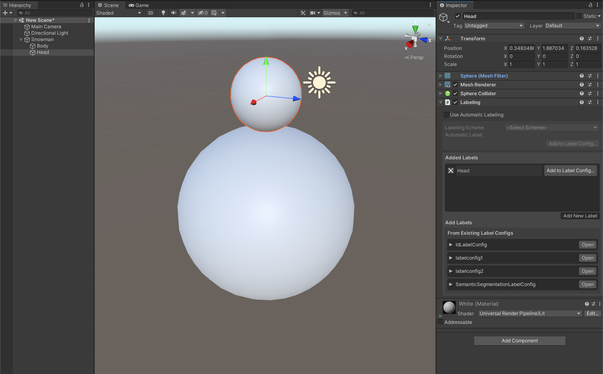

# FAQ and Code Samples

This page covers a variety of topics, including common questions and issues that may arise while using the Perception package, as well as code samples and recommendations for a number of popular workflows and use-cases.

## Labeling


<details>
  <summary><strong>Q:</strong> How can I disable or enable labeling on an object at runtime?</summary>

 You can turn labeling on and off on a GameObject by switching the enabled state of its `Labeling` component. For example:
  
  ```C#
  gameObject.GetComponent<Labeling>().enabled = false;  
  ```
</details>

<details>
  <summary><strong>Q:</strong> How can I remove or add new labels to objects at runtime?</summary>

This can be achieved through modifying the `labels` list of the `Labeling` component. The key is to call `RefreshLabeling` on the component after making any changes to the labels. Example:

```C#
var labeling = gameObject.GetComponent<Labeling>();
labeling.labels.Clear();
labeling.labels.Add("new-label");
labeling.RefreshLabeling();
```
Keep in mind that any new label added with this method should already be present in the `LabelConfig` attached to the `Labeler` that is supposed to label this object.
</details>

<details>
  <summary><strong>Q:</strong> Is it possible to label only parts of an object or assign different labels to different parts of objects?</summary>

  Labeling works on the GameObject level, so to achieve the scenarios described here, you will need to break down your main object into multiple GameObjects parented to the same root object, and add `Labeling` components to each of the inner objects, as shown below.

<p align="center">

</p>
  
  Alternatively, in cases where parts of the surface of the object need to be labeled (e.g. decals on objects), you can add labeled invisible surfaces on top of these sections. These invisible surfaces need to have a fully transparent material. To create an invisible material:

  * Create a new material (***Assets -> Create -> Material***) and name it `TransparentMaterial`
  * Set the `Surface Type` for the material to `Transparent`, and set the alpha channel of the `Base Map` color to 0.
    * For HDRP: In addition to the above, disable `Preserve specular lighting` 
   
  An example labeled output for an object with separate labels on inner objects is shown below:

<p align="center">

</p> 
</details>

<details>
  <summary><strong>Q:</strong> When visible surfaces of two objects are fully aligned, the bounding boxes seem to blink in and out of existence from one frame to another. Why is that?</summary>

This is due to a common graphics problem called *z-fighting*. This occurs when the shader can't decide which of the two surfaces to draw on top of the other, since they both have the exact same distance from the camera. To fix this, simply move one of the objects slightly so that the two problematic surfaces do not fully align.

</details>


## Randomization

<details>
  <summary><strong>Q:</strong> How can I have multiple sets of prefabs in a foreground placement Randomizer, and on every Iteration select one from each set?
  </summary>

  This question is an example of more complex functionality that can be achieved by applying slight modifications to the provided sample Randomizers, or by creating completely custom ones using the powerful Parameters provided in the package. 

  Here, we have a variety of options toward achieving the described outcome. One simple method could be to add several more `GameObjectParameter` fields inside of the provided sample `ForegroundObjectPlacementRandomizer`. Each of these Parameters could hold one of our object lists. Then, on each iteration, we would fetch one prefab from each of the lists using the `Sample()` function of each Parameter. 
  
  The above solution can work but it is not modular enough, with the lists of prefabs not being reusable in other Randomizers.

  A better approach can be to define each prefab list separately as a scriptable object asset, and then just reference those scriptable objects inside of our foreground Randomizer. To do this, we first define a `PrefabCluster` class to hold a list of prefabs.

  ```C#
  using UnityEngine;
  using UnityEngine.Perception.Randomization.Parameters;

  [CreateAssetMenu(fileName="NewPrefabCluster", menuName="Test/PrefabCluster")]
  public class PrefabCluster : ScriptableObject
  {
      public GameObjectParameter clusterPrefabs;
  }
  ```

  We can now create a cluster asset using the ***Assets -> Create -> Test -> PrefabCluster** menu option and populate its list of prefabs. Each cluster contains one `GameObjectParameter`, which will hold the list of prefabs and provide us with a `Sample()` function.

  To be able to edit these clusters with the same editor UI available for Randomizers, you will also need to add an empty custom editor for the `PrefabCluster` class that extends our bespoke `ParameterUIElementsEditor` class:

  ```C#
  using UnityEditor;
  using UnityEditor.Perception.Randomization;

  [CustomEditor(typeof(PrefabCluster))]
  public class PrefabClusterEditor : ParameterUIElementsEditor { }
  ```

  Note that any editor scripts must be placed inside a folder named "Editor" within your project. "Editor" is a special folder name in Unity that prevents editor code from compiling into a player during the build process. For example, the file path for the `PrefabClusterEditor` script above could be ".../Assets/Scripts/Editor/PrefabClusterEditor".

  The ***Inspector*** view of a prefab cluster asset looks like below:

  <p align="center">

</p>  

  Now all that is left is to use our prefab clusters inside a Randomizer. here is some sample code:

  ```C#
  using System;
using UnityEngine;

[Serializable]
[UnityEngine.Perception.Randomization.Randomizers.AddRandomizerMenu("My Randomizers/Cluster Randomizer")]
public class ClusterRandomizer : UnityEngine.Perception.Randomization.Randomizers.Randomizer
{
    public PrefabCluster[] clusters;
    protected override void OnIterationStart()
    {
        //select a random prefab from each cluster
        foreach (var cluster in clusters)
        {
            var prefab = cluster.clusterPrefabs.Sample();
            //do things with this prefab, e.g. create instances of it, etc. 
        }
    }
}
  ```
This Randomizer takes a list of `PrefabCluster` assets, then, on each Iteration, it goes through all the provided clusters and samples one prefab from each. The ***Inspector*** view for this Randomizer looks like this:

<p align="center">

</p>  

</details>

<details>
  <summary><strong>Q:</strong> How can I specify an exact number of objects to place using the sample foreground object placement Randomizer? </summary>

The provided `ForegroundObjectPlacementRandomizer` uses Poisson Disk sampling to find randomly positioned points in the space denoted by the provided `Width` and `Height` values. The distance between the sampled points will be at equal to `Separation Distance`. The number of sampled points will be the maximum number of points in the given area that match these criteria.

Thus, to limit the number of spawned objects, you can simply introduce a hard limit in the `for` loop that iterates over the Poisson Disk samples, to break out of the loop if the limit is reached. For example:

```C#
protected override void OnIterationStart()
{
    var seed = SamplerState.NextRandomState();
    
    //retrieve points using Poisson Disk sampling
    var placementSamples = PoissonDiskSampling.GenerateSamples(
        placementArea.x, placementArea.y, separationDistance, seed);

    var offset = new Vector3(placementArea.x, placementArea.y, 0f) * -0.5f;

    var limit = 50;
    //maximum number of objects to place

    var instantiatedCount = 0;
    //iterate over all points
    foreach (var sample in placementSamples)
    {
        if (instantiatedCount == limit)
            break;

        instantiatedCount ++;        

        var instance = m_GameObjectOneWayCache.GetOrInstantiate(prefabs.Sample());
        instance.transform.position = new Vector3(sample.x, sample.y, depth) + offset;
    }
    placementSamples.Dispose();
}
```

This will guarantee an upper limit of 50 on the number of objects. To have exactly 50 objects, we need to make sure the `Separation Distance` is small enough for the given area, so that there is always at least 50 point samples found. Experiment with different values for the distance until you find one that produces the minimum number of points required.

</details>

<details>
  <summary><strong>Q:</strong> How can I avoid object overlap with the sample foreground object placement Randomizer?</summary>

  There are a number of ways for procedurally placing objects while avoiding any overlap between them, and most of these methods can be rather complex and need to place objects in a sequence. All the modifications to the objects (like scale, rotation, etc.) would also need to happen before the next object is placed, so that the state of the world is fully known before each placement.

  Here, we are going to introduce a rather simple modification in the sample foreground placement code provided with the package, which works by finding a desirable separation distance based on the list of given prefabs. Based on the value given for `Non Overlap Guarantee`, this Randomizer can either reduce the amount of overlap or completely remove overlap. 

  ```C#
  using System;
using System.Collections.Generic;
using System.Linq;
using UnityEngine;
using UnityEngine.Perception.Randomization.Parameters;
using UnityEngine.Perception.Randomization.Randomizers;
using UnityEngine.Perception.Randomization.Randomizers.Utilities;
using UnityEngine.Perception.Randomization.Samplers;

[Serializable]
[AddRandomizerMenu("Example/No Overlap Foreground Object Placement Randomizer")]
public class NoOverlapForegroundObjectPlacementRandomizer : Randomizer
{
    public float depth;
    [Tooltip("Range of scales used for objects. All objects in each frame will use the same scale.")]
    public FloatParameter scaleParameter = new FloatParameter { value = new UniformSampler(4, 8) };
    public Vector2 placementArea;
    public GameObjectParameter prefabs;
    
    [Tooltip("Degree to which we can guarantee that no objects will overlap. Use 1 for no overlap and smaller values (down to 0) for more dense placement with a possibility of some overlap.")]
    public float nonOverlapGuarantee = 1;
    
    float m_ScaleFactor = 1f;
    GameObject m_Container;
    GameObjectOneWayCache m_GameObjectOneWayCache;
    Dictionary<GameObject, float> m_GameObjectBoundsSizeCache;
    List<GameObject> m_SelectedPrefabs;
    int m_SelectionPoolSizePerFrame = 1;
    FloatParameter m_IndexSelector = new FloatParameter { value = new UniformSampler(0, 1) };

    protected override void OnAwake()
    {
        m_Container = new GameObject("Foreground Objects");
        m_Container.transform.parent = scenario.transform;
        m_GameObjectOneWayCache = new GameObjectOneWayCache(
            m_Container.transform, prefabs.categories.Select(element => element.Item1).ToArray());
        m_GameObjectBoundsSizeCache = new Dictionary<GameObject, float>();
        m_SelectedPrefabs = new List<GameObject>();

        //Calculate the average bounds size for the prefabs included in this categorical parameter
        var averageBoundsSize = CalculateAverageBoundsSize();
        
        //Calculate average scale based on the scale range given
        var averageScale = 1f;
        var sampler = (UniformSampler)scaleParameter.value;
        if (sampler != null)
        {
            averageScale = (sampler.range.minimum + sampler.range.maximum) / 2;
        }

        //Use average bounds size and average scale to guess the maximum number of objects that can be placed without having them overlap. 
        //This is a heuristic to help us start the placement process. The actual number of items placed will usually be usually much smaller.
        m_SelectionPoolSizePerFrame = (int)(placementArea.x * placementArea.y / (averageBoundsSize * averageScale));
    }

    protected override void OnIterationStart()
    {
        m_ScaleFactor = scaleParameter.Sample();
        m_SelectedPrefabs.Clear();

        //Select a random number of prefabs for this frame. Placement calculations will be done based on this subset. 
        for (var i = 0; i < m_SelectionPoolSizePerFrame; i++)
        {
            var randIndex = (int)Mathf.Round((m_IndexSelector.Sample() * prefabs.categories.Count) - 0.5f);
            m_SelectedPrefabs.Add(prefabs.categories[randIndex].Item1);
        }

        //Calculate the minimum separation distance needed for the selected prefabs to not overlap.  
        var separationDistance = CalculateMaxSeparationDistance(m_SelectedPrefabs);
        var seed = SamplerState.NextRandomState();
        var placementSamples = PoissonDiskSampling.GenerateSamples(
            placementArea.x, placementArea.y, separationDistance, seed);
        var offset = new Vector3(placementArea.x, placementArea.y, 0f) * -0.5f;
        foreach (var sample in placementSamples)
        {
            //Pick a random prefab from the selected subset and instantiate it.
            var randIndex = (int)Mathf.Round((m_IndexSelector.Sample() * m_SelectedPrefabs.Count) - 0.5f);
            var instance = m_GameObjectOneWayCache.GetOrInstantiate(m_SelectedPrefabs[randIndex]);
            instance.transform.position = new Vector3(sample.x, sample.y, depth) + offset;
            instance.transform.localScale = Vector3.one * m_ScaleFactor;
        }

        placementSamples.Dispose();
    }

    protected override void OnIterationEnd()
    {
        m_GameObjectOneWayCache.ResetAllObjects();
    }

    /// <summary>
    /// Calculates the separation distance needed between placed objects to be sure that no two objects will overlap
    /// </summary>
    /// <returns>The max separation distance</returns>
    float CalculateMaxSeparationDistance(ICollection<GameObject> categories)
    {
        var maxBoundsSize = m_GameObjectBoundsSizeCache.Where(item => categories.Contains(item.Key)).Max(pair => pair.Value); 
        return maxBoundsSize * m_ScaleFactor * nonOverlapGuarantee;
    }

    float CalculateAverageBoundsSize()
    {
        foreach (var category in prefabs.categories)
        {
            var prefab = category.Item1;

            prefab.transform.localScale = Vector3.one;
            var renderers = prefab.GetComponentsInChildren<Renderer>();
            var totalBounds = new Bounds();
            foreach (var renderer in renderers)
            {
                totalBounds.Encapsulate(renderer.bounds);
            }

            var boundsSize = totalBounds.size.magnitude;
            m_GameObjectBoundsSizeCache.Add(prefab, boundsSize);
        }

        return m_GameObjectBoundsSizeCache.Values.Average();
    }
}

  ```

</details>

## Perception Camera

## Capture and Dataset Format

## Miscellaneous

