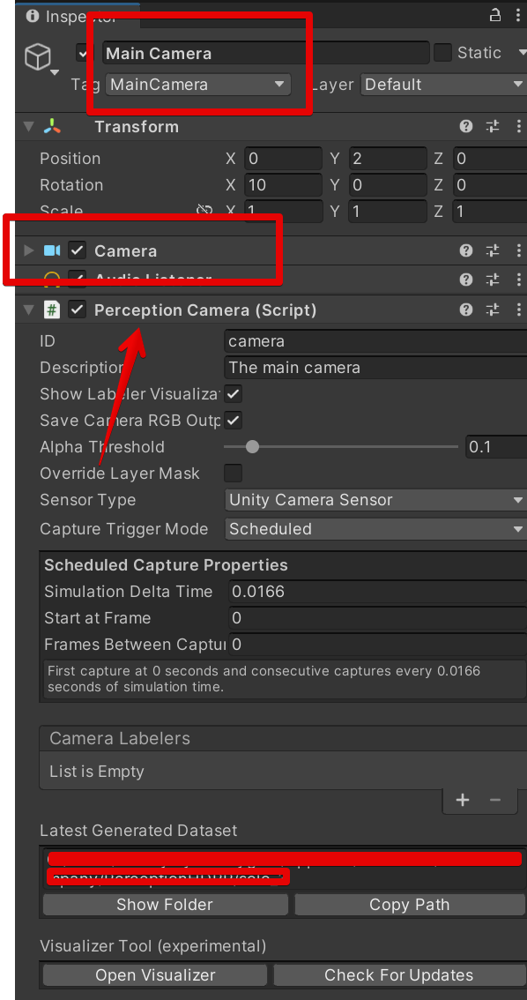
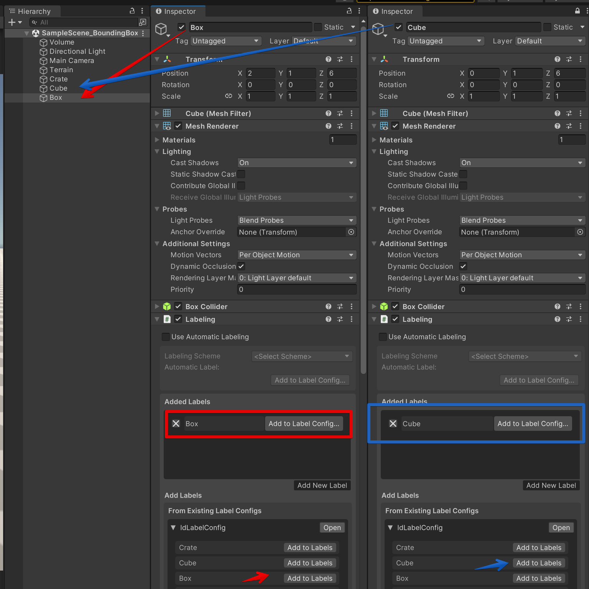
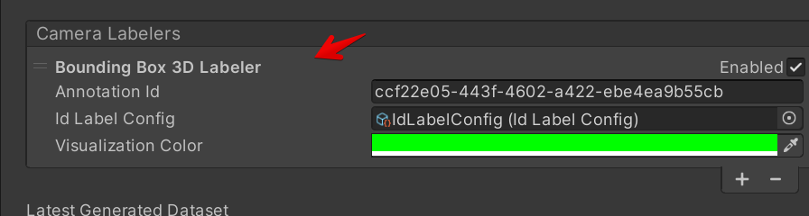
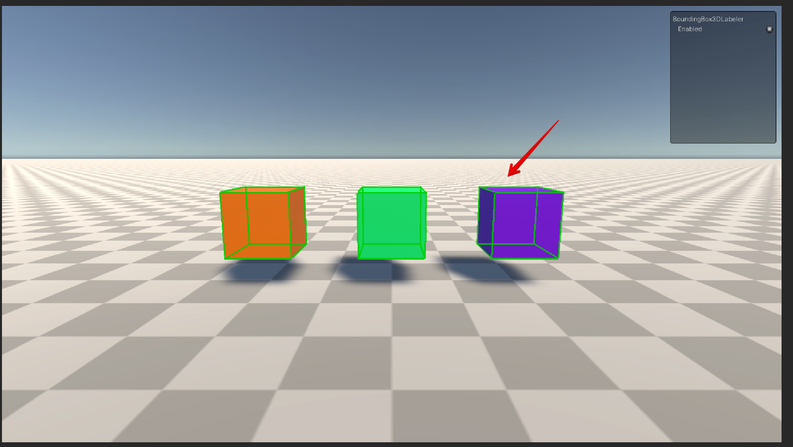

# BoundingBox3D Labeler

The BoundingBox2D Labeler produces rectangular 3d bounding box annotation for required objects each frame.

## Data Format
The keypoints captured each frame are in the following format:
```
"annotations": [
        {
          type: <str>                 -- annotation type
          id: <str>                   -- Labeler Id
          sensorId: <str>             -- Sensor ID
          description: <str>          -- description
          values: [
            {
              instanceId: <str>       -- UUID of the instance
              labelId: <int>          -- Integer identifier of the label
              labelName: <str>        -- Label name of the instance
              translation: <float[]>  -- center of the 3D bouning box
              size: <float[]>         -- size of the 3D bouning box
              rotation: <float[]>     -- rotation of the 3D bouning box
              velocity: <float[]>     -- 
              acceleration: <float[]> -- 
            },
            ...
          ]
        }
]
```

## Example scene
```
SampleScene_BoundingBox_3d
```

Scene can be found in unity editor by path `Scenes/Examples`

## Setup

1. Add script `PerceptionCamera` to the Camera in the scene
<p align="center">

</p>

2. Select BoundingBox3dLabeler from the avaiable list of labelers
<p align="center">

</p>

3. Set the existed IdLabelerConfig or [Create a new one](../GroundTruthLabeling.md#label-config)
<p align="center">

</p>

4. Add GameObjects to the scene hierarchy

5. Add to every GameObject that should be labeled a [Labeling](../GroundTruthLabeling.md) component and set proper Labels
<p align="center">

</p>

6. Add proper labels to each GameObject

7. **!IMPORTANT!** Check that IdLabelerConfig added to the main camera contains LabelIds added in the step 6

8. Each object that should be labaled will be labeled
<p align="center">

</p>
