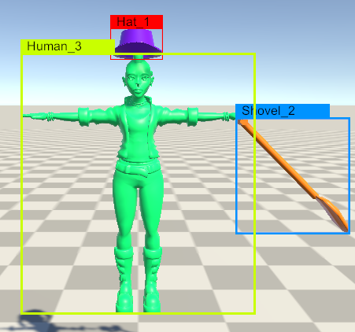
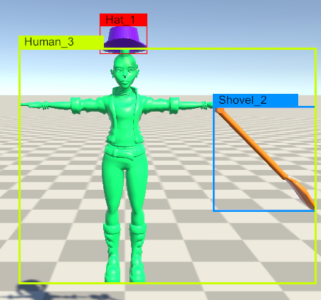
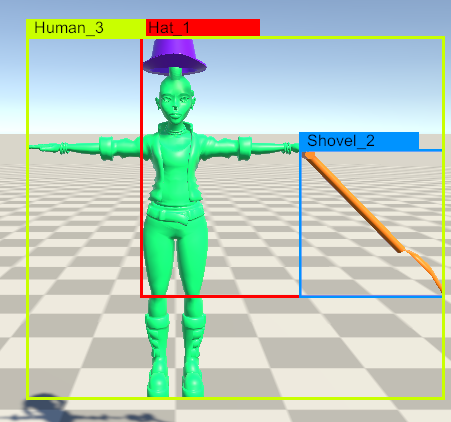
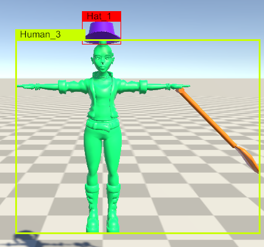

# Hierarchical Relationships

## 1. Scene Hierarchy Information

The Perception package now calculates the parent-child relationship of every Labeled GameObject every frame. This
information allows you to understand the hierarchical relationships between objects (identified by their unique instance
id) in the scene and can be used, for example, to "group" objects during post-processing.

This information is available in the annotation output for the `RenderedObjectInfoLabeler` where you will find three
new fields:

1. `parentInstanceId` – The instance id of the first parent with a `Labeling` component attached. If none exists, value
   of this will be -1.
2. `childrenInstanceIds` – A list of instance ids of direct child objects with a `Labeling` component. If none exists,
   value is an empty array.
3. `labels` – The full set of labels on the `Labeling` component.

Example:

```json
{
  "labelId": 3,
  "instanceId": 1,
  "color": [ 255, 0, 0,  255 ],
  "visiblePixels": 1112,
  "parentInstanceId": 2,
  "childrenInstanceIds": [ 4, 3 ],
  "labels": [ "Hat" ]
}
```

## 2. Encapsulated 2D Bounding Boxes

> This feature currently only supports 2D Bounding Boxes. Support for it for 3D Bounding Boxes is planned.

Occasionally you may want to label an object and also a child object within it. By default, that leads to the creation
of two bounding boxes completely independent of each other. However, in certain cases, you may want the bounding box of
the parent to take into account the bounding box of the child.

Consider for example, the case of a human wearing a hat and holding a shovel. By default, you get separate bounding
boxes for the human, hat and the shovel.

```
- GameObject A (label: Human)
    - GameObject B (label: Shovel)
    - GameObject C (label: Hat)
```

<p align="center">
  
</p>
<p align="center">Default "Independent" Bounding Boxes</p><br />

Suppose you want the human bounding box to also encompass the shovel. To do so, simply open up the IdLabelConfig
specified for the BoundingBox2D labeler. You should see an additional setting available for each label with two options
– `Default` and `Add to Parent`. For the label of the shovel, switch that to `Add to Parent` and re-run the simulation.
Now the bounding box of the human should "expand" to also include the bounding box of the shovel within it.

<p align="center">
  
</p>
<p align="center">Shovel label set to "Add to Parent"</p><br />

Notice that the hat is still not included in the bounding box for the human. You can repeat the above steps if you want
the hat to be included too.

### Nested Hierarchical Relationships

The "encapsulation" feature is not limited to direct children of objects but is rather calculated recursively. Consider
the (unrealistic) case where your object hierarchy looks like the following:

```
- GameObject A (label: Human)
    - GameObject C (label: Hat)
      - GameObject B (label: Shovel)
```

If your IdLabelConfig had the Hat label set to `Add to Parent`, the bounding box of the Human would be expanded to
include the Hat but not the shovel. However, if you had the Shovel label also set to `Add to Parent`, the bounding box
of the Hat would expand to include the Shovel and further the bounding box of the Human would also encompass the Shovel
bounding box.

<p align="center">
  
</p>
<p align="center">Shovel child of Hat. Hat child of Human. Shovel and Hat set to "Add to Parent"</p><br />

### Auto-Encapsulating 2D Bounding Boxes

```
- GameObject A (label: Human)
    - GameObject B (label: Shovel) <not included in IdLabelConfig>
    - GameObject C (label: Hat)
```

In a certain special case where you have an object A (say with the label Human) and child object B (say with label
Shovel) and you **do not** have the label for child object B (Shovel in this case) included in your IdLabelConfig, the
bounding box for the Human label will automatically expand to include the bounding box for the shovel. However, as the
Shovel label is not included in the IdLabelConfig, a separate bounding box for it will not be created.

<p align="center">
  
</p>
<p align="center">Shovel label not included in IdLabelConfig</p><br />
