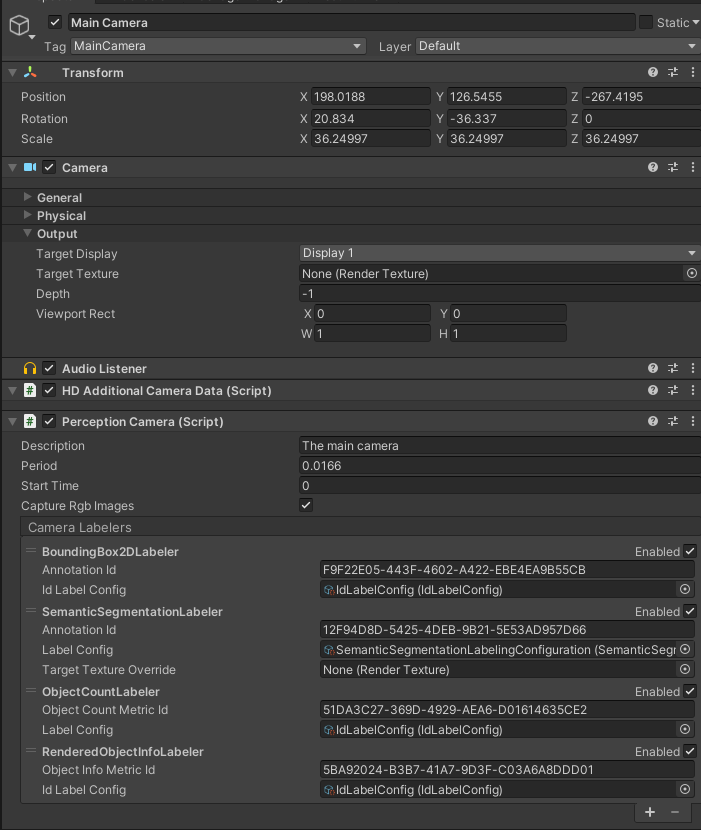

# Getting Started with Perception
This walkthrough will provide creating a new scene for generating perception datasets including segmentation data and image captures.

## Step 1: Create a project and install Perception
First, follow [this guide](SetupSteps.md) to install Perception in your project.

## Step 2 (for Universal Render Pipeline projects): Add GroundTruthRendererFeature
This step can be skipped for HDRP projects.

1. Select your project's `ScriptableRenderer` asset and open the inspector window. In most projects it is located at `Assets/Settings/ForwardRenderer.asset`.
2. Click `Add Renderer Feature` and select `Ground Truth Renderer Feature`

## Step 3: Create a new scene and camera
1. Create a new scene using File -> New Scene
2. `ctrl+s` to save the scene and give it a name
3. Select the Main Camera and reset the Position transform to 0 
4. In the Hierarchy window select the main camera
	1. In the inspector panel of the main camera select Add Component
	2. Add a **Perception Camera** component

## Step 4: Create labeled objects
1. Create a cube by right-clicking in the Hierarchy window, select 3D Object -> Cube 
2. Create 2 more cubes this way
3. Change the names of the cubes to Cube, Box, and Crate
4. Position the Cubes in front of the main Camera

5. On each cube, from the inspector panel add a **Labeling** component 
	1. Click the **+**
	2. In the text field add the name of the object i.e Crate. This will be the label used in the semantic segmentation images 

6. In the Project panel right click -> Perception -> Labeling Configuration
7. Select the new **ID Label Config**
	1. Click the **+**
	2. In the label text field add the same text that the Label script contains on the objects created in the scene (i.e Cube, Box, Crate)
		

8. Select the Main Camera in the Hierarchy panel 
9. In the Perception Camera attach the ID Label Config created in previous step for each ID Label config 

## Step 5: Run simulation and generate dataset
1. Press play in the editor, allow the scene to run for a few seconds, and then exit playmode
2. In the console log you will see a Shutdown in Progress message that will show a file path to the location of the generated dataset.
>Example file path on a Windows PC : `C:/Users/<User Name>/AppData/LocalLow/DefaultCompany/UnityTestFramework\2e10ec21-9d97-4cee-b5a2-7e95e299afa4\RGB18f61842-ef8d-4b31-acb5-cb1da36fb7b1`
3. In the dataset folder you will find the following data:
	- RGB captures 
	- Semantic segmentation images
	- Logs
	- JSON dataset
	

_RGB image_

_Example semantic segmentation image_