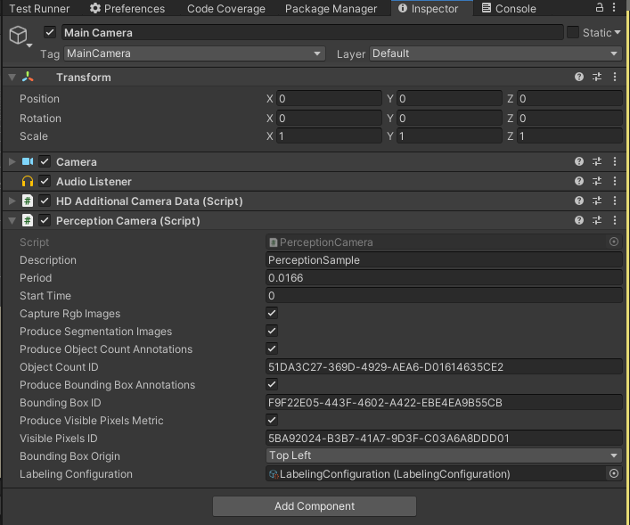
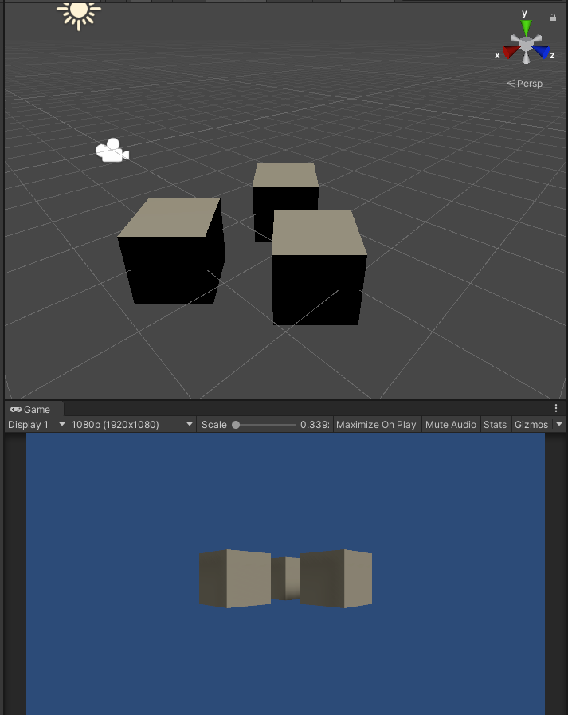
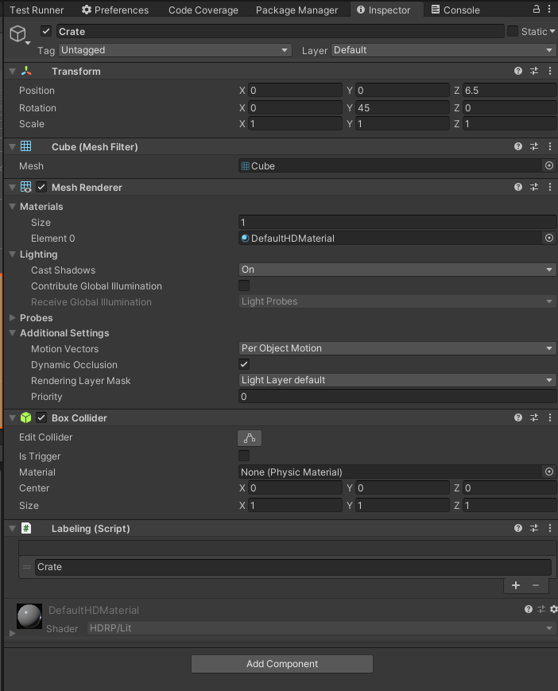
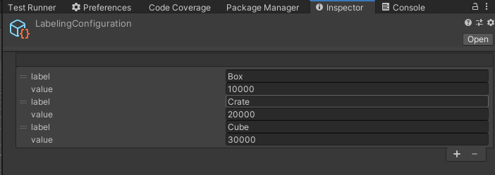

# Getting Started with Perception
This walkthrough will provide creating a new scene for generating perception datasets including segmentation data and image captures.

If you have not already done the setup steps for the project, click [here](Documentation~/SetupSteps.md) to start project setup.

## Step 1: Create a new scene and camera
1. Create a new scene using File -> New Scene
2. `ctrl+s` to save the scene and give it a name
3. Select the Main Camera and reset the Position transform to 0 
4. In the Hierarchy window select the main camera
	1. In the inspector panel of the main camera select Add Component
	2. Add a **Perception Camera** component

## Step 2: Create labeled objects
1. Create a cube by right-clicking in the Hierarchy window, select 3D Object -> Cube 
1. Create 2 more cubes this way
1. Change the names of the cubes to Cube, Box, and Crate
1. Position the Cubes in front of the main Camera

1. On each cube, from the inspector panel add a **Labeling** component 
	1. Click the **+**
	2. In the text field add the name of the object i.e Crate. This will be the label used in the semantic segmentation images 

1. In the Project panel right click -> Perception -> Labeling Configuration
1. Select the new **Labeling Configuration**
	1. Click the **+**
	2. In the label text field add the same text that the Label script contains on the objects created in the scene (i.e Cube, Box, Crate)
	3. Add a numerical value to the value field 
		1. Make sure the labels all have different values, for this example use increments of 10,000 to ensure they show up as very distinct colors in the segmentation images

9. Select the Main Camera in the Hierarchy panel 
	1. In the Perception Camera script in the Labeling Configuration field add the Labeling Configuration script created in previous step 

## Step 3: Checking local files
1. Press play in the editor, allow the scene to run for a few seconds, and then exit playmode
2. In the console log you will see a Shutdown in Progress message that will show a file path to the location of the generated dataset.
>Example file path on a Windows PC : `C:/Users/<User Name>/AppData/LocalLow/DefaultCompany/UnityTestFramework\2e10ec21-9d97-4cee-b5a2-7e95e299afa4\RGB18f61842-ef8d-4b31-acb5-cb1da36fb7b1`
4. In the dataset folder you will find the following data:
	1. RGB captures 
	2. Semantic segmentation images
	3. Logs
	4. JSON Dataset
	

