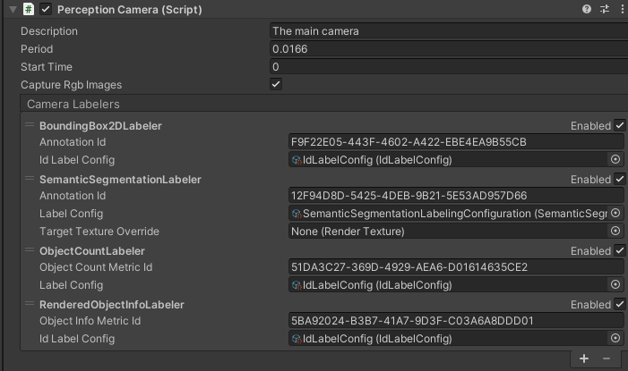

# Getting started with Perception

This walkthrough shows you how to create a new scene in order to generate perception datasets including segmentation data and image captures.

## Step 1: Create a project and install Perception

To install Perception in your project, follow the [Installing the Perception package in your project](SetupSteps.md) guide. 

## Step 2 (for Universal Render Pipeline projects): Add GroundTruthRendererFeature

You can skip this step for HDRP projects.

1. Select your project's **ScriptableRenderer** asset and open the Inspector window. In most projects it is located at `Assets/Settings/ForwardRenderer.asset`.
2. Select **Add Renderer Feature** and **Ground Truth Renderer Feature**. 

 _ForwardRenderer_

## Step 3: Create a new scene and camera

1. Create a new scene using **File** > **New Scene**
2. Ctrl+S to save the Scene and give it a name
3. Select the Main Camera and reset the **Position** transform to 0
4. In the Hierarchy window select the **Main Camera**
   1. In the Main Camera's Inspector window select **Add Component**
   2. Add a Perception Camera component

 _Perception Camera component_

## Step 4: Create labeled objects

1. Create a cube by right-clicking in the Hierarchy window and selecting **3D Object** > **Cube**
2. Create two more cubes this way
3. Change the names of the cubes to Cube, Box, and Crate
4. Position the cubes in front of the Main Camera

 _Position of the cubes in front of the Main Camera_

5. On each cube, in the Inspector window, add a Labeling component 
	1. Select **Add (+)**
	2. In the text field add the name of the object, for example Crate. Unity uses this label in the semantic segmentation images. 

 _A labeling component, for example "Crate"_

6. Create and set up an IdLabelConfig
   1. In the Project window select **Add (+)**, then **Perception** > **ID Label Config**
   2. In the Assets folder, select the new **IdLabelConfig**
   3. In the Inspector, select **Add to list (+)** three times
   4. In the three label text fields, add the text (Crate, Cube and Box) from the Labeling script on the objects you created in the Scene

 _IdLabelConfig with three labels_

7. Create and set up a SemanticSegmentationLabelingConfiguration

   1. In the Project panel select **Add (+)**, then **Perception** > **Semantic Segmentation Label Config**
   2. In the Assets folder, select the new SemanticSegmentationLabelingConfiguration
   3. In the Inspector, select **Add to list (+)** three times
   4. In the three label text fields, add the text (Cube, Crate and Box) from the Labeling script on the objects you created in the Scene

 _SemanticSegmentationLabelConfig with three labels and three colors_

8. In the Hierarchy window select the Main Camera

9. Add the IdLabelConfig to the Perception Camera script

   1. In the Perception Camera script, find the following three Camera Labelers: BoundingBox2DLabeler, ObjectCountLabeler and RenderedObjectInfoLabeler. For each Camera Labeler, in the Id Label Config field (or Label Config field, for the ObjectCountLabeler Camera Labeler), click the circle button. 
   2. In the Select IdLabelConfig window, select the **IdLabelConfig** you created. 

10. Add the SemanticSegmentationLabelingConfiguration to the Perception Camera script

    1. In the Perception Camera script, find the SemanticSegmentationLabeler Camera Labeler. In its Label Config field, select the circle button. 
    2. In the Select SemanticSegmentationLabelConfig window, select the **SemanticSegmentationLabelConfig** you created. 

 _Perception Camera Labelers_

## Step 5: Run simulation and generate dataset

1. In the Editor, press the play button, allow the scene to run for 10 seconds, then exit Play mode.
2. In the console log you see a Shutdown in Progress message that shows a file path to the location of the generated dataset.

> Example file path on a Windows PC : `C:/Users/<User Name>/AppData/LocalLow/DefaultCompany/UnityTestFramework\2e10ec21-9d97-4cee-b5a2-7e95e299afa4\RGB18f61842-ef8d-4b31-acb5-cb1da36fb7b1`

3. You find the following data in the dataset folder:
   - RGB captures
   - Semantic segmentation images
   - Logs
   - JSON dataset

 _RGB capture_

 _Semantic segmentation image_

## Optional Step: realtime visualization of labelers

The Perception package comes with the ability to show realtime results of the labeler in the scene. To enable this capability:

 _Example of Perception running with show visualizations enabled_

1. To use the visualizer, select the Main Camera, and in the Inspector window, in the Perception Camera component, enable **Show Visualizations**. This enables the built-in labelers which includes segmentation data, 2D bounding boxes, pixel and object counts.
2. Enabling the visualizer creates new UI controls in the Editor's Game view. These controls allow you to control each of the individual visualizers. You can enable or disable individual visualizers. Some visualizers also include controls that let you change their output. 

 _Visualization controls in action_

**Important Note:** The Perception package uses asynchronous processing to ensure reasonable frame rates of a scene. A side effect of real-time visualization is that the labelers must be applied to the capture in its actual frame, which potentially adversely affects the Scene's framerate.