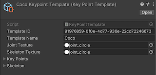
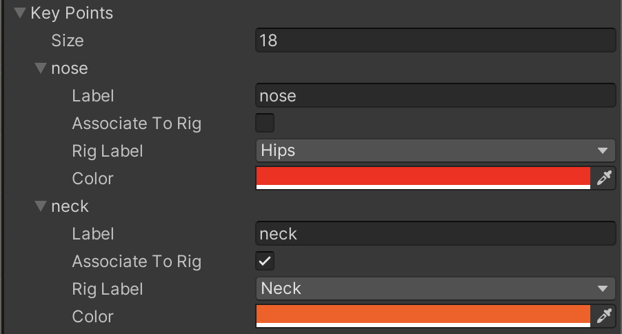
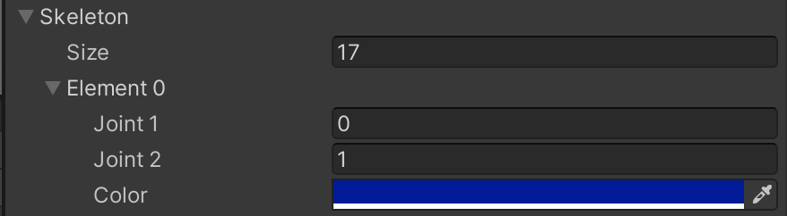

# Keypoint Labeler

The Keypoint Labeler captures the screen locations of specific points on labeled GameObjects. The typical use of this Labeler is capturing human pose estimation data, but it can be used to capture points on any kind of object. The Labeler uses a [Keypoint Template](#KeypointTemplate) which defines the keypoints to capture for the model and the skeletal connections between those keypoints. The positions of the keypoints are recorded in pixel coordinates.

## Data Format
The keypoints captured each frame are in the following format:
```
keypoints {
  label_id:      <int>   -- Integer identifier of the label
  instance_id:   <str>   -- UUID of the instance.
  template_guid: <str>   -- UUID of the keypoint template
  pose:          <str>   -- Current pose
  keypoints [            -- Array of keypoint data, one entry for each keypoint defined in associated template file.
    {
      index:     <int>   -- Index of keypoint in template
      x:         <float> -- X pixel coordinate of keypoint
      y:         <float> -- Y pixel coordinate of keypoint
      state:     <int>   -- Visibility state
    }, ...
  ]
}
```

The `state` entry has three possible values: 
* 0 - the keypoint either does not exist or is outside of the image's bounds
* 1 - the keypoint exists inside of the image bounds but cannot be seen because the object is not visible at its location in the image
* 2 - the keypoint exists and the object is visible at its location

The annotation definition, captured by the Keypoint Labeler once in each dataset, describes points being captured and their skeletal connections. These are defined by the [Keypoint Template](#KeypointTemplate).
```
annotation_definition.spec {
  template_id:       <str>           -- The UUID of the template
  template_name:     <str>           -- Human readable name of the template
  key_points [                       -- Array of joints defined in this template
    {
      label:         <str>           -- The label of the joint
      index:         <int>           -- The index of the joint
    }, ...
  ]
  skeleton [                         -- Array of skeletal connections (which joints have connections between one another) defined in this template
    {
      joint1:        <int>           -- The first joint of the connection
      joint2:        <int>           -- The second joint of the connection
    }, ...
  ]
}
```

## Setup
The Keypoint Labeler captures keypoints each frame from each object in the scene that meets the following conditions:

* The object or its children are at least partially visible in the frame 
  * The _Object Filter_ option on the Keypoint Labeler can be used to also include fully occluded or off-screen objects
* The root object has a `Labeling` component
* The object matches at least one entry in the Keypoint Template by either:
  * Containing an Animator with a [humanoid avatar](https://docs.unity3d.com/Manual/ConfiguringtheAvatar.html) whose rig matches a keypoint OR
  * Containing children with Joint Label components whose labels match keypoints

For a tutorial on setting up your project for keypoint labeling, see the [Human Pose Labeling and Randomization Tutorial](../HPTutorial/TUTORIAL.md).

## Keypoint Template

Keypoint Templates are used to define the keypoints and skeletal connections captured by the Keypoint Labeler. The Keypoint Template takes advantage of Unity's humanoid animation rig, and allows the user to automatically associate template keypoints to animation rig joints. Additionally, the user can choose to ignore the rigged points, or add points not defined in the rig.

A [COCO](https://cocodataset.org/#home) Keypoint Template is included in the Perception package.

### Editor

The Keypoint Template editor allows the user to create/modify a Keypoint Template. The editor consists of the header information, the keypoint array, and the skeleton array.


<br/>_Header section of the keypoint template_

In the header section, a user can change the name of the template and supply textures that they would like to use for the keypoint visualization.


<br/>_Keypoint section of the keypoint template_

The keypoint section allows the user to create/edit keypoints and associate them with Unity animation rig points. Each keypoint record
has 4 fields: label (the name of the keypoint), Associate to Rig (a boolean value which, if true, automatically maps the keypoint to
the GameObject defined by the rig), Rig Label (only needed if Associate To Rig is true, defines which rig component to associate with
the keypoint), and Color (RGB color value of the keypoint in the visualization).


<br/>_Skeleton section of the keypoint template_

The skeleton section allows the user to create connections between joints, basically defining the skeleton of a labeled object.

#### Animation Pose Label

This file is used to define timestamps in an animation to a pose label.
