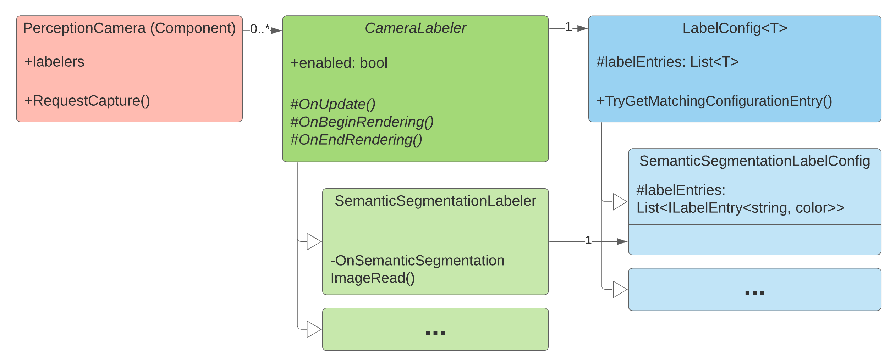

# Ground Truth Generation

The Perception package includes a set of Labelers which capture ground truth information along with each captured frame. The built-in Labelers support a variety of common computer vision tasks, including 2D and 3D bounding boxes, instance and semantic segmentation, and keypoint labeling (labeled points on 3D objects). The package also includes extensible components for building new Labelers to support additional tasks. Labelers derive ground truth data from labels specified on the GameObjects present in the Scene.

<p align="center">

  <br><i>Class diagram for the ground truth generation system of the Perception package</i>
</p>

## Camera Labeler
A set of Camera Labelers are added to the Perception Camera, each tasked with generating a specific type of ground truth. For instance, the Semantic Segmentation Labeler outputs segmentation images in which each labeled object is rendered in a unique user-definable color and non-labeled objects and the background are rendered black.

## <a name="label-config"></a>Label Config
The Label Config acts as a mapping between string labels and object classes (currently colors or integers), deciding which labels in the Scene (and thus which objects) should be tracked by the Labeler, and what color (or integer id) they should have in the captured frames. 

## Labeling Component
The Labeling component associates a list of string-based labels with a GameObject and its descendants. A Labeling component on a descendant overrides its parent's labels.

## Label Resolution
The Labeling component added to the GameObjects in the Scene works in conjunction with each active Labeler's Label Config, in order to map each labeled GameObject to an object class in the output.

This mapping is accomplished for a GameObject by:
* Finding the nearest Labeling component attached to the object or its parents.
* Finding the first label in the Labeling component that is present anywhere in the Labeler's Label Config.

Unity uses the resolved Label Entry from the Label Config to produce the final output.

## Limitations
Labeling is supported on MeshRenderers, SkinnedMeshRenderers, and partially supported on Terrains.

On terrains, the labels will be applied to the entire terrain. Trees and details can not be labeled. They will always render as black or zero in instance and segmentation images and will occlude other objects in ground truth.

## Best Practices
Generally algorithm testing and training requires a single label on an asset for proper identification such as "chair", "table" or "door". To maximize asset reuse, however, it is useful to give each object multiple labels in a hierarchy.

For example, you can assign four different labels to an asset representing a box of Rice Krispies so as to define an inherent hierarchy:

```yaml
- "food": type
- "cereal": subtype
- "kellogs": main descriptor
- "ricekrispies": sub descriptor
```

This way, you can have Label Configs that include labels from different levels of this hierarchy so that you can easily switch an object's label in the output by switching to a different Label Config. If the goal of the algorithm is to identify all objects in a Scene that are "food", that label is available and can be used if the Label Config only contains "food" and not the other labels of the object. Conversely if the goal is to identify only Rice Krispies cereal within a Scene, that label is also available. Depending on the goal of the algorithm, you can use any mix of labels in the hierarchy.

