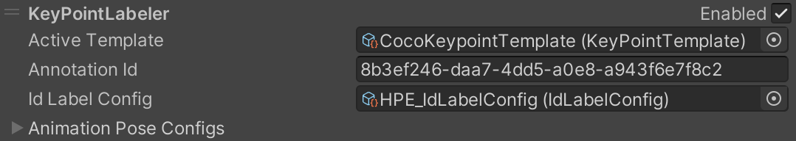

# Human Pose Labeling and Randomization Tutorial

In this tutorial, we will walk through the production of keypoint and pose datasets for computer vision tasks such as human pose estimation and gesture recognition.

We strongly recommend you finish [Phase 1 of the Perception Tutorial](../Tutorial/Phase1.md) before continuing with this one, especially if you do not have prior experience with Unity Editor. This tutorial requires at least version **0.7.0-preview.2** of the Perception package.

In this tutorial, **":green_circle: Action:"** mark all of the actions needed to progress through the tutorial. If you are in a hurry, just follow the actions!

Steps included in this tutorial:

* [Step 1: Import `.fbx` Models and Animations](#step-1)
* [Step 2: Set Up a Humanoid Character in a Scene](#step-2)
* [Step 3: Set Up the Perception Camera for Keypoint Annotation](#step-3)
* [Step 4: Configure Animation Pose Labeling](#step-4)
* [Step 5: Add Joints to the Character and Customize Keypoint Templates](#step-5)
* [Step 6: Randomize the Humanoid Character's Animations](#step-6)

### <a name="step-1">Step 1: Import `.fbx` Models and Animations</a> 

This tutorial assumes that you have already created a Unity project, installed the Perception package, and set up a Scene with a `Perception Camera` inside. If this is not the case, please follow **steps 1 to 3** of [Phase 1 of the Perception Tutorial](../Tutorial/Phase1.md). 

* **:green_circle: Action**: Open the project you created in the Perception Tutorial steps mentioned above. Duplicate `TutorialScene` and name the new Scene `HPE_Scene`. Open `HPE_Scene`.

We will use this duplicated Scene in this tutorial so that we do not lose our grocery object detection setup from the Perception Tutorial.

* **:green_circle: Action**: If your Scene already contains a Scenario object from the Perception Tutorial, remove all previously added Randomizers from this Scenario.
* **:green_circle: Action**: If your Scene does not already contain a Scenario, create an empty GameObject, name it `Simulation Scenario`, and add a `Fixed Length Scenario` component to it.

Your Scenario should now look like this:

<p align="center">

</p>

* **:green_circle: Action**: Select `Main Camera` and in the _**Inspector**_ view of the `Perception Camera` component, **disable** all previously added labelers using the check-mark in front of each. We will be using a new labeler in this tutorial.

We now need to import the sample files required for this tutorial.  

* **:green_circle: Action**: Open _**Package Manager**_ and select the Perception package, which should already be present in the navigation pane to the left side. 
* **:green_circle: Action**: From the list of ***Samples*** for the Perception package, click on the ***Import into Project*** button for the sample bundle named _**Human Pose Estimation**_.

Once the sample files are imported, they will be placed inside the `Assets/Samples/Perception` folder in your Unity project, as seen in the image below:

<p align="center">

</p>

* **:green_circle: Action**: Select all of the assets inside the `Assets/Samples/Perception/<perception-package-version>/Human Pose Estimation/Models and Animations`.
* **:green_circle: Action**: In the _**Inspector**_ tab, navigate to the _**Rig**_ section. 

Note how `Animation Type` is set to `Humanoid` for all selected assets. This is a requirement and makes sure all animations included in the sample `.fbx` files are ready to be used on a rigged humanoid model.

> :information_source: The _**Rig**_ section includes a checkbox named `Optimize Game Objects`. This flag is disabled on the included samples and we recommend you **disable** it on your rigged models as well so that all transforms included in your rig are exposed. If this flag is enabled, you will need to make sure all the joints you require for your workflow are selected in the list of `Extra Transforms to Expose`. This list is only displayed if the optimization checkbox is enabled.

### <a name="step-2">Step 2: Set Up a Humanoid Character in a Scene</a>

* **:green_circle: Action**: Drag and drop the file named `Player.fbx` into your Scene _**Hierarchy**_.
* **:green_circle: Action**: Select the new `Player` object in the Scene and in the _**Inspector**_ tab set its transform's position and rotation according to the image below to make the character face the camera.

<p align="center">

</p>

The `Player` object already has an `Animator` component attached. This is because the `Animation Type` property of all the sample `.fbx` files is set to `Humanoid`.
To animate our character, we will now attach an `Animation Controller` to the `Animator` component.

* **:green_circle: Action**: Create a new `Animation Controller` asset in your `Assets` folder and name it `TestAnimationController`.
* **:green_circle: Action**: Double click the new controller to open it. Then right-click in the empty area and select _**Create State**_ -> _**Empty**_. 
  
<p align="center">

</p>

This will create a new state and attach it to the Entry state with a new transition edge. This means the controller will always move to this new state as soon as the `Animator` component is awoken. In this example, this will happen when the **▷** button is pressed and the simulation starts.

* **:green_circle: Action**: Click on the state named `New State`. Then, in the _**Inspector**_ tab click the small circle next to `Motion` to select an animation clip.

In the selector window that pops up, you will see several clips named `Take 001`. These are animation clips that are bundled inside of the sample `.fbx` files you imported into the project. 

* **:green_circle: Action**: Select the animation clip originating from the `TakeObjects.fbx` file, as seen below:

<p align="center">

</p>

* **:green_circle: Action**: Assign `TestAnimationController` to the `Controller` property of the `Player` object's `Animator` component. 

<p align="center">

</p>

If you run the simulation now you will see the character performing an animation for picking up a hypothetical object as seen in the GIF below.

<p align="center">

</p> 


### <a name="step-3">Step 3: Set Up the Perception Camera for Keypoint Annotation</a> 

Now that we have our character performing animations, let's modify our `Perception Camera` to report the character's keypoints in the output dataset, updating frame by frame as they animate.

* **:green_circle: Action**: Add a `KeyPointLabeler` to the list of labelers in `Perception Camera`. Also, make sure `Show Labeler Visualizations` is turned on so that you can verify the labeler working.

Similar to the labelers we used in the Perception Tutorial, we will need a label configuration for this new labeler. 

* **:green_circle: Action**: In the _**Project**_ tab, right-click the `Assets` folder, then click _**Create -> Perception -> Id Label Config**_. Name the new asset `HPE_IdLabelConfig`.
* **:green_circle: Action**: Add a `MyCharacter` label to the newly created config.

> :information_source: You can use any label string, as long as you assign the same label to the `Player` object in the next step.

* **:green_circle: Action**: Add a `Labeling` component to the `Player` object in the Scene.
* **:green_circle: Action**: In the _**Inspector**_ UI for this new `Labeling` component, expand `HPE_IdLabelConfig` and click _**Add to Labels**_ on `MyCharacter`.

<p align="center">

</p> 

* **:green_circle: Action**: Return to `Perception Camera` and assign `HPE_IdLabelConfig` to the `KeyPointLabeler`'s label configuration property.

The labeler should now look like the image below:

<p align="center">

</p> 

Note the `CocoKeypointTemplate` asset that is already assigned as the `Active Template`. This template will tell the labeler how to map default Unity rig joints to human joint labels in the popular COCO dataset so that the output of the labeler can be easily converted to COCO format. Later in this tutorial, we will learn how to add more joints to our character and how to customize joint mapping templates.

<p align="center">

</p> 

You can now check out the output dataset to see what the annotations look like. To do this, click the _**Show Folder**_ button in the `Perception Camera` UI, then navigate inside to the dataset folder to find the `captures_000.json` file. Here is an example annotation for the first frame of our test-case here:


```json
"pose": "unset",
  "keypoints": [
    {
      "index": 0,
      "x": 0.0,
      "y": 0.0,
      "state": 0
    },
    {
      "index": 1,
      "x": 649.05615234375,
      "y": 300.65264892578125,
      "state": 2
    },
    {
      "index": 2,
      "x": 594.4522705078125,
      "y": 335.8978271484375,
      "state": 2
    },
    {
      "index": 3,
      "x": 492.46444702148438,
      "y": 335.72491455078125,
      "state": 2
    },
    {
      "index": 4,
      "x": 404.89456176757813,
      "y": 335.57647705078125,
      "state": 2
    },
    {
      "index": 5,
      "x": 705.89404296875,
      "y": 335.897705078125,
      "state": 2
    },
    {
      "index": 6,
      "x": 807.74688720703125,
      "y": 335.7244873046875,
      "state": 2
    },
    {
      "index": 7,
      "x": 895.1993408203125,
      "y": 335.57574462890625,
      "state": 2
    },
    {
      "index": 8,
      "x": 612.51654052734375,
      "y": 509.065185546875,
      "state": 2
    },
    {
      "index": 9,
      "x": 608.50006103515625,
      "y": 647.0631103515625,
      "state": 2
    },
    {
      "index": 10,
      "x": 611.7791748046875,
      "y": 797.7828369140625,
      "state": 2
    },
    {
      "index": 11,
      "x": 682.175048828125,
      "y": 509.06524658203125,
      "state": 2
    },
    {
      "index": 12,
      "x": 683.1016845703125,
      "y": 649.64434814453125,
      "state": 2
    },
    {
      "index": 13,
      "x": 686.3271484375,
      "y": 804.203857421875,
      "state": 2
    },
    {
      "index": 14,
      "x": 628.012939453125,
      "y": 237.50531005859375,
      "state": 2
    },
    {
      "index": 15,
      "x": 660.023193359375,
      "y": 237.50543212890625,
      "state": 2
    },
    {
      "index": 16,
      "x": 0.0,
      "y": 0.0,
      "state": 0
    },
    {
      "index": 17,
      "x": 0.0,
      "y": 0.0,
      "state": 0
    }
  ]
}
```

In the above annotation, all of the 18 joints defined in the COCO template we used are listed. For each joint that is present in our character, you can see the X and Y coordinates within the captured frame. However, you may notice three of the joints are listed with (0,0) coordinates. These joints are not present in our character. A fact that is also denoted by the `state` field. A state of **0** means the joint was not present, **1** denotes a joint that is present but not visible (to be implemented in a later version of the package), and **2** means the joint was present and visible.

You may also note that the `pose` field has a value of `unset`. This is because we have not defined poses for our animation clip and `Perception Camera` yet. We will do this next.

### <a name="step-4">Step 4: Configure Animation Pose Labeling</a> 

* **:green_circle: Action**: In the _**Project**_ tab, right-click the `Assets` folder, then click _**Create -> Perception -> Animation Pose Config**_. Name the new asset `MyAnimationPoseConfig`.

This type of asset lets us specify custom time ranges of an animation clip as **poses**. The time ranges are between 0 and 1 as they denote percentages of time elapsed in the animation clip.

* **:green_circle: Action**: Select the `MyAnimationPoseConfig` asset. In the _**Inspector**_ view, choose the same animation clip as before for the `Animation Clip` property. This would be the clip originating from `TakeObjects.fbx`.

You can now use the `Timestamps` list to define poses. Let's define four poses here:
   1. Reaching for the object. (starts at the 0% timestamp)
   2. Taking the object and standing up. (starts at the 28% timestamp)
   3. Putting the object in the pocket. (starts at the 65% timestamp)
   4. Standing. (starts at the 90% timestamp)

> :information_source: To find the time indexes in an animation clip that correspond with different poses, you can directly open the clip inside the _**Inspector**_. Click on the `TakeObjects.fbx` file in the _**Project**_ tab. Then, in the _**Inspector**_ view, you will see a small preview of the model along with a timeline above it. Move the timeline's marker to advance through the animation.

Modify `MyAnimationPoseConfig` according to the image below:

<p align="center">

</p> 

The pose configuration we created needs to be assigned to our `KeyPointLabeler`. So:

* **:green_circle: Action**: In the _**Inspector**_ UI for `Perception Camera`, set the `Size` of `Animation Pose Configs` for the `KeyPointLabeler` to 1. Then, assign the `MyAnimationPoseConfig` to the sole slot in the list, as shown below:

<p align="center">

</p> 

If you run the simulation again to generate a new dataset, you will see the new poses we defined written in it. All frames that belong to a certain pose will have the pose label attached.

### <a name="step-5">Step 5: Add Joints to the Character and Customize Keypoint Templates</a> 

The `CocoKeypointTemplate` asset that we are using on our `KeyPointLabeler` maps all of the joints included in the rigged character to their corresponding COCO labels. However, the character rigs used in Unity do not include some of the joints that are included in the COCO format. As we saw earlier, these joints appear with a state of **0** and coordinates of (0,0) in our current dataset. These joints are:

* Nose
* Left Ear
* Right Ear

We will now add these joints to our character using labels that are defined in the `CocoKeypointTemplate` asset. Let's first have a look at this asset.

* **:green_circle: Action**: In the UI for the `KeyPointLabeler` on `Perception Camera`, click on `CocoKeypointTemplate` to reveal the asset in the _**Project**_ tab, then click the asset to open it.

In the _**Inspector**_ view of `CocoKeypointTemplate`, you will see the list of 18 keypoints of the COCO standard. If you expand each keypoint, you can see several options. The `Label` property defines a string that can be used for mapping custom joints on the character to this template (we will do this shortly). The `Associate To Rig` flag denotes whether this keypoint can be directly mapped to a standard Unity keypoint in the rigged character. If this flag is enabled, the keypoint will then be mapped to the `Rig Label` chosen below it. The `Rig Label` dropdown displays a list of all standard joints available in rigged characters in Unity. In our case the list does not include the nose joint, so the `nose` keypoint has `Associate To Rig` disabled. If you look at an example that does exist in the list of standard joints (e.g. `neck`), the `Associate to Rig` flag is enabled, and the proper corresponding joint is selected as `Rig Label`. Note that when `Associate To Rig` is disabled, the `Rig Label` property is ignored. The image below depicts the nose and neck examples:


<p align="center">

</p> 

If you review the list you will see that the `left_ear` and `right_ear` joints are also not associated with the rig.

* **:green_circle: Action**: Expand the `Player` object's hierarchy in the scene to find the `Head` object. 

We will create our three new joints under the `Head` object.

* **:green_circle: Action**: Create three new empty GameObjects under `Head` and place them in the proper positions for the character's nose and ears, as seen in the GIF below (make sure the positions are correct in 3D space):

<p align="center">

</p> 

The final step in this process would be to label these new joints such that they match the labels of their corresponding keypoints in `CocoKeypointTemplate`. For this purpose, we use the `Joint Label` component.

* **:green_circle: Action**: Add a `Joint Label` component to each of the newly created joints. Then, for each joint, set `Size` to **1**, `Template` to `CocoKeypointTemplate`, and `Label` to the proper string (one of `nose`, `left_ear` or `right_ear`). These are also shown in the GIF above.
  
If you run the simulation now, you can see the new joints being visualized:

<p align="center">

</p> 

You could now look at the latest generated dataset to confirm the new joints are being detected and written.

### <a name="step-6">Step 6: Randomize the Humanoid Character's Animations</a> 

The final step of this tutorial is to add pose diversity to the datasets by randomizing the character's animation.

* **:green_circle: Action**: Add the `Animation Randomizer` to the list of Randomizers in the `Simulation Scenario` object.
* **:green_circle: Action**: Set the Scenario's number of `Frames Per Iteration` to 150 and the number of `Total Iterations` to 20.
* **:green_circle: Action**: Add an `Animation Randomizer Tag` component to the `Player` object to let the above Randomizer know this object's animations shall be randomized.

The `Animation Randomizer Tag` accepts a list of animation clips. At runtime, the `Animation Randomizer` will pick one of the provided clips randomly as well as a random time within the selected clip, and apply them to the character's `Animator`. Since we set the number of `Frames Per Iteration` to 100, each clip will play for 100 frames before the next clip replaces it.

* **:green_circle: Action**: Add four options to the `Animation Randomizer Tag` list. Then populate these options with the animation clips originating from the files `Run.fbx`, `Walk.fbx`, `PutGlassesOn.fbx`, and `Idle.fbx` (these are just examples; you can try any number or choice of rig animation clips).

If you run the simulation now, your character will randomly perform one of the above four animations, each for 150 frames. This cycle will recur 20 times, which is the total number of Iterations in your Scenario.   

<p align="center">

</p> 

> :information_source: The reason the character stops animating at certain points in the above GIF is that the animation clips are not set to loop. Therefore, if the randomly selected timestamp is sufficiently close to the end of the clip, the character will complete the animation and stop animating for the rest of the Iteration.

This concludes the Human Pose Labeling and Randomization Tutorial. In case of any issues or questions, please feel free to open a GitHub issue on the `com.unity.perception` repository so that the Unity Computer Vision team can get back to you as soon as possible.
