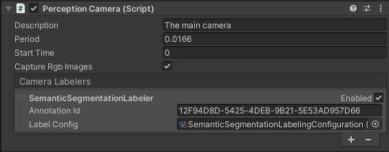

# The Perception Camera component
The Perception Camera component ensures the attached [Camera](https://docs.unity3d.com/Manual/class-Camera.html) runs at deterministic rates and captures RGB and other Camera-related ground truth to the [JSON dataset](Schema/Synthetic_Dataset_Schema.md) using [DatasetCapture](DatasetCapture.md). It supports HDRP and URP.



## Properties
| Property: | Function: |
|--|--|
| Description | A description of the camera to be registered in the JSON dataset. |
| Period | The amount of simulation time in seconds between frames for this camera. For more on sensor scheduling, see [DatasetCapture](DatasetCapture.md). |
| Start Time | The simulation time at which to run the first frame. This time will offset the period, useful for allowing multiple cameras to run at the right times relative to each other. |
| Capture Rgb Images | When this is checked, RGB images will be captured as PNG files in the dataset each frame. |
| Camera Labelers | A list of labelers which generate data derived from this camera. |

## Camera Labelers
Camera Labelers capture data related to the camera into the JSON dataset. This data can be used for model training or for dataset statistics. A number of Camera Labelers are provided with Perception, and additional labelers can be defined by deriving from the CameraLabeler class.

### Semantic Segmentation Labeler


_Example semantic segmentation image from a modified [SynthDet](https://github.com/Unity-Technologies/SynthDet) project_

The Semantic Segmentation Labeler generates a 2D RGB image using the attached camera where objects are drawn with the color associated with their label in the provided SemanticSegmentationLabelConfig. If no label is resolved for an object, it is drawn black.

### Bounding Box 2D Labeler


_example bounding box visualization from [SynthDet](https://github.com/Unity-Technologies/SynthDet) generated by the `SynthDet_Statistics` jupyter notebook_

The Bounding Box 2D Labeler produces 2D bounding boxes for each visible object with a label resolved by the given ID Label Config. Bounding boxes are calculated using the rendered image, so only occluded or out-of-frame portions of the objects are not included.

### Bounding Box 3D Ground Truth Labeler

The Bounding Box 3D Ground Truth Labeler prouces 3D ground truth bounding boxes for each labeled game object in the scene. Unlike the 2D bounding boxes, 3D bounding boxes are calculated from the labeled meshes in the scene and all objects (independent of their occlusion state) are recorded.

### Object Count Labeler
```
{
    "label_id": 25,
    "label_name": "drink_whippingcream_lucerne",
    "count": 1
}
```
_Example object count for a single label_

The Object Count Labeler records object counts for each label in the provided ID Label Config. Only objects with at least one visible pixel in the camera frame will be recorded.

### Rendered Object Info Labeler
```
{
    "label_id": 24,
    "instance_id": 320,
    "visible_pixels": 28957
}
```
_Example rendered object info for a single object_

The Rendered Object Info Labeler records a list of all objects visible in the camera image, including its instance id, resolved label id and visible pixels. Objects not resolved to a label in the given ID Label Config are not recorded.

## Limitations

Ground truth is not compatible with all rendering features, especially ones that modify the visibility or shape of objects in the frame.

When generating ground truth:
* Vertex and geometry shaders are not run
* Transparency is not considered. All geometry is considered opaque
* Besides built-in Lens Distortion in URP and HDRP, post-processing effects are not run

If you encounter additional incompatibilities, please open an  [issue](https://github.com/Unity-Technologies/com.unity.perception/issues)
