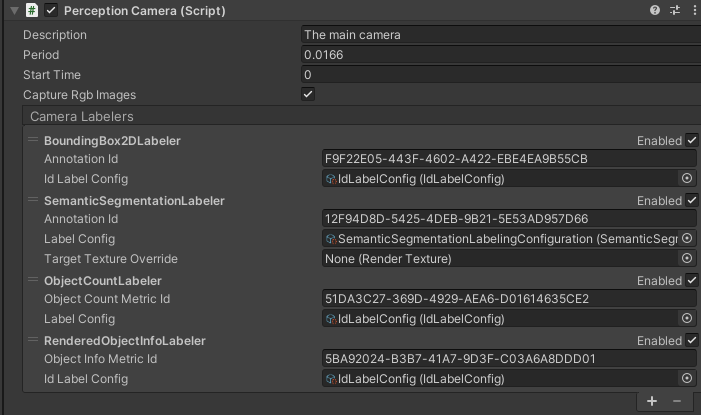
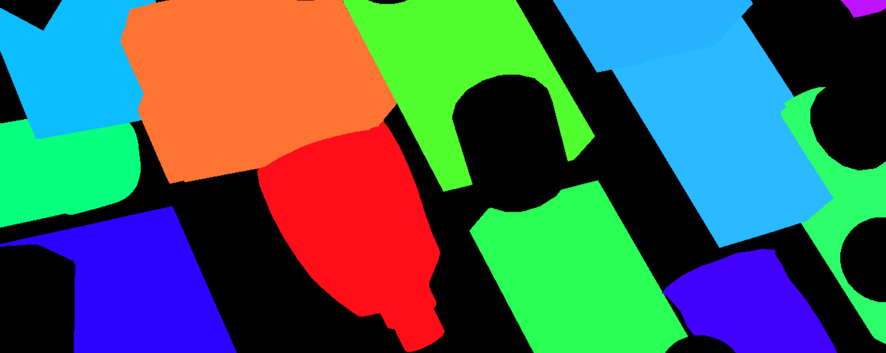

# The Perception Camera component
The Perception Camera component ensures that the [Camera](https://docs.unity3d.com/Manual/class-Camera.html) runs at deterministic rates. It also ensures that the Camera uses [DatasetCapture](DatasetCapture.md) to capture RGB and other Camera-related ground truth in the [JSON dataset](Schema/Synthetic_Dataset_Schema.md). You can use the Perception Camera component on the High Definition Render Pipeline (HDRP) or the Universal Render Pipeline (URP).


<br/>_Perception Camera component_

## Properties
| Property: | Function: |
|--|--|
| Description | A description of the Camera to be registered in the JSON dataset. |
| Period | The amount of simulation time in seconds between frames for this Camera. For more information on sensor scheduling, see [DatasetCapture](DatasetCapture.md). |
| Start Time | The simulation time at which to run the first frame. This time offsets the period, which allows multiple Cameras to run at the correct times relative to each other. |
| Capture Rgb Images | When you enable this property, Unity captures RGB images as PNG files in the dataset each frame. |
| Camera Labelers | A list of labelers that generate data derived from this Camera. |

## Camera labelers
Camera labelers capture data related to the Camera in the JSON dataset. You can use this data to train models and for dataset statistics. The Perception package provides several Camera labelers, and you can derive from the CameraLabeler class to define more labelers.

### SemanticSegmentationLabeler

<br/>_Example semantic segmentation image from a modified SynthDet project_

The SemanticSegmentationLabeler generates a 2D RGB image with the attached Camera. Unity draws objects in the color you associate with the label in the SemanticSegmentationLabelingConfiguration. If Unity can't find a label for an object, it draws it in black.

### InstanceSegmentationLabeler

The instance segmentation labeler generates a 2D RGB image with the attached camera. Unity draws each instance of a labeled 
object with a unique color.

### BoundingBox2DLabeler

<br/>_Example bounding box visualization from SynthDet generated by the `SynthDet_Statistics` Jupyter notebook_

The BoundingBox2DLabeler produces 2D bounding boxes for each visible object with a label you define in the IdLabelConfig.  Unity calculates bounding boxes using the rendered image, so it only excludes occluded or out-of-frame portions of the objects.

### Bounding Box 3D Ground Truth Labeler

The Bounding Box 3D Ground Truth Labeler prouces 3D ground truth bounding boxes for each labeled game object in the scene. Unlike the 2D bounding boxes, 3D bounding boxes are calculated from the labeled meshes in the scene and all objects (independent of their occlusion state) are recorded.

### ObjectCountLabeler

```
{
    "label_id": 25,
    "label_name": "drink_whippingcream_lucerne",
    "count": 1
}
```
_Example object count for a single label_

The ObjectCountLabeler records object counts for each label you define in the IdLabelConfig. Unity only records objects that have at least one visible pixel in the Camera frame.

### RenderedObjectInfoLabeler
```
{
    "label_id": 24,
    "instance_id": 320,
    "visible_pixels": 28957
}
```
_Example rendered object info for a single object_

The RenderedObjectInfoLabeler records a list of all objects visible in the Camera image, including its instance ID, resolved label ID and visible pixels. If Unity cannot resolve objects to a label in the IdLabelConfig, it does not record these objects.

## Limitations

Ground truth is not compatible with all rendering features, especially those that modify the visibility or shape of objects in the frame.

When generating ground truth:
* Unity does not run Vertex and geometry shaders
* Unity does not consider transparency and considers all geometry opaque 
* Unity does not run post-processing effects, except built-in lens distortion in URP and HDRP

If you discover more incompatibilities, please open an issue in the [Perception GitHub repository](https://github.com/Unity-Technologies/com.unity.perception/issues). 
