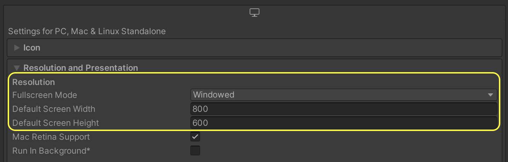
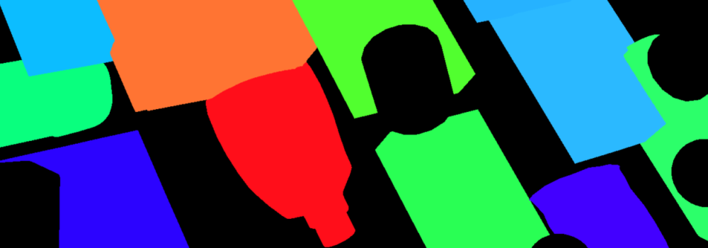

# The Perception Camera Component
The Perception Camera component ensures that the [Camera](https://docs.unity3d.com/Manual/class-Camera.html) runs at deterministic rates. It also ensures that the Camera uses [DatasetCapture](DatasetCapture.md) to capture RGB and other Camera-related ground truth in the [JSON dataset](Schema/Synthetic_Dataset_Schema.md). You can use the Perception Camera component on the High Definition Render Pipeline (HDRP).

<p align="center">

  <br><i>The Inspector view of the Perception Camera component</i>
</p>

## Properties
| Property: | Function: |
|--|--|
| Description | A description of the Camera to be registered in the JSON dataset. |
| Show Visualizations | Display realtime visualizations for labelers that are currently active on this camera. |
| Capture RGB Images | When you enable this property, Unity captures RGB images as PNG files in the dataset each frame. |
| Capture Trigger Mode | The method of triggering captures for this camera. In `Scheduled` mode, captures happen automatically based on a start frame and frame delta time. In `Manual` mode, captures should be triggered manually through calling the `RequestCapture` method of `PerceptionCamera`. |
| Override Layer Mask | When this property is enabled, labelers will utilize the layer mask on the Perception Camera instead of the culling mask on the camera when rendering objects during data capture. This override particularly affects object culling during segmentation image rendering. |
| Sensor Type | The Camera Sensor selected for producing pixel based ground truth data. |
| Layer Mask | The layer mask used by labelers when the Override Layer Mask field is enabled. |
| Alpha Threshold | The minimum level of transparency required for a pixel to be rendered in segmentation images. |
| Camera Labelers | A list of labelers that generate data derived from this Camera. |

### Properties for Scheduled Capture Mode
| Property: | Function: |
|--|--|
| Simulation Delta Time | The simulation frame time (seconds) for this camera. E.g. 0.0166 translates to 60 frames per second. This will be used as Unity's `Time.captureDeltaTime`, causing a fixed number of frames to be generated for each second of elapsed simulation time regardless of the capabilities of the underlying hardware. For more information on sensor scheduling, see [DatasetCapture](DatasetCapture.md). |
| First Capture Frame | Frame number at which this camera starts capturing. |
| Frames Between Captures | The number of frames to simulate and render between the camera's scheduled captures. Setting this to 0 makes the camera capture every frame. |

### Properties for Manual Capture Mode
| Property: | Function: |
|--|--|
| Affect Simulation Timing | Have this camera affect simulation timings (similar to a scheduled camera) by requesting a specific frame delta time. Enabling this option will let you set the `Simulation Delta Time` property described above.|

## Output Resolution
When using Unity Editor to generate datasets, the resolution of the images generated by the Perception Camera will match the resolution set for the ***Game*** view of the editor. However, images generated with built players (including local builds and Unity Simulation runs) will use the resolution specified in project settings. 

* To set the resolution of the ***Game*** view, click on the dropdown menu in front of `Display 1`. You can use one of the provided resolutions or create a new one. To create one, click **+**. Set `Type` to `Fixed Resolution` and `Width` and `Height` to your desired resolution.

<p align="center">

  <br><i>Creating a new resolution preset for the ***Game*** view</i>
</p>

* To set the resolution of the built player, Open ***Edit -> Project Settings*** and navigate to the ***Player*** tab. In the ***Resolution and Presentation*** section, set ***Fullscreen Mode*** to ***Windowed*** and then set ***Default Screen Width*** and ***Default Screen Height*** to your desired resolution.

<p align="center">

  <br><i>Setting the resolution of the built player</i>
</p>

## Accumulation
[Accumulation](Accumulation.md) allows you to use rendering techniques that require multiple frames to obtain the final result. Examples of this can be Path Tracing or Accumulation Motion Blur. For more information on this please refer to this [page](Accumulation.md)

## Camera Sensors
Custom Camera Sensors can be implemented for Perception Cameras to control how rendering is performed for all supported channel types (RGB, instance segmentation, normals, depth, etc.). The particular sensor selected for a Perception Camera can be configured using the `Sensor Type` field in the Perception Camera Component's inspector.

### Unity Camera Sensor
The Unity Camera Sensor is the default sensor selected on Perception Cameras. This sensor type enables users to capture data output from the camera component configured on the Perception Camera's Game Object.

The `Super Sampling Factor` field on this sensor informs the camera to capture images at 2, 4, or 8 times their original width and height (4, 16, or 64 times the resolution respectively) in order to perform a high quality super sampling anti-aliasing (SSAA) effect. This effect uses sub-pixel averaging to produce a smoother output image with less aliasing artifacts around the edges of rendered geometry and sometimes improved aliasing around small details within textures as well. Note that regardless of the particular super sampling setting configured on this sensor, the output resolution of this sensor does not change.
<br><br>
**NOTE:** Super Sampling Factor will increase RAM usage of the project and effect the performance. All details are [HERE](SuperSamplingFactor.md)


## Camera Labelers
Camera labelers capture data related to the Camera in the JSON dataset. You can use this data to train models and for dataset statistics. The Perception package provides several Camera labelers, and you can derive from the CameraLabeler class to define more labelers.

### Semantic Segmentation Labeler

<br/>_Example semantic segmentation image from a modified SynthDet project_

The SemanticSegmentationLabeler generates a 2D RGB image with the attached Camera. Unity draws objects in the color you associate with the label in the SemanticSegmentationLabelingConfiguration. If Unity can't find a label for an object, it draws it in black.

### Instance Segmentation Labeler

The instance segmentation labeler generates a 2D RGB image with the attached camera. Unity draws each instance of a labeled 
object with a unique color.

### Bounding Box 2D Labeler

<br/>_Example bounding box visualization from SynthDet generated by the `SynthDet_Statistics` Jupyter notebook_

The BoundingBox2DLabeler produces 2D bounding boxes for each visible object with a label you define in the IdLabelConfig.  Unity calculates bounding boxes using the rendered image, so it only excludes occluded or out-of-frame portions of the objects.

### Bounding Box 3D Labeler

The Bounding Box 3D Ground Truth Labeler produces 3D ground truth bounding boxes for each labeled game object in the scene. Unlike the 2D bounding boxes, 3D bounding boxes are calculated from the labeled meshes in the scene and all objects (independent of their occlusion state) are recorded.  
***Note:*** The Bounding Box 3D Labeler only supports non-nested skinned mesh renderer objects.  

### Object Count Labeler

```
{
    "label_id": 25,
    "label_name": "drink_whippingcream_lucerne",
    "count": 1
}
```
_Example object count for a single label_

The ObjectCountLabeler records object counts for each label you define in the IdLabelConfig. Unity only records objects that have at least one visible pixel in the Camera frame.

### Rendered Object Info Labeler
```
{
    "label_id": 24,
    "instance_id": 320,
    "visible_pixels": 28957
}
```
_Example rendered object info for a single object_

The `RenderedObjectInfoLabeler` records a list of all objects visible in the camera image, including their instance IDs, resolved label IDs, and visible pixel counts. If Unity cannot resolve objects to a label in the `IdLabelConfig`, it does not record these objects.

### Keypoint Labeler

The keypoint labeler captures the screen locations of specific points on labeled GameObjects. The typical use of this Labeler is capturing human pose estimation data, but it can be used to capture points on any kind of object. The Labeler uses a [Keypoint Template](Features/KeypointLabeler.md#KeypointTemplate) which defines the keypoints to capture for the model and the skeletal connections between those keypoints. The positions of the keypoints are recorded in pixel coordinates.

For more information, see [Keypoint Labeler](Features/KeypointLabeler.md) or the [Human Pose Labeling and Randomization Tutorial](HumanPose/TUTORIAL.md)

### Occlusion Labeler

```json
{
  "instanceId": 1,
  "percentVisible": 0.25,
  "percentInFrame": 0.5,
  "visibilityInFrame": 0.5
}
```
_(Above is an example of the set of occlusion metrics output for a single object)_

The occlusion labeler reports a set of visibility metrics for each object that is visible within the frame. Each set contains 3 metrics:
1. **Percent Visible**: The portion of an object that is visible.
2. **Percent In Frame**: The portion of an object that is not occluded by the camera frame.
3. **Visibility In Frame**: The unoccluded portion of the part of an object that is in frame.

_Note: The value of the percent-visible metric is equivalent to the product of the percent-in-frame and visibility-in-frame metrics. The precision at which these metrics are captured does not affect this proportional relationship._

The occlusion labeler has an out-of-frame resolution parameter that can be used to tune the computational demands of the labeler vs. the precision of output visibility metrics. Higher resolutions will increase the precision of output visibility metrics at the expense of increased computational costs and slower capture frame rates.

**Notice**: The occlusion labeler currently does not support orthographic cameras and terrain objects.

**Notice**: The precision of the occlusion labeler's metrics may vary by a few percent due to a variety of factors including:
1. The camera's resolution
2. The occlusion labeler's out-of-frame resolution
3. How many pixels are used to approximate the visible surface area of an object

The following adjustments can be made to increase the occlusion labeler's precision:
1. **Percent Visible**: Increasing the camera's resolution and/or increasing the occlusion labeler's out-of-frame resolution will increase the precision of this metric. Increasing either parameter will cause more pixels to be used to approximate the in-frame and/or out-of-frame pixels of an object respectively.
2. **Percent In Frame**: Similarly to the percent-visible metric, the precision of this metric can be tuned by changing the camera's resolution and/or increasing occlusion labeler's out-of-frame resolution.
3. **Visibility In Frame**: Increasing the camera's resolution will improve the precision of this metric.
4. **All metrics**: Increasing the portion of the frame occupied by objects of interest will diminish the effect of aliasing on the precision of all occlusion metrics.

### Depth Labeler

```json
"annotations": [
    {
    "@type": "type.unity.com/unity.solo.DepthAnnotation",
    "id": "Depth",
    "sensorId": "camera",
    "description": "Generates a 32-bit depth image in EXR format where each pixel contains the actual distance in Unity units (usually meters) from the camera to the object in the scene.",
    "imageFormat": "Exr",
    "dimension": [
    736.0,
    483.0
    ],
    "filename": "step0.camera.Depth.exr"
    }
]
```
_(Above is an example of metrics output for a depth frame)_

The depth labeler outputs a 32-bit depth image in EXR format. Each pixel contains the actual distance in Unity units (usually meters) from the camera to the object in the scene. The depth value is written into the R channel directly.

**Format**:

* 32-bits Float (4 bytes per pixel), where each channel is 32-bit. R channel is where we store the depth value (unit in meters), and the Alpha value is 1, and G and B are 0s.

* For example, if the distance between the camera and a pixel is 5 meters, the output pixel would be (5, 0, 0, 1).

**Visualization**

* For Windows Users

  The depth image can be opened with [RenderDoc](https://renderdoc.org/)
  1. Right click on the image and select "Open with" -> "RenderDoc"
     
  2. Click on the Texture Viewer Tab, and adjust the maximum of visible range to a preferred value (in our example is 100).
     

### Normal Labeler
```json
 "annotations": [
        {
          "@type": "type.unity.com/unity.solo.NormalAnnotation",
          "id": "Normal",
          "sensorId": "camera",
          "description": "Produces an image capturing the vertex normals of objects within the frame.",
          "imageFormat": "Exr",
          "dimension": [
            736.0,
            483.0
          ],
          "filename": "step0.camera.Normal.exr"
        }
      ]

```

_(Above is an example of metrics output for a normal frame)_

The normals labeler captures the vertex normals of objects within a 3 channel image. This normals image is encoded using the EXR format. The image’s RGB channels store the XYZ components of the each vertex normal pixel respectively.

### Environment Labeler
The Environment Labeler produces information about the scene environment such as the hierarchy of its labeled objects.

#### Available Information

1. **Label Hierarchy** – The Label Hierarchy (`hierarchy` field in the JSON) provides parent child relationships between labeled objects uniquely identified by their instance ids. The user can decide whether they want to generate label hierarchy at all, only for visible objects, or for all objects in the scene. Disabled objects are always ignored.


#### Annotation Example
```json
{
      "@type": "type.unity.com/unity.solo.EnvironmentStateMetric",
      "id": "environment",
      "sensorId": "",
      "annotationId": "",
      "description": "Captures details about the environment such as label hierarchy",
      "hierarchy": [
        {
          "instance_id": 1,
          "parent_instance_id": null,
          "child_instance_ids": [ 3, 4]
        },
        {
          "instance_id": 5,
          "parent_instance_id": 2,
          "child_instance_ids": []
        },
        {
          "instance_id": 2,
          "parent_instance_id": null,
          "child_instance_ids": [5]
        }
      ]
    }
```

### Pixel Position Labeler
The Pixel Position labeler outputs the camera-space distance from the camera to an object at a pixel. The output is an image file in the EXR format with the following encoding of each pixel. Imagine a vector $v_{AB} = (x,y,z)$ from the camera to the object at pixel $(A,B)$

**Red Channel** – The $x$ component of vector $v_{AB}$.
**Green Channel** – The $y$ component of vector $v_{AB}$.
**Blue Channel** - The $z$ component of vector $v_{AB}$.
**Alpha Channel** – Always set to 1.

### Metadata Labeler

At the end of the frame, this labeler gets data from all MetadataTags in the scene and records it to the _metadata_ section in the result JSON.

#### Included metadata tags
- LabelingNameMetadataTag
  - adds information about GameObject's name
  - a simple example of how to add data Frame JSON data
- LabelingTagMetadataTag
  - adds information about GameObject's tags
  - a simple example of how to add data Frame JSON data
- LightMetadataTag
  - adds information about the Intensity and Color of the lights
  - this is an example of how to inject scene-related information into the Frame JSON data
- LabelingChildNameMetadataTag
  - reports the name of the child object to the parent data
  - example of how to group data from different objects to the same report
- LabelingDistanceToMainCameraMetadataTag
  - reports distance from GameObject to the main camera
  - a simple example of how to do any Unity Engine calculation for reports
- LabelingKeyValuesMetadataTag
  - adds the possibility to add custom strings via Unity Editor
  - this is an example of how to add custom information via Unity Editor
- LabelingTransformDataMetadataTag
  - adds information about GameObject's transform
  - this is an example of how to add the possibility to select information to include in Frame JSON data within Unity Editor

#### How to create custom scene-related metadata tag

1. Create a new C# class inheriting from *BaseMetadataTag*
2. Implement the required abstract methods
   2.1 key - name of the object in serialized JSON file
   2.2 GetReportedValues(IMessageBuilder builder) - add any information required here to the *builder* by _builder.Add("object_name", data_to_be_added>)_
   2.3 (optional) instanceId - if any data grouping is required in the report, or keep it empty if no grouping is required
3. Add the newly created component to Prefabs or GameObjects in the scene

#### How to create custom Labeling-related metadata tag

1. Inherite the *LabelMetadataTag*
2. Implement required abstract methods
   2.1 key - name of the object in serialized JSON file
   2.2 GetReportedValues(IMessageBuilder builder) - add any information required here to the *builder* by _builder.Add("object_name", data_to_be_added>)_
3. Add component to the GameObject with Labeling component

_Result Example:_
```
{
  "frame": 3,
  "sequence": 1,
  "step": 0,
  "captures": [],
  "metrics": [
    {
      "@type": "type.unity.com/unity.solo.GenericMetric",
      "id": "metadata",
      "sensorId": "",
      "annotationId": "",
      "description": "Metadata labeler",
      "values": [
        {
          "SceneLight-Directional Light": {
            "Color": [
              255,
              244,
              214,
              255
            ],
            "Intensity": 70000.0
          },
          "instances": [
            {
              "instanceId": "1",
              "Values": {
                "Values": [
                  "test1",
                  "test2"
                ]
              }
            },
            {
              "instanceId": "3",
              "SqrMagnitudeToMainCamera": {
                "sqrMagnitudeToMainCamera": 37.0
              },
              "gameObjectName": {
                "name": "Cube"
              }
            },
            {
              "instanceId": "4",
              "transformRecord": {
                "rotationQuaternion": [
                  0.354044646,
                  0.797931969,
                  -0.485905975,
                  0.04303877
                ],
                "localRotationQuaternion": [
                  0.354044646,
                  0.797931969,
                  -0.485905975,
                  0.04303877
                ],
                "rotationEuler": [
                  53.6987267,
                  207.719666,
                  62.0927124
                ],
                "localRotationEuler": [
                  53.6987267,
                  207.719666,
                  62.0927124
                ],
                "parentName": "none",
                "lossyScale": [
                  1.0,
                  0.9999999,
                  1.0
                ],
                "localScale": [
                  1.0,
                  1.0,
                  1.0
                ]
              },
              "gameObjectTag": {
                "unityTag": "Untagged"
              }
            }
          ]
        }
      ]
    }
  ]
}
```


#### Annotation Example
```json
{
  "@type": "type.unity.com/unity.solo.PixelPositionAnnotation",
  "id": "PixelPosition",
  "sensorId": "camera",
  "description": "Generates a pixelized position image where RGB channels denote the XYZ components of the vector from the camera to a pixel respectively.",
  "imageFormat": "Exr",
  "dimension": [
    1920.0,
    1080.0
  ],
  "filename": "step0.camera.PixelPosition.exr"
}
```

#### Visualization
As the maximum range of camera-space distance values is from the camera's near plane to far plane, the Red, Green, and Blue channels most likely hold values much greater than 1. Thus, visualization via most programs would fail. To properly visualize the EXR, use the method (via RenderDoc) mentioned above in the Depth labeler.


## Limitations

Ground truth is not compatible with all rendering features, especially those that modify the visibility or shape of objects in the frame.

When generating ground truth:
* Unity does not run Vertex and geometry shaders
* Unity does not run post-processing effects, except built-in lens distortion in HDRP

If you discover more incompatibilities, please open an issue in the [Perception GitHub repository](https://github.com/Unity-Technologies/com.unity.perception/issues). 
