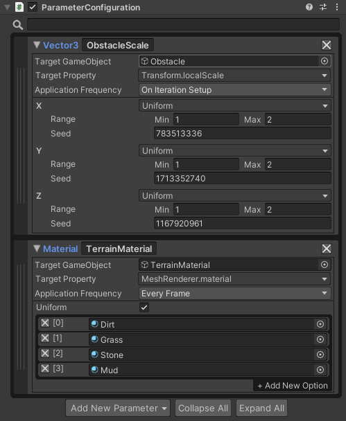
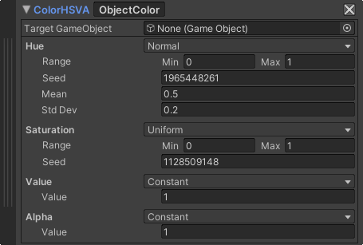
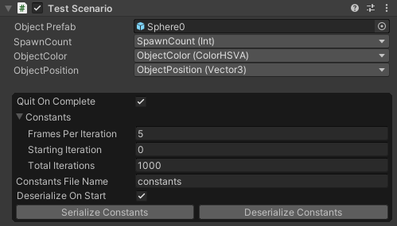

# Overview

The randomization toolset simplifies randomizing aspects of generating synthetic data. It facilitates exposing parameters for randomization, offers samplers to pick random values from parameters, and provides scenarios to define a full randomization process. Each of these also allows for custom implementations to fit particular randomization needs.

**What is Domain Randomization?**

Domain randomization is used to create variability in synthetic datasets to help ML models trained in a synthetic domain (Unity) work well in real world applications. The intuition is that the real world is complex and varies widely, while synthetic datasets have limited variation. By randomizing parts of the synthetic domain the ML model will be exposed to enough variability to perform well when deployed. Domain randomization techniques vary widely in what they randomize and how they choose the randomization to apply. The randomization toolset is intended to facilitate a broad variety of implementations and applications.

Our use of domain randomization draws from Tobin et al. (2017) work training robotic pick and place using purely synthetic data.

**How can a Unity project be randomized using the Perception Randomization toolset?** 

Randomizing a project involves the following steps:
1. Create a parameter configuration
2. Add parameters to the parameter configuration
3. Customize parameter properties and samplers
4. Create a scenario to control simulation execution

As the first step mentions, randomization begins with creating a new ParameterConfiguration component. From here, users can configure and organize new random parameters to control various aspects of their simulation directly from the inspector in the Unity editor.

Next, create a few parameters and modify their properties. Parameters often customize their random variables through the parameter configuration using samplers. Samplers enable users to specify a type of probabilty distribution to use when generating random values.

Finally, add a Scenario component to the scene. Scenarios are used to coordinate the application of randomizations during the execution of a simulation.

Continue reading for more details concerning the three primary components driving randomizations in the perception package: parameters, samplers, and scenarios.

## Parameters

Parameters are used to map common types of simulation properties to random variables. For example, a Vector3 size parameter can be used to randomize the x, y, and z dimensions of an obstacle. Or a material parameter can be used to swap between different terrain surface materials. Additionally, parameter sub-properties can be modified from the parameter configuration in playmode better visualize the impact of different randomization settings.

To read more about how to create custom parameter types, navigate over to the [parameters doc](Parameters.md).

## Samplers

Samplers generate random float values by sampling from probability distributions. They are considered bounded since each random sampler generates float values within a range defined by a minumum and maximum value. The values generated from samplers are often used to randomize the sub components of parameters.

For example, a color parameter has four independently randomizable components: hue, saturation, value, and alpha. Each of the four samplers attached to a color parameter can employ a unique probability distribution to customize how new colors are sampled within a simulation. Out of the box, the perception package supports uniform and normal distribution sampling. So in our color example, a user may choose a normal distribution for their hue, a uniform distribution for saturation, and a constant value sampler for the value and alpha color components.

Take a look at the [samplers doc](Samplers.md) to learn more about implementing custom probability distributions and samplers that can integrate with the perception package.

## Scenarios

 Scenarios have three responsibilities:
 1. Controlling the execution flow of your simulation 
 2. Customizing the application of random parameters in your project
 3. Defining constants that can be configured externally from a built Unity player 

The fundamental principle of domain randomization is to simulate environments under a variety of randomized conditions. Each **iteration** of a scenario is intended to encapsulate one complete run of a simulated environment under uniquely randomized conditions. Scenarios determine how to setup a new iteration, what conditions determine the end of an iteration, how to clean up a completed iteration, and finally how many iterations to perform. Each of these behaviors can be customized for a new scenario by deriving from the Scenario class in the perception package.

It is possible to configure parameters to affect simulation properties directly from the parameter configuration. While useful, this feature is constrained to a particular set of use cases. Instead, a user can reference existing parameters in their scenario to implement more intricate randomizations. For example, a user can reference a `SpawnCount` parameter and a `ObjectPosition` parameter to randomize the positions of a dynamic number of objects during the setup step of a scenario.

Finally, scenarios define constants from which to expose global simulation behaviors automatically. By modifying serialized constants externally, users can customize their simulation runtime even after their project has been built.

## Getting Started

Visit our [randomization tutorial doc](Tutorial.md) to get started using the perception package's randomization tools in an example project.
