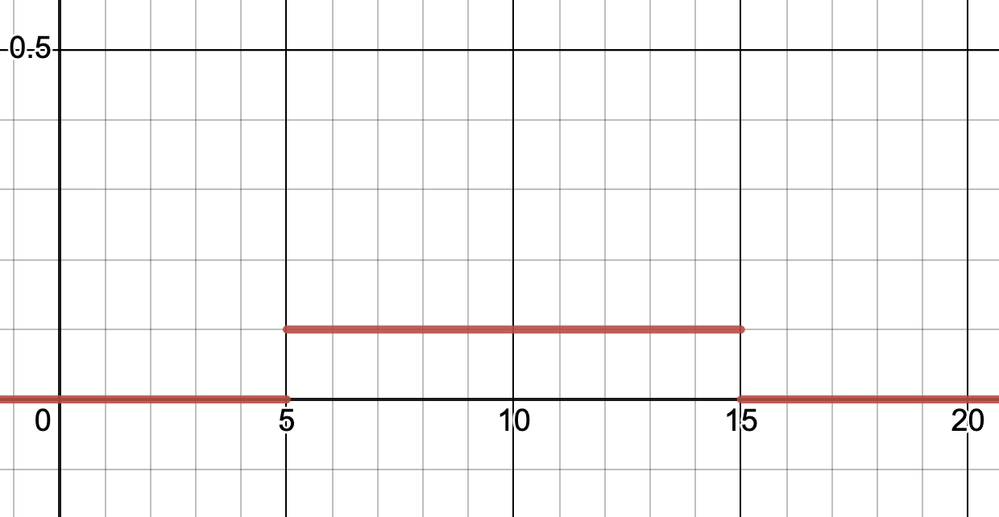
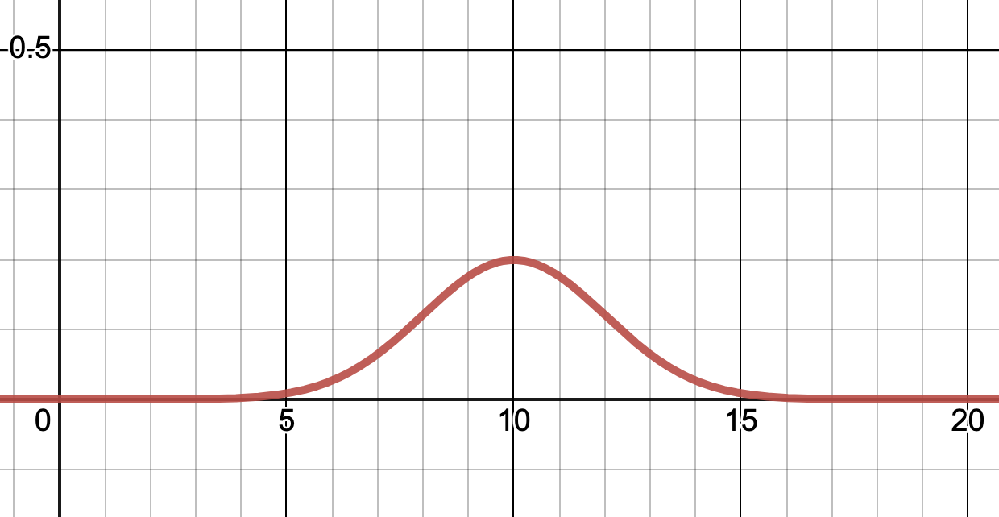
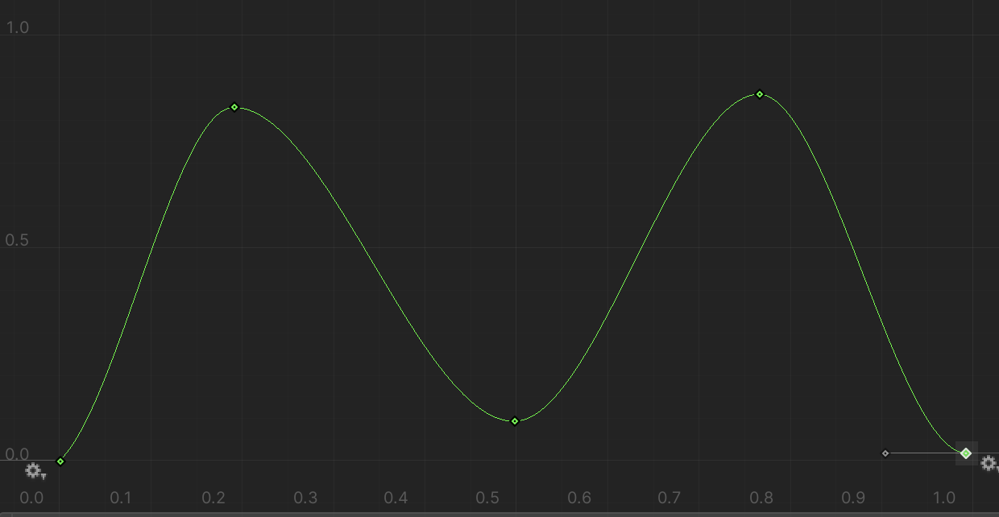

# Samplers
Samplers in the Perception package are classes that deterministically generate random float values from bounded probability distributions. Although Samplers are often used in conjunction with Parameters to generate arrays of typed random values, Samplers can be instantiated and used from any ordinary script.  We have a few Samplers included in the Perception package. 

## Included Samplers

### 1. Constant Sampler
Generates constant-valued samples.

```csharp
var sampler = new ConstantSampler();

// set sampled value to be 25
sampler.value = 25;

// Generate a sample
var sample = sampler.Sample(); // returns 25
var sample2 = sampler.Sample(); // returns 25
var sample3 = sampler.Sample(); // returns 25
```

### 2. Uniform Sampler
Samples values uniformly (each value has equality probability to be chosen) from a specified range.

```csharp
var sampler = new UniformSampler();

// generate values between the range 5 and 15
sampler.range = new FloatRange(5, 15);

// Generate a sample
var sample = sampler.Sample(); // value between 5 and 15
```

<p align="center">
  
</p>
<p align="center">Uniform distribution generated via the above code. Y-axis denotes probability of value on X-axis.</p><br />

### 3. Normal Sampler
Generates random samples from a truncated Normal distribution bounded by a specified range.

```csharp
var sampler = new NormalSampler();

// in statistics, often denoted by µ
sampler.mean = 10;
// in statistics, often denoted by σ
sampler.stdDev = 2;
// cut-off values below -20 and above 20
sampler.range = new FloatRange(-20, 20);

// Generate a sample
var sample = sampler.Sample();
```

<p align="center">
  
</p>
<p align="center">Normal distribution generated via the above code. Y-axis denotes probability of value on X-axis.</p><br />

### 4. Animation Curve Sampler

>  **Note:** Animation Curve is an inbuilt feature in Unity not the Perception package. For more information on Animation Curve's, reference the [AnimationCurve Scripting Manual](https://docs.unity3d.com/ScriptReference/AnimationCurve.html) entry.

Samples values according to a range and probability distribution denoted by a user provided `AnimationCurve`. The X axis of the AnimationCurve corresponds to the values this sampler will pick from while The Y axis corresponds to the relative probability of the values.

The relative probabilities (Y axis) do not need to max out at 1, as only the shape of the curve matters. The Y values cannot however be negative (i.e. probably of a value being negative).

**Creating an Animation Curve Programatically**

```csharp
var sampler = new AnimationCurveSampler();

// create an animation curve programattically
sampler.distributionCurve = AnimationCurve.EaseInOut(0, 1, 1, 100);

// Generate a sample
var sample = sampler.Sample();
```

**Creating an Animation Curve using UI**

It is much easier to create an Animation Curve by exposing the above Sampler variable in the Inspector and using Unity's UI for adding and editing points on the curve.

```csharp
// Unity UI handles curve creation
public AnimationCurve myDistributionCurve;

... 

void myFunction() {
  var sampler = new AnimationCurveSampler();
  
  // public variable containing the AnimationCurve
  sampler.distributionCurve = myDistributionCurve;
  
  // Generate a sample
  var sample = sampler.Sample();
}
```

<p align="center">
  
</p>
<p align="center">Animation Curve created in UI mimicking a bi-modal distribution.</p><br />

> ℹ️ **Note:** You can create your own custom samplers by inheriting from the `ISampler` interface. Custom samplers show up automatically in the sampler selection UI in randomizers. Take a look at the UniformSampler and NormalSampler structs as references for implementing your own custom sampler.

## Deterministic Simulations & Random Seeding
Samplers generate random values that are seeded by the active Scenario's current random state. Changing the Scenario's random seed will result in Samplers generating different values. Changing the order of Samplers, Parameters, or Randomizers will also result in different values being sampled during a simulation.

It is recommended that users do not generate random values using the `UnityEngine.Random` class or the `System.Random` class within a simulation since both of these classes can potentially generate non-deterministic or improperly seeded random values. Using only Perception Samplers to generate random values will help ensure that Perception simulations generate consistent results during local execution and on Unity Simulation in the cloud.
