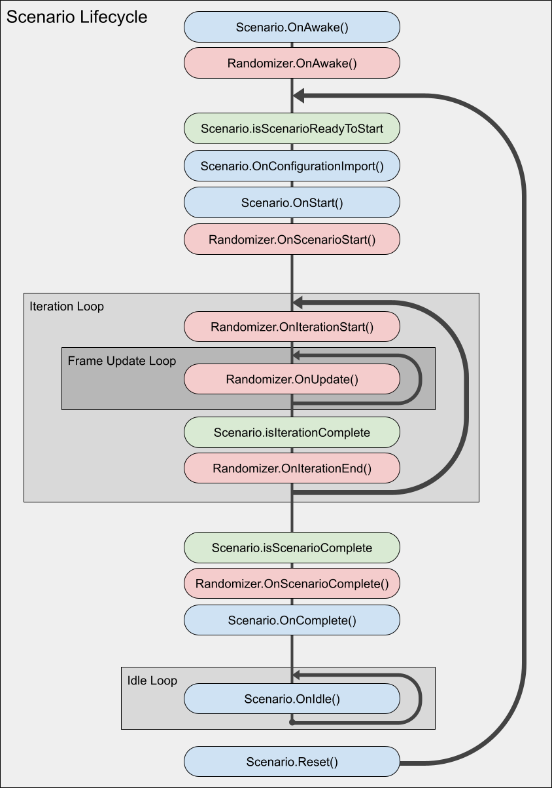

# Scenarios

Scenarios have three responsibilities:
1. Controlling the execution flow of your simulation
2. Organizing a list of Randomizers
3. Defining settings that can be configured externally from a built Unity player 

By default, the Perception package includes one ready-made Scenario, the `FixedLengthScenario` class. This Scenario runs each Iteration for a fixed number of frames and is compatible with the Run in Unity Simulation window for cloud simulation execution.


## Scenario Lifecycle Hooks

Scenarios have a number of lifecycle hooks that are called during execution. Below is a diagram visualizing the sequence of operations run by a typical scenario:

<p align="center">

</p>


## JSON Configuration

Scenarios can be serialized to JSON, modified, and imported at runtime to configure simulation behavior even after a Unity player has been built. The following scenario settings can be serialized by default using the "Generate JSON Config" button on the scenario inspector:
 1. Scenario constants
 2. String, numeric, and boolean fields on Randomizers and Parameters 
 3. Constant, Uniform, and Normal sampler configurations
 
 Here is an example of how to load a Scenario JSON configuration into a Windows Unity player using the `--scenario-config-file` flag:
 `.\PerceptionTutorial.exe --scenario-config-file scenarioConfiguration.json`

## Scenario Cloud Execution (Unity Simulation)

Users can utilize Unity's Unity Simulation service to execute a Scenario in the cloud through the perception package's Run in Unity Simulation window. To open this window from the Unity editor using the top menu bar, navigate to `Window -> Run in Unity Simulation`.

NOTE: To execute a Scenario using the Run in Unity Simulation window, the Scenario class must implement the UnitySimulationScenario class.

From the newly opened editor window, customize the following settings to configure a new Unity Simulation run:
1. **Run Name** - the name of the Unity Simulation run (example: TestRun0)
2. **Total Iterations** - The number of Scenario Iterations to complete during the run
3. **Instance Count** - The number of Unity Simulation worker instances to distribute execution between
4. **Sys-Param** - The system parameters or the hardware configuration of Unity Simulation worker instances to execute the Scenario with. Determines per instance specifications such as the number of CPU cores, amount of memory, and presence of a GPU for accelerated execution.
5. **Json Configuration** - This field is optional. You can select a json scenario configuration within your project to configure your Unity Simulation run instead of using the Scenario settings presently configured in the Editor.


## Implementing Custom Scenarios

For use cases where the Scenario should run for an arbitrary number of frames, implementing a custom Scenario may be necessary. Below are the two most common Scenario properties a user might want to override to implement custom Scenario Iteration conditions:
1. **isScenarioReadyToStart** - defines the conditions that determine when a Scenario can begin iterating
1. **isIterationComplete** - defines the conditions that determine the end of a Scenario iteration
2. **isScenarioComplete** - defines the conditions that determine the a Scenario to stop iterating


### Abstract Scenario Classes

There are a few abstract scenario classes to choose from depending on your requirements when deriving a custom scenario. Below is a list of these options and when it is appropriate to derive them for your use case:
1. **Scenario<T>** - This is the most basic scenario class to derive if only the basic scenario lifecycle coordination tooling is necessary
2. **PerceptionScenario<T>** - The perception scenario abstract class introduces some useful functionality for Scenarios that intend to utilize the Perception package's data capture tooling to generate datasets.
3. **UnitySimulationScenario<T>** - This abstract Scenario class is useful for implementing custom perception Scenarios that are compatible with the "Run in Unity Simulation Window." The FixedLengthScenario class is an example of a Scenario deriving from the UnitySimulationScenario class.

### Scenario Constants
Constants include properties such as starting iteration value or total iteration count that configure the lifecycle settings of the scenario. By deriving your own constants class you can  add your own custom Scenario settings for configuring different scenario properties. Below is an example of the Constants class used in the `FixedLengthScenario` class:
```
[Serializable]
public class Constants : UnitySimulationScenarioConstants
{
    public int framesPerIteration = 1;
}
```

There are a few key things to note here:
1. The Constants class will need to inherit from `UnitySimulationScenarioConstants` to be compatible with the Run in Unity Simulation window. Deriving from `UnitySimulationScenarioConstants` will add a few key properties to the Constants class that are needed to coordinate a Unity Simulation run. If running in Unity Simulation is not a requirement, a new scenario constants class can derive from the base ScenarioConstants class instead.
2. Make sure to include the `[Serializable]` attribute on a constant class. This will ensure that the Constants can be properly configured from the Unity inspector.
3. A Scenario class's `SerializeToJson()` and `DeserializeFromJson()` methods can be overridden to implement custom serialization strategies.
