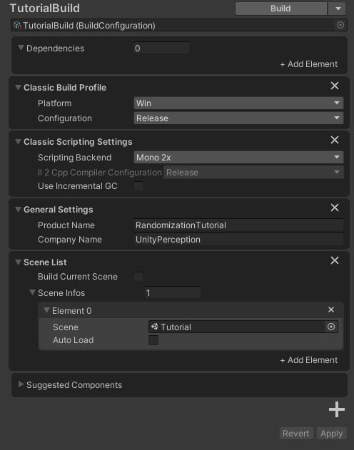

# Randomization Tutorial

This goal of this tutorial is to walk users through an example randomized perception project that explores the following activities:
1. Creating a parameter configuration
2. Customizing parameters and samplers
4. Configuring a scenario to run the simulation
5. Configure the perception camera
6. Building a simulation runtime
7. Modifying scenario constants

By the end of this guide, the user should have a new project that generates the perception data necessary to train a model to identify a cube from a solid colored background.

Note: Before beginning the tutorial, follow [this guide](../SetupSteps.md) to install the perception package into a new Unity project.


## Step 1: Create Scene and GameObjects
1. Create a new scene using `File -> New Scene`
2. Use the key combo `Ctrl+S` to save and name the new scene
3. Create a new cube GameObject
    1. Create a new cube GameObject by navigating to `GameObject -> 3D Object -> Cube` in the menubar
    2. Rename the new cube GameObject "Cube" by double clicking on the new GameObject that appeared in the hierarchy
    3. Reset the cube's transform component by right clicking on transform component in the cube's inpector and clicking `Reset`
4. Create a new background GameObject
    1. Create a new quad GameObject and rename it "Background"
    2. Set the background quad's position to (0, 0, 2) to set it behind the cube and make the quad large enough to fill the camera by change the quad's scale to (30, 30, 1)
5. In the *MeshRenderer* component of the *Cube* and *Background* GameObjects, set `Lighting -> Cast shadows -> Off` to prevent the two objects from casting shadows on each other


## Step 2: Create Parameter Configuration
1. Create a new empty GameObject by using `GameObject -> Create Empty` from the menubar
2. Rename the new empty GameObject "Config" by double clicking on the new GameObject that appeared in the hierarchy
3. To add a new Parameter Configuration component to the Config GameObject, click on the GameObject in the hierarchy and then click the `Add Component` button in the inspector window. Select `Randomization -> Parameter Configuration` to add the new component.


## Step 3: Create and Customize Parameters
In this step, we will configure 6 parameters to randomize the scene: *CubePosition*, *CubeRotation*, *CubeScale*, *CubeColor*, *BackgroundColor*, and *CameraRotation* 

#### Parameter 1: Cube Position
1. Create a new Vector3 parameter by clicking *Add New Parameter -> Vector3* on the parameter configuration inspector
2. Rename the parameter "CubePosition" by typing the text box next to the blue text indicating the parameter's type
3. Click the *Target GameObject* checkbox and select the *Cube* GameObject in the target object selector. Select the property *position* from the property dropdown.
4. Consider using the following sampler values:
    * X : Uniform [-5, 5]
    * Y : Uniform [-5, 5]
    * Z : Constant [Value = 0]
 
#### Parameter 2: Cube Rotation
1. Create a new Vector3 parameter named "CubeRotation"
2. Select the *Cube* GameObject as the target GameObject and select the property *Transform.eulerAngles* from the property dropdown
3. Consider using the following component values:
    * X : Uniform [0, 360]
    * Y : Uniform [0, 360]
    * Z : Uniform [0, 360]
    
#### Parameter 3: Cube Scale
1. Create a new Vector3 parameter named "CubeScale"
2. Select the *Cube* GameObject as the target GameObject and select the property *Transform.localScale* from the property dropdown
3. Consider using the following component values:
    * X : Uniform [0.5, 2]
    * Y : Uniform [0.5, 2]
    * Z : Uniform [0.5, 2]
4. To ensure that the X, Y, and Z samplers all sample equal scale values, copy the X sampler's random seed to all three samplers
    
#### Parameter 4: Cube Color
1. Create a new ColorHSVA parameter named "CubeColor"
2. Skip setting the target GameObject. We will be using this parameter from within the scenario instead.
3. Consider using the following component values:
    * Hue : Uniform [0, 1]
    * Saturation : Uniform [0, 1]
    * Value : Uniform [0.25, 1]
    * Alpha : Constant [Value = 0]
    
#### Parameter 5: Background Color
1. Create a new ColorHSVA parameter named "BackgroundColor"
2. Skip setting the target GameObject. We will be using this parameter from within the scenario instead.
3. Consider using the following component values:
    * Hue : Uniform [0, 1]
    * Saturation : Uniform [0, 1]
    * Value : Uniform [0.25, 1]
    * Alpha : Constant [Value = 0]
    
#### Parameter 6: Camera Rotation
1. Create a new Vector3 parameter named "CameraRotation"
2. Select the *Main Camera* GameObject as the target GameObject and select the property *Transform.eulerAngles* from the property dropdown
3. Consider using the following component values:
    * X : Constant [Value = 0]
    * Y : Constant [Value = 0]
    * Z : Uniform [0, 360]
    

## Step 4: Configure Scenario
1. Right click on the *Scripts* folder in the project hierarchy and select `Create -> C# Script`. Name the script "CubeScenario" and press enter.
2. Double click on the new "CubeScenario" script to open it for edit
3. In your code editor, paste the following C# code into the CubeScenario script:
    ```
    using System;
    using UnityEngine;
    using UnityEngine.Perception.Randomization.Configuration;
    using UnityEngine.Perception.Randomization.Parameters;
    using UnityEngine.Perception.Randomization.Scenarios;
    
    public class CubeScenario : Scenario<CubeScenario.Constants>
    {
        [Serializable]
        public class Constants
        {
            public int totalIterations = 1000;
        }
    
        public override bool isIterationComplete => currentIterationFrame >= 1;
        public override bool isScenarioComplete => currentIteration >= constants.totalIterations;
    
        public ParameterConfiguration config;
        public GameObject background;
        public GameObject cube;
        
        ColorHsvaParameter m_BackgroundColorParameter;
        ColorHsvaParameter m_CubeColorParameter;
        Material m_BackgroundMaterial;
        Material m_CubeMaterial;
        static readonly int k_BaseColor = Shader.PropertyToID("_BaseColor");
    
        public override void OnInitialize()
        {
            m_BackgroundColorParameter = config.GetParameter<ColorHsvaParameter>("BackgroundColor");
            m_CubeColorParameter = config.GetParameter<ColorHsvaParameter>("CubeColor");
            m_BackgroundMaterial = background.GetComponent<MeshRenderer>().material;
            m_CubeMaterial = cube.GetComponent<MeshRenderer>().material;
        }
    
        public override void OnIterationSetup()
        {
            m_BackgroundMaterial.SetColor(k_BaseColor, m_BackgroundColorParameter.Sample());
            m_CubeMaterial.SetColor(k_BaseColor, m_CubeColorParameter.Sample());
        }
    }
    ```
    So what is this CubeScenario script accomplishing?
    1. The *Constants* nested class in this scenario script determines what scenario parameters can be JSON serialized. Only these parameters can be changed externally from a built player. In this example, we expose the number of total iterations the scenario will complete.
    2. The overrided properties *isIterationComplete* and *isScenarioComplete* are checked before every frame to control the scenario's execution flow. In this case, the scenario will execute for only one frame for each iteration and continue executing until reaching the total iteration limit set by the *totalIterations* field in the constants class.
    3. In Unity, manipulating the color of a material is a shader specific task that cannot be accomplished directly from a color parameter's target GameObject setting. Instead we:
        1. Expose a reference to the parameter configuration this scenario's inspector as the public script variable
        2. Cache the ID of the *_BaseColor* shader property
        3. Override the OnInitialize() method to cache a few references. First, we lookup the parameters *BackgroundColor* and *CubeColor* by name from the the parameter configuration. Second, we grab the references to the materials attached to the cube and background GameObjects when the simulation starts.
        4. Override the OnIterationSetup() method to apply randomly sampled color values to the shaders of the cached materials at the beginning of each scenario iteration
4. Back in the Unity editor, navigate to the inspector of the *Config* GameObject and use `Add Component -> CubeScenario` to add the new CubeScenario component to your parameter configuration.
5. Open the constants dropdown and confirm how many iterations the scenario should run (the default is 1000)
6. Use the *backgroundColorParameter* and *cubeColorParameter* dropdowns to inform the script of which parameters in the configuration to use for the BackgroundColor and CubeColor respectively.
7. Select the *Background* and *Cube* GameObjects from their respective GameObject field selectors
8. Confirm that the scenario and parameter configuration are composed properly by clicking the play button in the editor. In the Game window, a cube of different sizes, rotations, scales, and colors should be appearing against a color changing background.
9. To serialize the constants used in the scenario to JSON for external modification after this project has been built into a runtime, click the *Serialize Config* button on the parameter configuration


## Step 5: Configure Perception Camera
Read through the [general perception getting started guide](../GettingStarted.md) before completing the following steps:
1. (For URP projects) Add GroundTruthRendererFeature
2. Add a *PerceptionCamera* component to the MainCamera
3. Label the cube
    1. Add a *Labeling* component to the cube GameObject
    2. Create a *LabelingConfiguration* asset
    3. Add the cube label to the new configuration
    4. Select the new configuration asset from the perception camera
4. Enter play mode to confirm that labeled data is being generated


## Step 6: Build Simulation Runtime
1. Create a new sub-folder under "Assets" in the Project Hierarchy named "BuildConfigurations"
2. Right click on the BuildConfigurations folder and use `Create -> Build -> Empty Build Configuration` to create a new build configuration asset
3. Rename the build configuration asset "TutorialBuild"
4. Copy the settings from the example build configuration screenshot below:

5. Click the "Build" button in the upper righthand corner of the build configuration inspector to create an executable of the tutorial scene.


## Step 7: Modify Scenario Constants
**Note**: Make sure that the "Deserialize On Start" field is checked in the scenario's inspector. A player built without this field checked will cause the player to not load serialized constants. 

1. Navigate to the folder created during the build from the previous step of this tutorial (example: C:\projects\RandomizationTutorial\Builds\Tutorial)
2. Open the "_Data" folder (example: Tutorial_Data) and then open the "StreamingAssets" folder
3. Inside the folder should be the JSON scenario constants serialized from the parameter configuration in Step 4
4. Edit this JSON file to update the scenario constants used in the player
5. Confirm the new constants are deserialized at runtime by executing the simulation
