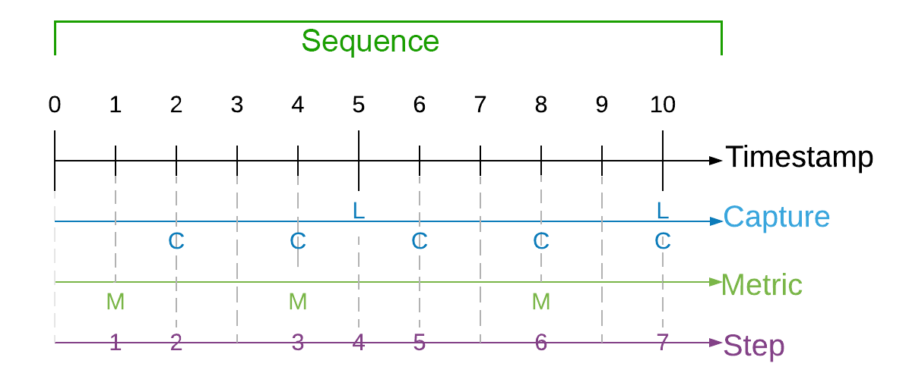
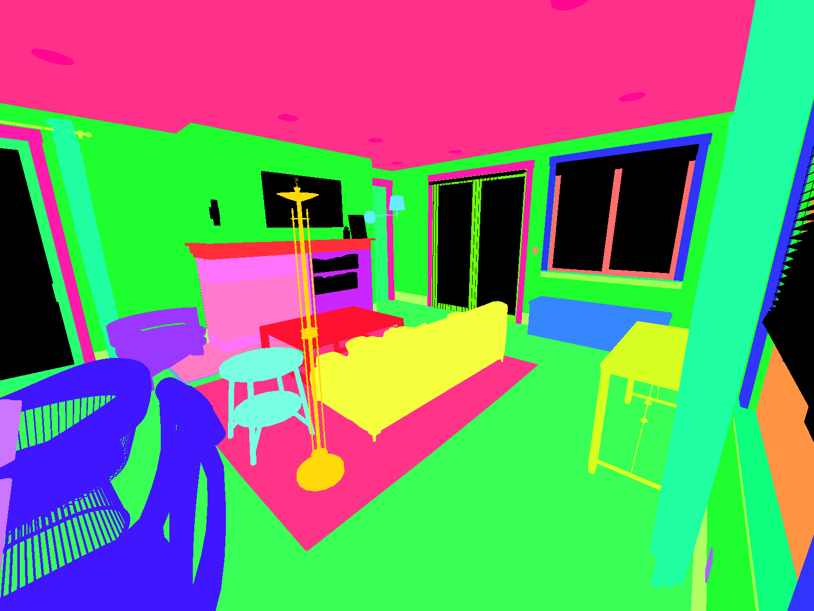
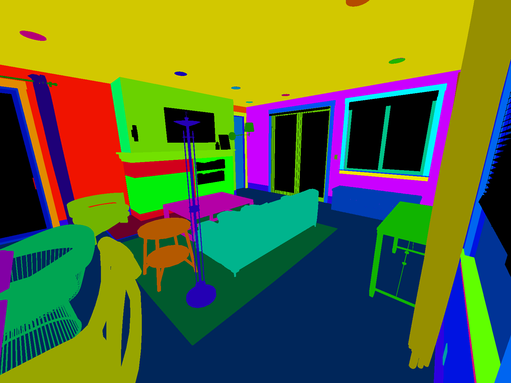

# Synthetic Optimized Labeled Objects (SOLO) Dataset Schema

A SOLO dataset is a combination of JSON and image files. This document describes the schema used to store the data.
The SOLO schema provides a generic structure for simulation output which can be easily consumed to show statistics or train machine learning models.
SOLO datasets are composed of sensor captures, annotations, and metrics, e.g. images and 2d bounding box labels.
This data comes in various forms and might be captured by different sensors and annotation mechanisms.
Multiple sensors may be producing captures at different frequencies.

## Goals

The schema should:

* Include captured sensor data and annotations in one well-defined format.
  This allows us to maintain a contract between the Perception package and the dataset consumers (e.g. Statistics and ML Modeling...)

* Maintain relationships between captured data and annotations that were taken by the same sensor at the same time.
  It should also maintain relationships between consecutive captures for time-related perception tasks (e.g. object tracking).

* Support streaming data, since the data will be created on the fly during the simulation from multiple processes or cloud instances.

* Be able to easily support new types of sensors and annotations.

## Terminology

* **simulation**: One or more executions of a Unity player build, potentially with different parameterization.

* **capture**: a Full rendering process of a Unity sensor which saves the rendered result to data files e.g.
  (png, [pcd](https://www.online-convert.com/file-format/pcd), etc).

* **frame**: The actual frame in the Unity simulation

* **sequence**: A time-ordered series of captures generated by a simulation. (Each Iteration of a Perception Scenario corresponds with one sequence of SOLO data)

* **step**: Index for data-producing frames in each sequence.

* **annotation**: Data (e.g. bounding boxes or semantic segmentation) recorded that is used to describe a particular capture at the same timestamp. A capture might include multiple types of annotations.

* **label**: A string token (e.g. car, human.adult, etc.) that represents a semantic type, or class. One GameObject might have multiple labels used for different annotation purposes.

* **coordinate systems**: There are three coordinate systems used in the schema.

  * **global coordinate system**: Coordinates with respect to the global origin in Unity.

  * **sensor coordinate system**: Coordinates with respect to a sensor. This is useful for ML model training for a single sensor, which can be transformed from a global coordinate system and ego coordinate system. Raw value of object pose using the sensor coordinate system is rarely recorded in simulation.

## Structure

SOLO data is stored in a sequence/step hierarchy. The top level of the generated data will consist of metadata 
and definition files, along with directories for each captured sequence. Inside of the sequence directory, there
will be a JSON file containing all of the annotations and metrics for the frame. Any additional files created by sensors or annotators (e.g. RGB captures or segmentation masks) will also reside in this directory. For organizational purposes, all files will conform to a strict naming schema. The frame file will follow: 
* **step.*NNNN*.frame.json** (where ***NNNN*** is the step number with padded 0’s). 
* Each additional file type will follow: **step.*NNNN.ID.EXT***, where ***NNNN*** is the step number with padded 0’s, ***ID*** is the registered ID of either the sensor or the Labeler that created the file, and ***EXT*** is the file extension.

The top level directory will contain:
* **metadata.json** - The metadata file contains simulation wide data. These values are either generated only once automatically by the Perception package or are system wide metadata.
* **sensor_definitions.json** - Contains the definitions of all of the sensors in the dataset.
* **annotation_definitions.json** - Contains the definitions of all of the annotations in the dataset.
* **metric_definitions.json** - Contains the definitions of all of the metrics in the dataset.

Each sequence will get its own directory which will contain all of the captures. The naming convention for sequence 
directories is as follows: sequence.X where X is a numeric value starting at the value 0. For example the first three sequence directory names for a simulation would be:
* sequence.0
* sequence.1
* sequence.2
  
A sequence directory contains all of the captures, annotations, and metrics for the sequence. All data filenames start with the step that they were captured in. The filename rules are different from there depending on the file type:

### File Structure
```
dataset.XXXX
├── metadata.json
├── sensor_definitions.json
├── annotation_definitions.json
├── metric_definitions.json
└── sequence.NUM
├── step.NUM.frame.json
├── step.NUM.capture.SENSOR[_ID].[ext]
└── step.NUM.annotation.NAME[_ID].SENSOR[_ID].[ext]
```

### Example Dataset Layout
```
dataset
├── metadata.json							
├── sensor_definitions.json                			
├── annotation_definitions.json            			
├── metric_definitions.json	            			
├── sequence.1
│   ├── step.1.frame.json
│   ├── step.1.rgb.front_camera.png
│   ├── step.1.semantic_segmentation_0.png
│   ├── step.1.semantic_segmentation_1.png
│   ├── step.1.instance_segmentation.png
│   ├── step.2.frame.json
│   ├── step.2.rgb.front_camera.png
│   ├── step.2.semantic_segmentation_0.png
│   ├── step.2.semantic_segmentation_1.png
│   └── step.2.instance_segmentation.png
└── sequence.2
├── step.1.frame.json
├── step.1.rgb.front_camera.png
├── step.1.semantic_segmentation_0.png
├── step.1.semantic_segmentation_1.png
├── step.1.instance_segmentation.png
├── step.2.frame.json
├── step.2.rgb.front_camera.png
├── step.2.semantic_segmentation_0.png
├── step.2.semantic_segmentation_1.png
└── step.2.instance_segmentation.png
```

### Frame
```
frame {
  frame:            <int> -- The integer ID of the frame 
  sequence:         <int> -- The sequence number
  step:             <int> -- The step inside the sequence  
  timestamp:        <int> -- Timestamp in milliseconds since the sequence started
  captures:         [<capture>,...] [optional] - The list of captures (see below)
  metrics:          [<metric>,...] [optional] - The list of metrics recorded for the frame (see below)
}
```

### Capture

A capture record contains the relationship between a captured file, a collection of annotations, and extra metadata that describes the state of the sensor.

```
capture {
  @type:             <str> -- The class type of the sensor
  id:                <str> -- The ID of the sensor that made the capture
  description:       <str> -- Human readable description of the sensor
  position:          <float3> -- Position in meters: (x, y, z) with respect to the global coordinate system
  rotation:          <float4> -- Orientation as quaternion: w, x, y, z
  velocity:          <float3> -- Velocity in meters per second as v_x, v_y, v_z
  acceleration:      <float3> [optional] -- Acceleration in meters per second^2 as a_x, a_y, a_z
  annotations:       [<obj>,...] [optional] -- List of the annotations in this capture. See below.
}
```
### RGB Capture
Extends the capture class above with data specific for an RGB camera sensor.
```
rgb_capture : capture {
  filename:          <str> -- A single file that stores sensor captured data.
  imageFormat:       <str> -- The format of the sensor captured file. (e.g. "Png")
  dimension:         <int2> -- The image size in pixels (width/height)
  projection:        <string> -- holds the type of projection the camera used for that capture: Options: "perspective" or "orthographic"
  matrix:            <float3> -- The projection matrix of the camera
}

reference: [camera_intrinsic](https://www.mathworks.com/help/vision/ug/camera-calibration.html#bu0ni74)
```

### Sequence, Step, and Timestamp

In some use cases, two consecutive captures might not be related in time during simulation.
For example, if we generate randomly placed objects in a scene for X steps of simulation.
In this case, sequence, step and timestamp are irrelevant for the captured data.
We can add a default value to the sequence, step and timestamp for these types of captures.

In cases where we need to maintain time order relationship between captures (e.g. a sequence of camera capture in a 10 second video) and [metrics](#metrics), we need to add a sequence, step, and timestamp to maintain the time ordered relationship of captures.

In SOLO, a sequence represents the collection of any time ordered captures and annotations, and corresponds to one Iteration of a Perception Scenario. Timestamps refer to the simulation wall clock in milliseconds since the sequence started. Steps are integer values which increase when a capture or metric event is triggered. We cannot use timestamps to synchronize between two different events because timestamps are floats and therefore make poor indices. Instead, we use a "step" counter which makes it easy to associate metrics and captures that occur at the same time.

Below is an illustration of how captures, metrics, timestamps, and steps are synchronized.



Since each sensor might trigger captures at different frequencies, at the same timestamp we might contain 0 to N captures, where N is the total number of sensors included in this scene.
If two sensors are captured at the same timestamp, they should share the same sequence, step, and timestamp value.


### Annotation

An annotation record contains the ground truth for a sensor either inline or in a separate file.
A single capture may contain many annotations each corresponding to one active Labeler in the simulation.

```
annotation {
  @type:             <str> -- The class type of the annotation
  id:                <str> -- The registered ID of the annotation
  sensorId:          <str> -- The ID of the sensor that this annotation is attached to
  description:       <str> -- The human readable description of the sensor
}
```

In addition to the above, an annotation may also include an array of individual objects recorded for this annotation, e.g. list of bounding boxes. We look at a couple of examples below. This array is typically named `values` or `instances`.


### Example Annotations

#### Semantic Segmentation

The semantic segmentation annotation extends the base annotation class to include the filename of a PNG formatted color mask in which each color maps to a unique object class. 

```
SemanticSegmentationAnnotation {
  @type:             "type.unity.com/unity.solo.SemanticSegmentationAnnotation",
  id:                <str> -- The registered ID of the annotation
  sensorId:          <str> -- The ID of the sensor that this annotation is attached to
  description:       <str> -- The human readable description of the sensor  
  imageFormat:       <str> -- Format of the segmentation mask ("Png")
  dimension:         <int2> -- Width and height of the output image
  instances [              -- Array of recorded object classes and their unique R,G,B pixel values
    {
      labelName:     <str> -- String identifier of the object class label
      pixelValue:    <int4> -- R,G,B,A values for this label's unique color [0-255]
    }, ...
  ]        
}
```

An example semantic segmentation annotation:

```
{
  "@type": "type.unity.com/unity.solo.SemanticSegmentationAnnotation",
  "id": "9ca0e2e4-5a0f-4ee3-8cae-b34565275059",
  "sensorId": "camera",
  "description": "Produces a semantic segmentation RGB mask",
  "imageFormat": "Png",
  "dimension": [
    1600.0,
    1200.0
  ],
  "filename": "step1.camera.9ca0e2e4-5a0f-4ee3-8cae-b34565275059.png",
  "instances": [
    {
      "labelName": "Baseboard-1",
      "pixelValue": [
        177,
        255,
        101,
        255
      ]
    }, ...
  ]
}  
```
An example semantic segmentation mask is shown below. Note how objects of the same class (e.g. dining chairs) have identical colors:



_Note: Non-labeled objects are rendered black in segmentation masks._

#### Instance Segmentation

Similar to semantic segmentation, the instance segmentation annotation includes the filename of a PNG formatted color mask. This time, each unique object has a unique color. The schema differs slightly from semantic segmentation and includes the `instanceId` (unique object id throughout the simulation) and `labelId` (numerical identifier for the object class). For instance:

```
"instances": [
  {
    "instanceId": 19,
    "labelId": 273,
    "labelName": "Wall",
    "color": [
      255,
      53,
      0,
      255
    ]
  }, ...  
]
```

An example instance segmentation mask is shown below. Note how each object has a unique color:



#### 2D Bounding Box

Each bounding box record maps a tuple of (instance, label) to a set of 4 variables (x, y, width, height) that draws a bounding box. We follow the OpenCV 2D coordinate [system](https://github.com/vvvv/VL.OpenCV/wiki/Coordinate-system-conversions-between-OpenCV,-DirectX-and-vvvv#opencv) where the origin (0,0), (x = 0, y = 0) is at the top left of the image. The list of bounding boxes are recorded in the `values` array of this annotation. An example annotation is shown below.

```
BoundingBox2DAnnotation {
  "@type":           "type.unity.com/unity.solo.BoundingBox2DAnnotation",
  id:                <str> -- The registered ID of the annotation
  sensorId:          <str> -- The ID of the sensor that this annotation is attached to
  description:       <str> -- The human readable description of the sensor  
  values [                -- Array of bounding boxes in the frame
    {
      instanceId:    <int>    -- Integer id of the entity
      labelId:       <int>    -- Integer identifier of the label
      labelName:     <str>    -- String identifier of the label
      origin:        <float2> -- The pixel location of the upper left corner of the box
      dimension:     <float2> -- number of pixels in the x and y direction
    }, ...
  ]
}
```

#### 3D Bounding Box

3D bounding box information. Unlike the 2D bounding boxes, 3D bounding box coordinates are captured in **sensor coordinate system**.
Each bounding box record maps a tuple of (instance, label) to translation, size and rotation that draws a 3D bounding box, as well as velocity and acceleration (optional) of the 3D bounding box.

```
  BoundingBox3DAnnotation {
  "@type":           "type.unity.com/unity.solo.BoundingBox3DAnnotation",
  id:                <str> -- The registered ID of the annotation
  sensorId:          <str> -- The ID of the sensor that this annotation is attached to
  description:       <str> -- The human readable description of the sensor 
  values [                -- The bounding boxes in the frame
    {
      instanceId:    <int>    -- Integer id of the entity
      labelId:       <int>    -- Integer identifier of the label
      labelName:     <str>    -- String identifier of the label
      translation    <float3> -- 3d bounding box's center location in meters with respect to the sensor's coordinate system
      size           <float3> -- 3d bounding box size in meters
      rotation       <float4> -- 3d bounding box orientation as quaternion: w, x, y, z.
      velocity       <float3> -- 3d bounding box velocity in meters per second.
      acceleration   <float3> -- 3d bounding box acceleration in meters per second^2.
    }, ...
  ]
}
```
#### Keypoints

Keypoint data, commonly used for human pose estimation. A keypoint capture is associated to a template that defines the keypoints (see annotation.definition file).
Each keypoint record maps a tuple of (instance, label) to template, pose, and an array of keypoints. A keypoint will exist in this record for each keypoint defined in the template file.
If a given keypoint doesn't exist in the labeled gameobject, then that keypoint will have a state value of 0; if it exists but is not visible, it will have a state value of 1,
if it exists and is visible it will have a state value of 2.
```
KeypointAnnotation {
  "@type":                           "type.unity.com/unity.solo.KeypointAnnotation"
  id:                                <str> -- The registered ID of the annotation
  sensorId:                          <str> -- The ID of the sensor that this annotation is attached to
  description:                       <str> -- The human readable description of the sensor 
  templateId:                        <str> -- The ID of the keypoint template
  values [
    {
      instanceId:                    <str> -- Id of the instance.
      labelId:                       <int> -- Integer identifier of the label
      pose:                          <str> -- Pose ground truth information
      keypoints [                          -- Array of keypoint data, one entry for each keypoint defined in associated template file.
        {
          index:                     <int>    -- Index of keypoint in template
          location:                  <float2> -- pixel coordinate of keypoint
          cameraCartesianLocation:   <float3> -- keypoint coordinate in camera's cartesian space
          state:                     <int>    -- 0: keypoint does not exist, 1 keypoint exists but is not visible, 2 keypoint exists and is visible
        }, ...
      ],
    }, ...
  ]
}}
```

### Metrics

Metrics store extra metadata that can be used to describe a particular sequence, capture or annotation.
Metric records are stored as an arbitrary number (M) of key-value pairs. For a sequence metric, capture_id, annotation_id and step should be null.
For a capture metric, annotation_id can be null.
For an annotation metric, all four columns of sequence_id, capture_id, annotation_id and step are not null.

Metrics files might be generated in parallel from different simulation instances.

```
metric {
  @type:             <str>       -- The class type of the annotation
  id:                <id>        -- The registered label ID. This id maps directly to entry in the metrics definition file
  sensorId:          <str>       -- [can be null] Id of the sensor this metric is associated with, if null, this metric is a global metric
  annotationId:     <str>       -- [can be null] Foreign key which points to annotation.id. If null, this metric is not associated with an annotator.
  description:       <str>       -- Description of the metric
  values:            [<obj>,...] -- List of all metric records stored as json objects.  
}
```

### Definitions

Sensor, annotation, and metric definition tables are static during the simulation.
This typically comes from the definition of the simulation and are generated during the simulation.

#### **sensor_definitions.json**

A JSON file containing a collection of all sensors present in the simulation.
Each sensor is assigned a unique UUID. Each is associated with an ego and stores the UUID of the ego as a foreign key.

```
sensorDefinition {
  @type:            <str> -- The class type of the sensor
  id:               <str> -- The registered ID of the sensor
  modality:         <str> {camera, lidar, radar, sonar,...} -- Sensor modality.
  description:      <str> [optional] -- Sensor instance description.
}
```

Sensors extend this base sensor class and can contain additional fields in their definition.

#### **annotation_definitions.json**

A JSON file containing a collection of annotation specifications (annotation_definition).
Each record describes a particular type of annotation. 

```
annotationDefinition {
  @type:             <str>           -- The class type of the annotation
  id:                <str>           -- Registered ID of the annotation, assigned in the Perception Camera UI  
  description:       <str>           -- [Optional] Description of this annotation definition.  
  spec:              [<obj>...]      -- [Optional] Format-specific specification for the annotation values (ex. label-value mappings for instance segmentation images)
}
```
Annotation definitions of each Labeler extend from the above base class. Depending on the type of annotation, the definition may contain a specification (`spec`) describing how annotation data should be mapped back to labels or objects in the scene. This information is constant throughout the simulation. 

##### Label Enumeration Spec
A specific type of `spec` that maps all the `label_id`s and `label_name`s used by the annotation. Annotation types that map numerical ids to string labels use this type of spec. One example is [2D Bounding Boxes](#2d-bounding-box). Labelers that generate this type of spec have a Label Config of type IdLabelConfig. 

```
annotationDefinition.spec {
  label_id:           <int>           -- Integer identifier of the label
  label_name:         <str>           -- String identifier of the label
}
```

##### Keypoint Template Information
The Keypoint Labeler also records the keypoint template used in the simulation in its annotation definition. Keypoint templates define the keypoints and skeletal connections captured by the [Keypoint Labeler](#keypoints).

```
keypoint annotation definition spec {
  @type:            "type.unity.com/unity.solo.KeypointAnnotation"
  id:                <str>           -- Registered ID of the annotation, assigned in the Perception Camera UI  
  description:       <str>           -- [Optional] Description of this annotation definition.  
  template:                          -- The keypoint template 
  {
    templateId:      <str>           -- The UUID of the template
    templateName:    <str>           -- Human readable name of the template
    keypoints [                        -- Array of joints defined in this template
    {
      label:         <str>           -- The label of the joint
      index:         <int>           -- The index of the joint
      color          <int4>          -- [Optional] The color to use for the visualization of the keypoint
    }, ...  
  }  
  skeleton [                         -- Array of skeletal connections (which joints have connections between one another) defined in this template
    {
      joint1:        <int>           -- The first joint of the connection
      joint2:        <int>           -- The second joint of the connection
      color          <int4>          -- [Optional] The color to use for the visualization of the bone
    }, ...
  ]
}
```

#### **metric_definitions.json**

A JSON file that stores collections of metric specifications records (metric_definition).
Each specification record describes a particular metric stored in [metrics](#metrics) values.
Each metric_definition record is assigned a unique identifier to a collection of specification records, which is stored as a list of key-value pairs.
The design is very similar to [annotation_definitions](#annotation_definitionsjson).

```
metricDefinition {
  @type"        <str> -- The class type of the metric
  id:           <int> -- Integer identifier of the metric definition.  
  description:  <str, optional> -- Description of this metric specifications.
  spec:         [<obj>...] -- [Optional] Format-specific specification for the metric values
}
```

### Schema Versioning

* The schema uses [semantic versioning](https://semver.org/).

* Version info is placed at root level of the json file that holds a collection of objects (e.g. captures.json,
  metrics.json, annotation_definitions.json,... ). All json files in a dataset will share the same version.
  It should change atomically across files if the version of the schema is updated.

* The version should only change when the Perception package changes (and even then, rarely).
  Defining new metric_definitions or annotation_definitions will not change the schema version since it does not involve any schema changes.
