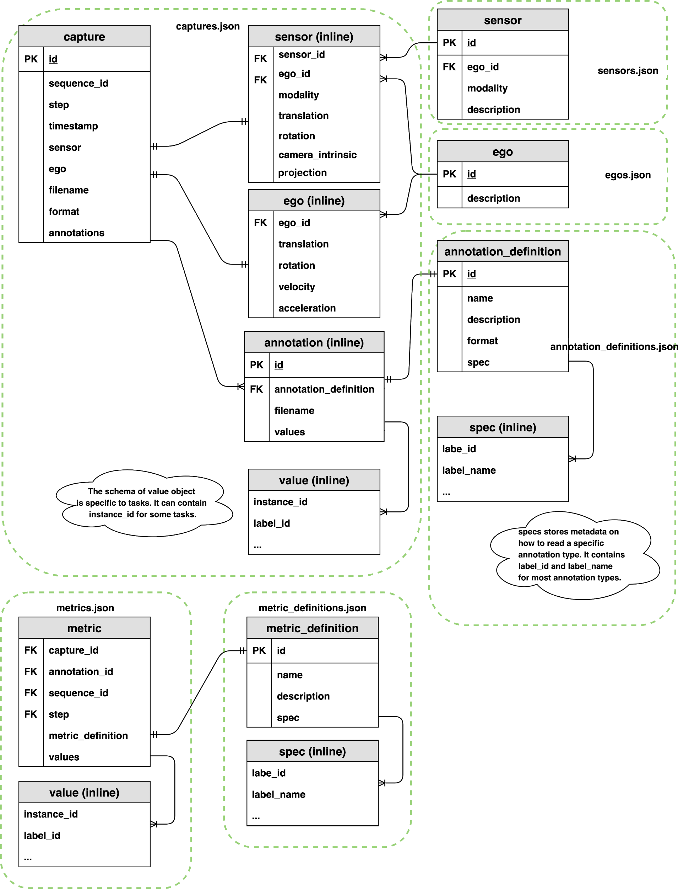

# Design: Synthetic Dataset Schema

In [dataset insights](https://docs.google.com/document/d/12nMXfVrWQ4glFJvGzbs1kiY5ucUZVSaP0gSxT7CVPzw/edit#heading=h.7o8v95hyl30m) (TODO: Replace link), we have synthetic dataset generated as part of the simulation execution that will later be consumed by machine learning models. Synthetic datasets are typically composed of sensor captured data and annotations. These data came in various forms and might be captured by different sensors and annotation mechanisms that were triggered at different frequencies. Organizing and maintaining these data become one of the important tasks before this data can be used for machine learning training.

Most public dataset for machine learning uses file system features to organize their dataset. They use filename convention or folder structure, which can only support very limited types of inputs and annotations. As the complexity of the system grows, as well as sensor configuration and types of annotation increases, organizing these files will become challenging over time. 

In this document, we will discuss a lightweight dataset schema design to organize synthetic datasets. We design this schema with the following goal in mind:

* Design a dataset schema that can be used to organize captured sensor data and annotations from the simulation. This schema allowed us to maintain a contract between the dataset producer (e.g. Perception SDK) a consumers (e.g. Statistics and ML Modeling...)

* This design should maintain relationships between captured data and annotations that were taken at a particular simulation timestamps. Optionally, It should also maintain relationships between two consecutive timestamps if they will be used for time related perception tasks (e.g. object tracking).  

* This design should support streaming data, since the data will be created on the fly during the simulation from multiple processes or cloud instances. 

* This design should be flexible to expand and support new types of sensor annotations

* The design assumes synthetic dataset can be serialized to filesystems. It should not make assumptions about transmission of storage of the dataset on a particular database management system. However, it’s flexible enough to support such use cases in the future. 

## Terminology

Definitions used in this document:

* **simulation**: an execution of a collection of X Unity builds (or builds with different parameters), each build is executed for a predefined steps of execution (e.g. executed for 10 seconds with 5fps for a total of 50 frames). Here a step is defined as one tick of the simulation wall-clock in Unity. 

* **capture**: full rendering process of a Unity sensor which saved the rendered result to data files (PNG, [pcd](https://www.online-convert.com/file-format/pcd), etc).

* **sequence**: a time-ordered collection of captures in the simulation. This is typically collected during the Y-steps simulation in a Unity build.

* **annotation**: some extra data (e.g. bounding boxes) recorded that is used to describe a particular capture at the same timestamp. A capture might include multiple types of annotations. 

* **ego**: a GameObject moving in Unity scene with sensors (camera/LIDAR/radar) attached to it. For example, a camera attached to an object moving in the Unity scene. 

* **label**: a collection of string tokens (e.g. car, human.adult, etc.) that represents a particular type of Unity GameObject (or a parent GameObject from a hierarchy of objects) used in the simulation. A GameObject might have multiple labels used for different annotation purposes. 

* **coordinate systems**: there are three coordinate systems in simulation

    * **global coordinate system**: coordinate with respect to a particular fixed point in a Unity scene. 

    * **ego coordinate system**: coordinate with respect to an ego object. Typically, this refers to an object moving in the Unity scene. For convenience, we can use the mount point for one of the sensors on ego as the origin of ego coordinate system. 

    * **sensor coordinate system**: coordinate with respect to a sensor. This is useful for ML model training for a single sensor, which can be transformed from a global coordinate system and ego coordinate system. Raw value of object pose using the sensor coordinate system is rarely recorded in simulation.

## design

This design is inspired from nuScenes [data format](#heading=h.ng38ehm32lgs). In nuScenes, data format relies on **relational database schema design**, which also assumes all tables are normalized. Relation design makes it harder to load data into memory when multiple joins are required to get the raw data of the simulation. In this work, we relied on **document based schema design** which is a more flexible design compared to relational design. It is more relaxed on normalization requirements. Some of the columns are duplicated across different tables that might result in increased dataset size. Since there are a variety of tools that can work on large document based datasets, denormalization is not considered a priority here.

### diagram

### captures

A capture record stored relationship between a captured file, a collection of annotations, and extra metadata that described this capture. A record is created when at least one of the sensors is triggered to make captures. Capture files might be generated distributedly from different simulation instances.

```
capture {
  id:                <str> -- UUID of the capture.
  sequence_id:       <str> -- UUID of the sequence.
  step:              <int> -- Used as the index of captures in the sequence. This field is used to maintain order of two captures within the same sequence. 
  timestamp:         <int> -- Simulation timestamp in milliseconds since the sequence started.
  sensor:            <obj> -- Attributes of the sensor. see below.
  ego:               <obj> -- Ego pose of this sample. See below.
  filename:          <str> -- A single file that stores sensor captured data. (e.g. camera_000.png, points_123.pcd, etc.)
  format:            <str> -- The format of the sensor captured file. (e.g. png, pcd, etc.)
  annotations:       [<obj>,...] [optional] -- List of all annotation objects in this capture. See below.
}
```


#### sequence, step and timestamp

In some use cases, two consecutive captures might not be related in time during simulation. For example, if we simply want to generate randomly placed objects in a scene for X steps of simulation. In this case, sequence, step and timestamp are irrelevant for the captured data. We can add default value to sequence, step and timestamp for these types of captures.

In cases where we need to maintain time order relationship between captures (e.g. a sequence of camera capture as in 10 seconds video) and [metrics](#heading=h.9mpbqqwxedti), we need to add sequence, step and timestamp to maintain time ordered relationship of captures. Sequence represents the collection of any time ordered captures and annotations. Timestamps are the simulation wall clock in milliseconds since the sequence started. Steps are integer values which should increase when a capture or metric event is triggered. Since timestamps might be floating point numbers which makes it harder to synchronize two events that occur at the same time, steps are necessary integer extension to make sure we can associate metrics and captures that occur at the same time. Below is an illustration of how captures, metrics, timestamps and steps are synchronized.  

Since each sensor might trigger captures at different frequencies, at the same timestamp we might contain 0 to N captures, where N is the total number of sensors included in this scene. If two sensors are captured at the same timestamp, they should share the same sequence, step and timestamp value.

 

Physical camera sensors require some time to finish exposure. Physical LIDAR sensor requires some time to finish one 360 scan. How do we define the timestamp of the sample in simulation? Following nuScene sensor [synchronization](https://www.nuscenes.org/data-collection) strategy, we define a reference line from ego origin to the ego’s "forward" traveling direction. The timestamp of the LIDAR scan is the time when the full rotation of the current LIDAR frame is achieved. A full rotation is defined as the 360 sweep between two consecutive times passing the reference line. The timestamp of the camera is the exposure trigger time in simulation.

#### capture.filenames

Typical sensor capture files might include:

* camera: 24-bit RGB PNG files

* LIDAR: [pcd](http://pointclouds.org/documentation/tutorials/pcd_file_format.php) point cloud file format

* RADAR: [pcd](http://pointclouds.org/documentation/tutorials/pcd_file_format.php) point cloud file format

* SONAR: [pcd](http://pointclouds.org/documentation/tutorials/pcd_file_format.php) point cloud file format

#### capture.ego

An ego record stores the ego status data when a sample is created. It includes translation, rotation, velocity and acceleration (optional) of the ego. It is computed with respect to the **global coordinate system** of a Unity scene.

```
ego {
  ego_id:       <str> -- Foreign key pointing to ego.id.
  translation:  <float, float, float> -- Position in meters: (x, y, z) with respect to the global coordinate system.
  rotation:     <float, float, float, float> -- Orientation as quaternion: w, x, y, z.
  velocity:     <float, float, float> -- Velocity in meters per second as v_x, v_y, v_z.
  acceleration: <float, float, float> [optional] -- Acceleration in meters per second^2 as a_x, a_y, a_z. 
}
```


#### capture.sensor

A sensor record that stored sensor attributes. Some of the attributes for might be identical for sensors with the same modality (e.g. field of view FOV for camera, beam density for LIDAR, etc.). Some attributes might be specific to a particular sensor (e.g. position calibration or camera focal length, etc) attached on a particular ego. Attribute might change during the simulation for domain randomization. Attributes can also include arbitrary key value pairs that describe other sensor properties in the simulation. It is computed with respect to the **ego coordinate system** of a given ego.

```
sensor {
  sensor_id:        <str> -- Foreign key pointing to sensor.id.
  ego_id:           <str> -- Foreign key pointing to ego.id.
  modality:         <str> {camera, lidar, radar, sonar,...} -- Sensor modality.
  translation:      <float, float, float> -- Position in meters: (x, y, z) with respect to the ego coordinate system. This is typically fixed during the simulation, but we can allow small variation for domain randomization.
  rotation:         <float, float, float, float> -- Orientation as quaternion: (w, x, y, z) with respect to ego coordinate system. This is typically fixed during the simulation, but we can allow small variation for domain randomization.
  camera_intrinsic: <3x3 float matrix> [optional] -- Intrinsic camera calibration. Empty for sensors that are not cameras.
  
  # add arbitrary optional key-value pairs for sensor attributes
}
```


reference: [camera_intrinsic](https://www.mathworks.com/help/vision/ug/camera-calibration.html#bu0ni74)

#### capture.annotation

An annotation record stored 1 to 1 relationship between an annotation file to a capture file. Each sensor capture might correspond to 0 to M annotation records, which stored as 1 to many relationships between capture and annotations in captures table. Some of the creature files might not have annotations. If annotations can be represented by json objects, they can be directly stored in the "values" field. Otherwise, we will need to store annotations in a special binary format using the “filename” field.

```
annotation {
  id:                    <str> -- UUID of the annotation.
  annotation_definition: <int> -- Foreign key point to annotation_definition.id. see below
  filename:              <str> [optional] -- Path to a single file that stores annotations. (e.g. sementic_000.png etc.)
  values:                [<obj>,...] [optional] -- List of objects that stored annotation data (e.g. polygon, 2d bounding box, 3d bounding box, etc). The data should be processed according to a given annotation_definition.id.  
}
```


#### capture.annotation.filenames

Here we provide examples of annotation files.

##### semantic segmentation - grayscale image

A grayscale PNG file (left) that stores integer value (label pixel_value in [annotation spec](#heading=h.i6217crabzpe) reference table, semantic segmentation) of the labeled object at each pixel. Color images (right) are only used for demonstration purposes. Color images are optional annotation files to be saved in simulation.

#### 

#### capture.annotation.values

##### instance segmentation - polygon

A json object that stored collections of polygons. Each polygon record maps a tuple of (instance, label) to a list of K pixel coordinates that forms a polygon. This object can be directly stored in annotation.values 

```
semantic_segmentation_polygon {
  label_id:     <int> -- Integer identifier of the label
  label_name:   <str> -- String identifier of the label
  instance_id:  <str> -- UUID of the instance.
  polygon:      [<int, int>,...] -- List of points in pixel coordinates of the outer edge. Connecting these points in order should create a polygon that identifies the object. 
}
```


##### 2D bounding box

A json file that stored collections of 2D bounding boxes. Each bounding box record maps a tuple of (instance, label) to a set of 4 variables (x, y, width, height) that draws a bounding box. We followed the OpenCV 2D coordinate [system](https://github.com/vvvv/VL.OpenCV/wiki/Coordinate-system-conversions-between-OpenCV,-DirectX-and-vvvv#opencv) where the origin (0,0), (x=0, y=0) is at the top left of the image. Although 2D bounding boxes can also be encoded as polygon annotation, we choose to keep 2D bounding boxes as a separate format for convenience. 

```
bounding_box_2d {
  label_id:     <int> -- Integer identifier of the label
  label_name:   <str> -- String identifier of the label
  instance_id:  <str> -- UUID of the instance.
  x:            <float> -- x coordinate of the upper left corner.
  y:            <float> -- y coordinate of the upper left corner. 
  width:        <float> -- number of pixels in the x direction
  height:       <float> -- number of pixels in the y direction
}
```


##### 3D bounding box

A json file that stored collections of 3D bounding boxes. Each bounding box record maps a tuple of (instance, label) to translation, size and rotation that draws a 3D bounding box, as well as velocity and acceleration (optional) of the 3D bounding box. All location data is given with respect to the **sensor coordinate system**.

```
bounding_box_3d {
  label_id:     <int> -- Integer identifier of the label
  label_name:   <str> -- String identifier of the label
  instance_id:  <str> -- UUID of the instance.
  translation:  <float, float, float> -- 3d bounding box location at the center in meters as center_x, center_y, center_z with respect to global coordinate system.
  size:         <float, float, float> -- 3d bounding box size in meters as width, length, height.
  rotation:     <float, float, float, float> -- 3d bounding box orientation as quaternion: w, x, y, z.
  velocity:     <float, float, float>  -- 3d bounding box velocity in meters per second as v_x, v_y, v_z.
  acceleration: <float, float, float> [optional] -- 3d bounding box acceleration in meters per second^2 as a_x, a_y, a_z.
}
```


#### instances (V2, WIP)

Although we didn’t have a specific table that account for instances, it should be noted that instances should be checked against the following cases

* Consider cases for object tracking

* Consider cases not used for object tracking, so that instances do not need to be consistent across different captures/annotations. How to support instance segmentation (maybe we need to use polygon instead of pixel color)

* Stored in values of annotation and metric values

##### instance segmentation file - grayscale image (V2)

A grayscale PNG file that stores integer values of labeled instances at each pixel. 


### metrics

Metrics stored extra metadata that can be used to describe a particular sequence, capture or annotation. Metric records are stored as arbitrary number (M) of key-value pairs. For a sequence metric, capture_id, annotation_id and step should be null. For a capture metric, annotation_id can be null. For an annotation metric, all four columns of sequence_id, capture_id, annotation_id and step are not null.

Metrics files might be generated distributedly from different simulation instances.

```
metric {
  capture_id:        <str> -- Foreign key point to capture.id.
  annotation_id:     <str> -- Foreign key point to annotation.id.
  sequence_id:       <str> -- Foreign key point to capture.sequence_id.
  step:              <int> -- Foreign key point to capture.step.
  metric_definition: <int> -- Foreign key point to metric_definition.id
  values:            [<obj>,...] -- List of all metric records stored as json objects.  
}
```


### references

All reference tables are static tables during the simulation. This typically comes from the definition of the simulation and should be created before tasks running distributed at different instances.

#### egos

A json file that stored collections of egos. This file is an enumeration of all egos in this simulation. A specific object with sensors attached to it is a commonly used ego in a driving simulation.

```
ego {
  id:           <str> -- UUID of the ego.
  description:  <str> [optional] -- Ego instance description.
}
```


#### sensors

A json file that stored collections of sensors. This file is an enumeration of all sensors in this simulation. Each sensor record assigned a unique UUID identifier to a particular sensor attached to an ego. Multiple sensors of the same modality on the same ego should be assigned with a different identifier. 

```
sensor {
  id:               <str> -- UUID of the sensor.
  ego_id:           <int> -- Foreign key pointing to ego.id.
  modality:         <str> {camera, lidar, radar, sonar,...} -- Sensor modality.
  description:      <str> [optional] -- Sensor instance description.
}
```


#### annotation_definitions

A json file that stores collections of annotation specifications (annotation_definition). Each specification record describes a particular type of annotation file, which is assigned an integer identifier to a collection of specification records, stored as a list of key-value pairs of records. Each specification record explicitly stores how a record annotation file should be mapped back to labels or any enumeration of objects. 

For example, in semantic segmentation, an annotation file is stored as a grayscale PNG file, where each pixel value corresponds to some labels. We stored the mapping between pixel values and a subset of labels defined in this [table](#bookmark=id.is7luv1toraj). This allows us to support different mapping between labels to pixel values in any PNG files.

Typically, in annotation_definition, it enumerates all labels_id and label_name used in this simulation for annotation purposes. Some special cases like semantic segmentation might assign additional values (e.g. pixel value) used record mapping between label_id/label_name to pixel grayscale color in annotated PNG files.

```
annotation_definition {
  id:           <int> -- Integer identifier of the annotation definition.
  name:         <str> -- Human readable annotation spec name (e.g. sementic_segmentation, instance_segmentation, etc.) 
  description:  <str, optional> -- Description of this annotation specifications.
  format:       <str> -- The format of the annotation files. (e.g. png, json, etc.)
  spec:         [<obj>...] -- Format-specific specification for the annotation values (ex. label-value mappings for semantic segmentation images)
}

# semantic segmentation
annotation_definition.spec {        
  label_id:          <int> -- Integer identifier of the label
  label_name:        <str> -- String identifier of the label
  pixel_value:       <int> -- Grayscale pixel value
  color_pixel_value: <int, int, int> [optional] -- Color pixel value
}

# label enumeration spec, used to enumerate all labels this annotation is considered. This might be a subset of all labels used in simulation.
annotation_definition.spec {
  label_id:    <int> -- Integer identifier of the label
  label_name:  <str> -- String identifier of the label
}
```


#### metric_definitions

A json file that stored collections of metric specifications records (metric_definition). Each specification record describes a particular metric stored in [metrics](#heading=h.o31qr0c07xx8) values. Each metric_definition record is assigned a unique identifier to a collection of specification records, which is stored as a list of key-value pairs. The design is very similar to [annotation_definitions](#heading=h.i6217crabzpe).

```
metric_definition {
  id:           <int> -- Integer identifier of the metric definition.
  name:         <str> -- Human readable metric spec name (e.g. object_count, average distance, etc.) 
  description:  <str, optional> -- Description of this metric specifications.
  spec:         [<obj>...] -- Format-specific specification for the metric values
}

# label enumeration spec, used to enumerate all labels this metric is considered. This might be a subset of all labels in simulation. As one example, this can be used for object count metrics.
metric_definition.spec {
  label_id:    <int> -- Integer identifier of the label
  label_name:  <str> -- String identifier of the label
}
```

### schema versioning

* We use [semantic versioning](https://semver.org/).

* Version info is placed at root level of the json file that holds a collection of objects (e.g. captures.json, metrics.json, annotation_definitionss.json,... ) Only one version used across all json files. It should change atomically across files if the version of the schema is updated

* If new metric_definition or annotation_definition are added, it will not change the schema version since it does not involve any scheme change. 

## example

A mockup of synthetic dataset according to this schema can be found [here](https://gitlab.internal.unity3d.com/machine-learning/thea/merge_requests/12). In this mockup, we have:

* 1 ego

* 2 sensors: 1 camera and 1 LIDAR

* 19 labels

* 3 captures, 2 metrics, 1 sequence, 2 steps 

    * the first includes 1 camera capture and 1 semantic segmentation annotation.

    *   two captures, 1 camera capture and 1 LIDAR capture, are triggered at the same time. For the camera, semantic segmentation, instance segmentation and 3d bounding box annotations are provided. For the LIDAR sensor, semantic segmentation annotation of point cloud is included.

    * one of the metric events is emitted for metrics at capture level. The other one is emitted at annotation level.

* 3 types of annotations: semantic segmentation, 3d bound box and LIDAR semantic segmentation. 

* 1 type of metric: object counts

## -------------required above this line (except V2)-------------------------

## questions

* How do we represent a hierarchical relationship of labels? 

* how to make sure schema are consistent across runs? How much flexibility do we want to allow users to configure this schema? How do we combine dataset from two runs?

    * We need to reserve an id range for default annotation_definition and metric_definiton that is shipped with a simulation package. These default are essential to ensure we can run dataset statistics and evaluation. 

    * Users can specify their own definition that is separate from above

* We need some default labels and specs for each public dataset (e.g. cityscapes labels and cityscapes pixel colors). What should be user configrable and what should be kept as default?

* Think about venn diagram of taxonomy between two dataset

    * How do we merge two synthetic dataset? Tow public dataset? Synthetic dataset + Public Dataset?

* How can we maintain a "wall clock" during the simulation? If we have different sensor modules running under different processes (or some of them on GPU), can we rely on timestamp to reconstruct the sequence of captures? Do we really need extra column “step” in order to keep track of this information? 

* Should we allow customers to use their own test set? What do we want to do if customers use a spec that does not have a public dataset? How can dataset evaluation support custom label definition from customers? 

# Appendix: nuScene Data Format

This [document](https://www.nuscenes.org/data-format) describes the database schema used in nuScenes. All annotations and metadata (including calibration, maps, vehicle coordinates etc.) are covered in a relational database. The database tables are listed below. Every row can be identified by its unique primary key token. Foreign keys such as sample_token may be used to link to the token of the table sample. Please refer to the tutorial for an introduction to the most important database tables.

## folder structure

```
nuscenes/
  samples/                   - Sensor data for keyframes.
    CAM_FRONT/files.jpg
    LIDAR_TOP/files.pcd.bin
    RADAR_FRONT/files.pcd
    ...
  sweeps/                    - Sensor data for intermediate frames.
  maps/                      - Folder for all map files: rasterized .png images and vectorized .json files.
  v1.0-*/                    - JSON tables that include all the meta data and annotations. Each split (trainval, test, mini) is provided in a separate folder.
```


## tables

### category

Taxonomy of objects (e.g. vehicles, human). Subcategories are delineated by a period (e.g. human.pedestrian.adult).

```
category {
   "token":                   <str> -- Unique record identifier.
   "name":                    <str> -- Category name. Subcategories indicated by period.
   "description":             <str> -- Category description.
}
```

```
[{
"token": "1fa93b757fc74fb197cdd60001ad8abf",
"name": "human.pedestrian.adult",
"description": "Adult subcategory."
},
{
"token": "b1c6de4c57f14a5383d9f963fbdcb5cb",
"name": "human.pedestrian.child",
"description": "Child subcategory."
}]
```


### attribute

An attribute is a property of an instance that can change while the category remains the same. Example: a vehicle being parked/stopped/moving, and whether or not a bicycle has a rider.

```
attribute {
   "token":                   <str> -- Unique record identifier.
   "name":                    <str> -- Attribute name.
   "description":             <str> -- Attribute description.
}
```


```
[{
"token": "cb5118da1ab342aa947717dc53544259",
"name": "vehicle.moving",
"description": "Vehicle is moving."
},
{
"token": "c3246a1e22a14fcb878aa61e69ae3329",
"name": "vehicle.stopped",
"description": "Vehicle, with a driver/rider in/on it, is currently stationary but has an intent to move."
}]
```


### instance

An object instance, e.g. particular vehicle. This table is an enumeration of all object instances we observed. Note that instances are not tracked across scenes.

```
instance {
   "token":                   <str> -- Unique record identifier.
   "category_token":          <str> -- Foreign key. Object instance category.
   "nbr_annotations":         <int> -- Number of annotations of this instance.
   "first_annotation_token":  <str> -- Foreign key. Points to the first annotation of this instance.
   "last_annotation_token":   <str> -- Foreign key. Points to the last annotation of this instance.
}
```


```
[{
  "token": "6dd2cbf4c24b4caeb625035869bca7b5",
  "category_token": "1fa93b757fc74fb197cdd60001ad8abf",
  "nbr_annotations": 39,
  "first_annotation_token": "ef63a697930c4b20a6b9791f423351da",
  "last_annotation_token": "8bb63134d48840aaa2993f490855ff0d"
},
{
  "token": "48d58b69b40149aeb2e64aa4b1a9192f",
  "category_token": "1fa93b757fc74fb197cdd60001ad8abf",
  "nbr_annotations": 30,
  "first_annotation_token": "6b89da9bf1f84fd6a5fbe1c3b236f809",
  "last_annotation_token": "2f69a953ed424deaa2a89ff4cd515c51"
}]
```


### sensor

A specific sensor type.

```
sensor {
  "token":                   <str> -- Unique record identifier.
  "channel":                 <str> -- Sensor channel name.
  "modality":                <str> {camera, lidar, radar} -- Sensor modality. Supports category(ies) in brackets.
}
```


```
[{
  "token": "725903f5b62f56118f4094b46a4470d8",
  "channel": "CAM_FRONT",
  "modality": "camera"
},
{
  "token": "dc8b396651c05aedbb9cdaae573bb567",
  "channel": "LIDAR_TOP",
  "modality": "lidar"
},
{
  "token": "47fcd48f71d75e0da5c8c1704a9bfe0a",
  "channel": "RADAR_FRONT",
  "modality": "radar"
}]
```


### calibrated_sensor

Definition of a particular sensor (lidar/radar/camera) as calibrated on a particular vehicle. All extrinsic parameters are given with respect to the ego vehicle body frame. All camera images come undistorted and rectified.

```
calibrated_sensor {
   "token":                   <str> -- Unique record identifier.
   "sensor_token":            <str> -- Foreign key pointing to the sensor type.
   "translation":             <float> [3] -- Coordinate system origin in meters: x, y, z.
   "rotation":                <float> [4] -- Coordinate system orientation as quaternion: w, x, y, z.
   "camera_intrinsic":        <float> [3, 3] -- Intrinsic camera calibration. Empty for sensors that are not cameras.
}
```


```
[{
  "token": "f4d2a6c281f34a7eb8bb033d82321f79",
  "sensor_token": "47fcd48f71d75e0da5c8c1704a9bfe0a",
  "translation": [3.412, 0.0, 0.5],
  "rotation": [0.9999984769132877, 0.0, 0.0, 0.0017453283658983088],
  "camera_intrinsic": []
},
{
  "token": "2ee327ac0903407dbb42c754861c1e63",
  "sensor_token": "1f69f87a4e175e5ba1d03e2e6d9bcd27",
  "translation": [2.422, 0.8, 0.78],
  "rotation": [0.7171539204983457, 0.0, 0.0, 0.6969148113750004],
  "camera_intrinsic": []
}]
```


### ego_pose

Ego vehicle pose at a particular timestamp. Given with respect to global coordinate system of the log's map. The ego_pose is the output of a lidar map-based localization algorithm described in our paper. The localization is 2-dimensional in the x-y plane.

```
ego_pose {
   "token":                   <str> -- Unique record identifier.
   "translation":             <float> [3] -- Coordinate system origin in meters: x, y, z. Note that z is always 0.
   "rotation":                <float> [4] -- Coordinate system orientation as quaternion: w, x, y, z.
   "timestamp":               <int> -- Unix time stamp.
}
```


```
[{
"token": "5ace90b379af485b9dcb1584b01e7212",
"timestamp": 1532402927814384,
"rotation": [0.5731787718287827, -0.0015811634307974854, 0.013859363182046986, -0.8193116095230444],
"translation": [410.77878632230204, 1179.4673290964536, 0.0]
},
{
"token": "37091c75b9704e0daa829ba56dfa0906",
"timestamp": 1532402927664178,
"rotation": [0.5721129977125774, -0.0014962022442161157, 0.011922678049447764, -0.8200867813684729],
"translation": [411.25243634487725, 1180.7511754315697, 0.0]
}]
```


### log

Information about the log from which the data was extracted.

```
log {
   "token":                   <str> -- Unique record identifier.
   "logfile":                 <str> -- Log file name.
   "vehicle":                 <str> -- Vehicle name.
   "date_captured":           <str> -- Date (YYYY-MM-DD).
   "location":                <str> -- Area where log was captured, e.g. singapore-onenorth.
}
```


```
[{
"token": "7e25a2c8ea1f41c5b0da1e69ecfa71a2",
"logfile": "n015-2018-07-24-11-22-45+0800",
"vehicle": "n015",
"date_captured": "2018-07-24",
"location": "singapore-onenorth"
},
{
"token": "53cf9c55dd8644bea67b9f009fc1ee38",
"logfile": "n008-2018-08-01-15-16-36-0400",
"vehicle": "n008",
"date_captured": "2018-08-01",
"location": "boston-seaport"
}]
```


### scene

A scene is a 20s long sequence of consecutive frames extracted from a log. Multiple scenes can come from the same log. Note that object identities (instance tokens) are not preserved across scenes.

```
scene {
   "token":                   <str> -- Unique record identifier.
   "name":                    <str> -- Short string identifier.
   "description":             <str> -- Longer description of the scene.
   "log_token":               <str> -- Foreign key. Points to log from where the data was extracted.
   "nbr_samples":             <int> -- Number of samples in this scene.
   "first_sample_token":      <str> -- Foreign key. Points to the first sample in scene.
   "last_sample_token":       <str> -- Foreign key. Points to the last sample in scene.
}
```


```
[{
"token": "cc8c0bf57f984915a77078b10eb33198",
"log_token": "7e25a2c8ea1f41c5b0da1e69ecfa71a2",
"nbr_samples": 39,
"first_sample_token": "ca9a282c9e77460f8360f564131a8af5",
"last_sample_token": "ed5fc18c31904f96a8f0dbb99ff069c0",
"name": "scene-0061",
"description": "Parked truck, construction, intersection, turn left, following a van"
},
{
"token": "fcbccedd61424f1b85dcbf8f897f9754",
"log_token": "53cf9c55dd8644bea67b9f009fc1ee38",
"nbr_samples": 40,
"first_sample_token": "3e8750f331d7499e9b5123e9eb70f2e2",
"last_sample_token": "281b92269fd648d4b52d06ac06ca6d65",
"name": "scene-0103",
"description": "Many peds right, wait for turning car, long bike rack left, cyclist"
}]
```


### sample

A sample is data collected at (approximately) the same timestamp as part of a single LIDAR sweep.

```
sample {
   "token":                   <str> -- Unique record identifier.
   "timestamp":               <int> -- Unix time stamp.
   "scene_token":             <str> -- Foreign key pointing to the scene.
   "next":                    <str> -- Foreign key. Sample that follows this in time. Empty if end of scene.
   "prev":                    <str> -- Foreign key. Sample that precedes this in time. Empty if start of scene.
}
```


```
[{
"token": "ca9a282c9e77460f8360f564131a8af5",
"timestamp": 1532402927647951,
"prev": "",
"next": "39586f9d59004284a7114a68825e8eec",
"scene_token": "cc8c0bf57f984915a77078b10eb33198"
},
{
"token": "39586f9d59004284a7114a68825e8eec",
"timestamp": 1532402928147847,
"prev": "ca9a282c9e77460f8360f564131a8af5",
"next": "356d81f38dd9473ba590f39e266f54e5",
"scene_token": "cc8c0bf57f984915a77078b10eb33198"
}]
```


### sample_data

A sensor data e.g. image, point cloud or radar return. For sample_data with is_key_frame=True, the time-stamps should be very close to the sample it points to. For non key-frames the sample_data points to the sample that follows closest in time.

```
sample_data {
   "token":                   <str> -- Unique record identifier.
   "sample_token":            <str> -- Foreign key. Sample to which this sample_data is associated.
   "ego_pose_token":          <str> -- Foreign key.
   "calibrated_sensor_token": <str> -- Foreign key.
   "filename":                <str> -- Relative path to data-blob on disk.
   "fileformat":              <str> -- Data file format.
   "width":                   <int> -- If the sample data is an image, this is the image width in pixels.
   "height":                  <int> -- If the sample data is an image, this is the image height in pixels.
   "timestamp":               <int> -- Unix time stamp.
   "is_key_frame":            <bool> -- True if sample_data is part of key_frame, else False.
   "next":                    <str> -- Foreign key. Sample data from the same sensor that follows this in time. Empty if end of scene.
   "prev":                    <str> -- Foreign key. Sample data from the same sensor that precedes this in time. Empty if start of scene.
}
```


```
[{
"token": "5ace90b379af485b9dcb1584b01e7212",
"sample_token": "39586f9d59004284a7114a68825e8eec",
"ego_pose_token": "5ace90b379af485b9dcb1584b01e7212",
"calibrated_sensor_token": "f4d2a6c281f34a7eb8bb033d82321f79",
"timestamp": 1532402927814384,
"fileformat": "pcd",
"is_key_frame": false,
"height": 0,
"width": 0,
"filename": "sweeps/RADAR_FRONT/n015-2018-07-24-11-22-45+0800__RADAR_FRONT__1532402927814384.pcd",
"prev": "f0b8593e08594a3eb1152c138b312813",
"next": "978db2bcdf584b799c13594a348576d2"
},
{
"token": "37091c75b9704e0daa829ba56dfa0906",
"sample_token": "ca9a282c9e77460f8360f564131a8af5",
"ego_pose_token": "37091c75b9704e0daa829ba56dfa0906",
"calibrated_sensor_token": "f4d2a6c281f34a7eb8bb033d82321f79",
"timestamp": 1532402927664178,
"fileformat": "pcd",
"is_key_frame": true,
"height": 0,
"width": 0,
"filename": "samples/RADAR_FRONT/n015-2018-07-24-11-22-45+0800__RADAR_FRONT__1532402927664178.pcd",
"prev": "",
"next": "f0b8593e08594a3eb1152c138b312813"
}]
```


### sample_annotation

A bounding box defining the position of an object seen in a sample. All location data is given with respect to the global coordinate system.

```
sample_annotation {
   "token":                   <str> -- Unique record identifier.
   "sample_token":            <str> -- Foreign key. NOTE: this points to a sample NOT a sample_data since annotations are done on the sample level taking all relevant sample_data into account.
   "instance_token":          <str> -- Foreign key. Which object instance is this annotating. An instance can have multiple annotations over time.
   "attribute_tokens":        <str> [n] -- Foreign keys. List of attributes for this annotation. Attributes can change over time, so they belong here, not in the object table.
   "visibility_token":        <str> -- Foreign key. Visibility may also change over time. If no visibility is annotated, the token is an empty string.
   "translation":             <float> [3] -- Bounding box location in meters as center_x, center_y, center_z.
   "size":                    <float> [3] -- Bounding box size in meters as width, length, height.
   "rotation":                <float> [4] -- Bounding box orientation as quaternion: w, x, y, z.
   "num_lidar_pts":           <int> -- Number of lidar points in this box. Points are counted during the lidar sweep identified with this sample.
   "num_radar_pts":           <int> -- Number of radar points in this box. Points are counted during the radar sweep identified with this sample. This number is summed across all radar sensors without any invalid point filtering.
   "next":                    <str> -- Foreign key. Sample annotation from the same object instance that follows this in time. Empty if this is the last annotation for this object.
   "prev":                    <str> -- Foreign key. Sample annotation from the same object instance that precedes this in time. Empty if this is the first annotation for this object.
}
```


```
[{
"token": "70aecbe9b64f4722ab3c230391a3beb8",
"sample_token": "cd21dbfc3bd749c7b10a5c42562e0c42",
"instance_token": "6dd2cbf4c24b4caeb625035869bca7b5",
"visibility_token": "4",
"attribute_tokens": ["4d8821270b4a47e3a8a300cbec48188e"],
"translation": [373.214, 1130.48, 1.25],
"size": [0.621, 0.669, 1.642],
"rotation": [0.9831098797903927, 0.0, 0.0, -0.18301629506281616],
"prev": "a1721876c0944cdd92ebc3c75d55d693",
"next": "1e8e35d365a441a18dd5503a0ee1c208",
"num_lidar_pts": 5,
"num_radar_pts": 0
},
{
"token": "7fa3a688931b4500b7ce29d187d3b975",
"sample_token": "2ff86dc19c4644a1a88ce5ba848f56e5",
"instance_token": "6dd2cbf4c24b4caeb625035869bca7b5",
"visibility_token": "4",
"attribute_tokens": ["4d8821270b4a47e3a8a300cbec48188e"],
"translation": [373.152, 1130.357, 1.25],
"size": [0.621, 0.669, 1.642],
"rotation": [0.9831098797903927, 0.0, 0.0, -0.18301629506281616],
"prev": "1e8e35d365a441a18dd5503a0ee1c208",
"next": "913072e56d6c4025b9b47ba085dd6d7c",
"num_lidar_pts": 6,
"num_radar_pts": 0
}]
```


### map

Map data that is stored as binary semantic masks from a top-down view.

```
map {
   "token":                   <str> -- Unique record identifier.
   "log_tokens":              <str> [n] -- Foreign keys.
   "category":                <str> -- Map category, currently only semantic_prior for drivable surface and sidewalk.
   "filename":                <str> -- Relative path to the file with the map mask.
}
```


```
[{
"category": "semantic_prior",
"token": "53992ee3023e5494b90c316c183be829",
"filename": "maps/53992ee3023e5494b90c316c183be829.png",
"log_tokens": ["0986cb758b1d43fdaa051ab23d45582b", "1c9b302455ff44a9a290c372b31aa3ce", "e60234ec7c324789ac7c8441a5e49731", "46123a03f41e4657adc82ed9ddbe0ba2", "a5bb7f9dd1884f1ea0de299caefe7ef4", "bc41a49366734ebf978d6a71981537dc", "f8699afb7a2247e38549e4d250b4581b", "d0450edaed4a46f898403f45fa9e5f0d", "f38ef5a1e9c941aabb2155768670b92a", "7e25a2c8ea1f41c5b0da1e69ecfa71a2", "ddc03471df3e4c9bb9663629a4097743", "31e9939f05c1485b88a8f68ad2cf9fa4", "783683d957054175bda1b326453a13f4", "343d984344e440c7952d1e403b572b2a", "92af2609d31445e5a71b2d895376fed6", "47620afea3c443f6a761e885273cb531", "d31dc715d1c34b99bd5afb0e3aea26ed", "34d0574ea8f340179c82162c6ac069bc", "d7fd2bb9696d43af901326664e42340b", "b5622d4dcb0d4549b813b3ffb96fbdc9", "da04ae0b72024818a6219d8dd138ea4b", "6b6513e6c8384cec88775cae30b78c0e", "eda311bda86f4e54857b0554639d6426", "cfe71bf0b5c54aed8f56d4feca9a7f59", "ee155e99938a4c2698fed50fc5b5d16a", "700b800c787842ba83493d9b2775234a"]
},
{
"category": "semantic_prior",
"token": "36092f0b03a857c6a3403e25b4b7aab3",
"filename": "maps/36092f0b03a857c6a3403e25b4b7aab3.png",
"log_tokens": ["6434493562e64d9aa36774bf8d98870e", "8e0ced20b9d847608afcfbc23056460e", "ec6814dc8ae34963908357a73d3f710e", "3a43824b84534c98bda1d07548db5817", "efa31cf3cd2f452789ca7f3e7541ea69", "6f7fe59adf984e55a82571ab4f17e4e2", "0d68b81100a640129a185cca5aa1edd7", "ff72da4810f74d18bee85070726cbade", "ca6d14b008ed4e0bb6b1eaaedadbd6c1", "485a0831e0964529b0b45d476139c68b", "eb987ba9054e427c8c3aae464c43e61c", "881dd2f8aaec49b681eb54be5bf3b3e2", "246e7da6bb344941bac92be421a545e2", "84ff0dbb8d7343ab95e776c4955d5884", "6577357788b24c35a3b0419c138f50db", "169c1773af08486c80ed3e9540528290", "4de1fda752ae4cf8b650a5245734eb4c", "20db5722b62c4c17bbff2d7b265a3c51", "8aa38e0d963f48ba84708bc8eb1a07c2", "bd38be48fba140f1941bf7c84a33255d", "55de0e85b8584ab59862e6afa690a0b8", "69271ec7af1f446ca16820ac46d2047a", "65629cfc47fe489fabc497ead466a313", "b2d2f313e9cf446aa50656117847d41b", "6c12081a828548b6b0a36f12d53be6ca", "8c66d9d518c54aed98dce7e3095501bc", "b2685a235700404581dc7354dd5b4eda", "01ebe4444f624b4699ec6bf58837b153", "08ba46dd716d42a69d108638fef5bbb9", "53cf9c55dd8644bea67b9f009fc1ee38", "ceb76203d8d7415f83ae3f81e112a0ca", "3313a6a85b264e4c86ee44d6e6329cf3", "ab1e1b004548466f86b31f879a2d9e50", "7a0fde44c3504eaeb18f9ad83bed65bc", "b90078a405814fcfa19b1ba24c022eb2",
"cb3e914a6f0b4deea0efc8521ca1e671", "b05f285d53744542a3413476d6dd9270"]
}]
```


### visibility

The visibility of an instance is the fraction of annotation visible in all 6 images. Binned into 4 bins 0-40%, 40-60%, 60-80% and 80-100%.

```
visibility {
   "token":                   <str> -- Unique record identifier.
   "level":                   <str> -- Visibility level.
   "description":             <str> -- Description of visibility level.
}
```


```
[{
"description": "visibility of whole object is between 0 and 40%",
"token": "1",
"level": "v0-40"
},
{
"description": "visibility of whole object is between 40 and 60%",
"token": "2",
"level": "v40-60"
}]
```


# Appendix: Abandoned approach

The Open Simulation Interface ([OSI](https://opensimulationinterface.github.io/osi-documentation/)) is a generic interface for the environmental perception of automated driving functions in virtual scenarios. It is a promising proposition to standardize the output of simulations. However, it’s schema is more complicated than our current need for simple perception system. It also uses [protocol buffer](https://github.com/protocolbuffers/protobuf/wiki) to store outputs which is less human readable.

