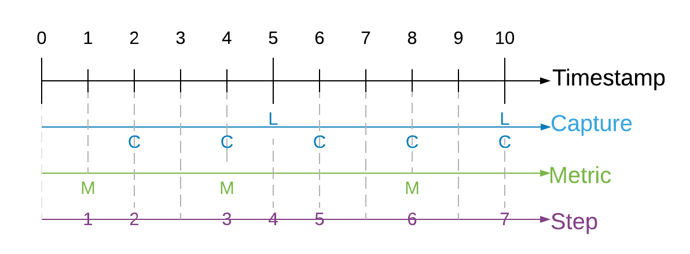

# Synthetic Dataset Schema
 
Synthetic datasets generated by the Perception package are captured in JSON. 
This document describes the schema used to store the data.
This schema provides a generic structure for simulation output which can be easily consumed to show statistics or train machine learning models.
Synthetic datasets are composed of sensor captures, annotations, and metrics e.g. images and 2d bounding box labels. 
This data comes in various forms and might be captured by different sensors and annotation mechanisms. 
Multiple sensors may be producing captures at different frequencies. 
The dataset organizes all of the data into a single set of JSON files. 

## Goals

* It should include captured sensor data and annotations in one well-defined format. 
This allows us to maintain a contract between the Perception package and the dataset consumers (e.g. Statistics and ML Modeling...)

* It should maintain relationships between captured data and annotations that were taken by the same sensor at the same time. 
It should also maintain relationships between consecutive captures for time-related perception tasks (e.g. object tracking).  

* It should support streaming data, since the data will be created on the fly during the simulation from multiple processes or cloud instances. 

* It should be able to easily support new types of sensors and annotations.

* It assumes the synthetic dataset are captured in a directory structure, but does not make assumptions about transmission of storage of the dataset on a particular database management system.

## Terminology

* **simulation**: one or more executions of a Unity player build, potentially with different parameterization.

* **capture**: a full rendering process of a Unity sensor which saved the rendered result to data files e.g.
(PNG, [pcd](https://www.online-convert.com/file-format/pcd), etc).

* **sequence**: a time-ordered series of captures generated by a simulation. 

* **annotation**: data (e.g. bounding boxes or semantic segmentation) recorded that is used to describe a particular capture at the same timestamp. 
A capture might include multiple types of annotations. 

* **step**: id for data-producing frames in the simulation. 

* **ego**: a frame of reference for a collection of sensors (camera/LIDAR/radar) attached to it. 
For example, for a robot with two cameras attached, the robot would be the ego containing the two sensors.

* **label**: a string token (e.g. car, human.adult, etc.) that represents a semantic type, or class. 
One GameObject might have multiple labels used for different annotation purposes. 
For more on adding labels to GameObjects, see [labeling](../GroundTruth-Labeling.md).

* **coordinate systems**: there are three coordinate systems used in the schema

    * **global coordinate system**: coordinate with respect to the global origin in Unity. 

    * **ego coordinate system**: coordinate with respect to an ego object. 
    Typically, this refers to an object moving in the Unity scene. 

    * **sensor coordinate system**: coordinate with respect to a sensor. 
    This is useful for ML model training for a single sensor, which can be transformed from a global coordinate system and ego coordinate system. 
    Raw value of object pose using the sensor coordinate system is rarely recorded in simulation.

## Design

The schema is based on the [nuScenes data format](https://www.nuscenes.org/data-format). 
The main difference between this schema and nuScenes is that we use **document based schema design** instead of **relational database schema design**. 
This means that instead of requiring multiple id-based "joins" to explore the data, data is nested and sometimes duplicated for ease of consumption.

## Components


### captures

A capture record contains the relationship between a captured file, a collection of annotations, and extra metadata that describes the state of the sensor.

```
capture {
  id:                <str> -- UUID of the capture.
  sequence_id:       <str> -- UUID of the sequence.
  step:              <int> -- The index of capture in the sequence. This field is used to order of captures within a sequence. 
  timestamp:         <int> -- Timestamp in milliseconds since the sequence started.
  sensor:            <obj> -- Attributes of the sensor. see below.
  ego:               <obj> -- Ego pose of this sample. See below.
  filename:          <str> -- A single file that stores sensor captured data. (e.g. camera_000.png, points_123.pcd, etc.)
  format:            <str> -- The format of the sensor captured file. (e.g. png, pcd, etc.)
  annotations:       [<obj>,...] [optional] -- List of the annotations in this capture. See below.
}
```

#### sequence, step and timestamp

In some use cases, two consecutive captures might not be related in time during simulation. 
For example, if we generate randomly placed objects in a scene for X steps of simulation. 
In this case, sequence, step and timestamp are irrelevant for the captured data. 
We can add a default value to the sequence, step and timestamp for these types of captures.

In cases where we need to maintain time order relationship between captures (e.g. a sequence of camera capture in a 10 second video) and [metrics](#metrics), we need to add a sequence, step and timestamp to maintain the time ordered relationship of captures. 
Sequence represents the collection of any time ordered captures and annotations. 
Timestamps refer to the simulation wall clock in milliseconds since the sequence started. 
Steps are integer values which increase when a capture or metric event is triggered. 
We cannot use timestamps to synchronize between two different events because timestamps are floats and therefore make poor indices. 
Instead, we use a "step" counter which make it easy to associate metrics and captures that occur at the same time. 
Below is an illustration of how captures, metrics, timestamps and steps are synchronized. 



Since each sensor might trigger captures at different frequencies, at the same timestamp we might contain 0 to N captures, where N is the total number of sensors included in this scene. 
If two sensors are captured at the same timestamp, they should share the same sequence, step and timestamp value.

 

Physical camera sensors require some time to finish exposure. 
Physical LIDAR sensor requires some time to finish one 360 scan. 
How do we define the timestamp of the sample in simulation? 
Following the nuScene sensor [synchronization](https://www.nuscenes.org/data-collection) strategy, we define a reference line from ego origin to the ego’s "forward" traveling direction. 
The timestamp of the LIDAR scan is the time when the full rotation of the current LIDAR frame is achieved. 
A full rotation is defined as the 360 sweep between two consecutive times passing the reference line. 
The timestamp of the camera is the exposure trigger time in simulation.

#### capture.ego

An ego record stores the ego status data when a sample is created. 
It includes translation, rotation, velocity and acceleration (optional) of the ego. 
The pose is with respect to the **global coordinate system** of a Unity scene.

```
ego {
  ego_id:       <str> -- Foreign key pointing to ego.id.
  translation:  <float, float, float> -- Position in meters: (x, y, z) with respect to the global coordinate system.
  rotation:     <float, float, float, float> -- Orientation as quaternion: w, x, y, z.
  velocity:     <float, float, float> -- Velocity in meters per second as v_x, v_y, v_z.
  acceleration: <float, float, float> [optional] -- Acceleration in meters per second^2 as a_x, a_y, a_z. 
}
```

#### capture.sensor

A sensor record contains attributes of the sensor at the time of the capture. 
Different sensor modalities may contain additional keys (e.g. field of view FOV for camera, beam density for LIDAR).

```
sensor {
  sensor_id:        <str> -- Foreign key pointing to sensor.id.
  ego_id:           <str> -- Foreign key pointing to ego.id.
  modality:         <str> {camera, lidar, radar, sonar,...} -- Sensor modality.
  translation:      <float, float, float> -- Position in meters: (x, y, z) with respect to the ego coordinate system. This is typically fixed during the simulation, but we can allow small variation for domain randomization.
  rotation:         <float, float, float, float> -- Orientation as quaternion: (w, x, y, z) with respect to ego coordinate system. This is typically fixed during the simulation, but we can allow small variation for domain randomization.
  camera_intrinsic: <3x3 float matrix> [optional] -- Intrinsic camera calibration. Empty for sensors that are not cameras.
  
  # add arbitrary optional key-value pairs for sensor attributes
}
```


reference: [camera_intrinsic](https://www.mathworks.com/help/vision/ug/camera-calibration.html#bu0ni74)

#### capture.annotation

An annotation record contains the ground truth for a sensor either inline or in a separate file. 
A single capture may contain many annotations.

```
annotation {
  id:                    <str> -- UUID of the annotation.
  annotation_definition: <int> -- Foreign key which points to an annotation_definition.id. see below
  filename:              <str> [optional] -- Path to a single file that stores annotations. (e.g. sementic_000.png etc.)
  values:                [<obj>,...] [optional] -- List of objects that store annotation data (e.g. polygon, 2d bounding box, 3d bounding box, etc). The data should be processed according to a given annotation_definition.id.  
}
```

#### Example annotation files

##### semantic segmentation - grayscale image

A grayscale PNG file that stores integer values (label pixel_value in [annotation spec](#annotation_definitionsjson) reference table, semantic segmentation) of the labeled object at each pixel. 


#### capture.annotation.values

##### instance segmentation - color image

A color png file that stores instance ids as a color value per pixel. The png files are located in the "filename" location.

```
instance_segmentation {
  instance_id:  <int> -- The instance ID of the labeled object
  color {             -- The pixel color that correlates with the instance ID
    r:          <int> -- The red value of the pixel between 0 and 255
    g:          <int> -- The green value of the pixel between 0 and 255
    b:          <int> -- The blue value of the pixel between 0 and 255
    a:          <int> -- The alpha value of the pixel between 0 and 255
  } 
}
```

##### 2D bounding box

Each bounding box record maps a tuple of (instance, label) 
to a set of 4 variables (x, y, width, height) that draws a bounding box. 
We follow the OpenCV 2D coordinate [system](https://github.com/vvvv/VL.OpenCV/wiki/Coordinate-system-conversions-between-OpenCV,-DirectX-and-vvvv#opencv) where the origin (0,0), (x=0, y=0) is at the top left of the image.

```
bounding_box_2d {
  label_id:     <int>   -- Integer identifier of the label
  label_name:   <str>   -- String identifier of the label
  instance_id:  <str>   -- UUID of the instance.
  x:            <float> -- x coordinate of the upper left corner.
  y:            <float> -- y coordinate of the upper left corner. 
  width:        <float> -- number of pixels in the x direction
  height:       <float> -- number of pixels in the y direction
}
```

##### 3D bounding box

3D bounding box information. Unlike the 2D bounding box, 3D bounding boxes coordinates are captured in **sensor coordinate system**. 
Each bounding box record maps a tuple of (instance, label) to translation, size and rotation that draws a 3D bounding box, as well as velocity and acceleration (optional) of the 3D bounding box.

```
bounding_box_3d {
  label_id:      <int>   -- Integer identifier of the label
  label_name:    <str>   -- String identifier of the label
  instance_id:   <str>   -- UUID of the instance.
  translation {          -- 3d bounding box's center location in meters with respect to global coordinate system.
    x:           <float> -- The x coordinate
    y:           <float> -- The y coordinate
    z:           <float> -- The z coordinate
  }
  size {                 -- 3d bounding box size in meters
    x:           <float> -- The x coordinate
    y:           <float> -- The y coordinate
    z:           <float> -- The z coordinate
  }          
  rotation {             -- 3d bounding box orientation as quaternion: w, x, y, z.
    x:           <float> -- The x coordinate
    y:           <float> -- The y coordinate
    z:           <float> -- The z coordinate
    w:           <float> -- The w coordinate
  }     
  velocity {             -- [Optional] 3d bounding box velocity in meters per second.
    x:           <float> -- The x coordinate
    y:           <float> -- The y coordinate
    z:           <float> -- The z coordinate
  } 
  acceleration {         -- [Optional] 3d bounding box acceleration in meters per second^2.
    x:           <float> -- The x coordinate
    y:           <float> -- The y coordinate
    z:           <float> -- The z coordinate
  } 
}
```
##### Keypoints

Keypoint data, commonly used for human pose estimation. A keypoint capture is associated to a template that defines the keypoints (see annotation.definition file).
Each keypoint record maps a tuple of (instance, label) to template, pose, and an array of keypoints. A keypoint will exist in this record for each keypoint defined in the template file.
If a given keypoint doesn't exist in the labeled gameobject, then that keypoint will have a state value of 0; if it exists but is not visible, it will have a state value of 1, 
if it exists and is visible it will have a state value of 2.
```
keypoints {
  label_id:      <int>   -- Integer identifier of the label
  instance_id:   <str>   -- UUID of the instance.
  template_guid: <str>   -- UUID of the keypoint template
  pose:          <str>   -- Pose ground truth information
  keypoints [            -- Array of keypoint data, one entry for each keypoint defined in associated template file.
    {
      index:     <int>   -- Index of keypoint in template
      x:         <float> -- X pixel coordinate of keypoint
      y:         <float> -- Y pixel coordinate of keypoint
      state:     <int>   -- 0: keypoint does not exist, 1 keypoint exists but is not visible, 2 keypoint exists and is visible
    }, ...
  ]
}
```

<!-- Not yet implemented annotations

#### instances (V2, WIP)

Although we don’t have a specific table that account for instances, it should be noted that instances should be checked against the following cases

* Consider cases for object tracking

* Consider cases not used for object tracking, so that instances do not need to be consistent across different captures/annotations. 
How to support instance segmentation (maybe we need to use polygon instead of pixel color)

* Stored in values of annotation and metric values
 
##### instance segmentation file - grayscale image (V2)

A grayscale PNG file that stores integer values of labeled instances at each pixel. 


-->
 
### metrics

Metrics store extra metadata that can be used to describe a particular sequence, capture or annotation. 
Metric records are stored as an arbitrary number (M) of key-value pairs. For a sequence metric, capture_id, annotation_id and step should be null. 
For a capture metric, annotation_id can be null. 
For an annotation metric, all four columns of sequence_id, capture_id, annotation_id and step are not null.

Metrics files might be generated in parallel from different simulation instances.

```
metric {
  capture_id:        <str> -- Foreign key which points to capture.id.
  annotation_id:     <str> -- Foreign key which points to annotation.id.
  sequence_id:       <str> -- Foreign key which points to capture.sequence_id.
  step:              <int> -- Foreign key which points to capture.step.
  metric_definition: <int> -- Foreign key which points to metric_definition.id
  values:            [<obj>,...] -- List of all metric records stored as json objects.  
}
```

### definitions

Ego, sensor, annotation, and metric definition tables are static during the simulation. 
This typically comes from the definition of the simulation and are generated during the simulation.

#### egos.json

A json file containing a collection of egos. This file is an enumeration of all egos in this simulation. 
A specific object with sensors attached to it is a commonly used ego in a driving simulation.

```
ego {
  id:           <str> -- UUID of the ego.
  description:  <str> [optional] -- Ego instance description.
}
```

#### sensors.json

A json file containing a collection of all sensors present in the simulation. 
Each sensor is assigned a unique UUID. Each is associated with an ego and stores the UUID of the ego as a foreign key.

```
sensor {
  id:               <str> -- UUID of the sensor.
  ego_id:           <int> -- Foreign key pointing to ego.id.
  modality:         <str> {camera, lidar, radar, sonar,...} -- Sensor modality.
  description:      <str> [optional] -- Sensor instance description.
}
```
#### annotation_definitions.json

A json file containing a collection of annotation specifications (annotation_definition). 
Each record describes a particular type of annotation and contains an annotation-specific specification describing how annotation data should be mapped back to labels or objects in the scene.

Typically, the `spec` key describes all labels_id and label_name used by the annotation. 
Some special cases like semantic segmentation might assign additional values (e.g. pixel value) to record the mapping between label_id/label_name and pixel color in the annotated PNG files.

##### annotation definition header
```
annotation_definition {
  id:                <int>           -- Integer identifier of the annotation definition.
  name:              <str>           -- Human readable annotation spec name (e.g. sementic_segmentation, instance_segmentation, etc.) 
  description:       <str>           -- [Optional] Description of this annotation specifications.
  format:            <str>           -- The format of the annotation files. (e.g. png, json, etc.)
  spec:              [<obj>...]      -- Format-specific specification for the annotation values (ex. label-value mappings for semantic segmentation images)
}
```
##### semantic segmentation
Annotation spec for semantic [segmentation labeler](#semantic-segmentation---grayscale-image)
```
annotation_definition.spec {        
  label_id:          <int>           -- Integer identifier of the label
  label_name:        <str>           -- String identifier of the label
  pixel_value:       <int>           -- Grayscale pixel value
  color_pixel_value: <int, int, int> -- [Optional] Color pixel value
}
```
##### label enumeration spec
This spec is used for annotations like [bounding box 2d](#2d-bounding-box). This might be a subset of all labels used in simulation.
```
annotation_definition.spec {
  label_id:          <int>           -- Integer identifier of the label
  label_name:        <str>           -- String identifier of the label
}
```
##### keypoint template
keypoint templates are used to define the keypoints and skeletal connections captured by the [keypoint labeler](#keypoints).
```
annotation_definition.spec {
  template_id:       <str>           -- The UUID of the template
  template_name:     <str>           -- Human readable name of the template
  key_points [                       -- Array of joints defined in this template
    {
      label:         <str>           -- The label of the joint
      index:         <int>           -- The index of the joint
      color {                        -- [Optional] The color to use for the visualization of the keypoint
        r:           <float>         -- Value from 0 to 1 for the red channel
        g:           <float>         -- Value from 0 to 1 for the green channel
        b:           <float>         -- Value from 0 to 1 for the blue channel
        a:           <float>         -- Value from 0 to 1 for the alpha channel
      }
    }, ...
  ]
  skeleton [                         -- Array of skeletal connections (which joints have connections between one another) defined in this template
    {
      joint1:        <int>           -- The first joint of the connection
      joint2:        <int>           -- The second joint of the connection
      color {                        -- [Optional] The color to use for the visualization of the bone
        r:           <float>         -- Value from 0 to 1 for the red channel
        g:           <float>         -- Value from 0 to 1 for the green channel
        b:           <float>         -- Value from 0 to 1 for the blue channel
        a:           <float>         -- Value from 0 to 1 for the alpha channel
      }
    }, ...
  ]
}
```

#### metric_definitions.json

A json file that stores collections of metric specifications records (metric_definition). 
Each specification record describes a particular metric stored in [metrics](#metrics) values. 
Each metric_definition record is assigned a unique identifier to a collection of specification records, which is stored as a list of key-value pairs. 
The design is very similar to [annotation_definitions](#annotation_definitionsjson).

```
metric_definition {
  id:           <int> -- Integer identifier of the metric definition.
  name:         <str> -- Human readable metric spec name (e.g. object_count, average distance, etc.) 
  description:  <str, optional> -- Description of this metric specifications.
  spec:         [<obj>...] -- Format-specific specification for the metric values
}

# label enumeration spec, used to enumerate all labels. For example, this can be used for object count metrics.
metric_definition.spec {
  label_id:    <int> -- Integer identifier of the label
  label_name:  <str> -- String identifier of the label
}
```

### schema versioning

* The schema uses [semantic versioning](https://semver.org/).

* Version info is placed at root level of the json file that holds a collection of objects (e.g. captures.json, 
metrics.json, annotation_definitions.json,... ). All json files in a dataset will share the same version. 
It should change atomically across files if the version of the schema is updated.

* The version should only change when the Perception package changes (and even then, rarely). 
Defining new metric_definitions or annotation_definitions will not change the schema version since it does not involve any schema changes.

## example

A mockup of synthetic dataset according to this schema can be found 
[here](https://github.com/Unity-Technologies/com.unity.perception/tree/master/com.unity.perception/Documentation~/Schema/mock_data/simrun).
