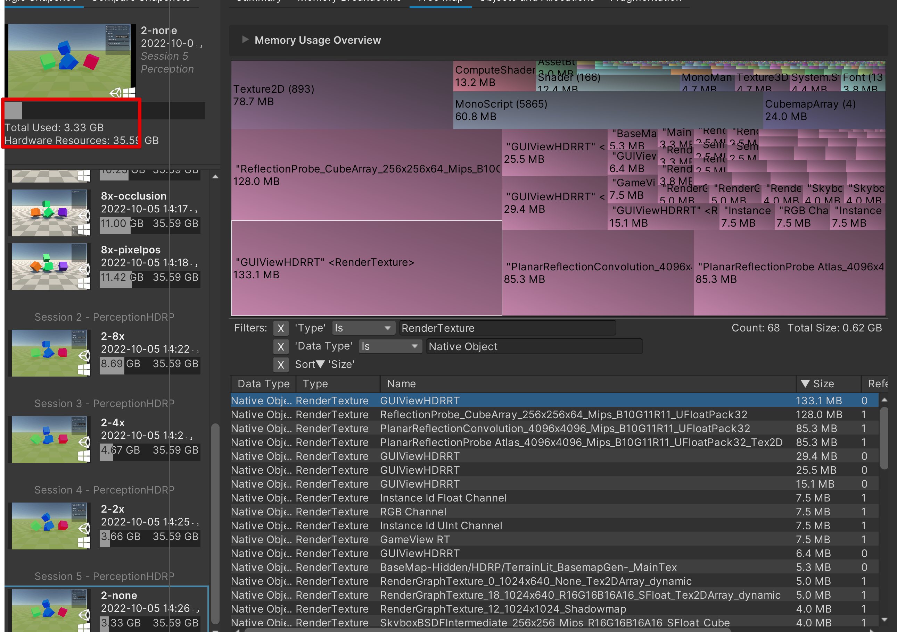
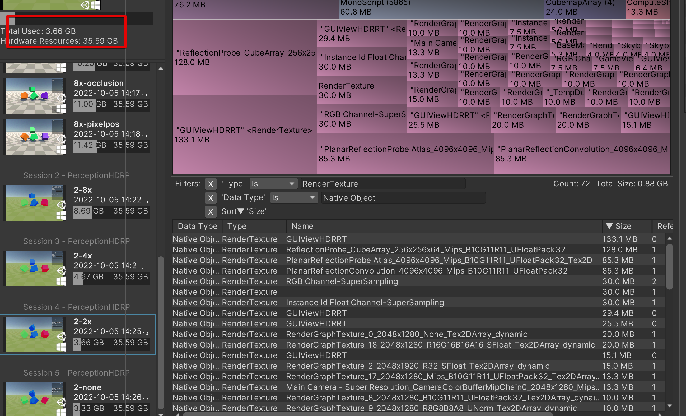
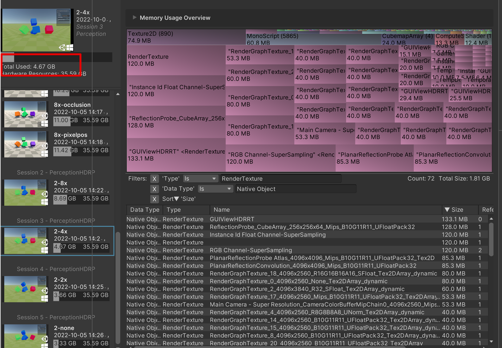
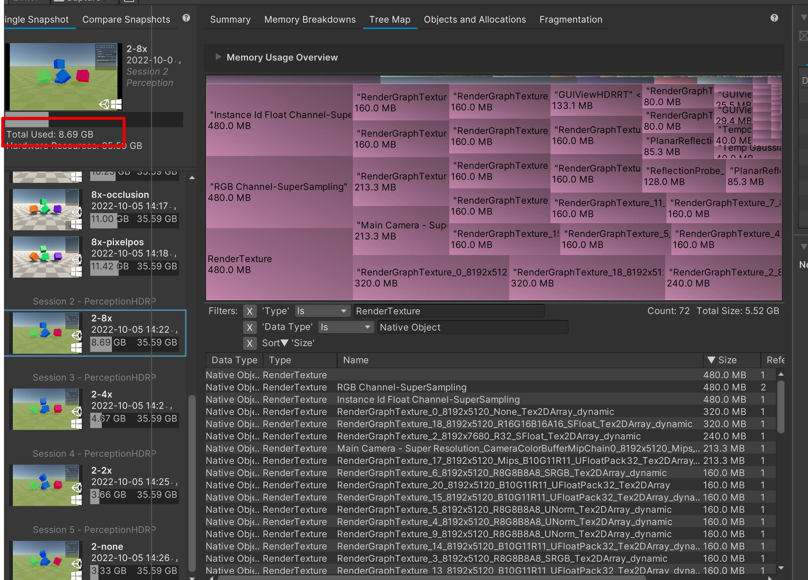

# Super Sampling

The `Super Sampling Factor` field on this sensor informs the camera to capture images at 2, 4, or 8 times their original width and height (4, 16, or 64 times the resolution respectively) in order to perform a high quality super sampling anti-aliasing (SSAA) effect.

## Memory Usage

Examples of the RAM memory used by render textures reqired for Perception to work, based on different Super Sampling scales.

   <i>Initial project memory usage</i>

   <i>2x Super Sampling project memory usage</i>

   <i>4x Super Sampling project memory usage</i>

   <i>8x Super Sampling project memory usage</i>

## Performance

The bigger render textures are in the project, the longer it will take to generate a frame.
Read about draw calls [HERE](https://docs.unity3d.com/Manual/optimizing-draw-calls.html)

## Labelers affected by Super Sampling
* Instance Segmentation Labeler
* Semantic Segmentation Labeler
* Depth Labeler
* Occlusion Labeler
* Normal Labeler
* Pixel position Labeler

This means: the bigger Super Sampling scale selected - more memory will be required for these labelers to work.