# 🔸 Phase 1: Setup and Basic Randomizations

In this phase of the Perception Synthetic Data Tutorial, you will start by downloading and installing Unity Editor and the Perception package. You will then use our sample assets and provided components to easily generate a synthetic dataset for training an object-detection model.

Throughout the tutorial, lines starting with **"🟢 Action:"** denote the actions you will need to perform in order to progress through the tutorial. The rest of the text will provide additional context and explanation around the actions. If in a hurry, you can just follow the actions!

## Table of Contents

- [Step 1: Download Unity Editor and Create a New Project](#step-1)
- [Step 2: Download the Perception Package and Import Samples](#step-2)
- [Step 3: Setup a Scene for Your Perception Simulation](#step-3)
- [Step 4: Specify Ground-Truth and Set Up Object Labels](#step-4)
- [Step 5: Set Up Background Randomizers](#step-5)
- [Step 6: Set Up Foreground Randomizers](#step-6)
- [Step 7: Inspect Generated Synthetic Data](#step-7)
- [Step 8: Explore and Visualize Your Dataset](#step-8)

> ℹ️ If you face any issues while following this tutorial, please create a post on the **[Unity Computer Vision Forum](https://forum.unity.com/forums/computer-vision.626/)** or the **[GitHub Issues Page](https://github.com/Unity-Technologies/com.unity.perception/issues)** and include as much detail as possible.

## <a name="step-1">Step 1: Download Unity Editor and Create a New Project</a>

- **🟢 Action**: Navigate to the [**Unity Hub Download**](https://unity3d.com/get-unity/download) page, click on **Download Unity Hub**, and install the application.

Unity Hub is a standalone application that streamlines the way you find, download, and manage your Unity Projects and Unity Editor installations. With the Unity Hub, you have a centralized interface of all your Unity projects along with which Editor versions they target and the platforms for which they can create builds.

>:information_source: The installations provided here are intended for Unity Hub version 3.3.0. Other versions provide similar functionality but may have substantially different UI.  

- **🟢 Action**: After installing Unity Hub, navigate to the [**Unity Download Archives**](https://unity3d.com/get-unity/download/archive) page. Download and install the latest version of **Unity Editor 2021.3.x** by clicking on the **Unity Hub** button to the right of the version number.

>:information_source: This tutorial was prepared with Unity 2021.3.11f1. Other versions of Unity 2021.3 may have minor differences.  

During the installation of Unity, you will be asked to choose which modules you would like to include. There is also an option to install _**Visual Studio**_. We recommend enabling this option if you do not already have a development environment that can attach to Unity for debugging. We will write some simple C# code in Phase 2 of this tutorial.

- **🟢 Action**: If desired, enable the option to install _**Visual Studio**_ when selecting modules during installation.

When you first run Unity, you will be asked to open an existing project or create a new one.

- **🟢 Action**: Open Unity and create a new **3D (HDRP)** project (You may need to download the HDRP template). Name your new project _**Perception Tutorial**_, and specify the desired location as shown below.

  	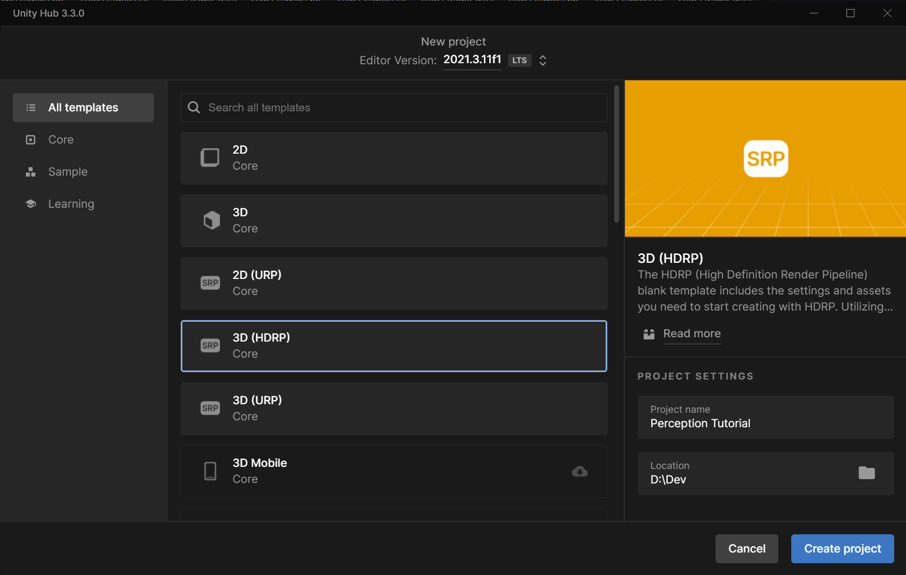

 

>:information_source: Perception only supports HDRP and will not work in URP or legacy projects!  

## <a name="step-2">Step 2: Download the Perception Package and Import Samples</a>

Once your new project is created and loaded, you will be presented with the Unity Editor interface. From this point on, whenever we refer to _**the editor**_, we mean the Unity Editor.

- **🟢 Action**: Close the **HDRP Wizard** window if it is displayed.

- **🟢 Action**: From the top menu bar, open _**Window → Package Manager**_.

As the name suggests, the _**Package Manager**_ is where you can download new, update, or remove Unity packages. It also provides information about each package such as description, links to documentation and changelog, sample assets, etc.

- **🟢 Action**: Click on the plus (**+**) sign at the top-left corner of the _**Package Manager**_ window and then choose the option _**Add package from git URL...**_.
- **🟢 Action**: Enter the address `com.unity.perception` and click _**Add**_.

> ℹ️ If you would like to install a specific version of the package, you can append the version to the end of the url. For example `com.unity.perception@0.11.0-preview.1`. For this tutorial, **we do not need to add a version**. You can also install the package from a local clone of the Perception repository. More information on installing local packages is available [here](https://docs.unity3d.com/Manual/upm-ui-local.html).

It will take some time for the manager to download and import the package. Once the operation finishes, you may receive a pop-up error about the version of the Burst package. Dismiss the pop-up. 

You will then see the newly downloaded Perception package automatically selected in the _**Package Manager**_.

Each package can come with a set of samples. As seen in the righthand panel, one of the bundles is named _**Tutorial Files**_, which will be required for completing this tutorial. It consists of some generic foreground and background objects, randomizers, shaders, and other elements needed for this tutorial. **Foreground** objects are those that the eventual machine learning model will try to detect. While **Background** objects will be placed in the background as distractors for the model.

- **🟢 Action**: In the _**Package Manager**_ window, from the list of _**Samples**_ for the Perception package, click on the _**Import**_ button for the bundle named _**Tutorial Files**_.

Once the sample files are imported, they will be placed inside the `Assets/Samples/Perception/<Perception Package Version>/Tutorial Files` folder in your Unity project. You can view your project's folder structure and access your files from the _**Project**_ tab of the editor, as seen in the image below (the package version should match the version you downloaded):

  	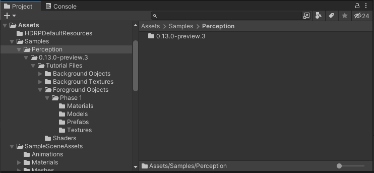

### <a name="step-3">Step 3: Setup a Scene for Your Perception Simulation</a> 

In Unity, Scenes contain any object that exists in the world. This world can be a game, or in our case, a perception-oriented simulation. Every new project contains a Scene named `SampleScene`, which is automatically opened when the project is created. This Scene comes with several objects and settings that we do not need, so let's create a new one.

- **🟢 Action**: In the _**Project**_ tab, right-click on the `Assets/Scenes` folder and click _**Create → Scene**_. Name this new Scene `TutorialScene` and **double-click on it to open it**.

The _**Hierarchy**_ tab of the editor displays all the Scenes currently loaded, and all the objects currently present in each loaded Scene, as shown below:

	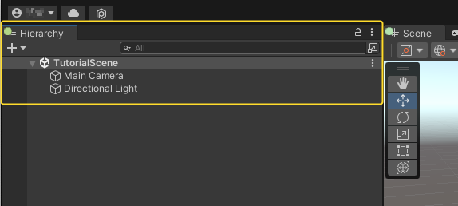

As seen above, the new Scene already contains a camera (`Main Camera`) and a light (`Directional Light`). We will now modify the camera's field of view and position to prepare it for the tutorial.

- **🟢 Action**: Click on `Main Camera` and in the _**Inspector**_ tab, make sure the camera's `Position`, `Rotation`, `Projection`, and `Field of View` match the screenshot below.

	

For this tutorial, we prefer our light to not cast any shadows, therefore:

- **🟢 Action**: Click on `Directional Light` and in the _**Inspector**_ tab, set `Shadow Type` to `No Shadows`.

We will now add the necessary components to the camera in order to equip it for the Perception workflow. To do this, we need to add a `Perception Camera` component to it. We can then define which types of ground-truth (such as bounding boxes, segmentation, etc.) we wish to generate using this camera.

- **🟢 Action**: Select `Main Camera` again and in the _**Inspector**_ tab, click on the _**Add Component**_ button.
- **🟢 Action**: Start typing `Perception Camera` in the search bar that appears, until the `Perception Camera` script is found, with a **[#]** icon to the left:

	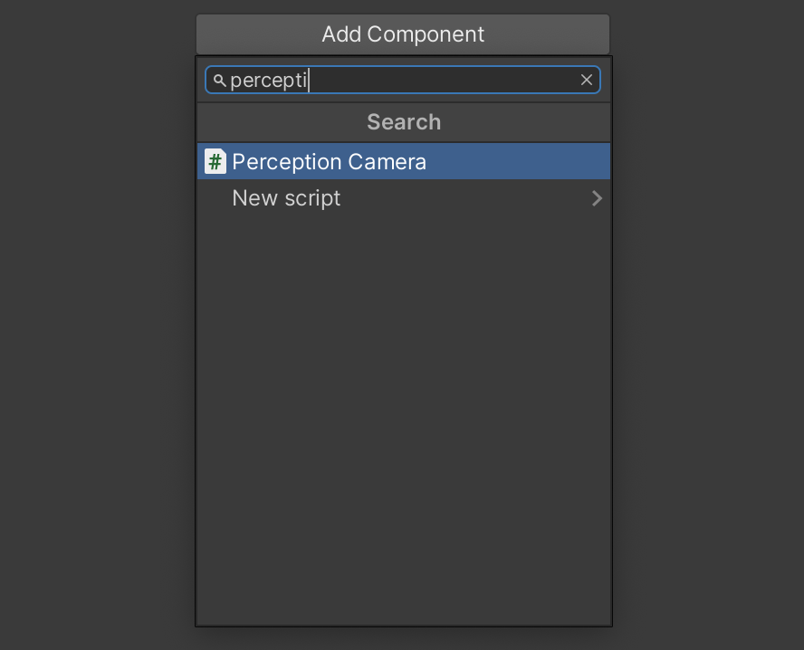

- **🟢 Action**: Click on this script to add it as a component. Your camera is now a `Perception` camera!

At the bottom of the Inspector UI, you may note a few error and warning messages. Let's fix these:

- **🟢 Action**: Open **Edit** -> **Project Settings** -> **Editor**, and disable **Asynchronous Shader Compilation**.

- **🟢 Action**: Search for and select the asset named `HDRP High Fidelity` in your project, and set **Lit Shader Mode** to **Both**.

>:information_source: By default, `HDRP High Fidelity` is used. If you plan to use other quality settings, make sure to apply the above fix in them too.

Adding components is the standard way in which objects can have various kinds of logic and data attached to them in Unity. This includes objects placed within the Scene (called `GameObjects`), such as the camera or directional light above, or objects outside of a Scene, in your project folders (called `Prefabs`).

The `Perception Camera` component comes with its own UI for modifying various aspects of synthetic frame generation and annotation, as well as adding or removing ground-truth. If you hover your mouse pointer over each of the fields shown below (e.g. `Simulation Delta Time`), you will see a tooltip popup with an explanation of what the item controls.

	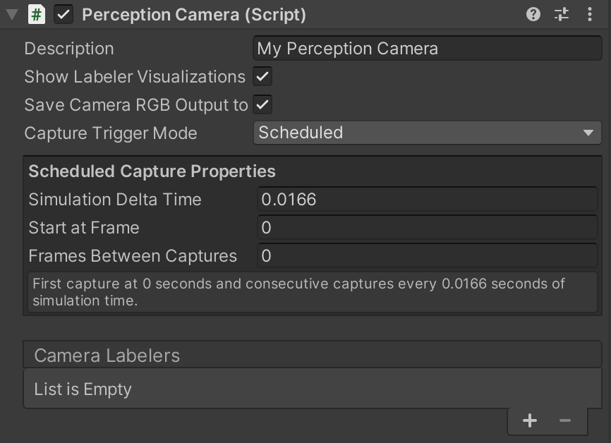

As seen in the UI for `Perception Camera`, the list of `Camera Labelers` is currently empty. For each type of ground-truth you wish to generate alongside your captured frames (e.g. 2D bounding boxes around objects), you will need to add a `Camera Labeler` to this list.

To speed up your workflow, the Perception package comes with several common Labelers for object-detection and human keypoint labeling tasks; however, if you are comfortable with C# code, you can also create your own custom labelers. The Labelers that come with the Perception package cover **keypoint labeling, 3D bounding boxes, 2D bounding boxes, object counts, object information (pixel counts and ids), instance segmentation, semantic segmentation, occlusion, depth, normals, and more.** For the full set of included labelers, take a look at the [Features](../Features/index.md) section. We will use four of these in this tutorial.

- **🟢 Action**: Click on the plus (_**+**_) button at the bottom right corner of the empty labeler list and select `BoundingBox2DLabeler`.
- **🟢 Action**: Repeat the above step to add `ObjectCountLabeler`, `RenderedObjectInfoLabeler`, `SemanticSegmentationLabeler`.

Once you add the Labelers, the _**Inspector**_ view of the `Perception Camera` component will look like this:

	

Some Labelers have the ability to display real-time visualizations while your simulation is running. For instance, the `BoundingBox2DLabeler` can display two-dimensional bounding boxes around the foreground objects that it is setup to track, and both segmentation Labelers can overlay transparent segmentation images on top of the camera's view. To enable the visualization feature, make sure the `Show Labeler Visualizations` checkmark is enabled.

## <a name="step-4">Step 4: Specify Ground-Truth and Set Up Object Labels</a>

It is now time to tell each Labeler added to the `Perception Camera` which objects it should label in the generated dataset. For instance, if your workflow is intended for generating ground-truth for detecting chairs, your Labelers would need to know that they should look for objects labeled "chair" within the scene. The chairs should in turn also be labeled "chair" in order to make them visible to the Labelers. We will now learn how to set up these configurations.

You will notice each added Labeler has a `Label Config` field. By adding a label configuration here you can instruct the Labeler to only look for objects with certain labels within the scene and ignore the rest. To do that, we first create label configurations.

- **🟢 Action**: In the _**Project**_ tab, right-click the `Assets` folder, then click _**Create → Perception → ID Label Config**_.

This will create a new asset file named `IdLabelConfig` inside the `Assets` folder.

- **🟢 Action**: Rename the newly created `IdLabelConfig` asset to `TutorialIdLabelConfig`.

Click on this asset to bring up its _**Inspector**_ view. In there, you can specify the labels that this config will keep track of. You can type in labels, add any labels defined in the project (through being added to prefabs), and import/export this label config as a JSON file. A new label config like the one we just created just contains an empty list of labels.

In this tutorial, we will generate synthetic data intended for detecting 10 everyday grocery items. These grocery items were imported into your project when you imported the tutorial files from the _**Package Manager**_, and are located in the folder `Assets/Samples/Perception/<Perception Package Version>/Tutorial Files/Foreground Objects/Phase 1/Prefabs`.

The label configuration we have created (`TutorialIdLabelConfig`) is of type `IdLabelConfig`, and is compatible with three of the four labelers we have attached to our `Perception Camera`. This type of label configuration associates each label with a unique numerical ID. However, `SemanticSegmentationLabeler` requires a different kind of label configuration which associates each label with a unique color instead of a numerical ID. This is because the output of this labeler is a set of images in which each visible foreground object is painted in a unique color.

- **🟢 Action**: In the _**Project**_ tab, right-click the `Assets` folder, then click _**Create → Perception → Semantic Segmentation Label Config**_. Name this asset `TutorialSemanticSegmentationLabelConfig`.

Now that you have created your label configurations, we need to assign them to Labelers that you previously added to your `Perception Camera` component.

- **🟢 Action**: Select the `Main Camera` object from the Scene _**Hierarchy**_, and in the _**Inspector**_ tab, assign the newly created `TutorialIdLabelConfig` to the first three Labelers. To do so, you can either drag and drop the former into the corresponding fields for each Labeler, or click on the small circular button in front of the `Id Label Config` field, which brings up an asset selection window filtered to only show compatible assets. Assign `TutorialSemanticSegmentationLabelConfig` to the fourth Labeler. The `Perception Camera` component will now look like the image below:

	

We can now assign labels to the objects that are supposed to be detected by an eventual object-detection model, and add those labels to both of the label configurations we have created. As mentioned above, these objects are located at `Assets/Samples/Perception/<Perception Package Version>/Tutorial Files/Foreground Objects/Phase 1/Prefabs`.

In Unity, Prefabs are essentially reusable GameObjects that are stored to disk, along with all their child GameObjects, components, and property values. Let's see what our sample prefabs include.

- **🟢 Action**: In the _**Project**_ tab, navigate to `Assets/Samples/Perception/<Perception_Package_Version>/Tutorial Files/Foreground Objects/Phase 1/Prefabs`
- **🟢 Action**: Double-click the file named `drink_whippingcream_lucerne.prefab` to open the Prefab asset.

When you open the Prefab asset, you will see the object shown in the Scene tab and its components shown on the right side of the editor, in the _**Inspector**_ tab:

	

The Prefab contains a number of components, including a [`Transform`](https://docs.unity3d.com/ScriptReference/Transform.html), a [`Mesh Filter`](https://docs.unity3d.com/ScriptReference/MeshFilter.html), a [`Mesh Renderer`](https://docs.unity3d.com/ScriptReference/MeshRenderer.html) and a **`Labeling`** component (highlighted in the image above). While the first three of these are common Unity components, the fourth one is specific to the Perception package and is used for assigning labels to objects. You can see here that the Prefab has one label already added, displayed in the list of `Added Labels`. The UI here provides a multitude of ways for you to assign labels to the object. You can either choose to have the asset automatically labeled (by enabling `Use Automatic Labeling`), or add labels manually. For automatic labeling, you can choose from a number of labeling schemes, e.g. the asset's name or folder name. If you go the manual route, you can type in labels, add labels from any label configuration in the project, or add from lists of suggested labels based on the Prefab's name and path.

Note that each object can have multiple labels assigned, and thus appear as different objects to Labelers with different label configurations. For instance, you may want your semantic segmentation Labeler to detect all cream cartons as `dairy_product`, while your Bounding Box Labeler still distinguishes between different types of dairy products. To achieve this, you can add a `dairy_product` label to all your dairy products, and then in your label configuration for semantic segmentation, only add the `dairy_product` label, and not any specific products or brand names.

For this tutorial, we have already prepared the foreground Prefabs for you and added the `Labeling` component to all of them. These Prefabs are created from 3D scans of the actual grocery items. If you are making your own Prefabs, you can easily add a `Labeling` component to them using the _**Add Component**_ button visible in the bottom right corner of the screenshot above.

> ℹ️ If you are interested in knowing more about the process of creating Unity compatible 3D models for use with the Perception package, you can visit [this page](https://github.com/Unity-Technologies/SynthDet/blob/master/docs/CreatingAssets.md). Once you have 3D models in `.fbx` format, the Perception package lets you quickly create Prefabs from multiple models. Just select all your models and from the top menu bar select _**Assets → Perception → Create Prefabs from Selected Models**_. The newly created Prefabs will be placed in the same folders as their corresponding models.

Even though the sample Prefabs already have a label manually added, to learn more about how to use the Labeling component, we will now use automatic labeling to label all our foreground objects. This will overwrite their manually added labels.

- **🟢 Action**: Select **all the files** inside the `Assets/Samples/Perception/<Perception Package Version>/Tutorial Files/Foreground Objects/Phase 1/Prefabs` folder.
- **🟢 Action**: From the _**Inspector**_ tab, enable `Use Automatic Labeling for All Selected Items`, and then select `Use asset name` as the labeling scheme.

	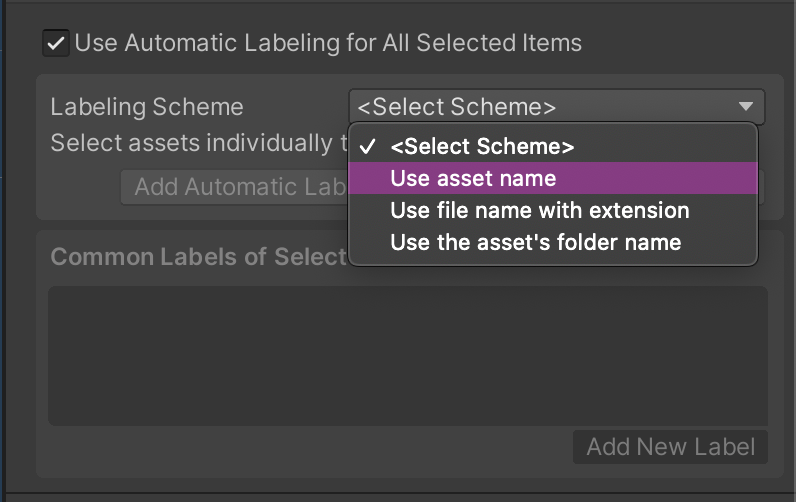

This will assign each of the selected Prefabs its own name as a label.

- **🟢 Action**: Click _**Add Automatic Labels of All Selected Assets to Config...**_.

In the window that opens, you can add all the automatic labels you just added to your Prefabs, to the label configurations you created earlier. At the top, there is a list of all the labels you are about to add, and below that, a list of all label configurations currently present in the project.

- **🟢 Action**: Add the list of labels to `TutorialIdLabelConfig` and `TutorialSemanticSegmentationLabelConfig` by clicking the _**Add All Labels**_ button for both.

	

Here, you can also open either of the configurations by clicking the _**Open**_ buttons. Open both configurations to make sure the list of labels has been added to them. They should now look similar to the screenshots below:

	

> ℹ️ Since we used automatic labels here and added them to our configurations, we are confident that the labels in the configurations match the labels of our objects. In cases where you decide to add manual labels to objects and configurations, make sure you use the exact same labels, otherwise, the objects for which a matching label is not found in your configurations will not be detected by the Labelers that are using those configurations.

Now that we have labeled all our foreground objects and set up our label configurations, let's briefly test things.

- **🟢 Action**: In the _**Project**_ tab, navigate to `Assets/Samples/Perception/<Perception Package Version>/Tutorial Files/Foreground Objects/Phase 1/Prefabs`.
- **🟢 Action**: Drag and drop any of the Prefabs inside this folder into the Scene Hierarchy. It will placed at the (0,0,0) position, which is visible to our camera.
- **🟢 Action**: Click on the play (**▷**) button located at the top middle section of the editor to run your simulation.

Since we have visualizations enabled on our `Perception Camera`, you should now see a bounding box being drawn around the object you put in the scene, and the object itself being colored according to its label's color in `TutorialSemanticSegmentationLabelConfig`, similar to the image below:

	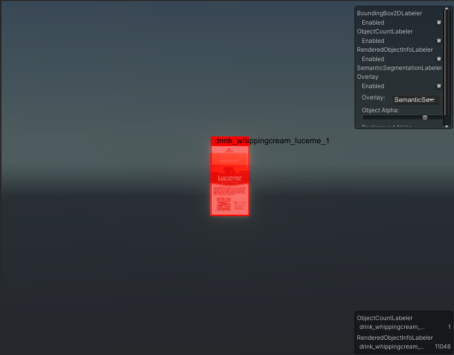

## <a name="step-5">Step 5: Set Up Background Randomizers</a>

As mentioned earlier, one of the core ingredients of the perception workflow is the randomization of various aspects of the simulation in order to introduce sufficient variation into the generated data.

To start randomizing your simulation you will first need to add a `Scenario` to your scene. Scenarios control the execution flow of your simulation by coordinating all `Randomizer` components added to them. The Perception package comes with a useful set of Randomizers that let you quickly place your foreground objects in the Scene, generate varied backgrounds, as well as randomize various parameters of the simulation over time such as position, scale, and rotation of objects, number of objects within the camera's view, and so on. Randomizers achieve this through coordinating a number of `Parameter`s, which essentially define the most granular randomization behaviors. For instance, for continuous variable types such as floats, vectors, and colors, Parameters can define the range and sampling distribution for randomization. While another class of Parameters let you randomly select one out of a number of categorical options. We will see examples of Randomizers with these two kinds of Parameters below.

To summarize, a sample `Scenario` could look like this:

	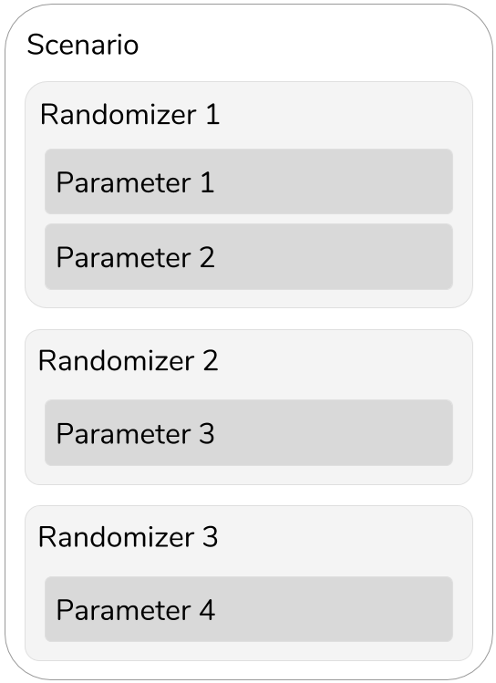

In this tutorial, you will learn how to use the provided Randomizers, as well as how to create new ones that are custom-fitted to your randomization needs.

- **🟢 Action**: Create a new GameObject in your Scene by right-clicking in the _**Hierarchy**_ tab and clicking `Create Empty`.
- **🟢 Action**: Rename your new GameObject to `Simulation Scenario`.
- **🟢 Action**: In the _**Inspector**_ view of this new object, add a new `Fixed Length Scenario` component.

Each `Scenario` executes a number of **Iteration**'s and each Iteration carries on for a number of frames. These are timing elements you can leverage in order to customize your Scenarios and the timing of your randomizations. You will learn how to configure Iterations and frames in Phase 2 of this tutorial. For now, we will use the `Fixed Length Scenario`, which is a special kind of Scenario that runs for a fixed number of frames during each Iteration. In our experience, this setup is sufficient for many common use-cases. Note that at any given time, you can have only one Scenario active in your Scene!

By default, the _**Inspector**_ view of `Fixed Length Scenario` should look like the following:

	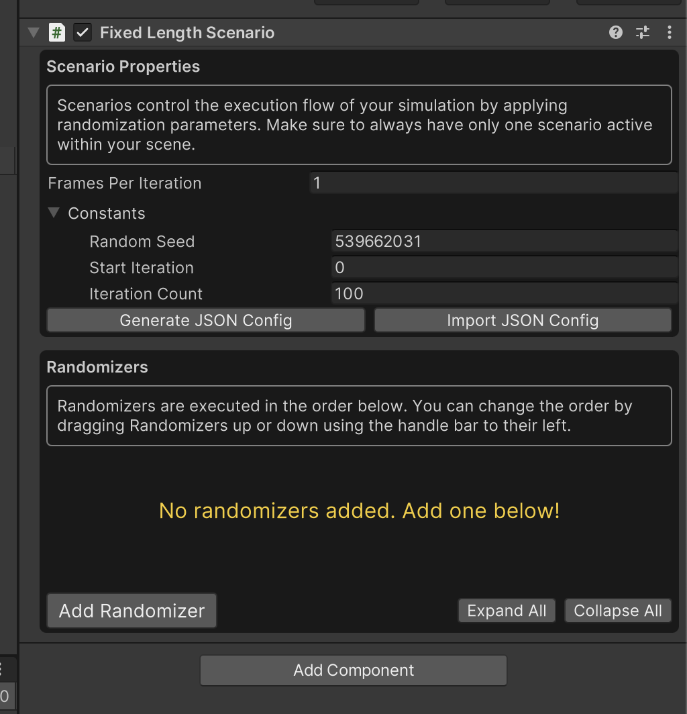

There are a number of settings and properties you can modify here. We can see here that the Scenario has been set to run for 100 Iterations, and that each Iteration will run for one frame. But this is currently an empty `Scenario`, so let's add some Randomizers.

- **🟢 Action**: Click _**Add Randomizer**_, and from the list choose `BackgroundObjectPlacementRandomizer`.

This Randomizer uses Poisson-Disk sampling to select random positions from a given area, and spawn copies of randomly selected Prefabs (from a given list) at the chosen positions. We will use this component to generate a background that will act as a distraction for our eventual object-detection machine learning model.

- **🟢 Action**: Click _**Add Folder**_, and from the file explorer window that opens, choose the folder `Assets/Samples/Perception/<Perception Package Version>/Tutorial Files/Background Objects/Prefabs`.

The background Prefabs are primitive shapes devoid of color or texture. Later Randomizers will take care of those aspects.

- **🟢 Action**: Set the rest of the properties according to the image below. That is, `Depth = 0, Layer Count = 2, Separation Distance = 0.5, Placement Area = (6,6)`.

	

- **🟢 Action**: Click on the **▷** (play) button located at the top middle section of the editor to run your simulation.

	

When the simulation starts running, Unity Editor will switch to the _**Game**_ tab to show you the output of the active camera, which carries the `Perception Camera` component:

	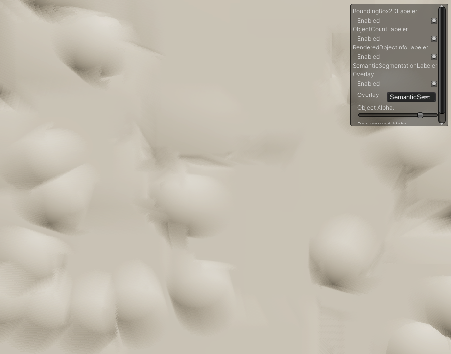

In the top right corner of the window, you can see a visualization control panel. You can enable or disable visualizations for individual Labelers using this panel. However, we have no labeled objects in the Scene yet, so no bounding boxes or semantic segmentation overlays will be visible.

Note that disabling visualizations for a Labeler does not affect your generated data. The annotations from all Labelers that are active before running the simulation will continue to be recorded and will appear in the output data.

To generate data as fast as possible, the simulation utilizes asynchronous processing to churn through frames quickly, rearranging and randomizing the objects in each frame. To be able to check out individual frames and inspect the real-time visualizations, click on the pause button (next to play). You can also switch back to the Scene view to be able to inspect each object individually. For performance reasons, it is recommended to disable visualizations altogether (from the _**Inspector**_ view of `Perception Camera`) once you are ready to generate a large dataset.

As seen in the image above, what we have now is just a beige-colored wall of shapes. This is because so far, we are only spawning some white shapes, and the warm color of our light is what gives them their this look. 

Additionally, the objects in the image are quite blurred. The effect you are observing here is motion blur, which happens because the placement Randomizer we used caches the instantiated objects from one Iteration to the next, and moves them to new locations on each Iteration instead of destroying them and creating new ones. This "motion" of the objects causes the motion blur effect to kick in.

HDRP projects have motion blur and a number of other post processing effects enabled by default. To disable motion blur or any other effect, follow these steps:

- **🟢 Action**: Create an empty GameObject in your Scene and add a Volume component to it.
- **🟢 Action**: Click _**New**_ next to the **Profile** field of the Volume to create and assign a new profile.
- **🟢 Action**: Click _**Add Override**_. Search for and select **Motion Blur**.
- **🟢 Action**: Enable **Intensity** and set its value to 0.

	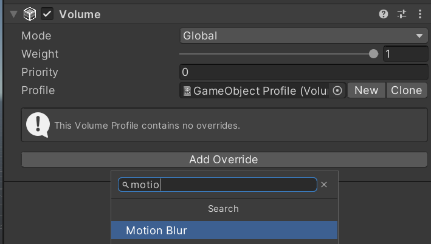

> ℹ️ If at this point you don't see any objects being displayed, make sure the Separation Distance for `BackgroundObjectPlacementRandomizer` is (6,6) and not (0,0).

> ℹ️ Your _**Game**_ tab may have a different field of view than the one shown here. We are using a **1280 x 960** resolution, which has a 4:3 aspect ratio. You can change the resolution or aspect ratio of your _**Game**_ view from the menu located at the top of the tab:

	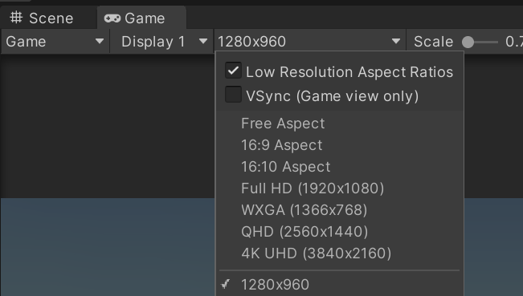

The purpose of the background layer in this project is to act as distraction in the learning process of the CV model. Thus, to make it more useful, we will further randomize it.

- **🟢 Action**: Repeat the previous steps to add `TextureRandomizer`, `HueOffsetRandomizer`, and `RotationRandomizer`.

`TextureRandomizer` will have the task of attaching random textures to our colorless background objects at each Iteration of the Scenario. Similarly, `HueOffsetRandomizer` will alter the color of the objects, and `RotationRandomizer` will give the objects a new random rotation each Iteration.

- **🟢 Action**: In the UI snippet for `TextureRandomizer`, click _**Add Folder**_ and choose `Assets/Samples/Perception/<Perception Package Version>/Tutorial Files/Background Textures`.

- **🟢 Action**: In the UI snippet for `RotationRandomizer`, verify that all the minimum values for the three ranges are `0` and that maximum values are `360`.

Your list of Randomizers should now look like the screenshot below:

	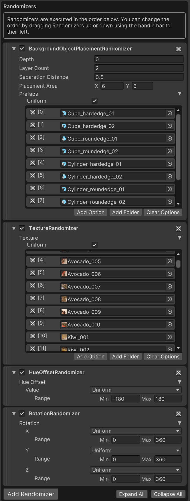

There is one more important thing left to do, in order to make sure all the above Randomizers operate as expected. Since `BackgroundObjectPlacementRandomizer` spawns objects, it already knows which objects in the Scene it is dealing with; however, the rest of the Randomizers we added are not yet aware of what objects they should target because they don't spawn their own objects.

To make sure each Randomizer knows which objects it should work with, we will use an object tagging and querying workflow that the bundled Randomizers already use. Each Randomizer can query the Scene for objects that carry certain types of `RandomizerTag` components. For instance, the `TextureRandomizer` queries the Scene for objects that have a `TextureRandomizerTag` component (you can change this in code!). Therefore, in order to make sure our background Prefabs are affected by the `TextureRandomizer` we need to make sure they have `TextureRandomizerTag` attached to them.

- **🟢 Action**: In the _**Project**_ tab, navigate to `Assets/Samples/Perception/<Perception Package Version>/Tutorial Files/Background Objects/Prefabs`.
- **🟢 Action**: Select all the files inside and from the _**Inspector**_ tab add a `TextureRandomizerTag` to them. This will add the component to all the selected files.
- **🟢 Action**: Repeat the above step to add `HueOffsetRandomizerTag` and `RotationRandomizerTag` to all selected Prefabs.

Once the above step is done, the _**Inspector**_ tab for a background Prefab should look like this:

	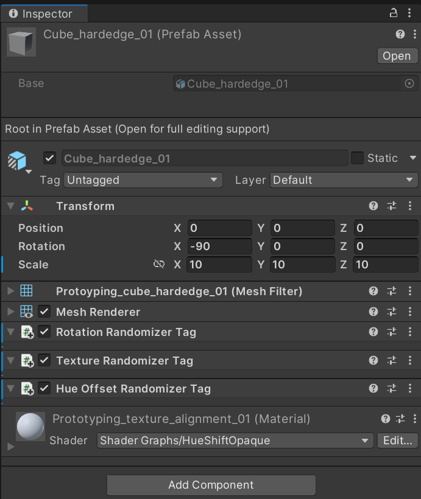

If you run the simulation now you will see the generated backgrounds look much more colourful and distracting!

	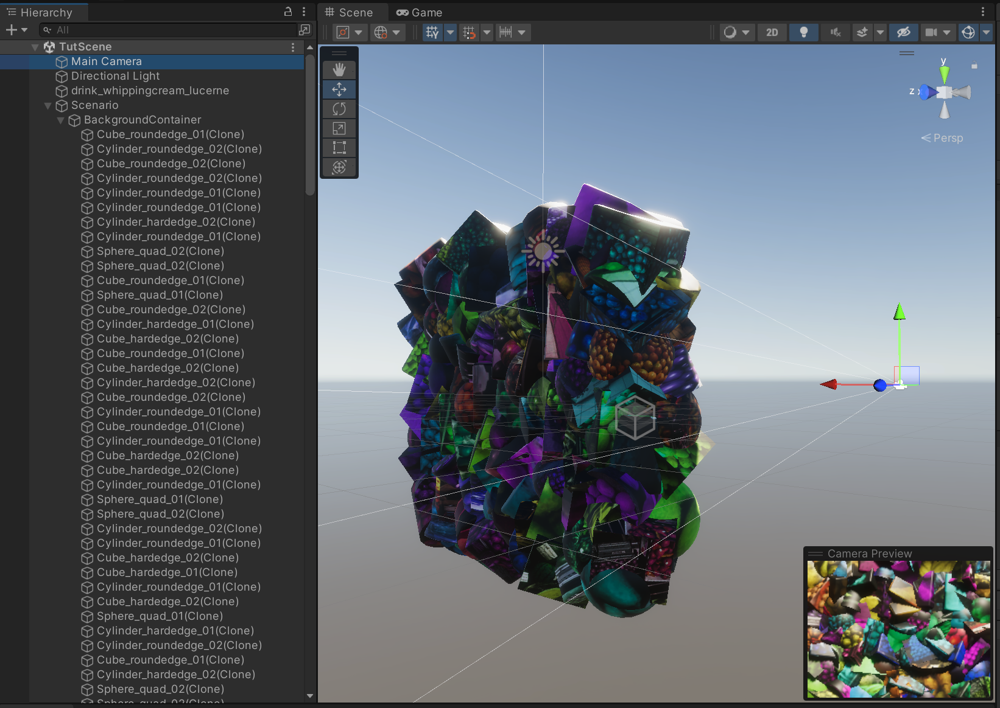

## <a name="step-6">Step 6: Set Up Foreground Randomizers</a>.

It is now time to spawn and randomize our foreground objects.

- **🟢 Action**: Add `ForegroundObjectPlacementRandomizer` to your list of Randomizers. Click _**Add Folder**_ and select `Assets/Samples/Perception/<Perception Package Version>/Tutorial Files/Foreground Objects/Phase 1/Prefabs`.
- **🟢 Action**: Set these values for the above Randomizer: `Depth = -3, Separation Distance = 1.5, Placement Area = (5,5)`.

This Randomizer uses the same algorithm as the one we used for backgrounds; however, it is defined in a separate C# class because you can only have **one of each type of Randomizer added to your Scenario**. Therefore, this is our way of differentiating between how background and foreground objects are treated.

While the texture and color of the foreground objects will be constant during the simulation, we would like their rotation to be randomized similar to the background Prefabs. To achieve this:

- **🟢 Action**: From the _**Project**_ tab select all the foreground Prefabs located in `Assets/Samples/Perception/<Perception Package Version>/Tutorial Files/Foreground Objects/Phase 1/Prefabs`, and add a `RotationRandomizerTag` component to them.

Randomizers execute according to their order within the list of Randomizers added to your Scenario. If you look at the list now, you will notice that `ForegroundObjectPlacementRandomizer` is coming after `RotationRandomizer`, therefore, foreground objects will NOT be included in the rotation randomizations, even though they are carrying the proper RandomizerTag. To fix that:

- **🟢 Action**: Drag `ForegroundObjectPlacementRandomizer` using the striped handlebar (on its left side) and drop it above `RotationRandomizer`.

Your full list of Randomizers should now look like the screenshot below:

	

You are now ready to generate your first dataset. Our current setup will produce 100 frames of annotated captures.

- **🟢 Action**: Click Play (**▷**) again and this time let the simulation finish. This should take only a few seconds.

While the simulation is running, your _**Game**_ view will quickly generate frames similar to the gif below (note: visualization for `SemanticSegmentationLabeler` is disabled here):

	

## <a name="step-7">Step 7: Inspect Generated Synthetic Data</a>

By default, the dataset will be generated in the SOLO format. You can find the location of your data, and set the location of future datasets inside the project settings window. To achieve this:

- **🟢 Action**: Open the _**Project Settings**_ window, by selecting the menu `Edit → Project Settings`. Select `Perception` from the left panel. This will bring up the _**Perception Settings**_ pane.

	

- **🟢 Action**: Click _**Show Folder**_ to show and highlight the folder in your operating system's file explorer. Enter this folder.

In this folder, you will find a few types of data, depending on your `Perception Camera` settings. These can include:
- Logs
- JSON data
- RGB images (raw camera output) (if the `Save Camera Output to Disk` checkmark is enabled on `Perception Camera`)
- Semantic segmentation images (if the `SemanticSegmentationLabeler` is added and active on `Perception Camera`)

The output dataset includes information about the active sensors in the Scene (currently only one, which is an RGB camera), as well as the ground-truth generated by all active Labelers. The [SOLO Synthetic Dataset Schema](../Schema/SoloSchema.md) page provides a comprehensive explanation of the schema of this dataset. We strongly recommend having a look at the page once you have completed this tutorial.

- **🟢 Action**: To get a quick feel of how the data is stored, open the latest folder with a name starting with `solo` and open the `step0.frame_data.json` located in any `sequence.x` folder. This file contains the output from `BoundingBox2DLabeler`. The `captures` array contains information such as camera matrix, position, etc. about the sensor (RGB camera in this case) and the annotations made by `BoundingBox2DLabeler` for all visible objects defined in its label configuration. For each visible object, the annotations include:
* `labelId`: The numerical id assigned to this object's label in the Labeler's label configuration
* `labelName`: The object's label, e.g. `candy_minipralines_lindt`
* `instanceId`: Unique instance id of the object
* `origin`: Pixel coordinates of the top-left corner of the object's bounding box (measured from the top-left corner of the image)
* `dimension`: width and height of the object's bounding box

- **🟢 Action**: Browse around the file structure of the generated data. Review the JSON metadata and the images captured for the first annotated sequence and verify that the objects within them match your expectations.

 

To further analyze your dataset and verify statistics such as the number of objects in each frame and more, you can use [Pysolotools](pysolotools.md). Additionally, you can visualize your dataset using [Voxel51](pysolotools-fiftyone.md). Check out the linked pages for guides on how to use these tools on a SOLO dataset.

This concludes Phase 1 of the Perception Tutorial. In the next phase, we will dive a little bit into randomization code and learn how to build custom Randomizers!

### 👉 [Continue to Phase 2: Custom Randomizations](Phase2.md)
