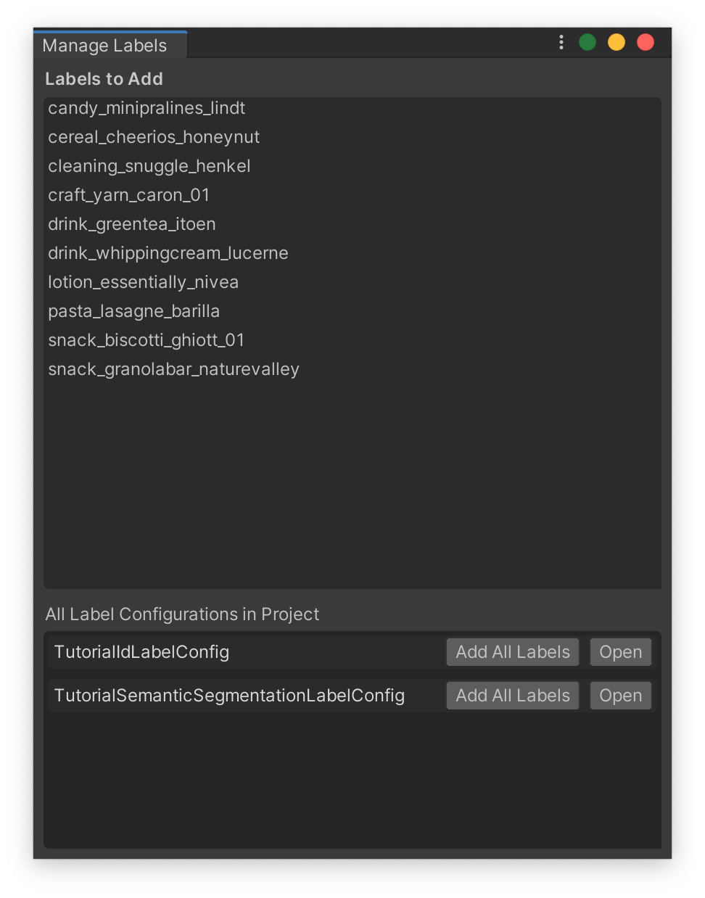
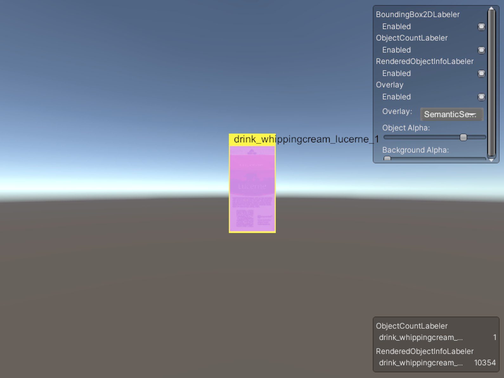
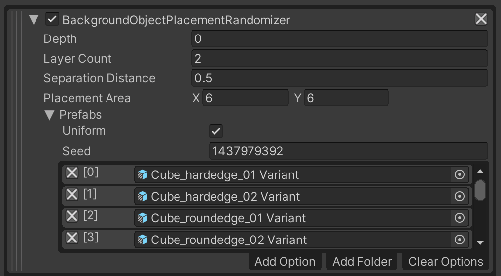

# Perception Tutorial
## Phase 1: Setup and Basic Randomizations

In this phase of the Perception tutorial, you will start from downloading and installing Unity Editor and the Perception package. You will then use our sample assets and provided components to easily generate a synthetic dataset for training an object-detection model. 

Through-out the tutorial, lines starting with bullet points followed by **":green_circle: Action:"** denote the individual actions you will need to perform in order to progress through the tutorial. This is while the rest of the text will provide additional context and explanation around the actions. If in a hurry, you can just follow the actions!

Steps included in this phase of the tutorial:

* [Step 1: Download Unity Editor and Create a New Project](#step-1)
* [Step 2: Download the Perception Package and Import Samples](#step-2)
* [Step 3: Setup a Scene for Your Perception Simulation](#step-3)
* [Step 4: Specify Ground-Truth and Set Up Object Labels](#step-4)
* [Step 5: Set Up Background Randomizers](#step-5)
* [Step 6: Set Up Foreground Randomizers](#step-6)
* [Step 7: Inspect Generated Synthetic Data](#step-7)
* [Step 8: Verify Data Using Dataset Insights](#step-8)

### <a name="step-1">Step 1: Download Unity Editor and Create a New Project</a> 
* **:green_circle: Action**: Navigate to [this](https://unity3d.com/get-unity/download/archive) page to download and install the latest version of **Unity Editor 2020.2.x**. (The tutorial has not yet been fully tested on newer versions.)

An alternative approach is to first install [_**Unity Hub**_](https://unity3d.com/get-unity/download), which will allow you to have multiple versions of Unity on your computer, and make it easier to manage your Unity projects and the versions of Unity they will use. 

During the installation of Unity, you will be asked to choose which modules you would like to include. This will depend on the types of applications you eventually intend to build with your Unity installation; however, for the purposes of this tutorial, we need to make sure _**Linux Build Support (Mono)**_ is checked (the IL2CPP option may be selected by default, but for this tutorial, we will need the Mono option). In addition, if you do not already have _**Visual Studio**_ on your computer, the wizard will give you an option to install it. Go ahead and check this option, as we will need _**Visual Studio**_ for writing some simple scripts in Phase 2 of the tutorial. 

* **:green_circle: Action**: Make sure the _**Linux Build Support (Mono)**_ and _**Visual Studio**_ installation options are checked when selecting modules during installation.

When you first run Unity, you will be asked to open an existing project, or create a new one. 

* **:green_circle: Action**: Open Unity and create a new project using the Universal Render Pipeline. Name your new project _**Perception Tutorial**_, and specify a desired location as shown below. 

### <a name="step-2">Step 2: Download the Perception Package and Import Samples</a> 

Once your new project is created and loaded, you will be presented with the Unity Editor interface. From this point on, whenever we refer to _**the editor**_, we mean Unity Editor.
* **:green_circle: Action**: From the top menu bar, open _**Window**_ -> _**Package Manager**_. 

As the name suggests, the _**Package Manager**_ is where you can download new packages, update or remove existing ones, and access a variety of information and additional actions for each package.

* **:green_circle: Action**: Click on the _**+**_ sign at the top-left corner of the _**Package Manager**_ window and then choose the option _**Add package from git URL...**_. 
* **:green_circle: Action**: Enter the address `com.unity.perception` and click _**Add**_.

> :information_source: If you would like to install a specific version of the package, you can append the version to the end of the url. For example `com.unity.perception@0.8.0-preview.1`. For this tutorial, **we do not need to add a version**. You can also install the package from a local clone of the Perception repository. More information on installing local packages is available [here](https://docs.unity3d.com/Manual/upm-ui-local.html).

It will take some time for the manager to download and import the package. Once the operation finishes, you will see the newly downloaded Perception package automatically selected in the _**Package Manager**_, as depicted below:

Each package can come with a set of samples. As seen in the righthand panel, the Perception package includes a sample named _**Tutorial Files**_, which will be required for completing this tutorial. The sample files consist of example foreground and background objects, Randomizer, shaders, and other useful elements to work with during this tutorial. **Foreground** objects are those that the eventual machine learning model will try to detect, and **background** objects will be placed in the background as distractors for the model.

* **:green_circle: Action**: In the _**Package Manager**_ window, from the list of _**Samples**_ for the Perception package, click on the _**Import**_ button for the sample named _**Tutorial Files**_.

Once the sample files are imported, they will be placed inside the `Assets/Samples/Perception` folder in your Unity project. You can view your project's folder structure and access your files from the _**Project**_ tab of the editor, as seen in the image below (the package version should match the version you downloaded):

* **:green_circle: Action**: **(For URP projects only)** The _**Project**_ tab contains a search bar; use it to find the file named `ForwardRenderer.asset`, as shown below:

* **:green_circle: Action**: **(For URP projects only)** Click on the found file to select it. Then, from the _**Inspector**_ tab of the editor, click on the _**Add Renderer Feature**_ button, and select _**Ground Truth Renderer Feature**_ from the dropdown menu:

This step prepares your project to render tailor-made images that will be later used for labeling the generated synthetic data.

### <a name="step-3">Step 3: Setup a Scene for Your Perception Simulation</a> 
Simply put, in Unity, Scenes contain any object that exists in the world. This world can be a game, or in this case, a perception-oriented simulation. Every new project contains a Scene named `SampleScene`, which is automatically opened when the project is created. This Scene comes with several objects and settings that we do not need, so let's create a new one. 

* **:green_circle: Action**: In the _**Project**_ tab, right-click on the `Assets/Scenes` folder and click _**Create -> Scene**_. Name this new Scene `TutorialScene` and **double-click on it to open it**. 

The _**Hierarchy**_ tab of the editor displays all the Scenes currently loaded, and all the objects currently present in each loaded Scene, as shown below:

As seen above, the new Scene already contains a camera (`Main Camera`) and a light (`Directional Light`). We will now modify the camera's field of view and position to prepare it for the tutorial. 

* **:green_circle: Action**: Click on `Main Camera` and in the _**Inspector**_ tab, make sure the camera's `Position`, `Rotation`, `Projection`, and `Field of View` match the screenshot below. 

For this tutorial, we prefer our light to not cast any shadows, therefore:

* **:green_circle: Action**: Click on `Directional Light` and in the _**Inspector**_ tab, set `Shadow Type` to `No Shadows`.

We will now add the necessary components to the camera in order to equip it for the Perception workflow. To do this, we need to add a `Perception Camera` component to it, and then define which types of ground-truth we wish to generate using this camera.

* **:green_circle: Action**: Select `Main Camera` again and in the _**Inspector**_ tab, click on the _**Add Component**_ button.
* **:green_circle: Action**: Start typing `Perception Camera` in the search bar that appears, until the `Perception Camera` script is found, with a **#** icon to the left:

* **:green_circle: Action**: Click on this script to add it as a component. Your camera is now a `Perception` camera.

> :information_source: You may now see a warning regarding asynchronous shader compilation in the UI for the `Perception Camera` component. To fix this issue, from the top menu bar go to _**Edit -> Project Settings… -> Editor**_ and under _**Shader Compilation**_ settings, disable _**Asynchronous Shader Compilation**_.

Adding components is the standard way in which objects can have various kinds of logic and data attached to them in Unity. This includes objects placed within the Scene (called GameObjects), such as the camera above, or objects outside of a Scene, in your project folders (called Prefabs).

The `Perception Camera` component comes with its own UI to modify various aspects of synthetic frame generation and annotation, as well as add or remove ground-truth 
labelers and labelling configurations:

If you hover your mouse pointer over each of the fields shown (e.g. `Simulation Delta Time`), you will see a tooltip popup with an explanation on what the item controls.

As seen in the UI for `Perception Camera`, the list of `Camera Labelers` is currently empty. For each type of ground-truth you wish to generate along-side your captured frames (e.g. 2D bounding boxes around objects), you will need to add a corresponding `Camera Labeler` to this list. 

To speed-up your workflow, the Perception package comes with five common labelers for object-detection tasks; however, if you are comfortable with code, you can also add your own custom labelers. The labelers that come with the Perception package cover **3D bounding boxes, 2D bounding boxes, object counts, object information (pixel counts and ids), and semantic segmentation images (each object rendered in a unique colour)**. We will use four of these in this tutorial.

* **:green_circle: Action**: Click on the _**+**_ button at the bottom right corner of the empty labeler list and select `BoundingBox2DLabeler`.
* **:green_circle: Action**: Repeat the above step to add `ObjectCountLabeler`, `RenderedObjectInfoLabeler`, `SemanticSegmentationLabeler`. 

Once you add the labelers, the _**Inspector**_ view of the `Perception Camera` component will look like this:

One of the useful features that comes with the `Perception Camera` component is the ability to display real-time visualizations of the labelers when your simulation is running. For instance, `BoundingBox2DLabeler` can display two-dimensional bounding boxes around the foreground objects that it tracks in real-time and `SemanticSegmentationLabeler` displays the semantic segmentation image overlaid on top of the camera's view. To enable this feature, make sure the `Show Labeler Visualizations` checkmark is enabled. 

### <a name="step-4">Step 4: Specify Ground-Truth and Set Up Object Labels</a> 

It is now time to tell each labeler added to the `Perception Camera` which objects it should label in the generated dataset. For instance, if your workflow is intended for generating frames and ground-truth for detecting chairs, your labelers would need to know that they should look for objects labeled "chair" within the scene. The chairs should in turn also be labeled "chair" in order to make them visible to the labelers. We will now learn how to set up these configurations.

You will notice each added labeler has a `Label Config` field. By adding a label configuration here you can instruct the labeler to look for certain labels within the scene and ignore the rest. To do that, we should first create label configurations.

* **:green_circle: Action**: In the _**Project**_ tab, right-click the `Assets` folder, then click _**Create -> Perception -> Id Label Config**_.

This will create a new asset file named `IdLabelConfig` inside the `Assets` folder. 

* **:green_circle: Action**: Rename the newly created `IdLabelConfig` asset to `TutorialIdLabelConfig`.

Click on this asset to bring up its _**Inspector**_ view. In there, you can specify the labels that this config will keep track of. You can type in labels, add any labels defined in the project (through being added to prefabs), and import/export this label config as a JSON file. A new label config like this one contains an empty list of labels.

In this tutorial, we will generate synthetic data intended for detecting 10 everyday grocery items. These grocery items were imported into your project when you imported the tutorial files from the _**Package Manager**_, and are located in the folder `Assets/Samples/Perception/0.8.0-preview.1/Tutorial Files/Foreground Objects/Phase 1/Prefabs`.

The label configuration we have created (`TutorialIdLabelConfig`) is of type `IdLabelConfig`, and is compatible with three of the four labelers we have attached to our `Perception Camera`. This type of label configuration carries a unique numerical ID for each label. However, `SemanticSegmentationLabeler` requires a different kind of label configuration which includes unique colors for each label instead of numerical IDs. This is because the output of this labeler is a set of images in which each visible foreground object is painted in a unique color.

* **:green_circle: Action**: In the _**Project**_ tab, right-click the `Assets` folder, then click _**Create -> Perception -> Semantic Segmentation Label Config**_. Name this asset `TutorialSemanticSegmentationLabelConfig`.

Now that you have created your label configurations, we need to assign them to labelers that you previously added to your `Perception Camera` component. 

* **:green_circle: Action**: Select the `Main Camera` object from the Scene _**Hierarchy**_, and in the _**Inspector**_ tab, assign the newly created `TutorialIdLabelConfig` to the first three labelers. To do so, you can either drag and drop the former into the corresponding fields for each labeler, or click on the small circular button in front of the `Id Label Config` field, which brings up an asset selection window filtered to only show compatible assets. Assign `TutorialSemanticSegmentationLabelConfig` to the fourth labeler. The `Perception Camera` component will now look like the image below:

It is now time to assign labels to the objects that are supposed to be detected by an eventual object-detection model, and add those labels to both of the label configurations we have created. As mentioned above, these objects are located at `Assets/Samples/Perception/0.8.0-preview.1/Tutorial Files/Foreground Objects/Phase 1/Prefabs`. 

In Unity, Prefabs are essentially reusable GameObjects that are stored to disk, along with all their child GameObjects, components, and property values. Let's see what our sample prefabs include.

* **:green_circle: Action**: In the _**Project**_ tab, navigate to `Assets/Samples/Perception/0.8.0-preview.1/Tutorial Files/Foreground Objects/Phase 1/Prefabs`
* **:green_circle: Action**: Double click the file named `drink_whippingcream_lucerne.prefab` to open the Prefab asset. 

When you open the Prefab asset, you will see the object shown in the Scene tab and its components shown on the right side of the editor, in the _**Inspector**_ tab:

The Prefab contains a number of components, including a `Transform`, a `Mesh Filter`, a `Mesh Renderer` and a `Labeling` component (highlighted in the image above). While the first three of these are common Unity components, the fourth one is specific to the Perception package, and is used for assigning labels to objects. You can see here that the Prefab has one label already added, displayed in the list of `Added Labels`. The UI here provides a multitude of ways for you to assign labels to the object. You can either choose to have the asset automatically labeled (by enabling `Use Automatic Labeling`), or add labels manually. In case of automatic labeling, you can choose from a number of labeling schemes, e.g. the asset's name or folder name. If you go the manual route, you can type in labels, add labels from any of the label configurations included in the project, or add from lists of suggested labels based on the Prefab's name and path. 

Note that each object can have multiple labels assigned, and thus appear as different objects to labelers with different label configurations. For instance, you may want your semantic segmentation labeler to detect all cream cartons as `dairy_product`, while your bounding box labeler still distinguishes between different types of dairy product. To achieve this, you can add a `dairy_product` label to all your dairy products, and then in your label configuration for semantic segmentation, only add the `dairy_product` label, and not any specific products or brand names.

For this tutorial, we have already prepared the foreground Prefabs for you and added the `Labeling` component to all of them. These Prefabs were based on 3D scans of the actual grocery items. If you are making your own Prefabs, you can easily add a `Labeling` component to them using the _**Add Component**_ button visible in the bottom right corner of the screenshot above.

> :information_source: If you are interested in knowing more about the process of creating Unity compatible 3D models for use with the Perception package, you can visit [this page](https://github.com/Unity-Technologies/SynthDet/blob/master/docs/CreatingAssets.md). Once you have 3D models in `.fbx` format, the Perception package lets you quickly create Prefabs from multiple models. Just select all your models and from the top menu bar select _**Assets -> Perception -> Create Prefabs from Selected Models**_. The newly created Prefabs will be placed in the same folders as their corresponding models.

Even though the sample Prefabs already have a label manually added, to learn more about how to use the Labeling component, we will now use automatic labeling to label all our foreground objects. This will overwrite their manually added labels.

* **:green_circle: Action**: Select **all the files** inside the `Assets/Samples/Perception/0.8.0-preview.1/Tutorial Files/Foreground Objects/Phase 1/Prefabs` folder.
* **:green_circle: Action**: From the _**Inspector**_ tab, enable `Use Automatic Labeling for All Selected Items`, and then select `Use asset name` as the labeling scheme.

This will assign each of the selected Prefabs its own name as a label.

* **:green_circle: Action**: Click _**Add Automatic Labels of All Selected Assets to Config...**_.

In the window that opens, you can add all the automatic labels you just added to your Prefabs, to the label configurations you created earlier. At the top, there is a list of all the labels you are about to add, and below that, a list of all label configurations currently present in the project. 

* **:green_circle: Action**: Add the list of labels to `TutorialIdLabelConfig` and `TutorialSemanticSegmentationLabelConfig` by clicking the _**Add All Labels**_ button for both.

Here, you can also open either of the configurations by clicking the _**Open**_ buttons. Open both configurations to make sure the list of labels has been added to them. They should now look similar to the screenshots below:

> :information_source: Since we used automatic labels here and added them to our configurations, we are confident that the labels in the configurations match the labels of our objects. In cases where you decide to add manual labels to objects and configurations, make sure you use the exact same labels, otherwise, the objects for which a matching label is not found in your configurations will not be detected by the labelers that are using those configurations.

Now that we have labelled all our foreground objects and setup our label configurations, let's briefly test things.

* **:green_circle: Action**: In the _**Project**_ tab, navigate to `Assets/Samples/Perception/0.8.0-preview.1/Tutorial Files/Foreground Objects/Phase 1/Prefabs`.
* **:green_circle: Action**: Drag and drop any of the Prefabs inside this folder into the Scene.
* **:green_circle: Action**: Click on the **▷** (play) button located at the top middle section of the editor to run your simulation.

Since we have visualizations enabled on our `Perception Camera`, you should now see a bounding box being drawn around the object you put in the scene, and the object itself being colored according to its label's color in `TutorialSemanticSegmentationLabelConfig`, similar to the image below:

### <a name="step-5">Step 5: Set Up Background Randomizers</a> 

As mentioned earlier, one of the core ingredients of the perception workflow is the randomization of various aspects of the simulation, in order to introduce sufficient variation into the generated data. 

To start randomizing your simulation you will first need to add a `Scenario` to your scene. Scenarios control the execution flow of your simulation by coordinating all `Randomizer` components added to them. The Perception package comes with a useful set of Randomizers that let you quickly place your foreground objects in the Scene, generate varied backgrounds, as well as randomize various parameters of the simulation over time, including things such as position, scale, and rotation of objects, number of objects within the camera's view, and so on. Randomizers achieve this through coordinating a number of `Parameter`s, which essentially define the most granular randomization behaviors. For instance, for continuous variable types such as floats, vectors, and colors, Parameters can define the range and sampling distribution for randomization. This is while another class of Parameters let you randomly select one out of a number of categorical options.  

To summarize, a sample `Scenario` could look like this:

In this tutorial, you will learn how to use the provided Randomizers, as well as how to create new ones that are custom-fitted to your randomization needs.

* **:green_circle: Action**: Create a new GameObject in your Scene by right-clicking in the _**Hierarchy**_ tab and clicking `Create Empty`.
* **:green_circle: Action**: Rename your new GameObject to `Simulation Scenario`.
* **:green_circle: Action**: In the _**Inspector**_ view of this new object, add a new `Fixed Length Scenario` component. 

Each `Scenario` executes a number of `Iteration`s, and each Iteration carries on for a number of frames. These are timing elements you can leverage in order to customize your Scenarios and the timing of your randomizations. You will learn how to use Iterations and frames in Phase 2 of this tutorial. For now, we will use the `Fixed Length Scenario`, which is a special kind of Scenario that runs for a fixed number of frames during each Iteration, and is sufficient for many common use-cases. Note that at any given time, you can have only one Scenario active in your Scene. 

The _**Inspector**_ view of `Fixed Length Scenario` looks like below:

There are a number of settings and properties you can modify here. `Quit On Complete` instructs the simulation to quit once this Scenario has completed executing. We can see here that the Scenario has been set to run for 100 Iterations, and that each Iteration will run for one frame. But this is currently an empty `Scenario`, so let's add some Randomizers.

* **:green_circle: Action**: Click _**Add Randomizer**_, and from the list choose `BackgroundObjectPlacementRandomizer`.

This Randomizer uses Poisson-Disk sampling to select random positions from a given area, and spawn copies of randomly selected Prefabs (from a given list) at the chosen positions. We will use this component to generate a background that will act as a distraction for our eventual object-detection machine learning model.

* **:green_circle: Action**: Click _**Add Folder**_, and from the file explorer window that opens, choose the folder `Assets/Samples/Perception/0.8.0-preview.1/Tutorial Files/Background Objects/Prefabs`.

The background Prefabs are primitive shapes devoid of color or texture. Later Randomizers will take care of those aspects. 

* **:green_circle: Action**: Set the rest of the properties according to the image below. That is, `Depth = 0, Layer Count = 2, Separation Distance = 0.5, Placement Area = (6,6)`.

* **:green_circle: Action**: Click on the **▷** (play) button located at the top middle section of the editor to run your simulation.

When the simulation starts running, Unity Editor will switch to the _**Game**_ tab to show you the output of the active camera, which carries the `Perception Camera` component:

In this view, you will also see the real-time visualizations we discussed before shown on top of the camera's view. In the top right corner of the window, you can see a visualization control panel, through which you can enable or disable visualizations for individual labelers. That said, we currently have no foreground objects in the Scene yet, so no bounding boxes or semantic segmentation overlays will be displayed.

Note that disabling visualizations for a labeler does not affect your generated data. The annotations from all labelers that are active before running the simulation will continue to be recorded and will appear in the output data.

To generate data as fast as possible, the simulation utilizes asynchronous processing to churn through frames quickly, rearranging and randomizing the objects in each frame. To be able to check out individual frames and inspect the real-time visualizations, click on the pause button (next to play). You can also switch back to the Scene view to be able to inspect each object individually. For performance reasons, it is recommended to disable visualizations altogether (from the _**Inspector**_ view of `Perception Camera`) once you are ready to generate a large dataset.

As seen in the image above, what we have now is just a beige-colored wall of shapes. This is because so far, we are only spawning them, and the beige color of our light is what gives them their current look. To make this background more useful, let's add a couple more `Randomizers`. 

> :information_source: If at this point you don't see any objects being displayed, make sure the Separation Distance for `BackgroundObjectPlacementRandomizer` is (6,6) and not (0,0).

> :information_source: If your _**Game**_ tab has a different field of view than the one shown here, change the aspect ratio of your _**Game**_ tab to `4:3`, as shown below:

* **:green_circle: Action**: Repeat the previous steps to add `TextureRandomizer`, `HueOffsetRandomizer`, and `RotationRandomizer`.

`TextureRandomizer` will have the task of attaching random textures to our colorless background objects at each Iteration of the Scenario. Similarly, `HueOffsetRandomizer` will alter the color of the objects, and `RotationRandomizer` will give the objects a new random rotation each Iteration. 

* **:green_circle: Action**: In the UI snippet for `TextureRandomizer`, click _**Add Folder**_ and choose `Assets/Samples/Perception/0.8.0-preview.1/Tutorial Files/Background Textures`. 

* **:green_circle: Action**: In the UI snippet for `RotationRandomizer`, verify that all the minimum values for the three ranges are `0` and that maximum values are `360`. 

Your list of Randomizers should now look like the screenshot below:

There is one more important thing left to do, in order to make sure all the above Randomizers operate as expected. Since `BackgroundObjectPlacementRandomizer` spawns objects, it already knows which objects in the Scene it is dealing with; however, the rest of the Randomizers  we added are not yet aware of what objects they should target because they don't spawn their own objects.

To make sure each Randomizer knows which objects it should work with, we will use an object tagging and querying workflow that the bundled Randomizers already use. Each Randomizer can query the Scene for objects that carry certain types of `RandomizerTag` components. For instance, the `TextureRandomizer` queries the Scene for objects that have a `TextureRandomizerTag` component (you can change this in code!). Therefore, in order to make sure our background Prefabs are affected by the `TextureRandomizer` we need to make sure they have `TextureRandomizerTag` attached to them.

* **:green_circle: Action**: In the _**Project**_ tab, navigate to `Assets/Samples/Perception/0.8.0-preview.1/Tutorial Files/Background Objects/Prefabs`.
* **:green_circle: Action**: Select all the files inside and from the _**Inspector**_ tab add a `TextureRandomizerTag` to them. This will add the component to all the selected files.
* **:green_circle: Action**: Repeat the above step to add `HueOffsetRandomizerTag` and `RotationRandomizerTag` to all selected Prefabs.

Once the above step is done, the _**Inspector**_ tab for a background Prefab should look like this:

If you run the simulation now you will see the generated backgrounds look much more colourful and distracting!

### <a name="step-6">Step 6: Set Up Foreground Randomizers</a> 

It is now time to spawn and randomize our foreground objects.

* **:green_circle: Action**: Add `ForegroundObjectPlacementRandomizer` to your list of Randomizers. Click _**Add Folder**_ and select `Assets/Samples/Perception/0.8.0-preview.1/Tutorial Files/Foreground Objects/Phase 1/Prefabs`.
* **:green_circle: Action**: Set these values for the above Randomizer: `Depth = -3, Separation Distance = 1.5, Placement Area = (5,5)`.

This Randomizer uses the same algorithm as the one we used for backgrounds; however, it is defined in a separate C# class because you can only have **one of each type of Randomizer added to your Scenario**. Therefore, this is our way of differentiating between how background and foreground objects are treated.

While the texture and color of the foreground objects will be constant during the simulation, we would like their rotation to be randomized similar to the background Prefabs. To achieve this:

* **:green_circle: Action**: From the _**Project**_ tab select all the foreground Prefabs located in `Assets/Samples/Perception/0.8.0-preview.1/Tutorial Files/Foreground Objects/Phase 1/Prefabs`, and add a `RotationRandomizerTag` component to them.

Randomizers execute according to their order within the list of Randomizers added to your Scenario. If you look at the list now, you will notice that `ForegroundObjectPlacementRandomizer` is coming after `RotationRandomizer`, therefore, foreground objects will NOT be included in the rotation randomizations, even though they are carrying the proper RandomizerTag. To fix that:

* **:green_circle: Action**: Drag `ForegroundObjectPlacementRandomizer` using the striped handle bar (on its left side) and drop it above `RotationRandomizer`.

Your full list of Randomizers should now look like the screenshot below:

You are now ready to generate your first dataset. Our current setup will produce 100 frames of annotated captures.

* **:green_circle: Action** Click **▷** (play) again and this time let the simulation finish. This should take only a few seconds.

While the simulation is running, your _**Game**_ view will quickly generate frames similar to the gif below (note: visualization for `SemanticSegmentationLabeler` is disabled here):

### <a name="step-7">Step 7: Inspect Generated Synthetic Data</a> 

* **:green_circle: Action** Select `Main Camera` again to bring up its _**Inspector**_ view. You will now see a new section added to the `Perception Camera` component, with buttons for showing the latest dataset output folder and copying its path to clipboard. An example is shown below (Mac OS):

* **:green_circle: Action**: Click _**Show Folder**_ to show and highlight the folder in your operating system's file explorer. Enter this folder.

In this folder, you will find a few types of data, depending on your `Perception Camera` settings. These can include:
- Logs
- JSON data
- RGB images (raw camera output) (if the `Save Camera Output to Disk` check mark is enabled on `Perception Camera`)
- Semantic segmentation images (if the `SemanticSegmentationLabeler` is added and active on `Perception Camera`)

The output dataset includes a variety of information about different aspects of the active sensors in the Scene (currently only one), as well as the ground-truth generated by all active labelers. [This page](https://github.com/Unity-Technologies/com.unity.perception/blob/master/com.unity.perception/Documentation%7E/Schema/Synthetic_Dataset_Schema.md) provides a comprehensive explanation on the schema of this dataset. We strongly recommend having a look at the page once you have completed this tutorial.

* **:green_circle: Action**: To get a quick feel of how the data is stored, open the folder whose name starts with `Dataset`, then open the file named `captures_000.json`. This file contains the output from `BoundingBox2DLabeler`. The `captures` array contains the position and rotation of the sensor (camera), the position and rotation of the ego (sensor group, currently only one), and the annotations made by `BoundingBox2DLabeler` for all visible objects defined in its label configuration. For each visible object, the annotations include:
* `label_id`: The numerical id assigned to this object's label in the labeler's label configuration
* `label_name`: The object's label, e.g. `candy_minipralines_lindt`
* `instance_id`: Unique instance id of the object
* `x` and `y`: Pixel coordinates of the top-left corner of the object's bounding box (measured from the top-left corner of the image)
* `width` and `height` of the object's bounding box

* **:green_circle: Action**: Review the JSON meta-data and the images captured for the first annotated frame, and verify that the objects within them match. 

### <a name="step-8">Step 8: Verify Data Using Dataset Insights</a> 

To verify and analyze a variety of metrics for the generated data, such as number of foreground objects in each frame and degree of representation for each foreground object (label), we will now use Unity's Dataset Insights framework. This will involve running a Jupyter notebook which is conveniently packaged within a Docker file that you can download from Unity. 

* **:green_circle: Action**: Download and install [Docker Desktop](https://www.docker.com/products/docker-desktop)
* **:green_circle: Action**: Open a command line interface (Command Prompt on Windows, Terminal on Mac OS, etc.) and type the following command to run the Dataset Insights Docker image: 
`docker run -p 8888:8888 -v <path to synthetic data>:/data -t unitytechnologies/datasetinsights:latest`, where the path to data is what we looked at earlier. You can copy the path using the _**Copy Path**_ button in the `Perception Camera` UI.

> :information_source: If you get an error about the format of the command, try the command again **with quotation marks** around the folder mapping argument, i.e. `"<path to synthetic data>:/data"`.

This will download a Docker image from Unity. If you get an error regarding the path to your dataset, make sure you have not included the enclosing `<` and `>` in the path and that the spaces are properly escaped.

* **:green_circle: Action**: The image is now running on your computer. Open a web browser and navigate to `http://localhost:8888` to open the Jupyter notebook:

* **:green_circle: Action**: To make sure your data is properly mounted, navigate to the `data` folder. If you see the dataset's folders there, we are good to go.
* **:green_circle: Action**: Navigate to the `datasetinsights/notebooks` folder and open `Perception_Statistics.ipynb`.
* **:green_circle: Action**: Once in the notebook, remove the `/<GUID>` part of the `data_root = /data/<GUID>` path. Since the dataset root is already mapped to `/data`, you can use this path directly.

This notebook contains a variety of functions for generating plots, tables, and bounding box images that help you analyze your generated dataset. Certain parts of this notebook are currently not of use to us, such as the code meant for downloading data generated through Unity Simulation (coming later in this tutorial).

Each of the code blocks in this notebook can be executed by clicking on them to select them, and then clicking the _**Run**_  button at the top of the notebook. When you run a code block, an **asterisk (\*)** will be shown next to it on the left side, until the code finishes executing.

Below, you can see a sample plot generated by the Dataset Insights notebook, depicting the number of times each of the 10 foreground objects appeared in the dataset. As shown in the histogram, there is a high level of uniformity between the labels, which is a desirable outcome. 

* **:green_circle: Action**: Follow the instructions laid out in the notebook and run each code block to view its outputs.

This concludes Phase 1 of the Perception Tutorial. In the next phase, you will dive a little bit into randomization code and learn how to build your own custom Randomizer. 

**[Continue to Phase 2: Custom Randomizations](Phase2.md)**
