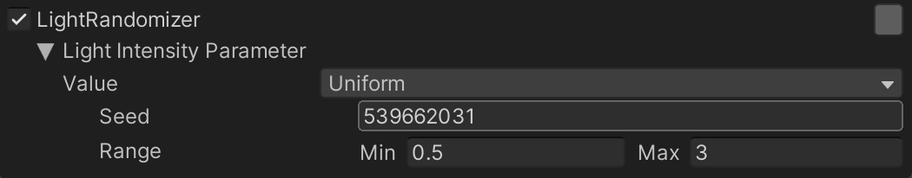
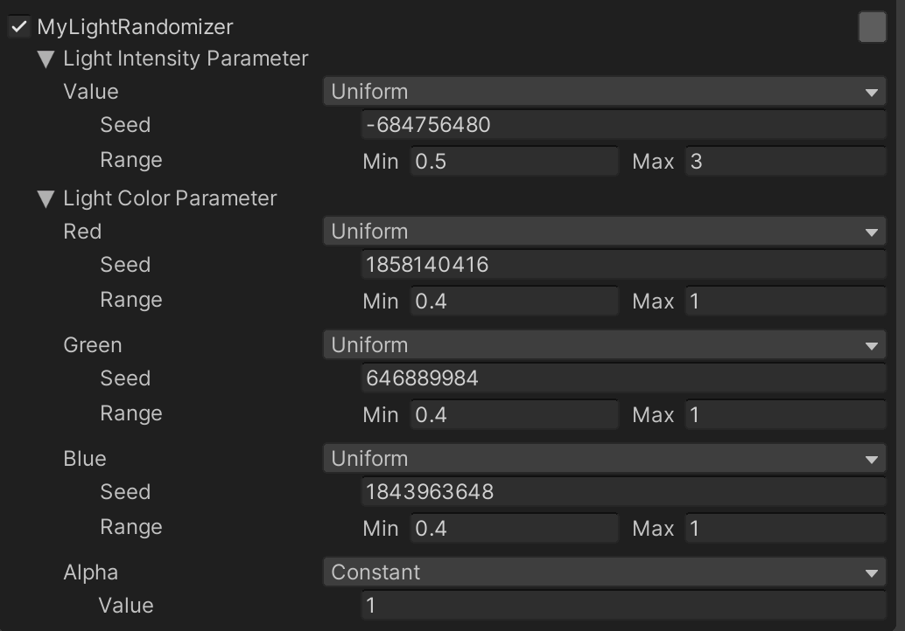
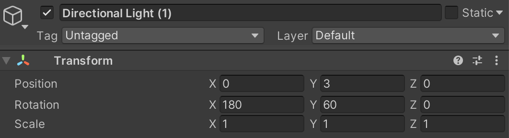

# Perception Tutorial
## Phase 2: Custom Randomizations

In Phase 1 of the tutorial, we learned how to use the Randomizers that are bundled with the Perception package to spawn background and foreground objects, and randomize their position, rotation, texture, and hue offset (color). In this phase, we will build a custom light Randomizer for the `Directional Light` object, affecting the light's intensity and color on each Iteration of the Scenario. We will also learn how to include certain data or logic inside a randomized object (such as the light) in order to more explicitly define and restrict its randomization behaviors.

Steps included this phase of the tutorial:
- [Step 1: Build a Lighting Randomizer](#step-1)
- [Step 2: Bundle Data and Logic Inside RandomizerTags](#step-2)

### <a name="step-1">Step 1: Build a Lighting Randomizer</a> 

We need to create two C# classes for our light randomization, `MyLightRandomizer` and `MyLightRandomizerTag`. The first of these will sample random values and assign them to the intensity and color of the light, and the second class will be the component that will be added to `Directional Light`, making it a target of `MyLightRandomizer`.

* **Action**: In the _**Project**_ tab, right-click on the `Scripts` folder and select _**Create -> C# Script**_. Name your new script file `MyLightRandomizer.cs`.
* **Action**: Create another script and name it `MyLightRandomizerTag.cs`.
* **Action**: Double-click `MyLightRandomizer.cs` to open it in _**Visual Studio**_.

Note that while _**Visual Studio**_ is the default option, you can choose any text editor of your choice. You can change this setting in _**Preferences -> External Tools -> External Script Editor**_.

* **Action**: Remove the contents of the class and copy/paste the code below:

```
using System;
using UnityEngine;
using UnityEngine.Experimental.Perception.Randomization.Parameters;
using UnityEngine.Experimental.Perception.Randomization.Randomizers;

[Serializable]
[AddRandomizerMenu("Perception/My Light Randomizer")]
public class MyLightRandomizer : Randomizer
{
    public FloatParameter lightIntensityParameter;

    protected override void OnIterationStart()
    {
        var taggedObjects = tagManager.Query<MyLightRandomizerTag>();

        foreach (var taggedObject in taggedObjects)
        {
            var light = taggedObject.GetComponent<Light>();            
            light.intensity = lightIntensityParameter.Sample();            
        }
    }
}
```

The purpose of this piece of code is to obtain a random float parameter and assign it to the light's `Intensity` field on the start of every Iteration. Let's go through the code above and understand each part. The `FloatParameter` field makes it possible for us to define a randomized float parameter and modify its properties from the editor UI, similar to how we already modified the properties for the previous Randomizers we used. 

**Note:** If you look at the _**Console**_ tab of the editor now, you will see an error regarding `MyLightRandomizerTag` not being found. This is to be expected, since we have not yet created this class; the error will go away once we create the class later.

If you return to your list of Randomizers in the _**Inspector**_ view of `SimulationScenario`, you can now add this new Randomizer.

* **Action**: Add `MyLightRandomizer` to the list of Randomizers in `SimulationScenario`.

You will notice that the Randomizer's UI snippet contains one Parameter named `Light Intensity Parameter`. This is the same Parameter we added in the code block above. Here, you can set the sampling distribution (`Value`), `Seed`, and `Range` for this float Parameter:

<p align="center">

</p>


* **Action**:  In the UI snippet for `MyLightRandomzier`, set the minimum and maximum for range to 0.5 and 3.

This range of intensities is arbitrary but will give us a typically nice lighting without excessive darkness or burnt-out highlights.

The `MyLightRandomizer` class extends `Randomizer`, which is the base class for all Randomizers that can be added to a Scenario. This base class provides a plethora of useful functions and properties that can help catalyze the process of creating new Randomizers.

The `OnIterationStart()` function is used for telling the Randomizer what actions to perform at the start of each Iteration of the Scenario. As seen in the code block, at the start of each Iteration, this class queries the `tagManager` object for all objects that carry the `MyLightRandomizerTag` component. Then, for each object inside the queried list, it first retrieves the `Light` component, and then sets its intensity to a new random float sampled from `lightIntensityParameter`. 

* **Action**: Open `MyLightRandomizerTag.cs` and replace its contents with the code below:

```
using UnityEngine;
using UnityEngine.Experimental.Perception.Randomization.Randomizers;

[AddComponentMenu("Perception/RandomizerTags/MyLightRandomizerTag")]
[RequireComponent(typeof(Light))]
public class MyLightRandomizerTag : RandomizerTag
{    
}

```

Yes, a RandomizerTag can be this simple if you just need it for helping Randomizers query for target objects. Later, you will learn how to add code here to encapsulate more data and logic within the randomized objects. 

Notice there is a `RequireComponent(typeof(Light))` line at the top. This line makes it so that you can only add the `MyLightRandomizerTag` component to an object that already has a `Light` component attached. This way, the Randomizers that query for this tag can be confident that the found objects have a `Light` component and can thus be Randomized.

* **Action**: Select `Directional Light` in the Scene's _**Hierarchy**_, and in the _**Inspector**_ tab, add a `My Light Randomizer Tag` component.
* **Action**: Run the simulation again and inspect how `Directional Light` now switches between different intensities. You can pause the simulation and then use the step button (to the right of the pause button) to move the simulation one frame forward and clearly see the varying light intensity

Let's now add more variation to our light by randomizing its color as well. 

* **Action**: Back inside `MyLightRandomizer.cs`, define a new `ColorRgbParameter`:

`public ColorRgbParameter lightColorParameter;`

* **Action**: Inside the code block that intensity was previously applied, add code for sampling color from the above Parameter and applying it:

```
foreach (var taggedObject in taggedObjects)
{
    var light = taggedObject.GetComponent<Light>();            
    light.intensity = lightIntensityParameter.Sample(); 
    light.color = lightColorParameter.Sample();           
}
```            

If you now check the UI snippet for `MyLightRandomizer`, you will notice that `Color Parameter` is added. This Parameter includes four separate randomized values for `Red`, `Green`, `Blue` and `Alpha`. Note that the meaningful range for all of these values is 0-1 (and not 0-255). You can see that the sampling range for red, green, and blue is currently also set to 0-1, which means the parameter covers a full range of colors. A color with (0,0,0) RGB components essentially emits no light. So, let's increase the minimum a bit to avoid such a scenario.

* **Action**: Increase the minimum value for red, green, and blue components to 0.4 (this is an arbitrary number that typically produces good-looking results).

Each value should also already have a unique `Seed` specified. This is the seed which the sampler will use to produce a random value from the specified distribution. If two random parameters have the same seed, range, and distribution, they will always have the same value. In the case of this color, this would lead to the red, green, and blue components having equal values, and thus the produced color always being a shade of grey. As such, in order to get varied colors and not just grey, we need to make sure the seed values are different for our red, green, and blue components. 

* **Action**: In the UI snippet for `MyLightRandomizer`, make sure the red, green, and blue components have different `Seed` values. Set the distribution and value for Alpha to `Constant` and 1, as we do not want to randomize the alpha component of the color.

The UI for `My Light Randomizer` should now look like this:

<p align="center">

</p>


* **Action**: Run the simulation for a few frames to observe the lighting color changing on each iteration.


### <a name="step-2">Step 2: Bundle Data and Logic Inside RandomizerTags</a> 


You may sometimes need to bundle certain randomization-related data or logic within an object that are inherent to the object itself. For instance, you may have multiple lights in the Scene but would like each of them to have their own unique range of intensities. It would be quite tedious to add a new Parameter to your light Randomizer for each of your lights. Furthermore, this would make your light Randomizer excessively tailored to one use-case, limiting the Randomizer's reusability. 

There are also cases where you may need to include certain logic within your object in order to make the Randomizer code more reusable and easier to maintain. For instance, you may want to build an office chair Prefab to use in various simulations. This chair is likely to support a range of customizations for its various parts (back angle, seat angle, seat height, etc.). Instead of directly mapping a Rotation Parameter from a Randomizer to the rotation of the back angle object within the chair, it might be more convenient to have the chair expose the range of possible angles in the form of a simple float between 0 and 1. With this approach, the Randomizer would only need to sample a float Parameter and assign it to the chair. The chair would in turn have a script attached that knows how to map this single float to a certain plausible back angle. You could even map this float to a more complex state of the chair. Your Randomizer would still only need one float Parameter.

Let's try this approach with our `Directional Light` object. We will create a duplicate of this light and then have the two lights use different ranges of intensity while both using the exact same float Parameter from `MyLightRandomizer.cs`.

* **Action**: Right-click on `Directional Light` in the Scene _**Hierarchy**_ and select _**Duplicate**_. The new light will automatically be named `Directional Light (1)`.
* **Action**: Change the Y rotation of `Directional Light (1)` to 60, as shown below:

<p align="center">

</p>

* **Action**: Change the Y rotation of `Directional Light` to -60.

This makes the two lights illuminate the scene from opposing angles, each having a 30-degree angle with the background and foreground planes. Note that the position of Directional Lights in Unity does not affect how they illuminate the scene, so you do not need to use the same position as the screenshot above.

* **Action**: Open `MyLightRandomizerTag.cs` and modify it to match the code below:
```
using UnityEngine;
using UnityEngine.Experimental.Perception.Randomization.Randomizers;

[AddComponentMenu("Perception/RandomizerTags/MyLightRandomizerTag")]
[RequireComponent(typeof(Light))]
public class MyLightRandomizerTag : RandomizerTag
{
    public float minIntensity;
    public float maxIntensity;

    public void SetIntensity(float rawIntensity)
    {
        var light = gameObject.GetComponent<Light>();        
        var scaledIntensity = rawIntensity * (maxIntensity - minIntensity) + minIntensity;
        light.intensity = scaledIntensity;        
    }
}

```
In the above code, we have created a new `SetIntensity` function that first scales the incoming intensity (assumed to be between 0 and 1) to our desired range and then assigns it to the light's intensity. The `Light` component is now fetched from the GameObject that this Randomizer tag is attached to. This works because both this tag component and the `Light` component are attached to the same object in the Scene (which is one of the lights). 

This component is already added to both our lights. We now need to set our desired minimum and maximum intensities, and this can be done through the _**Inspector**_ view.

* **Action**: Select `Directional Light` and from the **Inspector** UI for the `MyLightRandomizerTag` component, set `Min Intensity` to 0.5 and `Max Intensity` to 3.
* **Action**: Repeat the above step for `Directional Light (1)` and set `Min Intensity` to 0 and `Max Intensity` to 0.4.

Note that with this change, we fully transfer the responsibility for the light's intensity range to `MyLightRandomizerTag.cs` and assume the intensity value coming from `My Light Randomizer` is always between 0 and 1. Therefore, we now need to change the range for the corresponding Parameter in `My Light Randomizer` to (0,1). 

* **Action**: Select `SimulationScenario` and from the UI snippet for `My Light Randomizer`, change the range for `Light Intensity Parameter` from (0.5,3.5) to (0,1).

We also need to make a minor change to `MyLightRandomizer.cs` in order to make it compatible with this new approach.

* **Action**: Open `MyLightRandomizer.cs` and modify it as seen below:

```
using System;
using UnityEngine;
using UnityEngine.Experimental.Perception.Randomization.Parameters;
using UnityEngine.Experimental.Perception.Randomization.Randomizers;

[Serializable]
[AddRandomizerMenu("Perception/My Light Randomizer")]
public class MyLightRandomizer : Randomizer
{
    public FloatParameter lightIntensityParameter;
    public ColorRgbParameter lightColorParameter;

    protected override void OnIterationStart()
    {
        var taggedObjects = tagManager.Query<MyLightRandomizerTag>();
        foreach (var taggedObject in taggedObjects)
        {
            var light = taggedObject.GetComponent<Light>();                      
            light.color = lightColorParameter.Sample();            

            var tag = taggedObject.GetComponent<MyLightRandomizerTag>();            
            tag.SetIntensity(lightIntensityParameter.Sample());
        }
    }
}
```

Notice how we now fetch the `MyLightRandomizerTag` component from the tagged object and use its `SetIntensity` function instead of directly setting the intensity of the `Light` component.

* **Action**: Run your simulation, then pause it. Go to the _**Scene**_ view and inspect the color and intensity of each of the lights. Try turning each on and off to see how they affect the current frame. 

By this point in the tutorial, we have learned how to set-up a Perception Scene, randomize our simulation, and verify our generated datasets using Dataset Insights. That said, the size of the dataset we created was only 100 captures, which is not sufficient for model-training purposes. It is now time to generate a large-scale synthetic dataset with tens of thousands of frames using Unity Simulation. 

[Click here to continue to Phase 3: Cloud](Phase3.md)
