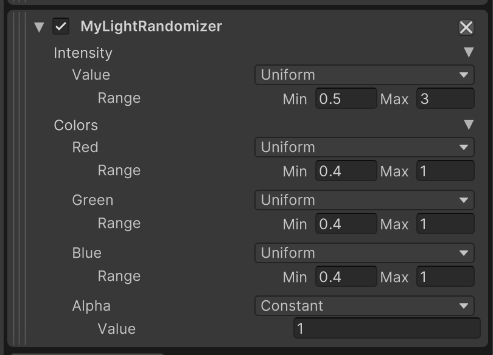

# 🔸 Phase 2: Custom Randomizations

In Phase 1 of the tutorial, we learned how to use the Randomizers that are bundled with the Perception package. Using included randomizers, we spawned background and foreground objects, randomized their position, rotation, texture, and hue offset (color). In this phase, we will build a custom Light Randomizer for the `Directional Light` object which will control the light's intensity and color on each Iteration of the Scenario. We will also learn how to bundle data and logic inside a randomized object (such as the light) in order to more explicitly define and restrict randomization behaviors on a per-object basis.

## Table of Contents

- [Step 1: Building a Light Randomizer](#step-1)
- [Step 2: Bundle Data and Logic Inside RandomizerTags](#step-2)

## <a name="step-1">Step 1: Building a Light Randomizer</a> 

We need to create two C# classes for our light randomization, `MyLightRandomizer` and `MyLightRandomizerTag`. The first of these will sample random values and assign them to the intensity and color of the light, and the second class will be the component that will be added to `Directional Light`, making it a target of the `MyLightRandomizer` script.

- **🟢 Action**: In the _**Project**_ tab, right-click on the `Assets` folder and select _**Create → Perception → C# Randomizer and RandomizerTag**_. Name your new script file `MyLightRandomizerTag.cs`.

This option creates a single C# file with two stub classes, one for the Randomizer and one for the RandomizerTag. They will be called `NewRandomizer` and `NewRandomizerTag` by default. Make sure that the file name matches the class name for the RandomizerTag object (`MyLightRandomizerTag`) in this case.

- **🟢 Action**: Double-click `MyLightRandomizerTag.cs` to open it in _**Visual Studio**_ or an IDE of your choice.

Note that while _**Visual Studio**_ is the default option, you can choose any text editor of your choice. You can change this setting in _**Preferences -> External Tools -> External Script Editor**_.

- **🟢 Action**: Modify the file to match the code below.

```C#
using System;
using UnityEngine;
using UnityEngine.Perception.Randomization.Parameters;
using UnityEngine.Perception.Randomization.Randomizers;
using UnityEngine.Perception.Randomization.Samplers;

[RequireComponent(typeof(Light))] //Can only attach to GameObjects which also have a Light component attached
//This tag is used to "target" which objects in the scene will be randomized
public class MyLightRandomizerTag : RandomizerTag {}

[Serializable]
[AddRandomizerMenu("MyLightRandomizer")]
public class MyLightRandomizer : Randomizer
{
    // A parameter whose value uniformly ranges from 2 to 10 when sampled
    public FloatParameter lightIntensity = new() { value = new UniformSampler(0, 1) };

    // Run this every randomization iteration
    protected override void OnIterationStart()
    {
        // Get all MyLightRandomizerTag's in the scene
        var tags = tagManager.Query<MyLightRandomizerTag>();
        foreach (var tag in tags)
        {
            // Get the light attached to the object
            var tagLight = tag.GetComponent<Light>();            
            tagLight.intensity = lightIntensity.Sample();
        }
    }
}
```

**Understanding Randomizers**  
The purpose of this piece of code is to sample a random float Parameter and assign it to the light's `Intensity` field on the start of every Iteration. Let's go through the code above and understand each part. The `FloatParameter` field makes it possible for us to define a randomized float Parameter and modify its properties from the editor UI, similar to how we already modified the properties for the previous Randomizers we used.

The `MyLightRandomizer` class extends `Randomizer`, which is the base class for all Randomizers that can be added to a Scenario. This base class provides a plethora of useful functions and properties that can help catalyze the process of creating new Randomizers.

The `OnIterationStart()` function is used for telling the Randomizer what actions to perform at the start of each Iteration of the Scenario. As seen in the code block, at the start of each Iteration, this class queries the `tagManager` object for all RandomizerTag components of type `MyLightRandomizerTag` that are currently present on active objects in the Scene. Then, for each tag inside the queried list, it first retrieves the `Light` component of the GameObject the tag is attached to, and then sets the light's intensity to a new random float sampled from `lightIntensity`. 

**Understanding RandomizerTags**  
A RandomizerTag can be this simple if you just need it for querying a set of target objects. Later, we will learn how to add code here to encapsulate more data and logic within the randomized objects. 

Notice there is a `RequireComponent(typeof(Light))` line at the top. This line makes it so that you can only add the `MyLightRandomizerTag` component to an object that already has a `Light` component attached. This way, the Randomizers that query for this tag can be confident that the found tags are attached to GameObjects that also have a `Light` component, and can thus be Randomized.

If you return to your list of Randomizers in the _**Inspector**_ view of `SimulationScenario`, you can now add the new Randomizer we created here.

- **🟢 Action**: Add `MyLightRandomizer` to the list of Randomizers in `SimulationScenario`.

You will notice that the Randomizer's UI snippet contains one Parameter named `Intensity`. This is the same Parameter we added in the code block above. Here, you can set the sampling distribution (`Value`) and `Range` for this float Parameter.

- **🟢 Action**:  In the UI snippet for `MyLightRandomzier`, set the minimum and maximum for range to **0.5** and **3**.

It is now time to add the tag we created earlier to the light in our Scene, so that the Randomizer can find it.

- **🟢 Action**: Select `Directional Light` in the Scene's _**Hierarchy**_, and in the _**Inspector**_ tab, add a `My Light Randomizer Tag` component.

There is one more thing left to do in order to have our directional light be the only source of light in the Scene, such that we can clearly see the effects of our work. By default, HDRP uses environment lighting. To disable it:

- **🟢 Action**: Select the Volume object we created in Phase 1 of the tutorial for disabling motion blur.
- **🟢 Action**: In the _**Inspector**_ tab, click _**Add Override**_. Search for and select **Visual Environment**.
- **🟢 Action**: Enable **Sky type** and set its value to **None**.


- **🟢 Action**: Run the simulation again and inspect how `Directional Light` now switches between different intensities. You can pause the simulation and then use the step button (to the right of the pause button) to move the simulation one frame forward and clearly see the varying light intensity

Let's now add more variation to our light by randomizing its color as well. 

- **🟢 Action**: Back in `MyLightRandomizerTag.cs`, inside the `MyLightRandomizer` class, define a new `ColorRgbParameter`:

```csharp
public ColorRgbParameter color;
```

- **🟢 Action**: Inside the code block in the `MyLightRandomizer` class that intensity was previously applied, add code for sampling color from the above Parameter and applying it. The `for` block should look like this:

```csharp
foreach (var tag in tags)
{
    // Get the light attached to the object
    var tagLight = tag.GetComponent<Light>();    
    tagLight.intensity = lightIntensity.Sample();
    tagLight.color = color.Sample();    
}
```            

If you now check the UI snippet for `MyLightRandomizer`, you will notice that a new parameter called `Color` is added. This Parameter includes four separate randomized values for `Red`, `Green`, `Blue` and `Alpha`. **Note that the meaningful range for all of these values is 0-1 (and not 0-255)**. You can see that the sampling range for red, green, and blue is currently set to 0-1, which means the Parameter covers a full range of colors. A color with (0,0,0) RGB components essentially emits no light. So, let's increase the minimum a bit to avoid such a scenario.

- **🟢 Action**: Increase the minimum value for red, green, and blue components to **0.4** (this is an arbitrary number that typically produces good-looking results).

The UI for `MyLightRandomizer` should now look like this:

<p align="center">

</p>


- **🟢 Action**: Run the simulation for a few frames to observe the light color changing on each Iteration of the Scenario.


## <a name="step-2">Step 2: Bundle Data and Logic Inside RandomizerTags</a> 

You may sometimes need to bundle certain randomization-related data or logic within an object that are inherent to the object itself. For instance, you may have multiple lights in the Scene but would like each of them to have **their own unique range** of intensities. It would be quite tedious to add a new Parameter to your light Randomizer for each of your lights just to achieve this. Furthermore, this would make your light Randomizer excessively tailored to one use-case, limiting the Randomizer's reusability. 

There are also cases where you may need to include certain logic within your object in order to make the Randomizer code more reusable and easier to maintain. For instance, you may want to build an office chair Prefab to use in various simulations. This chair is likely to support a range of customizations for its various parts (back angle, seat angle, seat height, etc.). Instead of directly mapping a Rotation Parameter from a Randomizer to the rotation of the back angle object within the chair, it might be more convenient to have the chair expose the range of possible angles in the form of a simple float between 0 and 1. With this approach, the Randomizer would only need to sample a float Parameter and assign it to the chair. The chair would in turn have a script attached that knows how to map this single float to a certain plausible back angle. You could even map this float to a more complex state of the chair. Your Randomizer would still only need one float Parameter.

Let's try this approach with our `Directional Light` object. We will create a duplicate of this light and then have the two lights use different ranges of intensity while both using the exact same float Parameter from `MyLightRandomizer.cs`.

- **🟢 Action**: Right-click on `Directional Light` in the Scene _**Hierarchy**_ and select _**Duplicate**_. The new light will automatically be named `Directional Light (1)`.
- **🟢 Action**: Change the Y rotation of `Directional Light (1)` to **-60**.
- **🟢 Action**: Change the Y rotation of the original `Directional Light` to **60**.

This makes the two lights illuminate the scene from opposing angles. Note that the position of Directional Lights in Unity does not affect how they illuminate the scene, only their rotation matters.

- **🟢 Action**: Open `MyLightRandomizerTag.cs` and modify the `MyLightRandomizerTag` class to match the following:

```csharp
[RequireComponent(typeof(Light))] //Can only attach to GameObjects which also have a Light component attached
//This tag is used to "target" which objects in the scene will be randomized
public class MyLightRandomizerTag : RandomizerTag
{
    public float minIntensity;
    public float maxIntensity;

    public void SetIntensity(float rawIntensity)
    {
        var tagLight = GetComponent<Light>();
        var scaledIntensity = rawIntensity * (maxIntensity - minIntensity) + minIntensity;
        tagLight.intensity = scaledIntensity;
    }
}
```

In the above code, we have created a new `SetIntensity` function that first scales the incoming intensity (assumed to be between 0 and 1) to our desired range and then assigns it to the light's intensity. The `Light` component is now fetched from the GameObject that this Randomizer tag is attached to. This works because both this tag component and the `Light` component are attached to the same object in the Scene (which is one of the directional lights we created). 

This component is already added to both our lights. We now need to set our desired minimum and maximum intensities, and this can be done through the _**Inspector**_ view.

- **🟢 Action**: Select `Directional Light` and from the **Inspector** UI for the `MyLightRandomizerTag` component, set `Min Intensity` to **0.5** and `Max Intensity` to **3**.
- **🟢 Action**: Repeat the above step for `Directional Light (1)` and set `Min Intensity` to **0** and `Max Intensity` to **0.4**.

Note that with this change, we fully transfer the responsibility for the light's intensity range to `MyLightRandomizerTag.cs` and assume that the intensity value coming from `MyLightRandomizer` is always between 0 and 1. Therefore, we now need to change the range for the corresponding Parameter in `MyLightRandomizer` to (0,1). 

- **🟢 Action**: Select `SimulationScenario` and from the UI snippet for `MyLightRandomizer`, change the range for `Light Intensity` to **(0, 1)**.

We also need to make a minor change to the `MyLightRandomizer` class in `MyLightRandomizerTag.cs` in order to make it compatible with this new approach.

- **🟢 Action**: Open `MyLightRandomizerTag.cs` and modify the `for` loop in the Randomizer class as below:

```csharp

foreach (var tag in tags)
{
    // Get the light attached to the object
    var tagLight = tag.GetComponent<Light>();
    tagLight.color = color.Sample();
    // Call the SetIntensity function we defined in the tag instead!
    tag.SetIntensity(lightIntensity.Sample());
}
```

Notice how we now utilize the `SetIntensity` function of `MyLightRandomizerTag` components of the tagged objects, instead of directly setting the intensity of the `Light` components.

- **🟢 Action**: Run your simulation, then pause it. Go to the _**Scene**_ view and inspect the color and intensity of each of the lights. Try turning each on and off to see how they affect the current frame. 

## Summary and Further Exploration

By this point in the tutorial, we have learned how to:  
1. Download the Unity Editor and install the Perception Package
2. Set up a Scene for synthetic data generation using a Scenario and Randomizers
3. Randomize our simulation using Randomizers included with Perception
4. Create custom Randomizers in C# for more complex/specific randomization needs

We have a collection of Python tools that allow you to parse, collect statistics, visualize, and even convert the generated data into different formats. Please visit the following tutorials to get a deeper understanding of these capabilities:
### 👉 [Pysolotools Overview](pysolotools.md)
### 👉 [Voxel51 Based Visualizer](pysolotools-fiftyone.md)
### 👉 [Converting your dataset to COCO](convert_to_coco.md)


As you explore the Perception Package and build randomized environments for synthetic data, you may come across features and workflows not covered by this tutorial. We have documentation on all new features, updates, workflows, etc. on the [Features](../Features/index.md) page which will be updated with every new release. We recommended exploring it to see the full feature set of what you can do with the Perception Package.

### 👉 [Continue to Features Overview](../Features/index.md)

For those interested in Human-related Computer Vision tasks, we also offer a guide: [Human Pose Labeling and Randomization](../HumanPose/TUTORIAL.md). This guide covers the production of keypoint and pose datasets for CV tasks such as human pose estimation and gesture recognition.

### 👉 [Continue to Human Pose Labeling Tutorial](../HumanPose/TUTORIAL.md)

