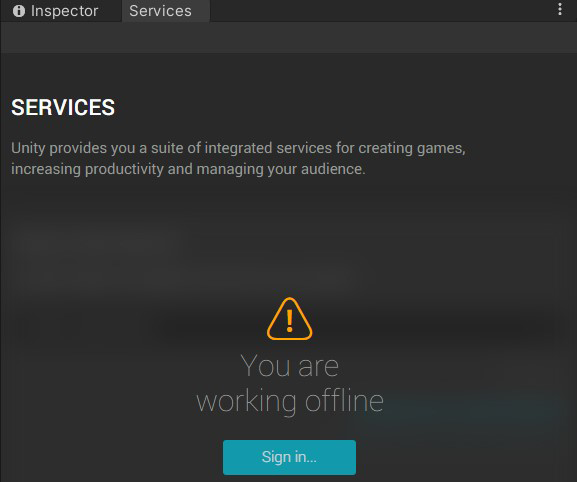
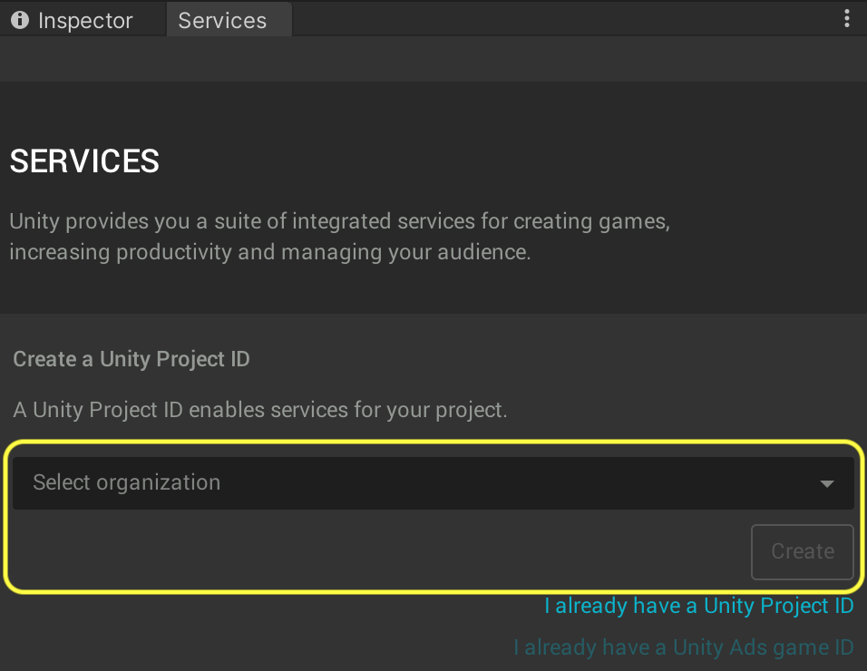
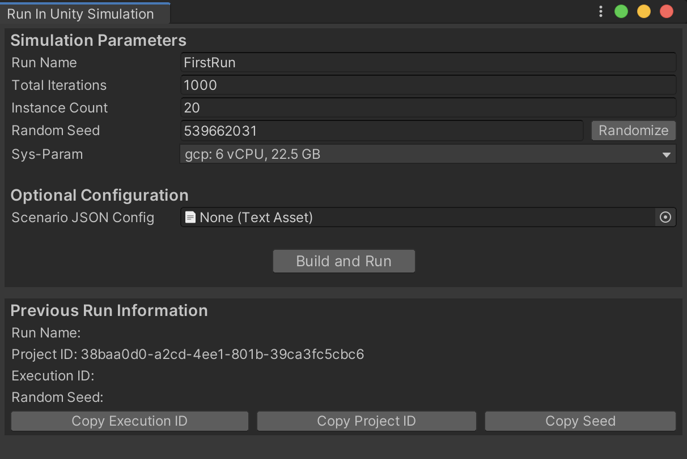
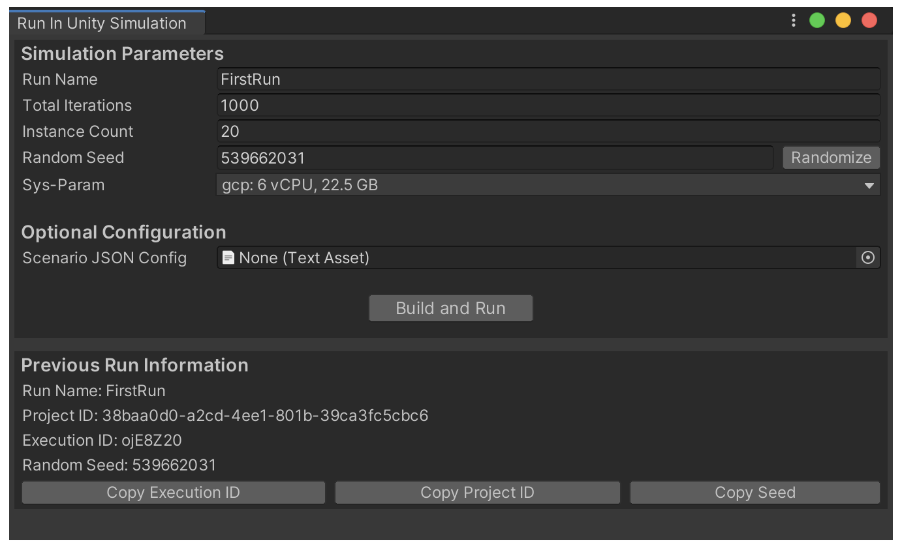
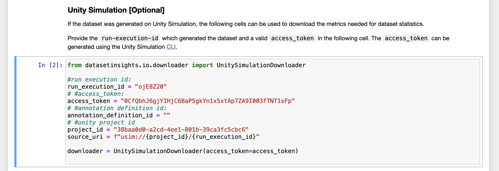
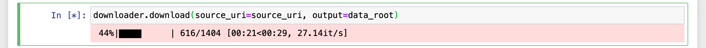

# Perception Tutorial
## Phase 3: Cloud

In this phase of the tutorial, we will learn how to run our Scene on _**Unity Simulation**_ and analyze the generated dataset using _**Dataset Insights**_. Unity Simulation will allow us to generate a much larger dataset than what is typically plausible on a workstation computer.

Steps included this phase of the tutorial:
- [Step 1: Setup Unity Account, Unity Simulation, and Cloud Project](#step-1)
- [Step 2: Run Project on Unity Simulation](#step-2)
- [Step 3: Keep Track of Your Runs Using the Unity Simulation Command-Line Interface](#step-3)
- [Step 4: Analyze the Dataset using Dataset Insights](#step-4)

### <a name="step-1">Step 1: Setup Unity Account, Unity Simulation, and Cloud Project</a> 

In order to use Unity Simulation, you need to first create a Unity account or login with your existing one. Once logged in, you will also need to sign-up for Unity Simulation. 

* **Action** Click on the _**Cloud**_ button at the top-right corner of Unity Editor to open the _**Services**_ tab. 

<p align="center">

</p>

If you have not logged in yet, the _**Services**_ tab will display a message noting that you are offline:

<p align="center">

</p>

* **Action**: Click _**Sign in...**_ and follow the steps in the window that opens to sign in or create an account.
* **Action**: Sign up for a free trial of Unity Simulation [here](https://unity.com/products/unity-simulation).

Unity Simulation is a cloud-based service that makes it possible for you to run hundreds of instances of Unity builds in order to generate massive amounts of data. The Unity Simulation service is billed on a per-usage basis, and the free trial offers up to $100 of free credit per month. In order to access the free trial, you will need to provide credit card information. **This information will be used to charge your account if you exceed the $100 monthly credit.** A list of hourly and daily rates for various computational resources is available in the page where you first register for Unity Simulation.

Once you have registered for a free trial, you will be taken to your Unity Simulation dashboard, where you will be able to observe your usage and billing invoices.

It is now time to connect your local Unity project to a cloud project.

* **Action**: Return to Unity Editor. In the _**Services**_ tab click _**Select Organization**_ and choose the only available option (which typically has the same name as your Unity username).

If you have used Unity before, you might have set-up multiple organizations for your account. In that case, choose whichever you would like to associate with this project.

<p align="center">

</p>

* **Action**: Click _**Create**_ to create a new cloud project and connect your local project to it.

### <a name="step-2">Step 2: Run Project on Unity Simulation</a> 

The process of running a project on Unity Simulation involves building it for Linux and then uploading this build, along with a set of parameters, to Unity Simulation. The Perception package simplifies this process by including a dedicated _**Run in Unity Simulation**_ window that accepts a small number of required parameters and handles everything else automatically.

For performance reasons, it is best to disable real-time visualizations before carrying on with the Unity Simulation run. 

* **Action**: From the _**Inspector**_ view of `Perception Camera`, disable real-time visualizations.

In order to make sure our builds are compatible with Unity Simulation, we need to set our project's scripting backend to _**Mono**_ rather than _**IL2CPP**_ (if not already set). We will also need to switch to _**Windowed**_ mode.

* **Action**: From the top menu bar, open _**Edit -> Project Settings**_.
* **Action**: In the window that opens, navigate to the _**Player**_ tab, find the _**Scripting Backend**_ setting (under _**Other Settings**_), and change it to _**Mono**_:

<p align="center">

</p>

* **Action**: Change _**Fullscreen Mode**_ to _**Windowed**_ and set a width and height of 800 by 600.

<p align="center">

</p>

* **Action**: Close _**Project Settings**_. 
* **Action**: From the top menu bar, open _**Window -> Run in Unity Simulation**_.

<p align="center">

</p>

* **Action**: Choose `TutorialScene` (which is the Scene we have been working in) as your _**Main Scene**_ and the `SimulationScenario` object as your _**Scenario**_.

Here, you can also specify a name for the run, the number of iterations the Scenario will execute for, and the number of _**Instances**_ (number of nodes the work will be distributed across) for the run. 

* **Action**: Name your run `FirstRun`, set the number of iterations to `1000`, and instances to `20`. 
* **Action**: Click _**Build and Run**_.

Your project will now be built and then uploaded to Unity Simulation. Depending on the upload speed of your internet connection, this might take anywhere from a few seconds to a couple of minutes. 

* **Action**: Once the operation is complete, you can find the **Build ID**, **Run Definition ID**, and **Execution ID** of this Unity Simulation run in the _**Console**_ tab:

<p align="center">

</p>


### <a name="step-3">Step 3: Keep Track of Your Runs Using the Unity Simulation Command-Line Interface</a> 

To keep track of the progress of your Unity Simulation run, you will need to use Unity Simulation's command-line interface (CLI). Detailed instructions for this CLI are provided [here](https://github.com/Unity-Technologies/Unity-Simulation-Docs/blob/master/doc/quickstart.md#download-unity-simulation-quickstart-materials). For the purposes of this tutorial, we will only go through the most essential commands, which will help us know when our Unity Simulation run is complete and where to find the produced dataset.

* **Action**: Download the latest version of `unity_simulation_bundle.zip` from [here](https://github.com/Unity-Technologies/Unity-Simulation-Docs/releases).

**Note**: If you are using a MacOS computer, we recommend using the _**curl**_ command from the Terminal to download the file, in order to avoid issues caused by the MacOS Gatekeeper when using the CLI. You can use these commands:
```
curl -Lo ~/Downloads/unity_simulation_bundle.zip <URL-unity_simulation_bundle.zip>
unzip ~/Downloads/unity_simulation_bundle.zip -d ~/Downloads/unity_simulation_bundle
```
The `<URL-unity_simulation_bundle.zip>` address can be found at the same page linked above.

* **Action**: Extract the zip archive you downloaded.
* **Action**: Open a command-line interface (Terminal on MacOS, cmd on Windows, etc.) and navigate to the extracted folder.

If you downloaded the zip archive in the default location in your downloads folder, you can use these commands to navigate to it from the command-line:

MacOS:
`cd ~/Downloads/unity_simulation_bundle`

Windows:
`cd C:\Users\UserName\Downloads\unity_simulation_bundle`

You will now be using the _**usim**_ executable to interact with Unity Simulation through commands. 

* **Action** To see a list of available commands, simply run `usim` once:

MacOS:
`USimCLI/mac/usim`

Windows:
`USimCLI\windows\usim`

The first step is to login.

* **Action**: Login to Unity Simulation using the `usim login auth` command.

MacOS:
`USimCLI/mac/usim login auth`

Windows:
`USimCLI\windows\usim login auth`

This command will ask you to press Enter to open a browser for you to login to your Unity account:

`Press [ENTER] to open your browser to ...`

* **Action**: Press Enter to open a browser window for logging in.

Once you have logged you will see this page:

<p align="center">

</p>

**Note**: On MacOS, you might get errors related to permissions. In these cases, try running your commands with the `sudo` qualifier. For example:
`sudo USimCLI/mac/usim login auth`. This will ask for your MacOS account's password and should help overcome the permission issues.

**Note : From this point on we will only include MacOS formatted commands in the tutorial, but all the `usim` commands we use will work in all supported operating systems.**

* **Action**: Return to your command-line interface. Get a list of cloud projects associated with your Unity account using the `usim get projects` command:

MacOS:
`USimCLI/mac/usim get projects`
<!--Windows:
`USimCLI\windows\usim get projects`-->

Example output:

```
 name                  id                                       creation time             
--------------------- ---------------------------------------- --------------------------- 
 Perception Tutorial   acd31956-582b-4138-bec8-6670be150f09 *   2020-09-30T00:33:41+00:00 
 SynthDet              9ec23417-73cd-becd-9dd6-556183946153     2020-08-12T19:46:20+00:00  
 ```

In case you have more than one cloud project, you will need to "activate" the one corresponding with your perception tutorial project. If there is only one project, it is already activated, and you will not need to execute the command below (note: replace `<project-id>` with the id of your desired project).

* **Action**: Activate the relevant project:

MacOS:
`USimCLI/mac/usim activate project <project-id>`
<!--Windows:
`USimCLI\windows\usim get projects <project-id>` -->

When asked if you are sure you want to change the active project, enter "**y**" and press **Enter**.

Now that we have made sure the correct project is active, we can get a list of all the current and past runs for the project. 

* **Action**: Use the `usim get runs` command to obtain a list of current and past runs:

MacOS:
`USimCLI/mac/usim get runs`

<!--Windows:
`USimCLI\windows\usim get runs`-->

An example output with 3 runs would look like this:

```
Active Project ID: acd31956-582b-4138-bec8-6670be150f09
name        id        creation time         executions                                    
----------- --------- --------------------- -----------------------------------------------
 FirstRun    1tLbZxL   2020-10-01 23:17:50    id        status        created_at           
                                             --------- ------------- --------------------- 
                                              yegz4WN   In_Progress   2020-10-01 23:17:54  
 Run2        klvfxgT   2020-10-01 21:46:39    id        status        created_at           
                                             --------- ------------- --------------------- 
                                              kML3i50   In_Progress   2020-10-01 21:46:42  
 Test        4g9xmW7   2020-10-01 02:27:06    id        status      created_at             
                                             --------- ----------- ---------------------   
                                              xBv3arj   Completed   2020-10-01 02:27:11    
```

As seen above, each run has a name, an ID, a creation time, and a list of executions. Note that each "run" can have more than one "execution", as you can manually execute runs again using the CLI.

You can also obtain a list of all the builds you have uploaded to Unity Simulation using the `usim get builds` command.

You may notice that the IDs seen above for the run named `FirstRun` match those we saw earlier in Unity Editor's _**Console**_. You can see here that the single execution for our recently uploaded build is `In_Progress` and that the execution ID is `yegz4WN`.

Unity Simulation utilizes the ability to run simulation instances in parallel. If you enter a number larger than 1 for the number of instances in the _**Run in Unity Simulation**_ window, your run will be parallelized, and multiple simulation instances will simultaneously execute. You can view the status of all simulation instances using the `usim summarize run-execution <execution-id>` command. This command will tell you how many instances have succeeded, failed, have not run yet, or are in progress. Make sure to replace `<execution-id>` with the execution ID seen in your run list. In the above example, this ID would be `yegz4WN`.

* **Action**: Use the `usim summarize run-execution <execution-id>` command to observe the status of your execution nodes:

MacOS:
`USimCLI/mac/usim summarize run-execution <execution-id>`
<!--Windows:
`USimCLI\windows\usim summarize run-execution <execution-id>`-->

Here is an example output of this command, indicating that there is only one node, and that the node is still in progress:

```
 state         count 
------------- -------
 Successes     0     
 In Progress   1     
 Failures      0     
 Not Run       0    
 ```

 At this point, we will need to wait until the execution is complete. Check your run with the above command periodically until you see a 1 for `Successes` and 0 for `In Progress`.
 Given the relatively small size of our Scenario (1,000 Iterations), this should take less than 5 minutes.

 * **Action**: Use the `usim summarize run-execution <execution-id>` command periodically to check the progress of your run.
 * **Action**: When execution is complete, use the `usim download manifest <execution-id>` command to download the execution's manifest:

 MacOS:
 `USimCLI/mac/usim download manifest <execution-id>`

 The manifest is a `.csv` formatted file and will be downloaded to the same location from which you execute the above command, which is the `unity_simulation_bundle` folder.
 This file does **not**** include actual data, rather, it includes links to the generated data, including the JSON files, the logs, the images, and so on.
 
 * **Action**: Open the manifest file to check it. Make sure there are links to various types of output and check a few of the links to see if they work.


### <a name="step-4">Step 4: Analyze the Dataset using Dataset Insights</a> 

 In order to download the actual data from your run, we will now use Dataset Insights again. This time though, we will utilize some of the lines that were commented in our previous use with locally generated data.

 * **Action**: Open the Dataset Insights Jupyter notebook again, using the command below:
 
 `docker run -p 8888:8888 -v <download path>/data:/data -t unitytechnologies/datasetinsights:latest`

In the above command, replace `<download path>` with the location on your computer in which you wish to download your data.

Once the Docker image is running, the rest of the workflow is quite similar to what we did in Phase 1, with certain differences caused by the need to download the data from Unity Simulation.

* **Action**: Open a web browser and navigate to `http://localhost:8888` to open the Jupyter notebook.
* **Action**: Navigate to the `datasetinsights/notebooks` folder and open `Perception_Statistics.ipynb`.
* **Action**: In the `data_root = /data/<GUID>` line, the `<GUID>` part will be the location inside your `<download path>` where the data will be downloaded. Therefore, you can just remove it so as to have data downloaded directly to the path you previously specified:

<p align="center">

</p>

The next few lines of code pertain to setting up your notebook for downloading data from Unity Simulation. 

* **Action**: In the block of code titled "Unity Simulation [Optional]", uncomment the lines that assign values to variables, and insert the correct values, based on information from your Unity Simulation run. 

We have previously learned how to obtain the `run_execution_id` and `project_id`. You can remove the value already present for `annotation_definition_id` and leave it blank. What's left is the `access_token`.

* **Action**: Return to your command-line interface and run the `usim inspect auth` command.

MacOS:
 `USimCLI/mac/usim inspect auth`

If you receive errors regarding authentication, your token might have timed out. Repeat the login step (`usim login auth`) to login again and fix this issue.

A sample output from `usim inspect auth` will look like below:

```
Protect your credentials. They may be used to impersonate your requests.
access token: Bearer 0CfQbhJ6gjYIHjC6BaP5gkYn1x5xtAp7ZA9I003fTNT1sFp
expires in: 2:00:05.236227
expired: False
refresh token: FW4c3YRD4IXi6qQHv3Y9W-rwg59K7k0Te9myKe7Zo6M003f.k4Dqo0tuoBdf-ncm003fX2RAHQ
updated: 2020-10-02 14:50:11.412979
```

The `access_token` you need for your Dataset Insights notebook is the access token shown by the above command, minus the `'Bearer '` part. So, in this case, we should input `0CfQbhJ6gjYIHjC6BaP5gkYn1x5xtAp7ZA9I003fTNT1sFp` in the notebook. 

* **Action**: Copy the access token excluding the `'Bearer '` part to the corresponding field in the Dataset Insights notebook.

Once you have entered all the information, the block of code should look like the screenshot below (the actual values you input will be different):

<p align="center">

</p>


* **Action**: Continue to the next code block and run it to download all the metadata files from the generated dataset. This includes JSON files and logs but does not include images (which will be downloaded later). 

You will see a progress bar while the data downloads:

<p align="center">

</p>


The next couple of code blocks (under "Load dataset metadata") analyze the downloaded metadata and display a table containing annotation-definition-ids for the various metrics defined in the dataset.

* **Action**: Once you reach the code block titled "Built-in Statistics", make sure the value assigned to the field `rendered_object_info_definition_id` matches the id displayed for this metric in the table output by the code block immediately before it. The screenshot below demonstrates this (note that your ids might differ from the ones here):

<p align="center">

</p>

Follow the rest of the steps inside the notebook to generate a variety of plots and stats. Keep in mind that this notebook is provided just as an example, and you can modify and extend it according to your own needs using the tools provided by the [Dataset Insights framework](https://datasetinsights.readthedocs.io/en/latest/).

This concludes the Perception tutorial. The next step in this workflow would be to train an object-detection model using a dataset generated on Unity Simulation. It is important to note that the 1000 large dataset we generated here is probably not sufficiently large for training most models. We chose this number here so that the run would complete in a fairly short period of time, allowing us to move on to learning how to analyze the dataset's statistics. In order to generate data for training, we recommend a dataset of about 400,000 captures. 

In the near future, we will expand this tutorial to Phase 4, which will include instructions on how to train a Faster R-CNN object-detection model using a dataset that can be generated by following this tutorial.
