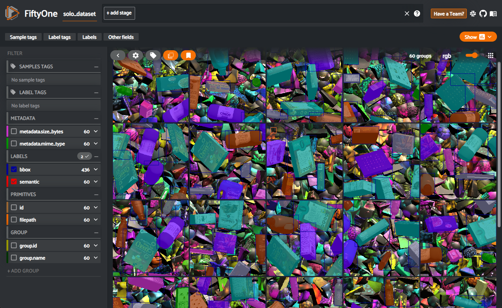
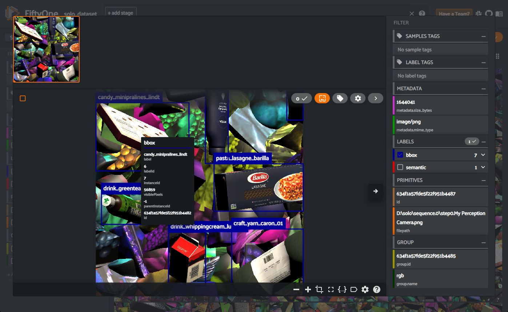
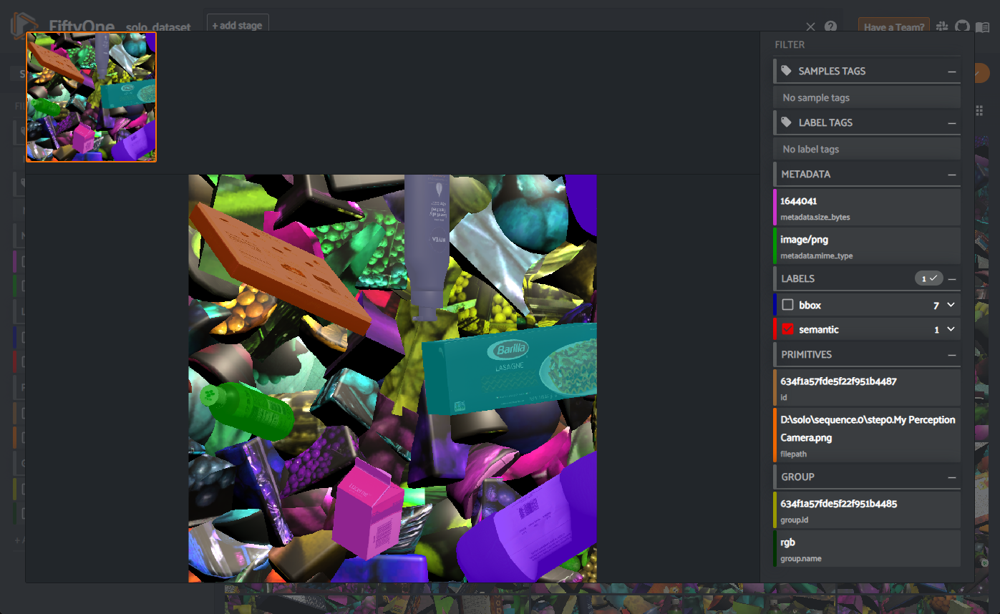

</br>

<h1 align="center">Visualizing SOLO Datasets with Voxel51 and Pysolotools</h1>

An important step to validating your data is being able to visually inspect it. We have developed a custom SOLO importer to [Voxel51](https://voxel51.com/) which allows for the visualization of all data and annotation types in SOLO. This tutorial will walk you through setting up your environment to use the pysolotools-fiftyone package, opening your data for viewing, and switching between label types. This guide will continue using the data generated in [Phase 1](Phase1.md) of the Synthetic Data Tutorial, but the Voxel51 viewer works with all SOLO datasets.

# Setup

## Set up your Python environment
The first thing that we will need to do is to setup our Python environment. This guide assumes that you already have Python 3.8 or higher installed on your machine.

To avoid a Python configuration nightmare, we highly recommend using a virtual Python environment for development. For this tutorial we will use Anaconda, but this is just a recommendation and not mandatory. For more information about Anaconda environments, and why you should use one, please see [here](https://conda.io/projects/conda/en/latest/user-guide/install/download.html).

* **🟢 Action**: Download and install [Anaconda](https://docs.anaconda.com/anaconda/install/index.html) or [Miniconda](https://conda.io/projects/conda/en/latest/user-guide/install/download.html) on your local machine
* **🟢 Action**: Create or reuse a virtual environment. 
For this example we are naming our environment `pysolotools_env`, but this name is up to you. If you have already created an environment from the [previous](pysolotools.md) step in the tutorial, you can reuse that environment (skip this step).
```shell
conda create --name pysolotools_env python=3.8
```

* **🟢 Action**: Activate the new conda environment
```shell
conda activate pysolotools_env
```

## Install OpenEXR
OpenEXR is a required Python library for pysolotools-fiftyone. OpenEXR requires system binaries to be built prior to installing the Python libraries. Please see the installation instructions [here](https://github.com/AcademySoftwareFoundation/openexr/blob/main/INSTALL.md) to help you install the OpenEXR binaries.

> ℹ️ It is more difficult to install OpenEXR binaries on Windows than MacOS, Linux, or Windows WSL. Our team has been able to do this by downloading the prebuilt OpenEXR wheel file found [here](https://www.lfd.uci.edu/~gohlke/pythonlibs/). Be sure to download the correct version for your Python environment. If you are using Python 3.8 then the *OpenEXR-1.3.8-cp38-cp38-win_amd64.whl* is probably the wheel file that you will need. Install the wheel file by running *pip install OpenEXR-1.3.8-cp38-cp38-win_amd64.whl*

* **🟢 Action**: Install OpenEXR binaries

After installing the binaries, you can install OpenEXR Python package the same way that you would install any other Python package.

* **🟢 Action**: Install openexr using pip with the following command
```shell
pip install openexr
```

## Install pysolotools-fiftyone
* **🟢 Action**: Install pysolotools-fiftyone using pip with the following command
```shell
pip install pysolotools-fiftyone
```

</br>

# Running Pysolotools-Fiftyone
We will now run pysolotools-fiftyone on the data that we generated previously.
* **🟢 Action**: Execute pysolotools-fiftyone on your data
```shell
pysolotools-fiftyone <SOLO_PATH>
```

This will launch the fiftyone viewer in your default web browser. You should see a page similar to this:  
<p align="center">
  	
</p>

By default all of the annotation types found in the dataset are on, which can be quite overwhelming visually. We can turn them off by clicking off the ***bbox*** and ***semantic*** labels under the **LABELS** tab on the left side column.
* **🟢 Action**: Turn off visible annotations by clicking of the ***bbox*** and ***semantic*** labels

There will be a tile for each generated frame of your dataset. You can zoom in on a single frame by clicking the tile on the page.
* **🟢 Action**: Click the tile in the upper left corner to zoom in on the first frame of the dataset

We will now look at the results of the individual Labelers by turning the labels back on. The first one we will look at is the results of the 2D bounding box Labeler.  

## 2D Bounding Box Labeler
The 2D bounding box Labeler shows the bounding boxes and label names of all of the labeled foreground objects in the frame. You can get even more granular information about a labeled object by hovering your mousing pointer over its box. This will provide metadata information including label id, instance id, and visible pixels. Other information could be included in this pop-up depending on which Labelers were active during dataset generation.

* **🟢 Action**: Enable the ***bbox*** Labeler by clicking the check box next to its name under the **LABELS** tab on the right side of the screen
<p align="center">
  	
</p>

## Semantic Segmentation Labeler
The semantic segmentation Labeler shows the identified types of objects by drawing each class of object with a color. These colors can be darkened by moving the slider found in the settings gear icon.
* **🟢 Action**: Enable the ***semantic*** Labeler and disable the ***bbox*** Labeler by clicking the check box next to their names under the **LABELS** tab on the right side of the screen

<p align="center">
  	
</p>

In this tutorial we only looked at the 2D bounding box and semantic segmentation Labelers. The fiftyone viewer; however, supports all of the current Perception Labeler types including: 2D bounding box, 3DF bounding box, instance & semantic segmentation, keypoints, occlusion, depth, normals, and pixel position Labelers.
