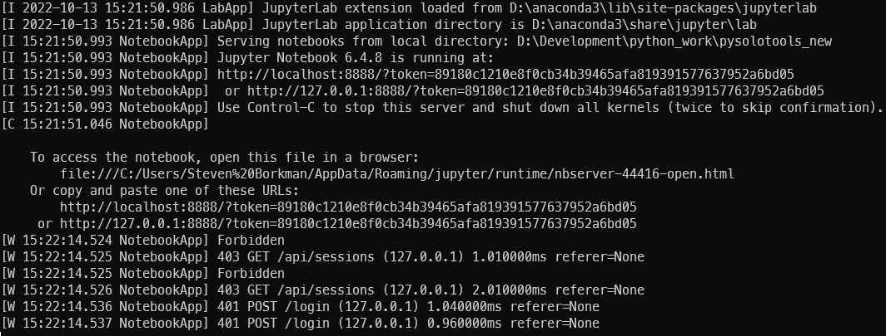
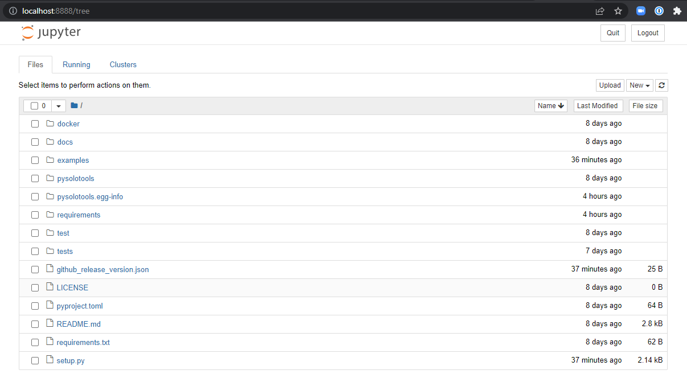
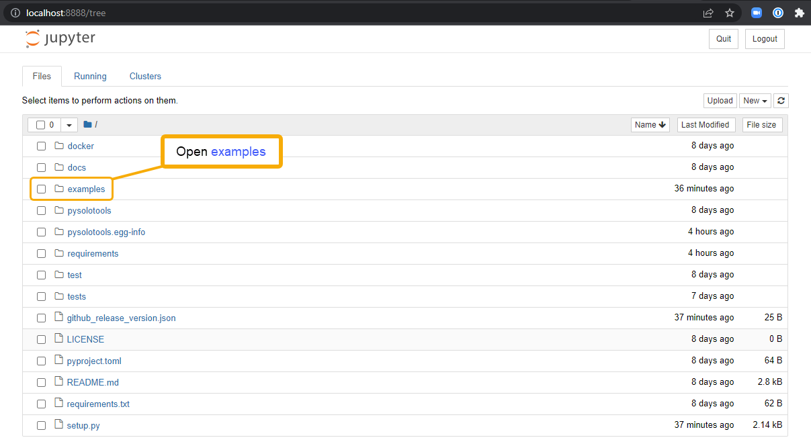
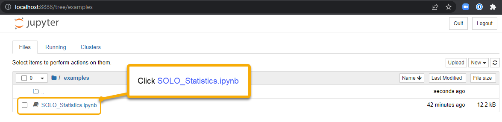
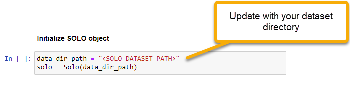
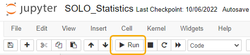
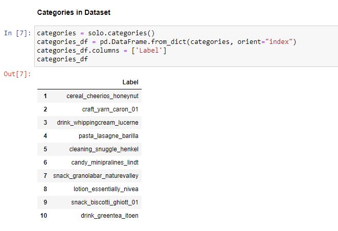
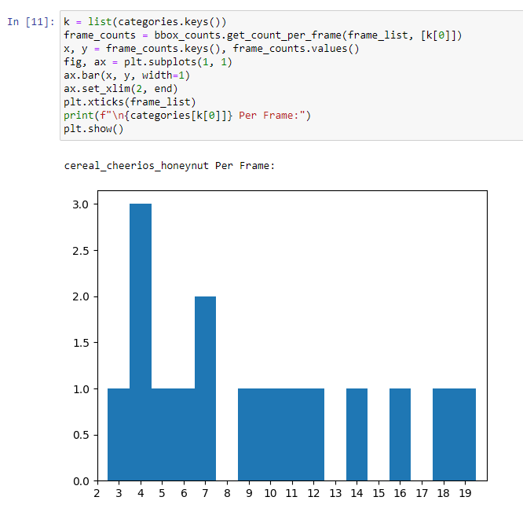
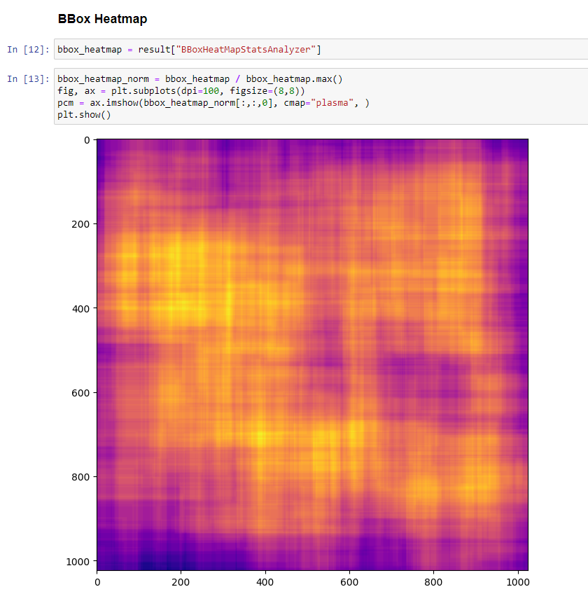
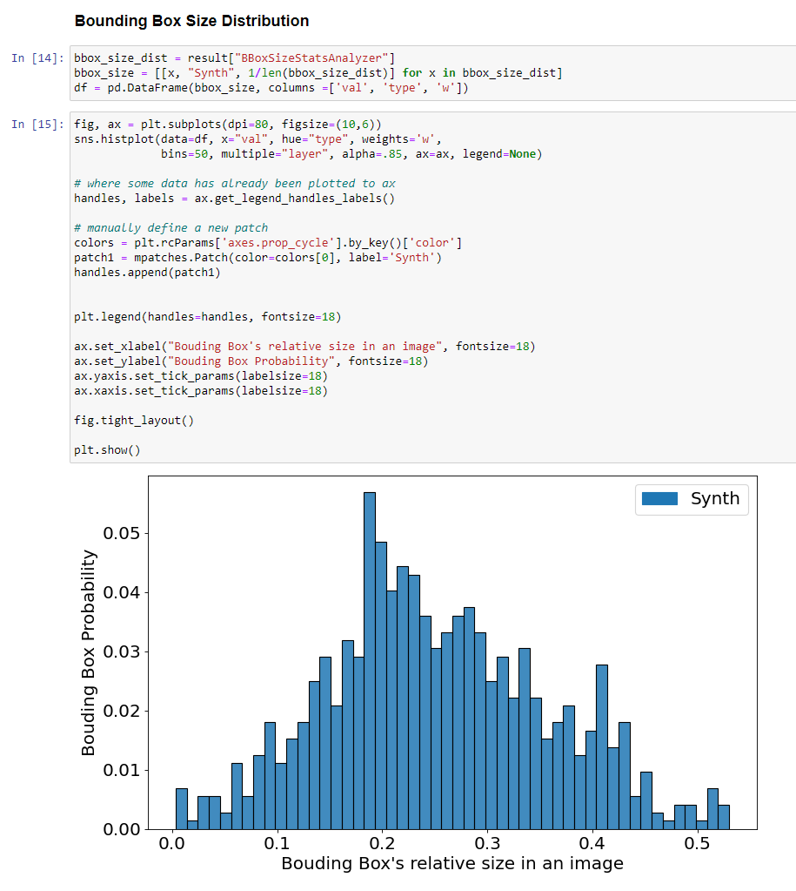

</br>

<h1 align="center">Analyzing SOLO Datasets with Pysolotools</h1>

[Pysolotools](https://github.com/Unity-Technologies/pysolotools) is a Python package that provides a variety of tools for processing, analyzing, and converting SOLO datasets created with the Perception package. In addition to a Python library, the package comes with an example Jupyter notebook that helps you load datasets and analyze a set of common statistics.

In this guide, we will go through the steps involved in opening SOLO datasets and verifying them using the provided Jupyter notebook. To learn how to generate datasets locally follow [Phase 1 of the Perception Tutorial](Phase1.md). Although we will use the dataset created in that tutorial in this guide, these same processes can be applied to any SOLO dataset.

## Setting Up Your Python Environment
The first thing that we will need to do is to setup our Python environment. This guide assumes that you already have Python 3.8 or higher installed on your machine.

To avoid a Python configuration nightmare, we highly recommend using a virtual Python environment for development. For this tutorial we will use Anaconda, but this is just a recommendation and not mandatory. For more information about Anaconda environments, and why you should use one, please see [here](https://conda.io/projects/conda/en/latest/user-guide/install/download.html).

* **🟢 Action**: Download and install [Anaconda](https://docs.anaconda.com/anaconda/install/index.html) or [Miniconda](https://conda.io/projects/conda/en/latest/user-guide/install/download.html) on your local machine
* **🟢 Action**: Create a virtual environment. For this example we are naming our environment `pysolotools_env`, but this name is up to you
```shell
conda create --name pysolotools_env python=3.8
```
* **🟢 Action**: Activate the new Conda environment
```shell
conda activate pysolotools_env
```

## Install Pysolotools
* **🟢 Action**: Install pysolotools using pip with the following command
```shell
pip install pysolotools
```

## Using a Jupyter Notebook to analyze the SOLO Dataset
Pysolotools comes with an example [Jupyter](https://jupyter.org/) notebook that can open and calculate statistics about the dataset.
* **🟢 Action**: Install jupyter notebook using pip with the following command
```shell
pip install jupyter
```

The notebook is located on the Pysolotools Git repository. 

* **🟢 Action**: In your Git capable command line shell, navigate to a folder where you would like to clone the Pysolotools repo.
* **🟢 Action**: Clone [pysolotools](https://github.com/Unity-Technologies/pysolotools).
```shell
git clone https://github.com/Unity-Technologies/pysolotools
cd pysolotools
```

The notebook has a number of dependencies. Let's install those now.

* **🟢 Action**: Install the notebook's dependencies:
```shell
pip install matplotlib
pip install pandas
pip install seaborn
```

* **🟢 Action**: Start a Jupyter Server
```shell
jupyter notebook
```
After starting your Jupyter server, you should see results similar to this in your shell:  
<p align="center">
    <br>
  	
</p>
And your web browser should load the Jupyter landing page:  
<p align="center">
    <br>
  	
</p>

> ℹ️ If your browser does not automatically start, you can point your browser to *http://localhost:8888/*
<br>

* **🟢 Action**: Open the example stats notebook by clicking on *examples* and then *SOLO_Statistics.ipynb*  
<p align="center">
    <br>
  	
</p>
<p align="center">
    <br>
    
</p>

* **🟢 Action**: Update the `Initialize SOLO object` cell to point to your SOLO dataset.
Replace the ` <SOLO-DATASET-PATH> ` token between the quotes to your dataset path.
<p align="center">
    <br>
    
</p>

* **🟢 Action**: Click the Run (**▷**) button to iterate through the notebook cells.
<p align="center">
    <br>
  	
</p>
We can use the notebook to display statistics about the dataset. We will first investigate the SOLO metadata, which provides information about the dataset, including the total number of sequences, frames, and frames per sequence. Each sequence is produced by one Iteration of a Perception Scenario. The metadata also contains other information, such as Labelers that were present during the generation of the dataset. To see this and similar information, you can add additional queries to the cell and re-play the cell to see that information.  
<p align="center">
    <br>
  	
</p>
The next cell shows us the label categories that are present in the dataset.  
<p align="center">
    <br>
  	
</p>  
The next couple of cells give us an example on how to query the objects in the dataset. The first result shows us the total number of objects in each of the first 20 frames of data.  
<p align="center">
    <br>
  	
</p>
The next graph shows us how many of a particular object are in each frame, in this case we are looking for `cereal_cheerios_honeynut` label category.  
<p align="center">
    <br>
  	
</p>
These queries can be updated to show a different set of frames or different category counts. Just edit the python code and re-run the cell.  
The next cells show a heatmap of how the 2D bounding box data in the dataset is distributed in the image bounds. The brighter the color of a pixel, the higher the percentage of frames in which a 2D bounding box covered the colored pixel.

<p align="center">
    <br>
  	
</p>
Bounding box size distribution shows the distribution of object sizes in the dataset.

<p align="center">
    <br>
  	
</p>

This concludes the Pysolotools Tutorial. In the next phase, we will use Voxel51 and the SOLO plugin to visually inspect the dataset.

### 👉 [Continue to Visualize with Voxel51](pysolotools-fiftyone.md)
