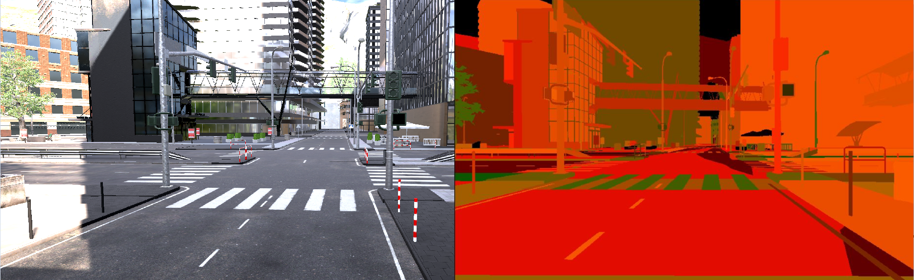
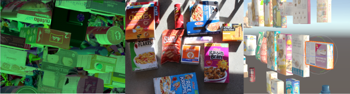
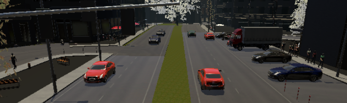

# Unity Perception package (com.unity.perception)
The Perception package provides a toolkit for generating large-scale datasets for perception-based machine learning, training and validation. It is focused on capturing ground truth for Camera-based use cases. In the future, the Perception package will include other types of sensors and machine learning tasks.

[Quick Installation Instructions](SetupSteps.md)

[Perception Tutorial](Tutorial/TUTORIAL.md)

## Preview package

This package is available as a preview, so it is not ready for production use. The features and documentation in this package might change before it is verified for release.

## Example projects using Perception

### SynthDet

[SynthDet](https://github.com/Unity-Technologies/SynthDet) is an end-to-end solution for training a 2D object detection model using synthetic data.

### Unity Simulation Smart Camera example

The [Unity Simulation Smart Camera Example](https://github.com/Unity-Technologies/Unity-Simulation-Smart-Camera-Outdoor) illustrates how Perception could be used in a smart city or autonomous vehicle simulation. You can generate datasets locally or at scale in [Unity Simulation](https://unity.com/products/unity-simulation).

## Package contents

|Feature|Description|
|---|---|
|[Labeling](GroundTruthLabeling.md)|A component that marks a GameObject and its descendants with a set of labels|
|[LabelConfig](GroundTruthLabeling.md#label-config)|An asset that defines a taxonomy of labels for ground truth generation|
|[Perception Camera](PerceptionCamera.md)|Captures RGB images and ground truth from a [Camera](https://docs.unity3d.com/Manual/class-Camera.html).|
|[DatasetCapture](DatasetCapture.md)|Ensures sensors are triggered at proper rates and accepts data for the JSON dataset.|
|[Randomization (Experimental)](Randomization/Index.md)|The Randomization tool set lets you integrate domain randomization principles into your simulation.|

## Known issues

* The Linux Editor 2019.4.7f1 and 2019.4.8f1 might hang when importing HDRP-based Perception projects. For Linux Editor support, use 2019.4.6f1 or 2020.1
