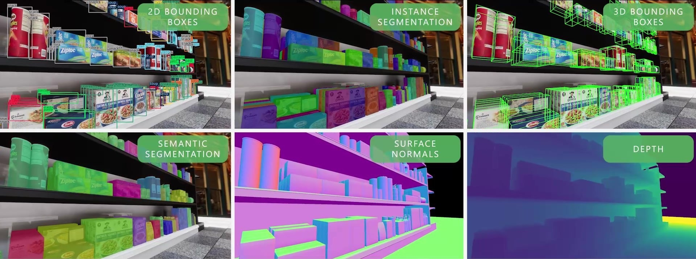
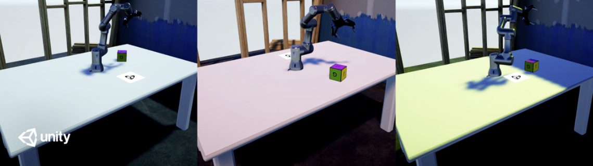

<p align="center">
  
</p>
<div align="center">
  <h1>Perception Package</h1>
  <span>by </span><a href="https://unity.com/computer-vision" target="_blank">Unity Computer Vision</a>
</div>
<br />
<p align="center">
  
  <a href="./LICENSE.md">
    
  </a>
  
  
</p>

<blockquote>
  <p align="center">
    <a href="https://create.unity.com/computer-vision-newsletter-sign-up?_gl=1*m30uzd*_gcl_aw*R0NMLjE2NDE4MzcyMjAuQ2p3S0NBaUF6LS1PQmhCSUVpd0FHMXJJT2tyQnYwaFFpQUtBQ1pwdXlzeklPbkdtRHp4dnVVOXNSem1EY0dwaTdLOFRra3FQc2gwLTFSb0NHQlFRQXZEX0J3RQ..*_gcl_dc*R0NMLjE2NDE4MzcyMjAuQ2p3S0NBaUF6LS1PQmhCSUVpd0FHMXJJT2tyQnYwaFFpQUtBQ1pwdXlzeklPbkdtRHp4dnVVOXNSem1EY0dwaTdLOFRra3FQc2gwLTFSb0NHQlFRQXZEX0J3RQ">Join our Mailing List!</a> Sign up to stay up-to-date on our latest feature release, community events, blog posts, and more!
  </p>
</blockquote>

<p align="center">
  
</p>

> `com.unity.perception` is in active development. Its features and API are subject to significant change as development progresses.

The Perception package provides a toolkit for generating large-scale synthetic datasets for computer vision training and validation. It is focused on a handful of camera-based use cases for now and will ultimately expand to other forms of sensors and machine learning tasks.

## Getting Started with Perception Package

**[Quick Start Guide](SetupSteps.md)**  
Adding the Perception package to your existing project. Recommended for users already familiar with Unity and the Perception package. If this is the first time exploring our toolset, we highly recommend briefly going through the **[Perception Synthetic Data Tutorial](Tutorial/TUTORIAL.md)**  below!

**[🌟 Perception Synthetic Data Tutorial 🌟](Tutorial/TUTORIAL.md)**  
Ideal for those new to either Unity, the Perception package, or synthetic data in general. Detailed instructions covering all the important steps: installing the Unity Editor, creating your first synthetic data generation project, adding domain randomization, visualizing, and analyzing your generated datasets. **No prior experience required.**

**[Human Pose Labeling and Randomization Tutorial](HumanPose/TUTORIAL.md)**  
Step by step instructions for using the keypoint, pose, and animation randomization tools included in the Perception package. We recommend that you complete the Perception Tutorial above before diving into this guide!

**[Frequently Asked Questions](FAQ/FAQ.md)**  
Check out our FAQ for a list of common questions, tips, tricks, and sample code for common code patterns.

**[Verifying Datasets with Dataset Insights](Tutorial/DatasetInsights.md)**  
Introduction to Unity's [Dataset Insights](https://github.com/Unity-Technologies/datasetinsights) – a python package for downloading, parsing and analyzing synthetic datasets.

## Reference Documentation

In-depth documentation on specific components of the package. For the full set of feature-based documentation, take a look at the [Features](Features/index.md) page.

| Feature                                             | Description                                                                                              |
|-----------------------------------------------------|----------------------------------------------------------------------------------------------------------|
| [Labeling](GroundTruthLabeling.md)                  | A component that associates a GameObject and its descendants with a set of "labels."                     |
| [Label Config](GroundTruthLabeling.md#label-config) | An asset that defines a taxonomy of labels for ground truth generation                                   |
| [Perception Camera](PerceptionCamera.md)            | Captures RGB images and ground truth from a [Camera](https://docs.unity3d.com/Manual/class-Camera.html). |
| [Dataset Capture](DatasetCapture.md)                | Ensures sensors are triggered at proper rates and accepts data for the JSON dataset.                     |
| [Randomization](Randomization/index.md)             | The Randomization tool set lets you integrate domain randomization principles into your simulation.      |
| [Output Endpoint](Features/CustomEndpoints.md)      | Currently supported output endpoints are: No Output, Perception endpoint, and Solo endpoint.             |

## Community and Support

For setup problems or discussions about leveraging the Perception package in your project, please create a new thread on the **[Unity Computer Vision forums](https://forum.unity.com/forums/computer-vision.626/)** with details such as operating system, reproduction steps, etc. If you run into any other problems with the Perception package or have a specific feature request, please open a **[GitHub Issue](https://github.com/Unity-Technologies/com.unity.perception/issues)**.

For any other questions or feedback, connect directly with the Computer Vision team at [computer-vision@unity3d.com](mailto:computer-vision@unity3d.com).

## Projects using Perception!

### SynthDet


[**SynthDet**](https://github.com/Unity-Technologies/SynthDet) is an end-to-end solution for training a 2D object detection model using synthetic data.

### Robotics Object Pose Estimation Demo


The [**Robotics Object Pose Estimation**](https://github.com/Unity-Technologies/Robotics-Object-Pose-Estimation) project demonstrates pick-and-place with a robot arm in Unity. It includes using ROS with Unity, importing URDF models, collecting labeled training data using the Perception package, and training and deploying a deep learning model.

## Local development
The repository includes a test project for local development located at `TestProjects/PerceptionHDRP`.

### Suggested IDE Setup
For closest standards conformity and best experience overall, JetBrains Rider or Visual Studio w/f JetBrains Resharper are suggested. For optimal experience, allow navigating to code in all packages included in your project. In your Unity Editor, navigate to `Preferences` → `External Tools` and check `Generate all .csproj files.` 

## License & Citation
The Perception package is licensed under [Apache License Version 2.0](LICENSE.md).  If you find this package useful, consider citing it using:
```
@misc{unity-perception2022,
    title={Unity {P}erception Package},
    author={{Unity Technologies}},
    howpublished={\url{https://github.com/Unity-Technologies/com.unity.perception}},
    year={2020}
}
```
